<h2 style="text-align:center">
  
</h2>

<h1 style="text-align:center">Universidad Peruana de Ciencias Aplicadas</h1>

<h3 style="text-align:center; margin-top:18px; margin-bottom:18px;">
  Ingeniería de Software
    
  Ciclo: 2026-20
    
  Curso: Arquitecturas De Software Emergentes
    
  Sección: 9056
      
  Profesor: Enrique Alejandro Valdivia Verde
    
  Informe del Trabajo Final
    
  Startup: HNG
    
  Producto: ElectroLink
</h3>

<table style="margin: 0 auto; width: auto; display: table; border-collapse: collapse; font-size: 12pt;">
  <thead>
    <tr>
      <th style="border:1px solid #000; padding:6px 12px; text-align:center;">Alumno</th>
      <th style="border:1px solid #000; padding:6px 12px; text-align:center;">Código</th>
    </tr>
  </thead>
  <tbody>
    <tr><td style="border:1px solid #000; padding:6px 12px; text-align:center;">Cesar Augusto Arostegui Alzamora</td><td style="border:1px solid #000; padding:6px 12px; text-align:center;">u202114548</td></tr>
    <tr><td style="border:1px solid #000; padding:6px 12px; text-align:center;">Vanessa May Lang Choy Robles</td><td style="border:1px solid #000; padding:6px 12px; text-align:center;">U202317450</td></tr>
    <tr><td style="border:1px solid #000; padding:6px 12px; text-align:center;">Leandro Saul Contreras López</td><td style="border:1px solid #000; padding:6px 12px; text-align:center;">U20231E215</td></tr>
    <tr><td style="border:1px solid #000; padding:6px 12px; text-align:center;">Ivo Marcelo Machado Bracamonte</td><td style="border:1px solid #000; padding:6px 12px; text-align:center;">U20231C368</td></tr>
  </tbody>
</table>

 Diciembre 2026 

# Registro de Versiones del Informe  
---

| Versión | Fecha       | Autor(es)                                                                 | Descripción de modificación |
|---------|-------------|---------------------------------------------------------------------------|------------------------------|

# Project Report Collaboration Insights  

## Evidencia de colaboración en GitHub

---

# Contenido
- [Registro de Versiones del Informe](#registro-de-versiones-del-informe)
- [Project Report Collaboration Insights](#project-report-collaboration-insights)
- [Contenido](#contenido)
- [Student Outcome](#student-outcome)
- [Capítulo I: Introducción](#capítulo-i-introducción)
  - [1.1. Startup Profile](#11-startup-profile)
    - [1.1.1. Descripción de la Startup](#111-descripción-de-la-startup)
    - [1.1.2. Perfiles de integrantes del equipo](#112-perfiles-de-integrantes-del-equipo)
  - [1.2. Solution Profile](#12-solution-profile)
    - [1.2.1. Antecedentes y problemática](#121-antecedentes-y-problemática)
    - [1.2.2. Lean UX Process](#122-lean-ux-process)
      - [1.2.2.1. Lean UX Problem Statements](#1221-lean-ux-problem-statements)
      - [1.2.2.2. Lean UX Assumptions](#1222-lean-ux-assumptions)
      - [1.2.2.3. Lean UX Hypothesis Statements](#1223-lean-ux-hypothesis-statements)
      - [1.2.2.4. Lean UX Canvas](#1224-lean-ux-canvas)
  - [1.3. Segmentos objetivo](#13-segmentos-objetivo)
- [Capítulo II: Requirements Elicitation & Analysis](#capítulo-ii-requirements-elicitation--analysis)
  - [2.1. Competidores](#21-competidores)
    - [2.1.1. Análisis competitivo](#211-análisis-competitivo)
    - [2.1.2. Estrategias y tácticas frente a competidores](#212-estrategias-y-tácticas-frente-a-competidores)
  - [2.2. Entrevistas](#22-entrevistas)
    - [2.2.1. Diseño de entrevistas](#221-diseño-de-entrevistas)
    - [2.2.2. Registro de entrevistas](#222-registro-de-entrevistas)
    - [2.2.3. Análisis de entrevistas](#223-análisis-de-entrevistas)
  - [2.3. Needfinding](#23-needfinding)
    - [2.3.1. User Personas](#231-user-personas)
    - [2.3.2. User Task Matrix](#232-user-task-matrix)
    - [2.3.3. Empathy Mapping](#233-empathy-mapping)
    - [2.3.4. As-is Scenario Mapping](#234-as-is-scenario-mapping)
  - [2.4. Ubiquitous Language](#24-ubiquitous-language)
- [Capítulo III: Requirements Specification](#capítulo-iii-requirements-specification)
  - [3.1. To-Be Scenario Mapping](#31-to-be-scenario-mapping)
  - [3.2. User Stories](#32-user-stories)
  - [3.3. Impact Mapping](#33-impact-mapping)
  - [3.4. Product Backlog](#34-product-backlog)
- [Capítulo IV: Strategic-Level Software Design](#capítulo-iv-strategic-level-software-design)
  - [4.1. Strategic-Level Attribute-Driven Design](#41-strategic-level-attribute-driven-design)
    - [4.1.1. Design Purpose](#411-design-purpose)
    - [4.1.2. Attribute-Driven Design Inputs](#412-attribute-driven-design-inputs)
      - [4.1.2.1. Primary Functionality (Primary User Stories)](#4121-primary-functionality-primary-user-stories)
      - [4.1.2.2. Quality Attribute Scenarios](#4122-quality-attribute-scenarios)
      - [4.1.2.3. Constraints](#4123-constraints)
    - [4.1.3. Architectural Drivers Backlog](#413-architectural-drivers-backlog)
    - [4.1.4. Architectural Design Decisions](#414-architectural-design-decisions)
    - [4.1.5. Quality Attribute Scenario Refinements](#415-quality-attribute-scenario-refinements)
  - [4.2. Strategic-Level Domain-Driven Design](#42-strategic-level-domain-driven-design)
    - [4.2.1. EventStorming](#421-eventstorming)
    - [4.2.2. Candidate Context Discovery](#422-candidate-context-discovery)
    - [4.2.3. Domain Message Flows Modeling](#423-domain-message-flows-modeling)
    - [4.2.4. Bounded Context Canvases](#424-bounded-context-canvases)
    - [4.2.5. Context Mapping](#425-context-mapping)
  - [4.3. Software Architecture](#43-software-architecture)
    - [4.3.1. Software Architecture System Landscape Diagram](#431-software-architecture-system-landscape-diagram)
    - [4.3.1. Software Architecture Context Level Diagrams](#431-software-architecture-context-level-diagrams)
    - [4.3.2. Software Architecture Container Level Diagrams](#432-software-architecture-container-level-diagrams)
    - [4.3.3. Software Architecture Deployment Diagrams](#433-software-architecture-deployment-diagrams)
- [Capítulo V: Tactical-Level Software Design](#capítulo-v-tactical-level-software-design)
  - [5.X. Bounded Context: \<Bounded Context Name\>](#5x-bounded-context-bounded-context-name)
    - [5.X.1. Domain Layer](#5x1-domain-layer)
    - [5.X.2. Interface Layer](#5x2-interface-layer)
    - [5.X.3. Application Layer](#5x3-application-layer)
    - [5.X.4. Infrastructure Layer](#5x4-infrastructure-layer)
    - [5.X.6. Bounded Context Software Architecture Component Level Diagrams](#5x6-bounded-context-software-architecture-component-level-diagrams)
    - [5.X.7. Bounded Context Software Architecture Code Level Diagrams](#5x7-bounded-context-software-architecture-code-level-diagrams)
      - [5.X.7.1. Bounded Context Domain Layer Class Diagrams](#5x71-bounded-context-domain-layer-class-diagrams)
      - [5.X.7.2. Bounded Context Database Design Diagram](#5x72-bounded-context-database-design-diagram)
- [Capítulo VI: Solution UX Design](#capítulo-vi-solution-ux-design)
  - [6.1. Style Guidelines](#61-style-guidelines)
    - [6.1.1. General Style Guidelines](#611-general-style-guidelines)
    - [6.1.2. Web, Mobile & Devices Style Guidelines](#612-web-mobile--devices-style-guidelines)
  - [6.2. Information Architecture](#62-information-architecture)
    - [6.2.2. Labeling Systems](#622-labeling-systems)
    - [6.2.3. Searching Systems](#623-searching-systems)
    - [6.2.4. SEO Tags and Meta Tags](#624-seo-tags-and-meta-tags)
    - [6.2.5. Navigation Systems](#625-navigation-systems)
  - [6.3. Landing Page UI Design](#63-landing-page-ui-design)
    - [6.3.1. Landing Page Wireframe](#631-landing-page-wireframe)
    - [6.3.2. Landing Page Mock-up](#632-landing-page-mock-up)
  - [6.4. Applications UX/UI Design](#64-applications-uxui-design)
    - [6.4.1. Applications Wireframes](#641-applications-wireframes)
    - [6.4.2. Applications Wireflow Diagrams](#642-applications-wireflow-diagrams)
    - [6.4.2. Applications Mock-ups](#642-applications-mock-ups)
    - [6.4.3. Applications User Flow Diagrams](#643-applications-user-flow-diagrams)
  - [6.5. Applications Prototyping](#65-applications-prototyping)
- [Capítulo VII: Product Implementation, Validation & Deployment](#capítulo-vii-product-implementation-validation--deployment)
  - [7.1. Software Configuration Management](#71-software-configuration-management)
    - [7.1.1. Software Development Environment Configuration](#711-software-development-environment-configuration)
    - [7.1.2. Source Code Management](#712-source-code-management)
    - [7.1.3. Source Code Style Guide & Conventions](#713-source-code-style-guide--conventions)
    - [7.1.4. Software Deployment Configuration](#714-software-deployment-configuration)
  - [7.2. Solution Implementation](#72-solution-implementation)
    - [7.2.X. Sprint n](#72x-sprint-n)
      - [7.2.X.1. Sprint Planning n](#72x1-sprint-planning-n)
      - [7.2.X.2. Sprint Backlog n](#72x2-sprint-backlog-n)
      - [7.2.X.3. Development Evidence for Sprint Review](#72x3-development-evidence-for-sprint-review)
      - [7.2.X.4. Testing Suite Evidence for Sprint Review](#72x4-testing-suite-evidence-for-sprint-review)
      - [7.2.X.5. Execution Evidence for Sprint Review](#72x5-execution-evidence-for-sprint-review)
      - [7.2.X.6. Services Documentation Evidence for Sprint Review](#72x6-services-documentation-evidence-for-sprint-review)
      - [7.2.X.7. Software Deployment Evidence for Sprint Review](#72x7-software-deployment-evidence-for-sprint-review)
      - [7.2.X.8. Team Collaboration Insights during Sprint](#72x8-team-collaboration-insights-during-sprint)
  - [7.3. Validation Interviews](#73-validation-interviews)
    - [7.3.1. Diseño de Entrevistas](#731-diseño-de-entrevistas)
    - [7.3.2. Registro de Entrevistas](#732-registro-de-entrevistas)
    - [7.3.3. Evaluaciones según heurísticas](#733-evaluaciones-según-heurísticas)
  - [7.4. Video About-the-Product](#74-video-about-the-product)
- [Conclusiones](#conclusiones)
- [Conclusiones y recomendaciones](#conclusiones-y-recomendaciones)
- [Video About-the-Team](#video-about-the-team)

# Student Outcome

| Criterio específico | Acciones realizadas | Conclusiones |
| :--- | :--- | :--- |
| **Comunica oralmente sus ideas y/o resultados con objetividad a público de diferentes especialidades y niveles jerárquicos, en el marco del desarrollo de un proyecto en ingeniería.** |  |  |
| **Comunica en forma escrita ideas y/o resultados con objetividad a público de diferentes especialidades y niveles jerárquicos, en el marco del desarrollo de un proyecto en ingeniería..** |  |  |

# Capítulo I: Introducción

## 1.1. Startup Profile

### 1.1.1. Descripción de la Startup

Hampcoders es una startup enfocada en el desarrollo de soluciones tecnológicas innovadoras que integran Internet de las Cosas (IoT) y desarrollo de software para el sector de la restauración y retail en Lima Metropolitana. La empresa nace con la visión de transformar la gestión operativa y de seguridad en entornos comerciales de alto tráfico.

Nuestra propuesta de valor se centra en ElectroLink, un ecosistema inteligente que combina hardware y software para monitorear en tiempo real la infraestructura eléctrica de cadenas de comida rápida, previniendo accidentes laborales y optimizando el consumo energético. Nos posicionamos como un aliado estratégico escalable que ayuda a las franquicias a reducir costos por paradas no programadas y a cumplir rigurosamente con los estándares de seguridad industrial.

### 1.1.2. Perfiles de integrantes del equipo

|   Código   |     Apellidos      |     Nombres     |                                                                                                                                                                         Perfil Académico y Profesional                                                                                                                                                                          | Perfil                                               |
|:----------:|:------------------:|:---------------:|:-------------------------------------------------------------------------------------------------------------------------------------------------------------------------------------------------------------------------------------------------------------------------------------------------------------------------------------------------------------------------------:|------------------------------------------------------|
| u202317450 |   Choy Robles    | Vanessa May Lang | Estudiante de Ingeniería de Software con experiencia en distintos lenguajes de programación, diseño UX/UI y trabajo bajo metodologías ágiles como Scrum. Aporto al equipo una visión orientada tanto a la funcionalidad como a la experiencia del usuario, contribuyendo en el desarrollo y mejora continua del producto. Me caracterizo por mi responsabilidad, cumplimiento de plazos y participación activa en el trabajo colaborativo. |          |
| U20231A816 | Valverde Portuguez | Natalia Ximena  | Estudiante de Ingeniería de Software en la Universidad Peruana de Ciencias Aplicadas (UPC). Cuento con conocimientos de Marketing y estoy interesada en el UX Design y base de datos con sql. Experiencia en trabajos de creación de startups en el ámbito laboral, lo que fortalece mis capacidades tanto en trabajos grupales e individuales para las bases de un proyecto. |  |  
|  |  |  |  |  |
|  |  |  |  |  |
|  |  |  |  |  |

## 1.2. Solution Profile

### 1.2.1. Antecedentes y problemática

El sector de comida rápida en Lima Metropolitana opera bajo un ritmo constante de alta exigencia operacional donde la maquinaria pesada de cocina (freidoras, hornos, congeladores) funciona de forma ininterrumpida. Según reportes técnicos del Organismo Supervisor de la Inversión en Energía y Minería (OSINERGMIN), la falta de sistemas de monitoreo técnico preventivo expone a las cadenas a fallas críticas e incidentes de seguridad de alta severidad.

Esta problemática cobró relevancia pública tras el trágico accidente eléctrico registrado en un local de la cadena McDonald's en el distrito de Pueblo Libre, documentado por medios nacionales como RPP Noticias (2019), donde dos jóvenes trabajadores perdieron la vida a causa de una descarga eléctrica proveniente de una máquina con mantenimiento deficiente. Este evento evidenció vacíos en la supervisión de la infraestructura eléctrica y la urgencia de contar con herramientas tecnológicas que permitan detectar fugas de corriente o anomalías antes de que desencadenen fatalidades.

Para definir de forma estructurada el problema planteado, se aplica la técnica 5 "W"s y 2 "H"s:

**Who (Quiénes):** Operarios de cocina, personal de limpieza y administradores de tiendas de cadenas de comida rápida en Lima Metropolitana.

**What (Qué):** Riesgo elevado de accidentes eléctricos por falta de mantenimiento predictivo, sumado al sobrecosto por consumo energético ineficiente y fallas inesperadas de maquinaria.

**Where (Dónde):** En los locales comerciales y áreas operativas de cocina de cadenas de comida rápida ubicadas en Lima Metropolitana.

**When (Cuándo):** Durante el horario de atención operacional continuo y los procesos de mantenimiento/limpieza diaria de los equipos.

**Why (Por qué):** Ausencia de sistemas automatizados en tiempo real que alerten sobre fluctuaciones, fugas de energía o fallas a tierra, dependiendo actualmente de inspecciones manuales y reactivas.

**How (Cómo):** Se implementa la solución ElectroLink, mediante sensores inteligentes conectables a los tableros y equipos eléctricos, integrados a una plataforma de alertas preventivas y un dashboard analítico para la toma de decisiones.

**How Much (Cuánto):** Pérdidas económicas por multas administrativas, clausuras temporales o definitivas de locales, indemnizaciones legales, reemplazo prematuro de equipos y sobrecostos del 15% al 25% en la facturación eléctrica mensual por ineficiencias de red según el Ministerio de Energía y Minas (MINEM).

### 1.2.2. Lean UX Process

#### 1.2.2.1. Lean UX Problem Statements

**Domain:** Seguridad industrial y gestión de energía basada en IoT para franquicias gastronómicas.  

**Customer Segments:** Gerentes de operaciones y administradores de locales de cadenas de comida rápida en Lima Metropolitana.  

**Pain Points:**
- Imposibilidad de detectar fallas eléctricas no visibles en el equipo de cocina hasta que ocurre un accidente o una avería total.  - Altas planillas de pago por consumo eléctrico sin visibilidad del equipo específico que genera el consumo anómalo.  
- Temor a sanciones e inspecciones de entes fiscalizadores (SUNAFIL, INDECI, OSINERGMIN).

**Gap:** Las soluciones actuales de mantenimiento son manuales, costosas y reactivas, sin integración con alertas preventivas en tiempo real dirigidas al personal en tienda.  

**Vision/Strategy:** Crear la plataforma ElectroLink, combinando sensores IoT de fácil instalación con alertas inmediatas al personal operativo y analítica centralizada para la administración.  

**Initial Segment:** Cadenas de comida rápida en Lima Metropolitana con más de 5 locales operativos.

**Declaración del Problema (Problem Statement):**

El servicio de monitoreo de infraestructura en las cadenas de comida rápida en Lima Metropolitana está pensado para atender fallas eléctricas de forma reactiva. Hemos detectado que la falta de supervisión continua e inteligente impide a los administradores anticiparse a fallas en equipos de cocina y fugas de energía, lo cual expone al personal a riesgos de electrocución y genera gastos innecesarios.

*¿Cómo podríamos proporcionar una herramienta de monitoreo IoT en tiempo real que prevenga accidentes laborales, optimice el consumo energético y garantice la continuidad operacional en las tiendas de comida rápida de Lima Metropolitana?*

#### 1.2.2.2. Lean UX Assumptions

**Business Outcomes** 

- **Creemos que nuestros usuarios necesitan una solución que les permita** monitorear la salud de su red eléctrica y consumo de maquinaria pesada de cocina en tiempo real, previniendo accidentes laborales (fugas a tierra/electrocución) y fallas críticas antes de que ocurran, ya que actualmente solo reaccionan cuando el equipo se avería o inspeccionan manualmente.
  
- **Estas necesidades se pueden resolver mediante** el desarrollo de una plataforma IoT compuesta por sensores integrados a tableros/maquinaria en cocina, alertas audibles/visibles inmediatas en tienda y un dashboard analítico centralizado para la gestión operativa.
  
- **Nuestros clientes iniciales son** gerentes de operaciones, administradores de tienda y Jefes de Seguridad y Salud en el Trabajo (SST) de cadenas y franquicias de comida rápida en Lima Metropolitana con más de 5 locales operativos.
  
- **El valor #1 que los clientes quieren de nuestro servicio es** garantizar la seguridad de su personal operativo evitando fatalidades por descargas eléctricas y previniendo la paralización de la cocina en horas de alto flujo de ventas.
  
- **El cliente también puede obtener estos beneficios adicionales** como reducción en la facturación eléctrica mensual por corrección de ineficiencias de red, cumplimiento normativo ante fiscalizaciones (SUNAFIL, OSINERGMIN) y prolongación de la vida útil de sus equipos industriales.
  
- **Vamos a adquirir la mayoría de los clientes a través de** venta directa B2B a casas matrices de franquicias gastronómicas, alianzas con la Sociedad Nacional de Industrias (sector restaurantes) y demostraciones en vivo del ahorro energético y mitigación de riesgos.
  
- **Haremos dinero a través de** un modelo de suscripción Software as a Service (SaaS) mensual por local monitoreado, sumado al costo de venta/instalación de los kits de sensores IoT.
  
- **Nuestra competencia de mercado serán** empresas tradicionales de mantenimiento eléctrico correctivo/preventivo y sistemas genéricos de gestión de instalaciones (facility management) que no ofrecen alertas IoT en tiempo real focalizadas en cocina.
  
- **Los venceremos debido a** nuestra especializada arquitectura IoT preventiva centrada en la seguridad del trabajador en cocina, alertas inmediatas para personal no técnico y analítica de consumo por máquina en una sola plataforma integrada.
  
- **Nuestro mayor riesgo de producto es** que las cadenas perciban la instalación de los sensores como una interrupción en su operación o duden de la precisión del sistema frente a entornos de grasa/calor extremo en cocina.
  
- **Resolveremos esto a través de** pruebas piloto gratuitas en cocinas de prueba, sensores con protección industrial adecuados para gastronomía y demostraciones cuantificables del retorno de inversión por prevención de fallas.
  
- **Qué otras suposiciones tenemos que, de probarse falsas, pueden causar que nuestro proyecto fracase:**
  - Creemos que los administradores de comida rápida priorizarán la prevención de riesgos y la eficiencia energética sobre la compra de mantenimiento correctivo tradicional.
  - Creemos que los operarios de cocina acatarán las alertas del sistema y detendrán el uso de una máquina si se reporta una anomalía o fuga de corriente.
  - Creemos que la instalación del hardware IoT en los tableros eléctricos no interferirá con la continuidad del servicio del restaurante.

**User Outcomes** 

- **¿Quién será el usuario?**
  - **Usuarios administradores:** Gerentes de Operaciones, Jefes de SST y Administradores de Local de comida rápida.
  - **Usuarios operativos:** Personal de cocina, cajeros y brigadistas de seguridad en tienda.
    
- **¿Dónde encaja nuestro producto en su trabajo o vida?**
  - Para los **administradores**, se integra en la supervisión técnica remota de la red de tiendas, permitiéndoles auditar consumos, planificar mantenimientos y mitigar riesgos legales.
  - Para los **operarios de cocina**, se integra en su rutina diaria de preparación de alimentos como un guardián de seguridad que les notifica en pantalla o mediante alertas locales si un equipo representa un peligro inminente.
    
- **¿Qué problemas busca resolver nuestro producto?**
  - Invisibilidad de fallas invisibles y fugas a tierra en maquinaria pesada de cocina.
  - Alto riesgo de electrocución o accidentes fatales del personal de cocina.
  - Costos excesivos en la factura de luz por equipos ineficientes o sobrecargados.
  - Pérdida de ventas por apagones locales o averías en horas de mayor demanda.

- **¿Cuándo y cómo es usado nuestro producto?**
  - **Cuándo:**
    - De forma ininterrumpida (24/7) en segundo plano para la captura de datos de red.
    - Al instante de detectar un sobrevoltaje, fuga de energía o sobrecalentamiento.
    - Durante las revisiones semanales de gestión de costos de la administración.
  - **Cómo:**
    - A través del Dashboard Web de analítica para la administración centralizada.
    - Mediante notificaciones push, SMS y señalizadores locales en la cocina ante emergencias.
      
- **¿Qué características son importantes?**
  - Monitoreo en tiempo real del voltaje, amperaje y temperatura de equipos clave.
  - Módulo de alerta temprana de fugas de corriente con protocolo de apagado seguro.
  - Dashboard de consumo energético con desglose de costos aproximados por máquina.
  - Historial de eventos y reporte de salud técnica para fiscalizaciones de seguridad.
  
- **¿Cómo debe comportarse y verse nuestro producto?**
  - **Interfaz administrativa:** Visualización de métricas clara, ejecutiva y enfocada en indicadores de riesgo y costo.
  - **Interfaz operativa/tienda:** Interfaz extremadamente simple, con códigos de colores intuitivos (Verde/Amarillo/Rojo) e instructivos de acción rápida ante emergencias.
  - **Comportamiento:** Respuesta inmediata (latencia mínima) en el envío de alertas críticas para prevenir riesgos de electrocución.

#### 1.2.2.3. Lean UX Hypothesis Statements

- **Hipótesis 1: Sobre el Monitoreo Preventivo y la Seguridad Laboral.**
  **Creemos que** la implementación de sensores IoT y alertas en tiempo real reduzca los accidentes laborales por descargas eléctricas y prevenga fallas críticas en los equipos de cocina.
  **Sabremos que** estamos en lo cierto **cuando veamos** los siguientes comentarios del mercado: una reducción del 80% en las incidencias por sobrecalentamiento o fugas de corriente y un aumento del 40% en solicitudes de mantenimiento preventivo programado antes de que ocurra una falla crítica en un periodo de 6 meses.
  
- **Hipótesis 2: Sobre la Eficiencia Energética y Reducción de Costos.**
  **Creemos que** proporcionar a los administradores un dashboard analítico con el desglose del consumo eléctrico en tiempo real por cada máquina incrementará la adopción de medidas de ahorro energético.
  **Sabremos que** hemos tenido éxito **cuando veamos** una disminución de al menos un 12% en el costo total de la facturación eléctrica mensual en el 70% de los locales monitoreados durante su primer trimestre de uso.

- **Hipótesis 3: Sobre la Valoración Operativa y Continuidad del Servicio.**
  **Creemos que** los gerentes de operaciones preferirán ElectroLink porque las alertas locales e informes técnicos previenen la paralización imprevista de las cocinas en horas pico de venta.
  **Sabremos que** esto es cierto **cuando veamos** una reducción del 50% en paradas no programadas por fallas eléctricas y una tasa de renovación de suscripciones del 85% por parte de las cadenas de comida rápida tras el periodo de prueba piloto.
  
- **Hipótesis 4: Sobre el Cumplimiento Normativo y Auditorías.**
  **Creemos que** ofrecer un historial descargable de auditorías y eventos de seguridad facilitará el cumplimiento de las normativas de Seguridad y Salud en el Trabajo (SST).
  **Sabremos que** hemos tenido éxito **cuando veamos** que el 90% de los administradores de tienda descarguen y presenten estos reportes en sus inspecciones internas y fiscalizaciones oficiales (SUNAFIL e INDECI).

#### 1.2.2.4. Lean UX Canvas

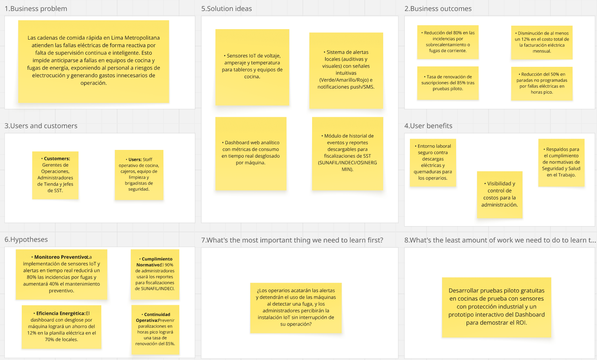

## 1.3. Segmentos objetivo

**Segmento objetivo #1: Trabajadores del Local (Staff Operativo y de Limpieza)**

- **Descripción:** Jóvenes operarios encargados de la cocina, atención en caja, despacho de pedidos y tareas de mantenimiento/limpieza de turnos en restaurantes de comida rápida en Lima Metropolitana.
  
- **Aspectos demográficos:**
  - Sexo: Masculino y Femenino.
  - Edades: Entre 18 y 28 años (muchos combinan estudios universitarios/técnicos con trabajo a tiempo parcial o completo).
  - Nivel socioeconómico: C y B.
    
- **Aspectos geográficos:** Residentes en Lima Metropolitana, que desempeñan sus labores en locales de comida rápida situados en avenidas principales, patios de comidas en centros comerciales o locales de vía pública.

- **Aspectos psicográficos:**
  - Realizan sus labores en entornos de alta velocidad y presión constante.
  - Poseen pocos o nulos conocimientos técnicos sobre electricidad o mantenimiento industrial.
  - Buscan garantías de seguridad para desempeñar sus labores sin poner en peligro su integridad física al manipular agua, mopas o artefactos de alto voltaje.

- **Necesidades clave:**
  - Conocer de manera clara e inmediata si un equipo es seguro de tocar o limpiar (por ejemplo, antes del baldeado o trapeado de la cocina).
  - Contar con una vía simple de notificación para reportar anomalías o ruidos extraños en los equipos sin descuidar sus tareas de atención.
  - Disponer de entornos laborales seguros donde no corran riesgos de electrocución o quemaduras.

- **Sustento estadístico:** El sector de comida rápida en Lima Metropolitana es uno de los mayores empleadores de jóvenes técnicos y universitarios en el país. De acuerdo con informes y registros de la Superintendencia Nacional de Fiscalización Laboral (SUNAFIL), las deficiencias en las condiciones de seguridad e higiene industrial en cocinas comerciales constituyen uno de los principales motivos de inspección, siendo las fallas mecánicas y descargas eléctricas en zonas operativas los eventos con mayor potencial de lesiones graves o fatalidades.

**Segmento objetivo #2: Manager del Local (Administrador / Jefe de Tienda)**

- **Descripción:** Profesional a cargo de la gestión de la tienda, responsable del cumplimiento de las metas de venta, la seguridad e higiene (SST), el control de costos operativos y el mantenimiento técnico de la infraestructura.
  
- **Aspectos demográficos:**
  - Cargos: Store Manager, Administrador de Local, Supervisor de Turno, Jefe de SST.
  - Edades: Entre 25 y 50 años.
  - Nivel socioeconómico: B y A.

- **Aspectos geográficos:** Encargados de establecimientos de comida rápida en Lima Metropolitana.

- **Aspectos psicográficos:**
  - Orientados al cumplimiento estricto de KPIs de servicio, presupuestos de mantenimiento y normativas legales/laborales (SUNAFIL, OSINERGMIN, INDECI e Inspecciones Municipales).
  - Buscan evitar a toda costa contingencias que afecten la imagen de la marca, clausuras temporales/definitivas o demandas legales por negligencia.
  - Valoran los datos centralizados para coordinar de forma preventiva con los equipos de mantenimiento corporativo.
  
- **Necesidades clave:**
  - Garantizar un ambiente de trabajo 100% seguro contra riesgos eléctricos para todo su personal.
  - Disponer de visibilidad del consumo energético por máquina para controlar costos y reducir la factura de energía.
  - Programar mantenimientos predictivos evitando que las cocinas, congeladoras o freidoras se malogren en horas de alta demanda o generen mermas de insumos.
  
- **Sustento estadístico:** En Lima Metropolitana operan más de 1,200 locales pertenecientes a cadenas y franquicias de comida rápida (hamburgueserías, pollerías, pizzerías). Según reportes del sector retail y gastronómico, los costos asociados a servicios básicos y mantenimiento técnico representan entre el 15% y 20% de los gastos operativos mensuales de cada tienda, donde las ineficiencias de red pueden elevar la facturación hasta un 25% si no se detectan anomalías a tiempo. 

# Capítulo II: Requirements Elicitation & Analysis

En esta sección se presentan los resultados del análisis de requerimientos, incluyendo la identificación de competidores, entrevistas con stakeholders y la definición de necesidades clave para el desarrollo de la solución ElectroLink.

## 2.1. Competidores

Tenemos los siguientes competidores directos e indirectos en el mercado de soluciones IoT para monitoreo energético y seguridad eléctrica en restaurantes multisede:

| Empresa / solución | Tipo | Descripción | Similitud con ElectroLink |
|---|---|---|---|
| ElectroLink | Solución propia | Plataforma IoT para monitorear tableros y equipos de cocina con alertas locales, remotas, dashboard multisede e historial. | Propuesta de referencia. Orientada a cadenas de comida rápida en Lima. |
| Powerhouse Dynamics – Open Kitchen | Competidor directo | Plataforma IoT e inteligencia energética para restaurantes multisede. Supervisa cocina, refrigeración, HVAC, iluminación y consumo por circuito en cloud. | Alta. Atiende restaurantes, monitorea equipos y circuitos, centraliza información y gestiona energía y operaciones. |
| MachineQ Foodservice | Competidor directo | Monitoreo IoT para equipos, enchufes, breakers y activos. MQinsights con datos actuales e históricos, tendencias, alertas configurables e información predictiva. | Alta en monitoreo energético y prevención de paradas. Menor en seguridad eléctrica laboral y cumplimiento local. |
| Acrel Smart Power Distribution | Competidor directo o indirecto especializado | Ecosistema de medidores, sensores, gateways y plataforma IoT para distribución eléctrica, energía, alarmas y seguridad multisede. | Alta en tableros, circuitos y alarmas. Enfoque más industrial que gastronómico. |

### 2.1.1. Análisis competitivo

Realizando una comparación de las soluciones mencionadas, se observa que ElectroLink se diferencia por su enfoque en la seguridad eléctrica laboral y la prevención de accidentes en entornos de cocina, mientras que los competidores se centran más en la eficiencia energética y el monitoreo de equipos. Además, ElectroLink busca adaptarse a las necesidades específicas de las cadenas de comida rápida, ofreciendo una solución local y personalizada.

#### Competitive Analysis Landscape

| ¿Por qué llevar a cabo este análisis? | Escriba en el recuadro la pregunta que busca responder o el objetivo de este análisis. |
|---|---|
| Conocer cómo se posiciona ElectroLink frente a soluciones internacionales de monitoreo energético, gestión IoT y seguridad eléctrica para restaurantes multisede. | ¿Qué ventajas, limitaciones y oportunidades tiene ElectroLink frente a Powerhouse Dynamics–Open Kitchen, MachineQ Foodservice y Acrel Smart Power Distribution? |
| Identificar funcionalidades ya validadas en el mercado. | ¿Qué características debe incluir el producto mínimo viable de ElectroLink para ser competitivo? |
| Encontrar un espacio de diferenciación. | ¿Cómo puede ElectroLink competir desde la seguridad eléctrica, la prevención de accidentes y la adaptación a cadenas de comida rápida en Lima Metropolitana? |
| Comparar modelos comerciales y canales de llegada al cliente. | ¿Qué propuesta de producto, precio, distribución y marketing resulta más conveniente para una startup local? |

|  |  |  |  |  |
|---|---|---|---|---|
|  | **ElectroLink** | **Powerhouse Dynamics – Open Kitchen** | **MachineQ Foodservice** | **Acrel Smart Power Distribution** |
| **Overview** | Plataforma IoT enfocada en seguridad eléctrica, eficiencia energética y continuidad operativa en cadenas de comida rápida de Lima. | Plataforma empresarial IoT para optimizar energía, refrigeración, HVAC, iluminación y equipos de restaurantes multisede. | Plataforma IoT para monitorear consumo y utilización de equipos mediante datos en tiempo real, históricos, tendencias y alertas. | Sistema de distribución eléctrica inteligente con medidores, sensores, gateways, alarmas y plataforma cloud para instalaciones multisede. |

**Perfil de Marketing**

| Perfil | Factor de análisis | ElectroLink | Open Kitchen | MachineQ | Acrel |
|---|---|---|---|---|---|
| **Perfil de Marketing** | **Ventaja competitiva ¿Qué valor ofrece a los clientes?** | Prevención de accidentes eléctricos, detección temprana de anomalías, alertas para personal no técnico, reducción de consumo y evidencia para mantenimiento y SST. | Visibilidad centralizada de locales, automatización energética, control de equipos y reducción de costos operativos. | Información accionable sobre consumo y rendimiento de activos, prevención de downtime y optimización del uso energético. | Medición detallada de parámetros eléctricos, alarmas configurables, monitoreo remoto y gestión de seguridad de la distribución. |
|  | **Mercado objetivo** | Cadenas y franquicias de comida rápida en Lima con más de 5 locales. Compradores: operaciones, SST, mantenimiento corporativo. Usuarios: cocina y limpieza. | Marcas de restaurantes, foodservice, retail y operadores multisede con infraestructura energética compleja. | Empresas de foodservice y organizaciones que necesitan monitorear equipos, consumo, utilización y mantenimiento. | Restaurantes, retail, edificios, centros industriales e instalaciones comerciales que requieren gestión multisede. |
|  | **Estrategias de marketing** | Venta B2B directa, pilotos en locales, demos de ahorro y seguridad, alianzas con mantenimiento eléctrico, asociaciones empresariales y consultores SST. | Venta empresarial, demostraciones, alianzas con fabricantes de equipos y paquetes con hardware, instalación y servicios administrados. | Venta consultiva B2B basada en casos de ahorro, monitoreo remoto, reducción de fallas e integración con sistemas empresariales. | Venta técnica por cotización, distribuidores, integradores eléctricos y proyectos de infraestructura o automatización. |

**Perfil de Producto**

| Perfil | Factor de análisis | ElectroLink | Open Kitchen | MachineQ | Acrel |
|---|---|---|---|---|---|
| **Perfil de Producto** | **Productos & Servicios** | Kit de sensores corriente, voltaje y temperatura; detección de fugas; gateway; dashboard web; alertas push/SMS/locales; historial; reportes; mantenimiento preventivo. | Open Kitchen, monitoreo por circuito, control HVAC, refrigeración, iluminación, alertas, analítica, reportes, instalación/soporte y reducción de demanda con IA. | MQinsights, transformadores de corriente, smart plugs, gateways, monitoreo por activo/enchufe/breaker, alertas, tendencias y predictivo. | Medidores mono/trifásicos, sensores inalámbricos y temperatura, gateways, plataforma IoT EMS, alarmas, históricos, monitoreo y control. |
|  | **Precios & Costos** | Modelo propuesto: costo inicial por kit + instalación + suscripción SaaS mensual por local/tablero. Accesible para cadenas medianas, piloto de bajo riesgo. | Cotización empresarial. Ref. no oficial USD 150-400 mensual por local. Incluye hardware, instalación, software y servicios. No hay tarifa pública. | Cotización según sensores, activos, conectividad, locales, integración y servicios. Depende de infraestructura IoT y suscripción. | Cotización por proyecto. Ref. hardware desde USD 200-1.000 por caja inteligente. No equivale al costo total de implementación. |
|  | **Canales de distribución (Web y/o Móvil)** | Dashboard web central, interfaz simple en tienda, push/SMS y señalizadores locales. Futuro: app móvil para técnicos y administradores. | Plataforma cloud en navegador, reportes centralizados y control remoto. Enfoque en gestión empresarial multisede. | Plataforma MQinsights, dashboards, alertas e integración por API REST o integraciones nativas empresariales. | Plataforma cloud y paneles; gateways con Modbus, RS485, Wi-Fi, 4G o LoRa según dispositivo. |

**Análisis SWOT**

| Perfil | Factor de análisis | ElectroLink | Open Kitchen | MachineQ | Acrel |
|---|---|---|---|---|---|
| **Análisis SWOT** | **Fortalezas** | Propuesta vertical para restaurantes; prioridad en seguridad laboral; alertas simples; adaptación a Lima y SST; integra seguridad, energía y mantenimiento. | Marca y experiencia IoT; enfoque restaurantes; amplia cobertura; monitoreo por circuito; control HVAC y refrigeración; escala grande. | Arquitectura escalable; monitoreo por activo/enchufe/breaker; datos históricos y tiempo real; alertas configurables; predictiva; APIs. | Amplio catálogo hardware; medición multicircuito; alarmas e históricos; seguridad eléctrica; personalización y arquitectura distribuida. |
|  | **Debilidades** | Startup sin historial ni casos; hardware y algoritmos por validar en grasa, calor y humedad; requiere certificación e instalación segura; debe validar reducción de accidentes. | Posiblemente sobredimensionada y costosa para cadenas pequeñas; depende de implementación empresarial; más eficiencia que prevención de electrocución. | Requiere varios dispositivos y arquitectura compleja; propuesta horizontal no adaptada a normativa peruana, SST o limpieza en cocinas. | Enfoque técnico-industrial; complejo para no técnicos; requiere personal eléctrico para instalación; no diseñado para flujo de restaurante. |
|  | **Oportunidades** | Ser solución local en seguridad foodservice; implementación rápida y bajo costo; reportes SST; alianzas con instaladores, aseguradoras y mantenimiento; expansión a retail, hoteles y dark kitchens. | Crecimiento multisede y necesidad de reducir costos energéticos favorecen plataformas inteligentes. Ampliación vía fabricantes. | Demanda de visibilidad energética, sostenibilidad, menos downtime y gestión remota. API permite integración con software existente. | Expansión IoT energético y modernización comercial crean oportunidad para distribución conectada, medición por circuito y alarmas remotas. |
|  | **Amenazas** | Competidores con capital y marca; resistencia a hardware; falsas alarmas; responsabilidad legal; dificultad para demostrar ROI; certificación y seguridad eléctrica. | Puede capturar cuentas grandes con solución integral, marca internacional, instalación y soporte administrado. | Puede competir con plataforma IoT reutilizable multindustria y respaldo Comcast/MachineQ. | Puede competir por precio en hardware, vía integradores locales y como proveedor de infraestructura en proyectos grandes. |

**Comparación de capacidades**

| Capacidad | ElectroLink | Open Kitchen | MachineQ | Acrel |
|---|---|---|---|---|
| Orientación específica a restaurantes | Alta | Alta | Alta en foodservice | Media |
| Monitoreo por local | Sí | Sí | Sí | Sí |
| Monitoreo por circuito | Sí, como función central | Sí | Sí | Sí |
| Monitoreo de corriente y voltaje | Sí | Sí, según configuración | Sí | Sí |
| Monitoreo de temperatura | Sí, en equipos y tableros | Sí, principalmente en equipos y refrigeración | Disponible según sensores y caso de uso | Sí |
| Detección de fugas o fallas a tierra | Debe ser función central, validada técnicamente | No aparece como eje principal | No aparece como eje principal | Puede cubrir condiciones eléctricas y alarmas, según componentes |
| Alertas configurables | Sí | Sí | Sí | Sí |
| Alertas para personal no técnico | Sí, mediante interfaz local simple | Principalmente gestión centralizada | Principalmente dashboard y notificaciones | Principalmente alarmas técnicas |
| Analítica energética | Sí | Sí, con funciones avanzadas de demanda | Sí | Sí |
| Mantenimiento predictivo | En desarrollo; debe validarse con datos piloto | Sí, mediante monitoreo de equipos y analítica | Sí, con insights predictivos | Sí, mediante monitoreo de condición y alarmas |
| Control remoto de equipos | Opcional o futura | Sí, especialmente HVAC, iluminación y equipos compatibles | Depende de los dispositivos instalados | Disponible según dispositivos y salidas |
| Gestión de órdenes de trabajo | Debe integrarse en el roadmap | Puede requerir integración o servicio adicional | Puede integrarse mediante API | Puede requerir integración con CMMS |
| Reportes para SST y auditorías locales | Diferenciador principal | Reportes operativos y energéticos | Reportes de consumo, activos y eventos | Registros técnicos y de eventos |
| Adaptación a Perú | Alta, si se implementa correctamente | Baja o requiere localización | Baja o requiere localización | Baja o requiere integrador local |
| Complejidad para una cadena mediana | Diseñable como baja o media | Media o alta | Media | Media o alta |
| Modelo comercial | Kit + instalación + SaaS | Cotización empresarial | Cotización empresarial | Hardware/proyecto + plataforma/cotización |

**SWOT consolidado de ElectroLink**

| Fortalezas | Debilidades |
|---|---|
| Enfoque especializado en cadenas de comida rápida y cocinas de alta exigencia. | Falta de validación comercial y técnica en condiciones reales. |
| Integra seguridad eléctrica, consumo energético y mantenimiento preventivo. | Dependencia de la precisión de sensores y algoritmos de detección. |
| Alertas diseñadas para usuarios no técnicos en la tienda. | Costos iniciales de diseño, certificación, instalación y soporte. |
| Posibilidad de generar evidencia para inspecciones y auditorías internas. | Riesgo de falsas alarmas o de que el personal ignore las alertas. |
| Adaptación a procesos, idioma, operación y necesidades regulatorias locales. | Todavía no cuenta con marca, referencias ni economías de escala de proveedores internacionales. |
| Modelo SaaS recurrente por local, tablero o conjunto de sensores. | La detección de fugas y el protocolo de apagado seguro requieren validación por especialistas eléctricos. |
| **Oportunidades** | **Amenazas** |
| Digitalización de la operación de cadenas y franquicias. | Open Kitchen puede ofrecer una plataforma integral a grandes cadenas. |
| Necesidad de disminuir paradas, accidentes, consumo y costos de mantenimiento. | MachineQ puede aprovechar una plataforma IoT horizontal y escalable. |
| Alianzas con empresas de mantenimiento eléctrico, SST, aseguradoras e integradores. | Acrel puede competir con hardware de menor costo y amplia variedad de medidores. |
| Venta de pilotos para demostrar ahorro y reducción de riesgos. | Las cadenas pueden preferir proveedores eléctricos tradicionales. |
| Expansión a minimarkets, hoteles, dark kitchens, centros comerciales y retail. | Problemas de conectividad, calor, grasa, humedad o interferencias en cocina. |
| Integración con CMMS, ERP, sistemas de tickets y plataformas de mantenimiento. | Una falla del sistema podría generar responsabilidad operativa o reputacional. |
| Posibilidad de construir una base de datos local para modelos predictivos. | Requisitos de seguridad eléctrica, certificación, responsabilidad profesional y protección de datos. |

### 2.1.2. Estrategias y tácticas frente a competidores

ElectroLink no debería competir únicamente con el argumento de medir el consumo. Open Kitchen, MachineQ y Acrel ya cubren medición energética, monitoreo remoto, alarmas y análisis de activos. La oportunidad está en combinar esas capacidades con seguridad eléctrica del trabajador, respuesta inmediata en tienda y trazabilidad del mantenimiento.

Posicionamiento recomendado: ElectroLink es una plataforma IoT de seguridad eléctrica y continuidad operativa para cadenas de restaurantes, capaz de detectar anomalías en tableros y equipos, alertar al personal antes de una falla crítica y generar evidencia para la gestión de mantenimiento y SST.

Prioridades del producto mínimo viable:

1. Medición segura y confiable de corriente, voltaje y temperatura.
2. Detección técnicamente validada de sobrecargas, sobrecalentamiento, pérdida de fase y eventos anómalos.
3. Alertas locales claras, con instrucciones de acción para personal no técnico.
4. Dashboard multisede para administradores y gerentes de operaciones.
5. Historial de eventos, responsables, acciones correctivas y reportes descargables.
6. Pilotos controlados en uno o dos locales antes de prometer porcentajes de ahorro o reducción de accidentes.
7. Integración posterior con órdenes de trabajo, mantenimiento corporativo y sistemas de auditoría.

Conviene validar antes de la versión final las cifras sobre accidentes, número de locales, porcentajes de sobrecosto energético y requisitos de OSINERGMIN, SUNAFIL e INDECI. Debe distinguirse entre detectar una anomalía eléctrica y garantizar la ausencia de riesgo de electrocución: ElectroLink debe complementar, no reemplazar, las protecciones eléctricas, inspecciones certificadas y procedimientos de SST.

## 2.2. Entrevistas

### 2.2.1. Diseño de entrevistas
En esta sección se presenta el diseño de las entrevistas por segmento objetivo.

**Segmento #1: Trabajadores del Local (Staff Operativo y de Limpieza)**

**Preguntas principales:**
- ¿Cómo actúas cuando surge un problema eléctrico, como un corte de luz, una freidora o que deja de funcionar un horno?
- ¿Qué tan rápido se atiende normalmente ese tipo de problemas en tu local?
- ¿De qué manera una falla eléctrica afecta tu trabajo con relación a la atención al cliente, tiempos de entrega y seguridad?
- ¿Has vivido alguna situación donde una instalación mal hecha o falta de mantenimiento haya causado un problema mayor en el local? ¿Cómo se resolvió?
- ¿Con qué frecuencia ves que se hace mantenimiento preventivo a los equipos e instalaciones eléctricas de tu local?
- ¿Qué importancia le das a que las reparaciones eléctricas del local cumplan normas de seguridad y cumplimiento normativo?
- ¿Considerarías útil usar una plataforma que permita reportar rápido una falla y conectar con proveedores verificados para tu zona?
- ¿Qué funcionalidades crees que harían esa plataforma útil para ti en el día a día (reporte en 1 clic, seguimiento en tiempo real, historial de fallas, chat con técnico)?

**Preguntas complementarias:**
- ¿Qué sueles hacer o buscar en internet cuando no sabes si una falla es eléctrica o del equipo?
- ¿Cuánto confías en que tu reporte será atendido rápidamente por el encargado o un técnico?
- ¿En qué momentos específicos del turno crees que sería más útil tener acceso a soporte eléctrico certificado (hora punta, cierre, apertura)?
- ¿Te sentirías cómodo usando una aplicación para reportar fallas y agendar mantenimientos preventivos sin depender solo de WhatsApp o aviso verbal?

**Segmento #2: Manager del Local (Administrador / Jefe de Tienda)**

**Preguntas principales:**
- ¿Cómo está actualmente con la forma en que gestionas fallas y mantenimientos eléctricos en tu local?
- ¿Qué haces normalmente cuando necesitas encontrar a alguien que repare o revise una instalación eléctrica del local?
- ¿Qué tan fácil o difícil te resulta encontrar técnicos eléctricos certificados que atiendan con la rapidez que exige una cadena de comida rápida?
- ¿Cuando has contratado un servicio eléctrico antes, ¿qué fue lo que más te preocupó (tiempo de inactividad, costo, seguridad alimentaria, cumplimiento normativo)?
- ¿Qué cosas valoras más al contratar un proveedor para tu local (disponibilidad 24/7, certificación, garantía, precio, rapidez, facturación formal)?
- ¿Con qué frecuencia realizas mantenimiento preventivo a tableros, cableado, refrigeración y equipos de cocina eléctrica?
- ¿Te ha pasado que una instalación mal hecha haya causado pérdida de ventas, cierre temporal o riesgo sanitario? ¿Cómo lo resolviste?
- ¿Estarías dispuesto a pagar una suscripción mensual si eso te garantiza proveedores verificados, atención prioritaria y monitoreo preventivo? ¿Por qué?
- ¿Qué funcionalidades crees que te facilitarían la gestión desde una plataforma (panel multi-local, Acuerdo de Nivel de Servicio y tiempos de atención, calificaciones, pagos y facturación, historial y alertas preventivas)?

**Preguntas complementarias:**
- ¿Dónde buscas actualmente técnicos o proveedores (contactos de la cadena, Facebook, WhatsApp, proveedores corporativos)?
- ¿Has probado plataformas para solicitar servicios de mantenimiento? ¿Cómo fue la experiencia?
- ¿Qué herramientas digitales usas hoy para organizar mantenimientos y pedidos (Excel, WhatsApp, sistema interno de la franquicia)?
- ¿Qué tan dispuesto estarías a formar parte de una red de locales y proveedores certificados con estándares comunes de seguridad eléctrica?

### 2.2.2. Registro de entrevistas

**Segmento #1: Trabajadores del Local (Staff Operativo y de Limpieza)**

- Entrevista: Mark Mori
- Edad: 21 años
- Link: [Ver entrevista](https://youtu.be/P8z1pkmBKxY)
- Inicia en: 0:10
- Duración: 7:38

**Contexto de la entrevista**
El objetivo de la charla fue conocer la perspectiva del personal operativo sobre una propuesta de proyecto basada en dispositivos IoT (sensores inteligentes) para medir el consumo eléctrico, evitar sobrecalentamientos y prevenir accidentes en locales comerciales.

**Aspectos clave mencionados por el entrevistado:**
- Protocolos ante fallas eléctricas: Cuando ocurre un corte de luz o falla un equipo (como freidoras u hornos), se avisa inmediatamente al gerente de turno. El gerente baja el interruptor y se emite un ticket de soporte. Priorizan revisar las llaves termomagnéticas para asegurar que las cámaras de frío no pierdan temperatura y se echen a perder los insumos.
- Tiempos de respuesta: Para fallas críticas reportadas por su plataforma interna, el tiempo estimado de atención y arreglo por parte de los técnicos es de 1 a 3 horas, ya que no pueden detener operaciones esenciales.
Impacto de las fallas en el trabajo y servicio:
- Atención y ventas: Se paralizan las operaciones. Caen los sistemas POS (puntos de venta) por falta de internet y las pantallas de cocina se apagan, impidiendo ver o tomar nuevos pedidos.
- Delivery: Los repartidores no pueden ser despachados.
- Seguridad: Las fallas incrementan el riesgo de accidentes, posibles fugas de gas o problemas de iluminación en el entorno de la cocina.
**Mantenimientos preventivos y seguridad:**
El mantenimiento en su local se realiza cada dos meses. Es vital porque la grasa y el calor constante de la cocina pueden afectar los circuitos.
Mark considera crítico el cumplimiento normativo. Reciben capacitaciones mensuales sobre cómo actuar en estas emergencias, lo cual es fundamental al convivir con pisos húmedos, freidoras y altas temperaturas.
**Opinión sobre la plataforma propuesta (IoT y reportes):**
Considera útil la idea para el seguimiento en tiempo real, aunque menciona que actualmente su empresa ya terceriza esa función con proveedores establecidos.
Funcionalidades deseadas: Si utilizara esta nueva plataforma en el día a día, le gustaría que incluyera el seguimiento en tiempo real del ticket de soporte, la opción de adjuntar fotografías del problema, un historial de fallas y un chat directo con el técnico para agilizar la solución y mejorar la trazabilidad.

---

- Entrevista: Anyelina Rivera
- Edad: 21 años
- Link: [Ver entrevista](https://youtu.be/Il90kC2yYTM)
- Inicia en: 0:02
- Duración: 10:48

**Contexto de la entrevista**
Al igual que en la primera entrevista, el objetivo fue conocer la perspectiva de un trabajador de restaurante de comida rápida sobre una propuesta de proyecto IoT para monitorear componentes eléctricos en la cocina y prevenir accidentes.

**Aspectos clave mencionados por la entrevistada:**
- Protocolos ante fallas eléctricas: Lo primero que hacen es avisar al encargado de turno. Si es un corte general, esperan indicaciones; pero si es un equipo específico (freidora, horno, plancha), evitan manipularlo por seguridad (especialmente si hay humo, chispas o cables dañados). Mientras tanto, el equipo de cocina se reorganiza para seguir trabajando con las máquinas operativas y priorizar pedidos.
- Tiempos de respuesta: Depende de la gravedad. Si la falla afecta directamente la producción y operación, se reporta rápidamente como emergencia para coordinar con mantenimiento. Si es algo menor, puede esperar. Los tiempos también dependen de la disponibilidad del técnico o de si se necesitan repuestos.

**Impacto de las fallas en el trabajo y servicio:**
- Atención y tiempos: Los pedidos se acumulan, el tiempo de preparación aumenta y los clientes terminan esperando más de lo habitual, lo cual afecta la calidad del servicio de comida rápida.
- Seguridad: Anyelina resalta que la seguridad es prioritaria. Preferirán detener el uso de un equipo antes que arriesgarse a una descarga eléctrica o accidente mayor por querer sacar los pedidos rápido.

**Mantenimientos preventivos y seguridad:**
Sabe que hay un mantenimiento periódico coordinado por los encargados, aunque los empleados no manejan el cronograma exacto.
Considera vital el mantenimiento preventivo porque en un restaurante los equipos se usan intensamente todo el día. Esperar a que se malogren genera más costos y afecta la atención.
Cumplimiento normativo: Le da mucha importancia. Las reparaciones no solo deben hacer que la máquina vuelva a funcionar, sino que deben garantizar la seguridad del personal, dado que trabajan en un entorno riesgoso con calor, agua, grasa y electricidad.

**Opinión sobre la plataforma propuesta (IoT y reportes):**
Considera que sería muy útil para ordenar y acelerar el proceso. Valora especialmente que la plataforma ofrezca técnicos y proveedores verificados, ya que los temas eléctricos no deben dejarse en manos de cualquier persona.
Funcionalidades deseadas:
- Reportes rápidos y sencillos: Seleccionar el equipo, hacer una descripción corta y poder adjuntar fotos/videos de prueba sin que sea un proceso engorroso.
- Seguimiento en tiempo real: Saber si el técnico ya fue asignado y a qué hora llegará.
- Historial de fallas: Para identificar si un equipo se malogra repetidamente y evaluar si es mejor reemplazarlo.
- Chat directo con el técnico: Para poder explicar mejor el problema antes de que llegue al local.

---

### 2.2.3. Análisis de entrevistas

## 2.3. Needfinding

Continuando con esta sección, se presentan los hallazgos de las entrevistas y la investigación de campo, organizados en herramientas de análisis de necesidades, incluyendo la creación de user personas, matrices de tareas, mapas de empatía y escenarios actuales (as-is).

### 2.3.1. User Personas

Segmento 1:

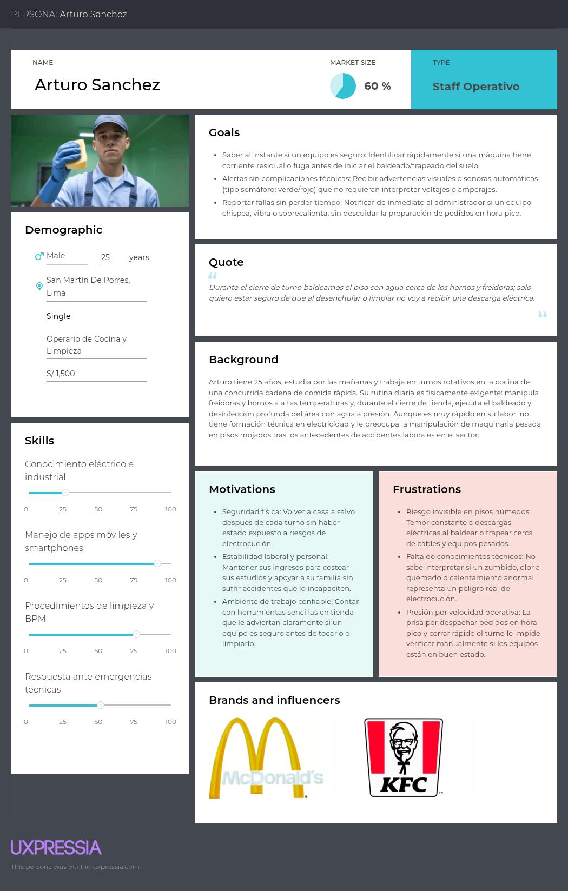

Segmento 2:

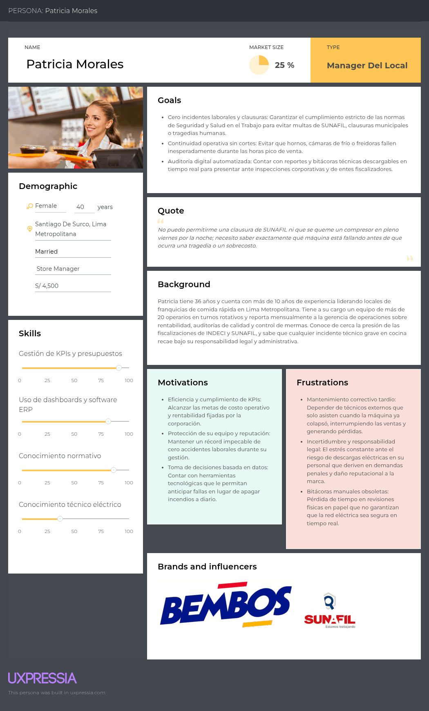

### 2.3.2. User Task Matrix

En esta sección se detallan las tareas que realizan los diferentes segmentos de usuarios representados por los User Personas de ElectroLink, con el objetivo de cumplir sus metas relacionadas con la prevención de accidentes laborales, el monitoreo y control técnico, y la optimización del consumo eléctrico en cadenas de comida rápida.

**Segmento: Trabajadores del Local (Staff Operativo y de Limpieza)**

| Persona | Actividad | Frecuencia | Importancia |
| :--- | :--- | :--- | :--- |
| Arturo Sanchez - Operario de Cocina y Limpieza | Verificar el indicador visual de seguridad antes de baldear o limpiar la cocina | Frecuentemente | Alta |
| Arturo Sanchez - Operario de Cocina y Limpieza | Recibir alertas inmediatas ante fugas de corriente o sobrecalentamiento en máquinas | Frecuentemente | Alta |
| Arturo Sanchez - Operario de Cocina y Limpieza | Reportar anomalías físicas o ruidos extraños en los equipos de cocina | Frecuentemente | Alta |
| Arturo Sanchez - Operario de Cocina y Limpieza | Detener el uso o desconexión de una máquina riesgosa ante una alerta crítica | Ocasionalmente | Alta |
| Arturo Sanchez - Operario de Cocina y Limpieza | Confirmar el restablecimiento seguro de un equipo tras la intervención de mantenimiento | Ocasionalmente | Media |
| Arturo Sanchez - Operario de Cocina y Limpieza | Revisar instructivos rápidos de seguridad y apagado seguro en pantalla de cocina | Ocasionalmente | Media |

---

**Segmento: Managers del Local (Administradores / Jefes de Tienda)**

| Persona | Actividad | Frecuencia | Importancia |
| :--- | :--- | :--- | :--- |
| Patricia Morales - Store Manager | Monitorear en tiempo real la salud de la red y el estado de los equipos críticos | Frecuentemente | Alta |
| Patricia Morales - Store Manager | Recibir y gestionar notificaciones de fugas eléctricas y riesgos de electrocución | Frecuentemente | Alta |
| Patricia Morales - Store Manager | Coordinar servicios de mantenimiento preventivo y correctivo con técnicos | Frecuentemente | Alta |
| Patricia Morales - Store Manager | Analizar reportes de consumo energético detallados por máquina | Ocasionalmente | Alta |
| Patricia Morales - Store Manager | Descargar bitácoras y reportes de seguridad para inspecciones (SUNAFIL / INDECI) | Ocasionalmente | Alta |
| Patricia Morales - Store Manager | Evaluar indicadores de ahorro energético y sobrecostos en la facturación mensual | Ocasionalmente | Alta |
| Patricia Morales - Store Manager | Supervisar el historial de alertas e incidencias técnicas de la tienda | Ocasionalmente | Media |

### 2.3.3. Empathy Mapping

Segmento 1:

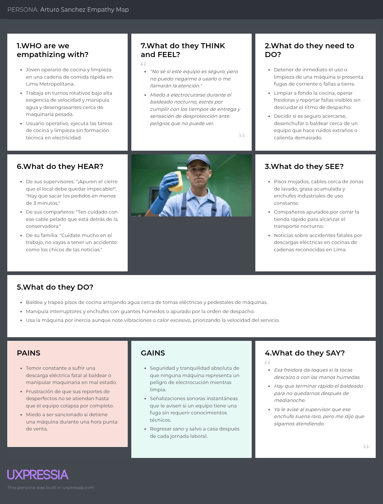

Segmento 2:

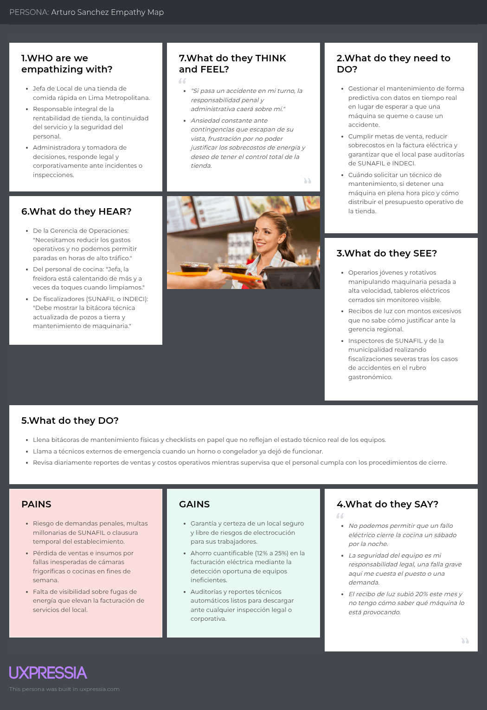

### 2.3.4. As-is Scenario Mapping

En esta sección se modela la situación operativa y de gestión actual ("As-Is") en las tiendas de comida rápida de Lima Metropolitana, evidenciando las fricciones, riesgos y vacíos tecnológicos que existen antes de la adopción de ElectroLink.

### As-Is Scenario Mapping - Segmento 1: Trabajadores del Local (Staff Operativo y de Limpieza)

| Fases | Fase 1: Inicio de Turno e Inspección Empírica | Fase 2: Operación Diaria Bajo Presión | Fase 3: Aparición de Falla No Notificada | Fase 4: Limpieza y Baldeado de Alto Riesgo | Fase 5: Cierre de Turno y Reporte Verbal |
| :--- | :--- | :--- | :--- | :--- | :--- |
| **Doing** | Enciende freidoras, tostadoras y hornos directamente por inercia, confiando únicamente en que la máquina encienda sin emitir chispas a simple vista. | Prepara alimentos a alta velocidad en hora pico; manipula perillas, carcasas y switches sin saber si existe una fuga de corriente parásita en la carcasa. | Siente un leve hormigueo ("toque") al rozar la freidora o percibe un olor sutil a cable caliente; no sabe si es normal y duda si avisar para no detener la línea de despacho. | Arroja baldes con agua y desengrasante sobre el piso de la cocina para trapear rápido, pasando trapeadores húmedos cerca de cables de conexión y enchufes industriales a nivel del suelo. | Apaga las máquinas manualmente de prisa para no perder el último transporte nocturno; le avisa de pasada o por WhatsApp al supervisor sobre "el zumbido extraño" del equipo. |
| **Thinking** | *"Ojalá todo prenda bien hoy; no tengo forma de saber si los cables de atrás están pelados o haciendo masa."* | *"Tengo que sacar los combos en menos de 3 minutos, no me da el tiempo para fijarme en detalles técnicos."* | *"Sentí una descarga pequeña al tocar el borde metálico, pero si paro la freidora la jefa me llamará la atención por retrasar los pedidos."* | *"Tengo que baldear con mucho cuidado; el piso está inundado de agua cerca de las conexiones y temo electrocutarme como ocurrió en otros locales."* | *"Ya le dije al encargado que esa máquina da toques; espero que no se le olvide y que mañana nadie se accidente."* |
| **Feeling** | Incertidumbre y resignación. | Estrés constante y distracción por temor al entorno de trabajo. | Miedo, duda e indefensión ante un peligro invisible. | Pánico latente, vulnerabilidad y extrema tensión física. | Agotamiento, frustración e intranquilidad por la seguridad del equipo. |

---

### As-Is Scenario Mapping - Segmento 2: Manager del Local (Administrador / Jefe de Tienda)

| Fases | Fase 1: Apertura y Revisión Manual | Fase 2: Operación Ciegas del Consumo | Fase 3: Ocurrencia de Avería Intempestiva | Fase 4: Mantenimiento Correctivo de Emergencia | Fase 5: Cierre Mensual y Enfrentamiento de Costos |
| :--- | :--- | :--- | :--- | :--- | :--- |
| **Doing** | Firma checklists físicos de apertura en hojas de papel; verifica visualmente que las luces del tablero no estén bajadas, sin conocer los niveles reales de voltaje ni fugas. | Supervisa la operación de venta ignorando por completo qué equipo específico está provocando picos de demanda o fugas a tierra durante la jornada. | Recibe el reporte urgente del colapso de una conservadora en pleno viernes por la noche; el interruptor termomagnético general salta y deja a oscuras parte de la cocina. | Llama de urgencia a servicios técnicos externos no verificados; suspende temporalmente la venta de ítems del menú y reubica insumos perecibles para evitar mermas masivas. | Recibe la factura eléctrica con un sobrecosto del 20% que no puede justificar ante la gerencia regional; llena manualmente bitácoras desactualizadas ante una inspección de SUNAFIL. |
| **Thinking** | *"Lleno estos formatos de seguridad en papel por protocolo, pero no garantizan que la red interna esté a salvo de un cortocircuito."* | *"No sé qué máquina consume más luz; solo me entero de los gastos cuando llega el recibo a fin de mes."* | *"Justo colapsa en la hora de mayor venta; perderemos miles de soles en pedidos y los insumos de la congeladora corren riesgo."* | *"El técnico cobrará tarifa de emergencia y demorará horas en llegar; la cocina está paralizada y el personal expuesto a riesgos."* | *"El recibo vino altísimo otra vez y no sé qué falló; si me cae una auditoría de SUNAFIL o INDECI no tengo reportes técnicos para sustentar el estado del local."* |
| **Feeling** | Falsa sensación de control y desconfianza en los registros manuales. | Ceguera operativa e impotencia presupuestal. | Desesperación, estrés extremo y alarma ante la paralización de ventas. | Agobio, reactividad y preocupación por la continuidad de la franquicia. | Frustración financiera, incertidumbre legal y alta presión corporativa. |

## 2.4. Ubiquitous Language

### 1. Términos del Dominio de Seguridad y Parámetros Eléctricos

*   **Fuga a tierra (Ground Fault Leakage):** Derivación anómala de corriente eléctrica hacia partes metálicas o carcasa exterior de una máquina debido a fallas en el aislamiento o humedad. Es el principal precursor de descargas eléctricas y accidentes laborales en cocina.
*   **Corriente Residual (Residual Current):** Diferencia medible entre la corriente que entra y la que sale de un circuito cerrado; indica la presencia activa de una fuga hacia tierra o masa.
*   **Sobrecorriente / Sobrecarga (Overcurrent / Overload):** Condición operativa en la que la demanda de corriente supera la capacidad nominal de diseño de un circuito o motor por un tiempo prolongado, generando sobrecalentamiento.
*   **Caída de Tensión (Voltage Sag):** Disminución transitoria del voltaje nominal en la red interna de la tienda producida por el arranque simultáneo de cargas inductivas pesadas (motores, compresores).
*   **Pozo a Tierra (Grounding System):** Mecanismo de seguridad obligatorio en instalaciones eléctricas que disipa hacia el suelo las corrientes de falla y sobretensiones, protegiendo tanto a los operarios como a los equipos.
*   **Temperatura de Circuito/Equipo (Operating Temperature):** Nivel térmico medido en bornes, cables y carcasas de maquinaria para prevenir conatos de incendio y desgaste de material dieléctrico.

### 2. Términos de Hardware e Infraestructura IoT

*   **Kit de Sensores (Sensor Kit):** Conjunto modular de hardware industrial compuesto por transformadores de corriente de núcleo abierto (sensores de efecto Hall/corriente), sondas térmicas y módulos de medición de voltaje instalados sin cortar el suministro de la red.
*   **Gateway IoT (IoT Edge Gateway):** Dispositivo central de comunicaciones local instalado en el tablero general que recolecta, preprocesa y encripta las lecturas de telemetría de los sensores de cocina para enviarlas a la nube mediante Wi-Fi o red celular (4G/LTE).
*   **Tablero de Distribución / General (Distribution Board):** Panel eléctrico que aloja los interruptores termomagnéticos, diferenciales y barras de conexión que alimentan los subcircuitos de la tienda.
*   **Telemetría Eléctrica (Electrical Telemetry):** Flujo de datos periódicos de alta resolución (amperaje, voltaje, factor de potencia, temperatura) transmitido en tiempo real desde el hardware IoT hacia la plataforma cloud.

### 3. Términos de Software, Alertas y Operación en Tienda

*   **Umbral de Disparo (Alert Threshold):** Límite paramétrico preestablecido (ej. corriente de fuga > 30 mA, temperatura de cable > 65 °C) que, al superarse, activa automáticamente eventos de contingencia en el sistema.
*   **Alerta Crítica (Critical Alert / Hazard):** Notificación de máxima prioridad desencadenada por una falla que compromete la vida humana o la integridad estructural de la tienda (ej. fuga eléctrica viva en entorno húmedo). Requiere apagado o bloqueo inmediato.
*   **Alerta Preventiva (Warning / Anomaly):** Notificación temprana emitida cuando una máquina opera fuera de su curva normal de consumo o temperatura, anticipando una falla antes de su interrupción total.
*   **Semáforo de Seguridad (Visual Safety Indicator):** Interfaz simplificada para el personal de piso que traduce métricas técnicas en estados cromáticos comprensibles:
    *   *Verde (Seguro):* Parámetros óptimos; seguro para operar y baldear.
    *   *Amarillo (Precaución):* Fluctuación o anomalía leve registrada; requiere supervisión.
    *   *Rojo (Peligro Inminente):* Fuga activa o sobrecalentamiento crítico; prohibido tocar o limpiar el equipo.
*   **Protocolo de Apagado Seguro (Safe Shutdown Protocol):** Secuencia asistida de instrucciones que guía al personal operativo para aislar la maquinaria comprometida de la fuente de energía antes de intervenirla físicamente.
*   **Bitácora Técnica Digital (Digital Incident Log):** Registro inmutable y cronológico de todas las lecturas de telemetría, anomalías disparadas, alertas notificadas y acciones de mitigación adoptadas por el personal de tienda.

### 4. Términos de Gestión Operativa, Auditoría y Negocio

*   **Monitoreo por Circuito (Circuit-Level Monitoring):** Capacidad analítica de aislar y auditar el comportamiento eléctrico y consumo energético de una sola línea dedicada o máquina específica (ej. freidora de papas, cámara de congelación).
*   **Continuidad Operativa (Uptime / Operational Continuity):** Métrica que evalúa el tiempo que la línea de preparación y despacho de alimentos se mantiene en servicio ininterrumpido durante los horarios de atención al cliente.
*   **Eficiencia de Red (Power Quality Efficiency):** Razón entre la energía activa efectivamente utilizada y la energía reactiva/pérdida facturada por distorsiones armónicas o sobrecargas en equipos envejecidos.
*   **Reporte de Cumplimiento SST (OSH Compliance Report):** Documento descargable generado por la plataforma que consolida evidencias técnicas sobre la estabilidad eléctrica de la tienda, utilizado en auditorías ante la SUNAFIL, OSINERGMIN e INDECI.
*   **Store Manager (Administrador de Tienda):** Usuario directivo responsable de la gestión de costos, cumplimiento normativo, respuesta ante fiscalizaciones y coordinación de órdenes de mantenimiento en el local.
*   **Operario de Cocina / Limpieza (Kitchen Crew):** Usuario operativo expuesto directamente a la interacción física con la maquinaria pesada de cocina y a tareas de limpieza profunda (baldeado de pisos).

# Capítulo III: Requirements Specification

## 3.1. To-Be Scenario Mapping

### To-Be Scenario Mapping - Segmento 1: Trabajadores del Local (Staff Operativo y de Limpieza)

| Fases | Fase 1: Inicio de Turno y Verificación | Fase 2: Operación Diaria de Equipos | Fase 3: Detección y Notificación de Anomalía | Fase 4: Protocolo de Limpieza Segura | Fase 5: Cierre de Turno y Reporte |
| :--- | :--- | :--- | :--- | :--- | :--- |
| **Doing** | Revisa el panel táctil/señalizador local en cocina antes de encender freidoras y hornos. | Trabaja en la preparación de alimentos observando los indicadores visuales en verde. | Escucha una alerta auditiva local y ve que la pantalla cambia a indicador Rojo "Fuga Detectada". | Consulta el estado del equipo en la pantalla local antes de trapear o baldear la zona de cocina. | Presiona el botón de reporte rápido de fin de turno para confirmar equipos seguros. |
| **Thinking** | "Es genial poder ver con una luz verde si los equipos están seguros antes de empezar a trabajar." | "Puedo concentrarme en sacar los pedidos rápido sin miedo a tocar una máquina en mal estado." | "El sistema me avisa de inmediato que hay peligro; debo alejarme y reportar según el protocolo." | "No debo preocuparme por un shock eléctrico al trapear la cocina porque la pantalla me confirma la seguridad." | "Terminé mi turno tranquilo sabiendo que dejé todo reportado sin trámites complicados." |
| **Feeling** | Confianza y tranquilidad. | Seguridad y concentración. | Alerta pero respaldado por la señalización clara. | Alivio y protección. | Satisfacción y seguridad laboral. |

### To-Be Scenario Mapping - Segmento 2: Manager del Local (Administrador / Jefe de Tienda)

| Fases | Fase 1: Supervisión Inicial del Dashboard | Fase 2: Monitoreo Continuo de Consumo | Fase 3: Gestión Inmediata de Alerta Crítica | Fase 4: Coordinación de Mantenimiento | Fase 5: Auditoría y Cierre Mensual |
| :--- | :--- | :--- | :--- | :--- | :--- |
| **Doing** | Abre el Dashboard Web de ElectroLink al inicio de la jornada para verificar el estado de la red. | Revisa la gráfica de consumo en kWh y Soles por máquina para identificar ineficiencias. | Recibe una alerta push/SMS sobre sobrecalentamiento en un congelador clave. | Revisa la recomendación del sistema y agenda revisión técnica en horario fuera de pico. | Exporta el reporte consolidado en PDF para la inspección interna y cumplimiento de SST. |
| **Thinking** | "Tengo visibilidad completa de toda la tienda desde mi laptop sin tener que revisar tablero por tablero." | "Veo claramente qué freidora está consumiendo más energía de lo normal este mes." | "La alerta me llegó a tiempo; puedo actuar antes de que la máquina se queme o cause un accidente." | "Puedo programar la reparación técnica sin interrumpir el flujo de ventas de la hora pico." | "Tengo toda la documentación lista y sustentada para presentar ante fiscalizaciones oficiales." |
| **Feeling** | Control y certidumbre. | Claridad y capacidad de optimización. | Urgencia gestionada con efectividad. | Proactividad y alivio. | Respaldo, cumplimiento y profesionalismo. |

---

## 3.2. User Stories

| Epic / User Story ID | Título | Descripción | Criterios de Aceptación | Relacionado con (Epic ID) |
| :--- | :--- | :--- | :--- | :--- |
| **EP01** | **Gestión de Seguridad Operativa en Tienda** | Módulo orientado a proteger la integridad física del staff operativo mediante monitoreo y señalización local. | N/A (Epic) | N/A |
| **EP02** | **Monitoreo Técnico y Alertas para la Administración** | Módulo central para la gestión preventiva, supervisión de red y notificaciones ejecutivas. | N/A (Epic) | N/A |
| **EP03** | **Gestión Energética y Costos Operativos** | Módulo para la visualización, desglose y optimización del consumo eléctrico en el local. | N/A (Epic) | N/A |
| **EP04** | **Cumplimiento Normativo y Reportes de Seguridad** | Módulo para la generación de evidencias técnicas exigidas por entes reguladores (SUNAFIL, OSINERGMIN, INDECI). | N/A (Epic) | N/A |
| **EP05** | **Configuración de Perfiles y Control de Acceso** | Módulo administrativo para la personalización de usuarios y acceso a datos del local. | N/A (Epic) | N/A |
| **US01** | Visualización de Semáforo Operativo | Como Trabajador del Local, deseo ver una señalización de colores (Verde/Amarillo/Rojo) en el panel de cocina, para saber de forma inmediata si un equipo es seguro de manipular o trapear a su alrededor. | **Dado** que el trabajador se encuentra en el área de cocina, **cuando** el sensor registra una fuga de corriente o sobrecalentamiento, **entonces** la pantalla muestra el indicador en Rojo y despliega el mensaje "NO TOCAR". | EP01 |
| **US02** | Botón de Reporte Rápido de Falla | Como Trabajador del Local, deseo presionar un botón de reporte en la pantalla local, para notificar al Manager sobre anomalías o ruidos en una máquina sin pausar la atención al cliente. | **Dado** que un equipo emite un ruido inusual, **cuando** el operario presiona "Reportar Falla", **entonces** el sistema envía una alerta inmediata al Dashboard del Manager con la máquina y hora registrada. | EP01 |
| **US03** | Alarma Sonora de Emergencia | Como Trabajador del Local, deseo escuchar una alerta auditiva local, para evacuar o alejarme de inmediato del equipo de cocina si ocurre una fuga a tierra crítica. | **Dado** que ocurre una fuga de corriente crítica, **cuando** el sensor la detecta en tiempo real, **entonces** el sistema activa la bocina local y parpadea la pantalla en rojo con el instructivo de seguridad. | EP01 |
| **US04** | Confirmación de Equipo Apagado | Como Trabajador del Local, deseo consultar en pantalla la confirmación de desenergización, para realizar el baldeado o trapeado del piso con total seguridad. | **Dado** que se va a iniciar la limpieza, **cuando** el trabajador selecciona "Verificar Limpieza", **entonces** la pantalla confirma que el circuito eléctrico del área está aislado y es seguro trapear. | EP01 |
| **US05** | Consulta de Protocolo de Apagado | Como Trabajador del Local, deseo visualizar los pasos de apagado seguro en pantalla, para cortar la energía de una máquina en emergencia sin correr riesgos. | **Dado** que se activa una alerta de peligro, **cuando** el trabajador mira la pantalla local, **entonces** el sistema lista 3 pasos simples numerados para ejecutar el corte de energía seguro. | EP01 |
| **US06** | Registro de Incidencia de Turno | Como Trabajador del Local, deseo confirmar la entrega de turno mediante un check rápido, para dejar constancia del estado de los equipos al siguiente grupo de trabajo. | **Dado** que finaliza el turno, **cuando** el operario presiona "Cerrar Turno Operativo", **entonces** el sistema registra el estado de las máquinas y envía un resumen al Manager. | EP01 |
| **US07** | Guía Rápida de Primeros Auxilios Eléctricos | Como Trabajador del Local, deseo consultar un botón de ayuda rápida en pantalla, para conocer las acciones inmediatas en caso de contacto accidental de un compañero con corriente. | **Dado** que ocurre un incidente, **cuando** el trabajador presiona "Ayuda / Emergencia", **entonces** la pantalla despliega gráficos con las instrucciones de aislamiento y socorro. | EP01 |
| **US08** | Alerta Visual de Humedad en Zona de Cocina | Como Trabajador del Local, deseo ver una advertencia en la interfaz cuando se detecte humedad excesiva cerca a tableros, para evitar conectar equipos en superficies mojadas. | **Dado** que el sensor ambiental detecta agua cerca al tablero, **cuando** el operario se aproxima, **entonces** el panel muestra una advertencia amarilla de "Superficie Húmeda". | EP01 |
| **US09** | Dashboard de Red en Tiempo Real | Como Manager del Local, deseo visualizar un Dashboard centralizado con el estado de la red eléctrica, para identificar qué equipos presentan ineficiencias o riesgos antes de una falla en hora pico. | **Dado** que el Manager ingresa a la plataforma web, **cuando** carga la vista principal, **entonces** el sistema despliega el estado de salud técnica, voltaje y temperatura de todos los equipos del local. | EP02 |
| **US10** | Alertas Push y SMS de Emergencia | Como Manager del Local, deseo recibir alertas automáticas por SMS y notificación Push, para tomar acciones inmediatas ante sobrevoltajes o fugas de energía. | **Dado** que se sobrepasa el límite seguro de amperaje en un equipo, **cuando** el sensor registra el evento, **entonces** el sistema envía un mensaje SMS y notificación al teléfono del Manager. | EP02 |
| **US11** | Configuración de Umbrales Térmicos | Como Manager del Local, deseo personalizar los límites tolerables de temperatura y amperaje por equipo, para adaptar las alertas a la maquinaria antigua o nueva. | **Dado** que el Manager edita la ficha de una freidora, **cuando** ingresa los límites máximos permitidos y guarda, **entonces** el sistema actualiza la lógica de disparo de alertas para dicho equipo. | EP02 |
| **US12** | Historial Filtrable de Alertas | Como Manager del Local, deseo filtrar las alertas por fecha, nivel de severidad y equipo, para analizar los patrones de fallas más recurrentes en la cocina. | **Dado** que el Manager accede al historial de eventos, **cuando** selecciona el filtro "Severidad Alta" y "Últimos 30 días", **entonces** el sistema muestra únicamente las alertas críticas registradas en ese periodo. | EP02 |
| **US13** | Asignación de Tareas de Revisión | Como Manager del Local, deseo asignar una alerta no crítica al técnico de mantenimiento, para programar su revisión antes de que se convierta en una avería total. | **Dado** que se genera una alerta amarilla, **cuando** el Manager selecciona "Asignar a Técnico", **entonces** el sistema notifica al técnico designado con el detalle del equipo y nivel de urgencia. | EP02 |
| **US14** | Estado de Conectividad de Sensores | Como Manager del Local, deseo ver un indicador de estado de conexión de cada sensor IoT, para asegurar que toda la cocina esté siendo monitoreada sin puntos ciegos. | **Dado** que un sensor pierde conexión a la red local, **entonces** el Dashboard muestra el icono del equipo en gris e informa "Sensor Desconectado". | EP02 |
| **US15** | Panel de Mantenimiento Preventivo | Como Manager del Local, deseo recibir recomendaciones automáticas de mantenimiento predictivo, para programar revisiones sin congelar la cocina en horas pico. | **Dado** que el sistema detecta desgaste en las resistencias de un horno, **cuando** la probabilidad de falla es alta, **entonces** sugiere agendar mantenimiento en las próximas 48 horas. | EP02 |
| **US16** | Registro de Turnos del Personal Operativo | Como Manager del Local, deseo visualizar qué trabajador estuvo a cargo de la cocina durante una alerta, para realizar el seguimiento operativo correspondiente. | **Dado** que se registra una falla operativa, **cuando** el Manager consulta el detalle del evento, **entonces** el sistema muestra el turno y nombre del trabajador responsable en ese horario. | EP02 |
| **US17** | Desglose de Consumo por Equipo | Como Manager del Local, deseo consultar el consumo eléctrico en kWh y Soles (PEN) desglosado por máquina, para identificar cuáles elevan la factura mensual. | **Dado** que el Manager entra al módulo de energía, **cuando** selecciona un rango de fechas, **entonces** el sistema muestra una gráfica interactiva con el gasto en PEN por cada equipo de cocina. | EP03 |
| **US18** | Comparativa de Consumo Histórico | Como Manager del Local, deseo comparar el gasto energético del mes actual con el del mes anterior, para evaluar si las medidas de ahorro implementadas funcionaron. | **Dado** que el Manager selecciona "Comparar Periodos", **cuando** elige "Mes Actual vs Mes Anterior", **entonces** el sistema muestra la variación porcentual de consumo y costo. | EP03 |
| **US19** | Detección de Consumo Anómalo Fuera de Horario | Como Manager del Local, deseo recibir un reporte de consumos registrados durante la madrugada o local cerrado, para detectar máquinas dejadas encendidas por error. | **Dado** que la tienda está fuera de horario comercial, **cuando** un equipo registra un consumo superior al modo de espera (standby), **entonces** el sistema envía una alerta de "Consumo Inusual Fuera de Horario". | EP03 |
| **US20** | Proyección de Factura Eléctrica | Como Manager del Local, deseo ver una proyección del costo total de la factura eléctrica al cierre del mes, para ajustar los presupuestos operacionales del local. | **Dado** que transcurren los primeros 15 días del mes, **cuando** el Manager consulta la proyección, **entonces** el sistema estima el monto total final en PEN aplicando la tarifa eléctrica vigente. | EP03 |
| **US21** | Exportación de Reportes de Eficiencia | Como Manager del Local, deseo descargar en Excel/PDF el reporte de consumo energético, para presentarlo en la reunión de revisión de costos con la gerencia general. | **Dado** que el Manager está en la vista de reportes, **cuando** hace clic en "Exportar Excel", **entonces** se descarga la hoja de cálculo con el desglose diario por circuito y equipo. | EP03 |
| **US22** | Metas de Ahorro Energético por Tienda | Como Manager del Local, deseo fijar un tope de consumo mensual en kWh, para recibir alertas cuando la tienda esté próxima a superar el presupuesto energético. | **Dado** que el Manager ingresa un límite de 3000 kWh, **cuando** el consumo acumulado alcanza el 85%, **entonces** el sistema envía una notificación de advertencia de presupuesto. | EP03 |
| **US23** | Generación de Reporte SST en PDF | Como Manager del Local, deseo descargar un PDF del historial de eventos de seguridad eléctrica, para presentar evidencias formales ante inspecciones de SUNAFIL o INDECI. | **Dado** que se realiza una auditoría oficial, **cuando** el Manager presiona "Exportar Reporte SST", **entonces** el sistema genera un documento PDF con registro cronológico de alertas resueltas. | EP04 |
| **US24** | Checklist Digital de Inspección Eléctrica | Como Manager del Local, deseo completar un checklist digital semanal de la red, para registrar el cumplimiento de los estándares de seguridad industrial. | **Dado** que inicia la semana, **cuando** el Manager completa las preguntas del checklist en la plataforma, **entonces** el sistema guarda el registro asociado a la fecha y usuario. | EP04 |
| **US25** | Registro de Mantenimientos Realizados | Como Manager del Local, deseo adjuntar la constancia de mantenimiento emitida por el técnico, para mantener la trazabilidad de reparaciones ante auditorías. | **Dado** que concluye una reparación, **cuando** el Manager sube el comprobante escaneado a la ficha del equipo, **entonces** el sistema actualiza la fecha del último mantenimiento efectuado. | EP04 |
| **US26** | Certificado de Salud Técnica del Local | Como Manager del Local, deseo consultar el nivel de cumplimiento normativo del local (0% a 100%), para corregir observaciones antes de una inspección municipal. | **Dado** que el Manager revisa el módulo de cumplimiento, **cuando** carga la página, **entonces** el sistema muestra el porcentaje global de salud técnica de la infraestructura del local. | EP04 |
| **US27** | Recordatorio de Renovación de Mantenimiento | Como Manager del Local, deseo recibir alertas cuando venza el periodo de garantía o mantenimiento de un equipo, para evitar operar con maquinaria sin certificación. | **Dado** que faltan 7 días para el vencimiento de revisión de una congeladora, **cuando** el Manager ingresa a la app, **entonces** el sistema muestra una notificación en el panel de tareas. | EP04 |
| **US28** | Creación de Cuentas para Trabajadores | Como Manager del Local, deseo registrar las cuentas de los operarios de cocina en el sistema, para que puedan identificarse al iniciar sus turnos en el panel local. | **Dado** que se contrata un nuevo trabajador, **cuando** el Manager ingresa su nombre y DNI, **entonces** el sistema genera un código PIN de 4 dígitos para su acceso rápido en tienda. | EP05 |
| **US29** | Configuración de Notificaciones Preferidas | Como Manager del Local, deseo elegir si recibir alertas por WhatsApp, SMS o correo, para ajustar los canales de comunicación según mi disponibilidad de señal. | **Dado** que el Manager entra a su perfil, **cuando** selecciona "WhatsApp" como canal primario, **entonces** el sistema envía las alertas críticas prioritariamente a su número registrado. | EP05 |
| **US30** | Autenticación Segura en Plataforma Web | Como Manager del Local, deseo iniciar sesión con correo y contraseña encriptada, para proteger la información financiera y operativa de mi local. | **Dado** que el Manager ingresa sus credenciales válidas en la página de login, **cuando** presiona "Ingresar", **entonces** el sistema le otorga acceso al Dashboard administrativo. | EP05 |
| **US31** | Recuperación de Contraseña de Administrador | Como Manager del Local, deseo solicitar la restauración de mi clave por correo, para recuperar el acceso a la plataforma si la olvido. | **Dado** que el Manager presiona "Olvidé mi contraseña", **cuando** ingresa su correo corporativo, **entonces** el sistema envía un enlace seguro de restablecimiento con validez de 15 minutos. | EP05 |
| **US32** | Personalización de Mapa de Cocina | Como Manager del Local, deseo organizar visualmente los iconos de los equipos según la distribución real de mi cocina, para ubicar rápidamente la máquina en falla. | **Dado** que el Manager está en la vista de configuración, **cuando** arrastra el icono "Freidora 1" a la zona izquierda, **entonces** la plataforma guarda el diseño espacial del local. | EP05 |
| **US33** | Registro de Firma Digital de Conformidad | Como Manager del Local, deseo registrar mi firma digital en la plataforma, para validar automáticamente los reportes descargables de inspección SST. | **Dado** que el Manager adjunta su firma en formato imagen, **cuando** se genera un reporte PDF, **entonces** el sistema incluye la firma al pie del documento normativo. | EP05 |
| **US34** | Visualización de Logs de Actividad en Tienda | Como Manager del Local, deseo revisar la bitácora de acciones realizadas en el panel local, para verificar quién atendió una alerta o registró un reporte rápido. | **Dado** que el Manager consulta la sección de auditoría, **cuando** filtra por fecha, **entonces** el sistema lista la hora, usuario y acción ejecutada en el panel de la cocina. | EP05 |
| **US35** | Bloqueo Temporal de Teclado Local por Limpieza | Como Trabajador del Local, deseo activar la función "Modo Limpieza" en el panel táctil, para trapear la pantalla sin accionar botones por error. | **Dado** que el trabajador va a trapear el panel, **cuando** mantiene presionado el botón "Limpieza" por 3 segundos, **entonces** la pantalla inhabilita los toques táctiles durante 30 segundos. | EP01 |

---

## 3.3. Impact Mapping

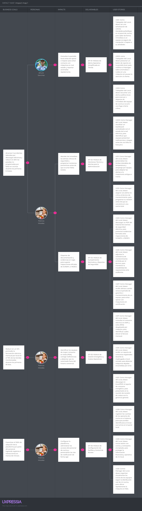 

## 3.4. Product Backlog

| # Orden | User Story ID | Título | Descripción | Story Points (1 / 2 / 3 / 5 / 8) |
| :---: | :---: | :--- | :--- | :---: |
| 1 | **US01** | Visualización de Semáforo Operativo | Como Trabajador del Local, deseo ver una señalización de colores (Verde/Amarillo/Rojo) en el panel de cocina, para saber de forma inmediata si un equipo es seguro de manipular o trapear a su alrededor. | 3 |
| 2 | **US02** | Botón de Reporte Rápido de Falla | Como Trabajador del Local, deseo presionar un botón de reporte en la pantalla local, para notificar al Manager sobre anomalías o ruidos en una máquina sin pausar la atención al cliente. | 2 |
| 3 | **US03** | Alarma Sonora de Emergencia | Como Trabajador del Local, deseo escuchar una alerta auditiva local, para evacuar o alejarme de inmediato del equipo de cocina si ocurre una fuga a tierra crítica. | 3 |
| 4 | **US04** | Confirmación de Equipo Apagado | Como Trabajador del Local, deseo consultar en pantalla la confirmación de desenergización, para realizar el baldeado o trapeado del piso con total seguridad. | 2 |
| 5 | **US05** | Consulta de Protocolo de Apagado | Como Trabajador del Local, deseo visualizar los pasos de apagado seguro en pantalla, para cortar la energía de una máquina en emergencia sin correr riesgos. | 2 |
| 6 | **US06** | Registro de Incidencia de Turno | Como Trabajador del Local, deseo confirmar la entrega de turno mediante un check rápido, para dejar constancia del estado de los equipos al siguiente grupo de trabajo. | 2 |
| 7 | **US07** | Guía Rápida de Primeros Auxilios Eléctricos | Como Trabajador del Local, deseo consultar un botón de ayuda rápida en pantalla, para conocer las acciones inmediatas en caso de contacto accidental de un compañero con corriente. | 2 |
| 8 | **US08** | Alerta Visual de Humedad en Zona de Cocina | Como Trabajador del Local, deseo ver una advertencia en la interfaz cuando se detecte humedad excesiva cerca a tableros, para evitar conectar equipos en superficies mojadas. | 2 |
| 9 | **US09** | Dashboard de Red en Tiempo Real | Como Manager del Local, deseo visualizar un Dashboard centralizado con el estado de la red eléctrica, para identificar qué equipos presentan ineficiencias o riesgos antes de una falla en hora pico. | 5 |
| 10 | **US10** | Alertas Push y SMS de Emergencia | Como Manager del Local, deseo recibir alertas automáticas por SMS y notificación Push, para tomar acciones inmediatas ante sobrevoltajes o fugas de energía. | 3 |
| 11 | **US11** | Configuración de Umbrales Térmicos | Como Manager del Local, deseo personalizar los límites tolerables de temperatura y amperaje por equipo, para adaptar las alertas a la maquinaria antigua o nueva. | 3 |
| 12 | **US12** | Historial Filtrable de Alertas | Como Manager del Local, deseo filtrar las alertas por fecha, nivel de severidad y equipo, para analizar los patrones de fallas más recurrentes en la cocina. | 3 |
| 13 | **US13** | Asignación de Tareas de Revisión | Como Manager del Local, deseo asignar una alerta no crítica al técnico de mantenimiento, para programar su revisión antes de que se convierta en una avería total. | 3 |
| 14 | **US14** | Estado de Conectividad de Sensores | Como Manager del Local, deseo ver un indicador de estado de conexión de cada sensor IoT, para asegurar que toda la cocina esté siendo monitoreada sin puntos ciegos. | 2 |
| 15 | **US15** | Panel de Mantenimiento Preventivo | Como Manager del Local, deseo recibir recomendaciones automáticas de mantenimiento predictivo, para programar revisiones sin congelar la cocina en horas pico. | 8 |
| 16 | **US16** | Registro de Turnos del Personal Operativo | Como Manager del Local, deseo visualizar qué trabajador estuvo a cargo de la cocina durante una alerta, para realizar el seguimiento operativo correspondiente. | 2 |
| 17 | **US17** | Desglose de Consumo por Equipo | Como Manager del Local, deseo consultar el consumo eléctrico en kWh y Soles (PEN) desglosado por máquina, para identificar cuáles elevan la factura mensual. | 8 |
| 18 | **US18** | Comparativa de Consumo Histórico | Como Manager del Local, deseo comparar el gasto energético del mes actual con el del mes anterior, para evaluar si las medidas de ahorro implementadas funcionaron. | 5 |
| 19 | **US19** | Detección de Consumo Anómalo Fuera de Horario | Como Manager del Local, deseo recibir un reporte de consumos registrados durante la madrugada o local cerrado, para detectar máquinas dejadas encendidas por error. | 3 |
| 20 | **US20** | Proyección de Factura Eléctrica | Como Manager del Local, deseo ver una proyección del costo total de la factura eléctrica al cierre del mes, para ajustar los presupuestos operacionales del local. | 5 |
| 21 | **US21** | Exportación de Reportes de Eficiencia | Como Manager del Local, deseo descargar en Excel/PDF el reporte de consumo energético, para presentarlo en la reunión de revisión de costos con la gerencia general. | 3 |
| 22 | **US22** | Metas de Ahorro Energético por Tienda | Como Manager del Local, deseo fijar un tope de consumo mensual en kWh, para recibir alertas cuando la tienda esté próxima a superar el presupuesto energético. | 3 |
| 23 | **US23** | Generación de Reporte SST en PDF | Como Manager del Local, deseo descargar un PDF del historial de eventos de seguridad eléctrica, para presentar evidencias formales ante inspecciones de SUNAFIL o INDECI. | 5 |
| 24 | **US24** | Checklist Digital de Inspección Eléctrica | Como Manager del Local, deseo completar un checklist digital semanal de la red, para registrar el cumplimiento de los estándares de seguridad industrial. | 3 |
| 25 | **US25** | Registro de Mantenimientos Realizados | Como Manager del Local, deseo adjuntar la constancia de mantenimiento emitida por el técnico, para mantener la trazabilidad de reparaciones ante auditorías. | 2 |
| 26 | **US26** | Certificado de Salud Técnica del Local | Como Manager del Local, deseo consultar el nivel de cumplimiento normativo del local (0% a 100%), para corregir observaciones antes de una inspección municipal. | 3 |
| 27 | **US27** | Recordatorio de Renovación de Mantenimiento | Como Manager del Local, deseo recibir alertas cuando venza el periodo de garantía o mantenimiento de un equipo, para evitar operar con maquinaria sin certificación. | 2 |
| 28 | **US28** | Creación de Cuentas para Trabajadores | Como Manager del Local, deseo registrar las cuentas de los operarios de cocina en el sistema, para que puedan identificarse al iniciar sus turnos en el panel local. | 3 |
| 29 | **US29** | Configuración de Notificaciones Preferidas | Como Manager del Local, deseo elegir si recibir alertas por WhatsApp, SMS o correo, para ajustar los canales de comunicación según mi disponibilidad de señal. | 2 |
| 30 | **US30** | Autenticación Segura en Plataforma Web | Como Manager del Local, deseo iniciar sesión con correo y contraseña encriptada, para proteger la información financiera y operativa de mi local. | 3 |
| 31 | **US31** | Recuperación de Contraseña de Administrador | Como Manager del Local, deseo solicitar la restauración de mi clave por correo, para recuperar el acceso a la plataforma si la olvido. | 2 |
| 32 | **US32** | Personalización de Mapa de Cocina | Como Manager del Local, deseo organizar visualmente los iconos de los equipos según la distribución real de mi cocina, para ubicar rápidamente la máquina en falla. | 5 |
| 33 | **US33** | Registro de Firma Digital de Conformidad | Como Manager del Local, deseo registrar mi firma digital en la plataforma, para validar automáticamente los reportes descargables de inspección SST. | 2 |
| 34 | **US34** | Visualización de Logs de Actividad en Tienda | Como Manager del Local, deseo revisar la bitácora de acciones realizadas en el panel local, para verificar quién atendió una alerta o registró un reporte rápido. | 3 |
| 35 | **US35** | Bloqueo Temporal de Teclado Local por Limpieza | Como Trabajador del Local, deseo activar la función "Modo Limpieza" en el panel táctil, para trapear la pantalla sin accionar botones por error. | 1 |

---

# Capítulo IV: Strategic-Level Software Design

## 4.1. Strategic-Level Attribute-Driven Design

En esta sección se presenta el proceso de diseño arquitectónico de ElectroLink abordando la definición de la arquitectura desde una perspectiva estratégica y orientada tanto a los atributos de calidad como al dominio del negocio.

### 4.1.1. Design Purpose

El propósito del proceso de diseño de ElectroLink es definir una arquitectura de software que permita soportar de manera confiable, escalable y mantenible el monitoreo continuo de los componentes eléctricos presentes en establecimientos de cadenas de comida rápida. La solución busca responder a la problemática asociada con la detección tardía de anomalías eléctricas, posibles fugas de corriente, sobrecargas, fallas de funcionamiento y consumos energéticos ineficientes, situaciones que pueden generar interrupciones operativas, riesgos de seguridad y mayores costos de mantenimiento.

Los principales propósitos que orientan el diseño de la solución son:

- **Facilitar el monitoreo continuo del estado eléctrico de los establecimientos:** ElectroLink debe permitir visualizar de manera centralizada las mediciones obtenidas por los dispositivos IoT instalados en los diferentes componentes y equipos eléctricos de cada local. Esto permitirá a los responsables de mantenimiento y operaciones conocer el estado de los activos eléctricos sin necesidad de realizar inspecciones constantes de manera presencial.

- **Detectar oportunamente anomalías y posibles fallas eléctricas:** La solución deberá analizar las mediciones obtenidas por los dispositivos IoT para identificar comportamientos fuera de los rangos esperados, tales como consumos anómalos, sobrecargas, variaciones de voltaje, temperaturas elevadas o posibles fugas de corriente. Ante estas situaciones, el sistema deberá generar alertas que permitan al personal responsable actuar antes de que una anomalía pueda convertirse en una falla crítica.

- **Reducir interrupciones operativas y costos de mantenimiento:** El acceso a información histórica y en tiempo real permitirá identificar tendencias y comportamientos anormales en los equipos eléctricos, facilitando la ejecución de mantenimiento preventivo y reduciendo la dependencia de intervenciones correctivas posteriores a una falla. De esta manera, la solución busca disminuir tiempos de inactividad y costos asociados a reparaciones inesperadas.

- **Optimizar el consumo energético de los establecimientos:** ElectroLink deberá proporcionar información sobre el consumo eléctrico de los equipos y componentes monitoreados, permitiendo identificar patrones de uso ineficientes o consumos fuera de los valores habituales. Esta información podrá ser utilizada por los responsables de operaciones para tomar decisiones orientadas a mejorar la eficiencia energética de los establecimientos.

- **Atender las necesidades de los principales segmentos de usuario:**
    - **Responsables de mantenimiento:** requieren identificar rápidamente anomalías, consultar el historial de mediciones y recibir alertas que permitan priorizar las actividades de mantenimiento.
    - **Responsables de operaciones:** necesitan conocer el estado general de los implementos eléctricos registrados por cada establecimiento y detectar situaciones que puedan afectar la continuidad de las operaciones.
    - **Administradores o responsables de la cadena:** requieren disponer de información consolidada sobre distintos locales para analizar consumo energético, incidencias y desempeño operativo.

- **Asegurar un monitoreo confiable y oportuno:** Debido a que la solución dependerá de dispositivos IoT y comunicación continua con la plataforma, el diseño arquitectónico deberá considerar atributos de calidad relacionados con disponibilidad, confiabilidad, rendimiento, seguridad y escalabilidad. La información crítica deberá ser transmitida y procesada oportunamente, mientras que la plataforma deberá ser capaz de soportar el incremento progresivo de establecimientos, dispositivos y mediciones sin comprometer la operación del sistema.

### 4.1.2. Attribute-Driven Design Inputs

En esta sección se presentan los tres tipos principales de entradas consideradas para el proceso de diseño: la funcionalidad primaria, representada mediante las historias de usuario más relevantes para la operación del sistema; los escenarios de atributos de calidad, que permiten establecer expectativas medibles relacionadas con aspectos como disponibilidad, rendimiento, seguridad, confiabilidad y escalabilidad; y las restricciones, que delimitan las decisiones arquitectónicas debido a condiciones tecnológicas, operativas o de negocio.

Estas entradas servirán posteriormente como base para la identificación y priorización de los drivers arquitectónicos, así como para la definición de las decisiones de diseño que estructurarán la arquitectura de ElectroLink.

#### 4.1.2.1. Primary Functionality (Primary User Stories)
Para el proceso de Attribute-Driven Design (ADD) de ElectroLink se han seleccionado las User Stories que representan las funcionalidades esenciales de la solución y que generan un impacto significativo sobre su arquitectura. La selección considera principalmente aquellas capacidades relacionadas con la adquisición y procesamiento de información proveniente de dispositivos IoT, el monitoreo del estado eléctrico de los equipos, la detección y comunicación de situaciones de riesgo, la configuración de parámetros operativos, el análisis del consumo energético y la protección del acceso a la plataforma.

| Epic / User Story ID | Título | Descripción | Criterios de Aceptación | Relacionado con (Epic ID) |
| :--- | :--- | :--- | :--- | :--- |
| **US01** | Visualización de Semáforo Operativo | Como Trabajador del Local, deseo ver una señalización de colores (Verde/Amarillo/Rojo) en el panel de cocina, para saber de forma inmediata si un equipo es seguro de manipular o trapear a su alrededor. | **Dado** que el trabajador se encuentra en el área de cocina, **cuando** el sensor registra una fuga de corriente o sobrecalentamiento, **entonces** la pantalla muestra el indicador en Rojo y despliega el mensaje "NO TOCAR". | EP01 |
| **US03** | Alarma Sonora de Emergencia | Como Trabajador del Local, deseo escuchar una alerta auditiva local, para evacuar o alejarme de inmediato del equipo de cocina si ocurre una fuga a tierra crítica. | **Dado** que ocurre una fuga de corriente crítica, **cuando** el sensor la detecta en tiempo real, **entonces** el sistema activa la bocina local y parpadea la pantalla en rojo con el instructivo de seguridad. | EP01 |
| **US09** | Dashboard de Red en Tiempo Real | Como Manager del Local, deseo visualizar un Dashboard centralizado con el estado de la red eléctrica, para identificar qué equipos presentan ineficiencias o riesgos antes de una falla en hora pico. | **Dado** que el Manager ingresa a la plataforma web, **cuando** carga la vista principal, **entonces** el sistema despliega el estado de salud técnica, voltaje y temperatura de todos los equipos del local. | EP02 |
| **US10** | Alertas Push y SMS de Emergencia | Como Manager del Local, deseo recibir alertas automáticas por SMS y notificación Push, para tomar acciones inmediatas ante sobrevoltajes o fugas de energía. | **Dado** que se sobrepasa el límite seguro de amperaje en un equipo, **cuando** el sensor registra el evento, **entonces** el sistema envía un mensaje SMS y notificación al teléfono del Manager. | EP02 |
| **US11** | Configuración de Umbrales Térmicos | Como Manager del Local, deseo personalizar los límites tolerables de temperatura y amperaje por equipo, para adaptar las alertas a la maquinaria antigua o nueva. | **Dado** que el Manager edita la ficha de una freidora, **cuando** ingresa los límites máximos permitidos y guarda, **entonces** el sistema actualiza la lógica de disparo de alertas para dicho equipo. | EP02 |
| **US14** | Estado de Conectividad de Sensores | Como Manager del Local, deseo ver un indicador de estado de conexión de cada sensor IoT, para asegurar que toda la cocina esté siendo monitoreada sin puntos ciegos. | **Dado** que un sensor pierde conexión a la red local, **entonces** el Dashboard muestra el icono del equipo en gris e informa "Sensor Desconectado". | EP02 |
| **US17** | Desglose de Consumo por Equipo | Como Manager del Local, deseo consultar el consumo eléctrico en kWh y Soles (PEN) desglosado por máquina, para identificar cuáles elevan la factura mensual. | **Dado** que el Manager entra al módulo de energía, **cuando** selecciona un rango de fechas, **entonces** el sistema muestra una gráfica interactiva con el gasto en PEN por cada equipo de cocina. | EP03 |
| **US19** | Detección de Consumo Anómalo Fuera de Horario | Como Manager del Local, deseo recibir un reporte de consumos registrados durante la madrugada o local cerrado, para detectar máquinas dejadas encendidas por error. | **Dado** que la tienda está fuera de horario comercial, **cuando** un equipo registra un consumo superior al modo de espera (standby), **entonces** el sistema envía una alerta de "Consumo Inusual Fuera de Horario". | EP03 |
| **US23** | Generación de Reporte SST en PDF | Como Manager del Local, deseo descargar un PDF del historial de eventos de seguridad eléctrica, para presentar evidencias formales ante inspecciones de SUNAFIL o INDECI. | **Dado** que se realiza una auditoría oficial, **cuando** el Manager presiona "Exportar Reporte SST", **entonces** el sistema genera un documento PDF con registro cronológico de alertas resueltas. | EP04 |
| **US30** | Autenticación Segura en Plataforma Web | Como Manager del Local, deseo iniciar sesión con correo y contraseña encriptada, para proteger la información financiera y operativa de mi local. | **Dado** que el Manager ingresa sus credenciales válidas en la página de login, **cuando** presiona "Ingresar", **entonces** el sistema le otorga acceso al Dashboard administrativo. | EP05 |

En conjunto, estas funcionalidades influyen directamente en decisiones posteriores relacionadas con los mecanismos de comunicación entre dispositivos, procesamiento de eventos, almacenamiento de telemetría, generación de alertas, gestión de identidad y acceso, así como en la disponibilidad y escalabilidad de la plataforma.

#### 4.1.2.2. Quality Attribute Scenarios

| Atributo | Fuente | Estímulo | Artefacto | Entorno | Respuesta | Medida |
|---|---|---|---|---|---|---|
| **Rendimiento** | Sensor IoT | Se detecta una condición eléctrica crítica, como fuga de corriente, sobrecorriente o temperatura fuera del umbral permitido. | Servicio de recepción y procesamiento de telemetría / sistema de alertas | Operación normal del establecimiento | El sistema procesa la medición, determina su criticidad y genera la alerta correspondiente para el panel local y el Manager. | La alerta crítica debe generarse en un máximo de **3 segundos** desde la recepción de la medición. |
| **Disponibilidad** | Infraestructura del sistema | Una instancia o servicio encargado del monitoreo deja de estar disponible inesperadamente. | Plataforma de monitoreo de ElectroLink | Operación normal o periodo de alta actividad del local | La plataforma continúa brindando las funciones esenciales de monitoreo mediante mecanismos de recuperación o redundancia. | Restablecer el servicio afectado en un máximo de **60 segundos** y mantener una disponibilidad mensual de al menos **99.9 %**. |
| **Confiabilidad** | Red de comunicaciones / dispositivo IoT | Se produce una pérdida temporal de conexión entre un dispositivo IoT y el backend. | Gateway o mecanismo de transmisión de telemetría | Conectividad inestable o interrupción temporal de Internet | Las mediciones son almacenadas temporalmente y transmitidas cuando se recupera la conexión, evitando la pérdida de información relevante. | Recuperar y sincronizar al menos el **99.5 % de las mediciones** generadas durante la interrupción. |
| **Confiabilidad** | Dispositivo IoT | Un sensor deja de enviar información durante su operación. | Servicio de supervisión de dispositivos | Operación normal | El sistema identifica la pérdida de comunicación, cambia el estado del sensor a desconectado y comunica la situación al responsable del local. | Detectar e informar la desconexión en un máximo de **30 segundos** desde la última comunicación esperada. |
| **Seguridad** | Usuario no autorizado o atacante externo | Se intenta acceder al Dashboard o a recursos protegidos utilizando credenciales inválidas o inexistentes. | Servicio de autenticación y autorización | Plataforma accesible desde Internet | El sistema rechaza el acceso, registra el intento y evita que el usuario acceda a información o funcionalidades protegidas. | El **100 % de los endpoints protegidos** debe requerir autenticación válida y los intentos rechazados deben quedar registrados. |
| **Seguridad** | Manager autenticado | Se intenta modificar los umbrales eléctricos o parámetros de configuración de un equipo. | Servicio de configuración de dispositivos y equipos | Operación normal | El sistema verifica que el usuario posea los permisos requeridos antes de aplicar el cambio y registra la modificación realizada. | El **100 % de las modificaciones de parámetros críticos** debe validar autorización y generar un registro de auditoría. |
| **Escalabilidad** | Administrador de la cadena | Se incorporan nuevos establecimientos y dispositivos IoT a ElectroLink. | Plataforma IoT y servicios de procesamiento de telemetría | Crecimiento progresivo de la cadena | La infraestructura incrementa su capacidad de procesamiento sin requerir cambios importantes en la arquitectura ni afectar significativamente los tiempos de respuesta. | La solución debe soportar inicialmente hasta **5 000 dispositivos IoT conectados**, manteniendo los tiempos de procesamiento de alertas críticas dentro del límite establecido. |
| **Modificabilidad** | Equipo de desarrollo | Se requiere incorporar un nuevo tipo de sensor o una nueva variable de monitoreo. | Módulo de integración y procesamiento IoT | Sistema en evolución | La arquitectura permite integrar el nuevo dispositivo o tipo de medición sin modificar significativamente otros módulos del sistema. | La incorporación debe limitar los cambios principalmente al módulo de integración correspondiente y requerir como máximo **2 días-persona de desarrollo**, excluyendo pruebas de hardware. |

#### 4.1.2.3. Constraints

Las restricciones arquitectónicas para el proyecto ElectroLink se han categorizado en técnicas, operativas, de integración y regulatorias, estableciendo los límites dentro de los cuales debe diseñarse y operar la solución:

| ID | Título | Descripción | Aceptación | EPIC | 
|---|---|---|---|---|
| CON-01 | Hardware IoT Predefinido (ESP32) | Los dispositivos físicos de monitoreo (sensores y gateways) deben estar basados estrictamente en microcontroladores ESP32, adaptados para operar bajo las condiciones del entorno. | Escenario 1: Captura de datos en entorno hostilDado que el microcontrolador ESP32 está instalado en un tablero de cocina,Cuando las temperaturas y humedad aumentan por la operación,Entonces el dispositivo debe mantener su conectividad y continuar transmitiendo telemetría. | EP01 y EP02 |
| CON-02 | Arquitectura Monolítica Modular en C# | El backend debe implementarse como una API RESTful utilizando C# / ASP.NET Core y Entity Framework Core, garantizando la separación por módulos de negocio (monolito modular). | Escenario 1: Estructura del proyectoDado que un desarrollador inspecciona el código fuente,Cuando revisa las dependencias y la solución,Entonces se evidencia el uso de C#, ASP.NET Core y una separación interna por Bounded Contexts bien definidos. | Todas |
| CON-03 | Persistencia en PostgreSQL | Toda la información relacional, incluyendo datos de usuarios, credenciales, locales e historiales de mantenimiento, debe persistirse obligatoriamente en PostgreSQL. | Escenario 1: Almacenamiento de transaccionesDado que un manager registra la asignación de un técnico,Cuando el sistema guarda la transacción,Entonces los datos se persisten asegurando atomicidad dentro de la base de datos PostgreSQL. | Todas |
| CON-04 | Frontend Segregado (React y Flutter) | El ecosistema cliente debe separar la tecnología: la web administrativa (SPA) se construirá con JavaScript/React, mientras que la aplicación móvil se desarrollará con Dart/Flutter. | Escenario 1: Uso de dashboard administrativoDado que el manager de tienda abre la plataforma web,Cuando visualiza el consumo eléctrico en tiempo real,Entonces la interfaz reacciona de forma fluida e interactiva usando componentes de React.Escenario 2: Notificaciones en campoDado que un técnico o trabajador usa la app móvil,Cuando recibe una alerta de voltaje,Entonces la experiencia nativa es soportada por el framework Flutter. | EP02 y EP03 |
| CON-05 | Infraestructura Cloud en Microsoft Azure | El despliegue de los servicios (Backend, Frontend SPA y Base de Datos) debe realizarse exclusivamente sobre la nube de Microsoft Azure, usando Azure App Service. | Escenario 1: Despliegue en producciónDado que se finaliza un sprint y se lanza una nueva versión,Cuando el pipeline de CI/CD sube los contenedores,Entonces estos son alojados y orquestados dentro de la infraestructura de Azure. | Todas | 
| CON-06 | Integraciones de Terceros Obligatorias | La plataforma está restringida a usar Stripe para la facturación SaaS, Firebase Cloud Messaging (FCM/APNs) para alertas Push, y Mapbox/Google Maps para geolocalización. | Escenario 1: Pago de suscripciónDado que una cadena de comida rápida adquiere el plan Premium,Cuando realiza el pago mensual,Entonces el cobro se procesa obligatoriamente a través de los webhooks de Stripe.Escenario 2: Alerta Crítica PushDado que el sistema detecta una fuga de corriente,Cuando dispara la alerta móvil,Entonces la notificación viaja a través de FCM/APNs. | EP02 y EP05 |
| CON-07 | Cumplimiento Normativo SST | El sistema debe generar evidencias, bitácoras y reportes inmutables de incidentes que cumplan estrictamente con los estándares legales peruanos (SUNAFIL, OSINERGMIN, INDECI). | Escenario 1: Auditoría de seguridad oficialDado que el local recibe una inspección inopinada de SUNAFIL,Cuando el administrador exporta el reporte de salud técnica,Entonces el PDF generado contiene firmas digitales y un registro inalterable que sustenta el cumplimiento legal del local. | EP04 |

La tabla de restricciones arquitectónicas establece las condiciones que deben cumplirse durante el diseño del proyecto, evitando dudas o decisiones técnicas innecesarias desde el inicio. Estas restricciones tecnológicas, operativas y legales se organizan mediante escenarios BDD (Dado/Cuando/Entonces), lo que permite definir pruebas claras para validar su cumplimiento. Para ElectroLink, esta tabla ayuda a garantizar que la arquitectura funcione correctamente en el entorno de una cocina de comida rápida y cumpla con las normas de seguridad y regulación correspondientes (SUNAFIL/INDECI). De esta manera, se busca que la solución tecnológica sea viable y contribuya a los objetivos del negocio.

### 4.1.3. Architectural Drivers Backlog

| Driver ID | Título de Driver | Descripción | Importancia para Stakeholders | Architecture Technical Complexity |
|---|---|---|---|---|
| **DR-01** | **Rendimiento** | Capacidad de ElectroLink para recibir y procesar continuamente las mediciones generadas por los sensores IoT, detectar condiciones críticas como fugas de corriente, sobrecorriente o sobrecalentamiento y generar las alertas correspondientes en un tiempo máximo de **3 segundos** desde la recepción del evento, garantizando una respuesta oportuna ante situaciones que puedan comprometer la seguridad del establecimiento. | Alta | Alta |
| **DR-02** | **Disponibilidad** | Capacidad de la plataforma para mantener operativas las funciones esenciales de monitoreo eléctrico ante fallos parciales de servicios, dispositivos o infraestructura, buscando una disponibilidad mensual mínima de **99.9 %** y permitiendo recuperar un servicio afectado en un máximo de **60 segundos**, sin comprometer las funciones críticas de seguridad. | Alta | Alta |
| **DR-03** | **Confiabilidad** | Capacidad del sistema para mantener un monitoreo consistente incluso ante interrupciones temporales de conectividad, almacenando localmente las mediciones pendientes y sincronizándolas posteriormente con la plataforma. Asimismo, ElectroLink debe detectar sensores desconectados en un máximo de **30 segundos** y recuperar al menos el **99.5 % de las mediciones** generadas durante una pérdida temporal de comunicación. | Alta | Alta |
| **DR-04** | **Escalabilidad** | Capacidad de la arquitectura para soportar el crecimiento progresivo de ElectroLink mediante la incorporación de nuevos establecimientos, equipos eléctricos y dispositivos IoT sin requerir una reestructuración significativa del sistema. La solución deberá poder soportar inicialmente hasta **5 000 dispositivos IoT conectados**, manteniendo los tiempos establecidos para el procesamiento de eventos críticos. | Alta | Alta |
| **DR-05** | **Monitoreo y Detección de Anomalías** | Capacidad funcional para recibir información proveniente de sensores IoT, visualizar en tiempo real el estado eléctrico y térmico de los equipos, evaluar las mediciones respecto a umbrales configurados y detectar condiciones anómalas que puedan representar riesgos de seguridad, fallas operativas o funcionamiento ineficiente. | Alta | Alta |
| **DR-06** | **Operación Local ante Pérdida de Conectividad** | Capacidad de los componentes locales de ElectroLink para conservar funciones esenciales de seguridad cuando se interrumpe la comunicación con los servicios remotos. Las alertas críticas locales no deberán depender exclusivamente de la disponibilidad de Internet, permitiendo advertir al personal del establecimiento y almacenar temporalmente los eventos hasta recuperar la conexión. | Alta | Alta |
| **DR-07** | **Seguridad** | Implementación de mecanismos para proteger la información operativa y la configuración de los equipos mediante autenticación, autorización y comunicación segura. El **100 % de los recursos protegidos** deberá requerir autenticación válida, mientras que toda modificación de parámetros críticos, como umbrales eléctricos y térmicos, deberá verificar los permisos correspondientes y generar registros de auditoría. | Alta | Media |
| **DR-08** | **Interoperabilidad IoT** | Capacidad de ElectroLink para comunicarse con diferentes sensores, dispositivos y componentes IoT utilizados para medir variables como corriente, voltaje, consumo energético y temperatura, empleando interfaces y protocolos definidos que permitan desacoplar los dispositivos físicos de los servicios encargados del procesamiento y análisis de la información. | Alta | Media |
| **DR-09** | **Gestión de Alertas** | Capacidad del sistema para clasificar los eventos detectados según su nivel de severidad y distribuir las alertas hacia los mecanismos correspondientes, incluyendo señalización visual o auditiva local, Dashboard administrativo y canales de notificación remotos para el Manager del establecimiento. | Alta | Media |
| **DR-10** | **Gestión Energética** | Capacidad de la plataforma para almacenar y procesar información histórica sobre el consumo eléctrico de los equipos, permitiendo calcular consumos en kWh, estimar costos, comparar periodos e identificar patrones anómalos como consumo fuera del horario comercial. | Media | Media |
| **DR-11** | **Modificabilidad** | Facilidad con la que la arquitectura permite incorporar nuevos tipos de sensores, variables eléctricas o mecanismos de análisis sin generar modificaciones significativas en componentes no relacionados. La integración de un nuevo tipo de sensor deberá concentrar los cambios principalmente en su módulo de integración y requerir como máximo **2 días-persona de desarrollo**, excluyendo las pruebas asociadas al hardware. | Media | Media |
| **DR-12** | **Persistencia y Trazabilidad** | Capacidad del sistema para conservar mediciones de telemetría, alertas, cambios de configuración y eventos relevantes de los equipos, permitiendo realizar consultas históricas, análisis energético, auditorías y seguimiento de incidentes sin perder la relación entre el dispositivo, equipo y establecimiento que originó la información. | Media | Media |

### 4.1.4. Architectural Design Decisions

A continuación se presenta la evaluación de las decisiones de diseño arquitectónico para ElectroLink, comparando el estilo de Monolito Modular (DDD) frente a una arquitectura basada en Microservicios, evaluándolos según los Drivers Arquitectónicos definidos.

| Driver ID | Título de Driver | Monolito Modular (DDD) Pro | Monolito Modular (DDD) Contra | Microservicios Pro | Microservicios Contra | 
|---|---|---|---|---|---|
|DR01|Rendimiento|Las llamadas entre los módulos de telemetría IoT y el gestor de alertas ocurren en memoria, lo que elimina la latencia de red interna y facilita cumplir el tiempo de respuesta $\le 3$ segundos.|El procesamiento intensivo de datos de los sensores IoT puede competir por recursos de CPU/RAM con otros módulos (ej. consultas al Dashboard administrativo).|Los servicios especializados (ej. Ingesta IoT) pueden optimizarse independientemente, asignando hardware específico para la lectura de telemetría.|El overhead de comunicación por red entre microservicios (ej. Ingesta $\rightarrow$ Alertas $\rightarrow$ Notificación) puede incrementar la latencia en flujos críticos.|
|DR02|Disponibilidad|Despliegue simple y unificado en Azure App Service. Menor cantidad de partes móviles e infraestructura que puedan fallar en la comunicación interna.|Cualquier fallo crítico en un módulo (ej. un bucle infinito procesando datos de sensores) puede tumbar toda la instancia y afectar la operación de todos los locales.|El aislamiento de fallos permite que, si el servicio de reportes SST falla, la detección de fugas de corriente y alertas siga funcionando sin interrupciones.|La alta disponibilidad requiere infraestructura compleja (Service Mesh, Kubernetes) y manejo de tolerancia a fallos entre red (Circuit Breakers).|
|DR04|Escalabilidad|La modularización interna mediante DDD permite escalar horizontalmente replicando la instancia completa para absorber la demanda.|Limitaciones de eficiencia en costos: para escalar la capacidad de 5,000 dispositivos IoT, se debe escalar también el módulo de facturación y usuarios innecesariamente.|Escalabilidad horizontal elástica y granular: el servicio de ingesta IoT puede escalar masivamente por demanda sin afectar o sobredimensionar el resto del sistema.|Costo operativo inicial elevado y alta complejidad de orquestación requerida para mantener la consistencia entre múltiples bases de datos.|
|DR07|Seguridad|Seguridad centralizada con un único flujo de autenticación, gestión de tokens JWT y control de accesos uniforme para las APIs y la configuración de umbrales.|Mayor superficie de impacto: el compromiso o vulneración de un módulo compromete el acceso directo a la base de datos completa (PostgreSQL).|Seguridad aislada por servicio; los datos de facturación (Stripe) están separados de los datos de telemetría, aplicando el principio de menor privilegio.|Requiere una gestión distribuida compleja de tokens de autorización y validación de identidades en cada salto entre servicios.|
|DR11|Modificabilidad|La separación lógica por dominios (DDD) facilita incorporar nuevos tipos de sensores IoT limitando el impacto al módulo correspondiente, lográndolo en $\le 2$ días-persona.|Si no se respeta la disciplina arquitectónica, los límites de los módulos pueden difuminarse, creando un alto acoplamiento (Big Ball of Mud).|Servicios pequeños y totalmente independientes permiten la evolución tecnológica y despliegue aislado de nuevas funcionalidades IoT sin afectar el resto.|Requiere gobernanza fuerte y coordinación exhaustiva para gestionar cambios en contratos de APIs o transacciones distribuidas (Patrón Saga).|

### 4.1.5. Quality Attribute Scenario Refinements

Luego del proceso de **Quality Attribute Workshop**, el equipo revisó los escenarios de atributos de calidad identificados inicialmente y priorizó aquellos con mayor influencia sobre la arquitectura de ElectroLink. La priorización consideró principalmente el impacto de cada escenario sobre la seguridad del personal, la continuidad del monitoreo eléctrico, la capacidad de respuesta ante anomalías y el crecimiento futuro de la solución.

Como resultado, se refinaron los escenarios relacionados con **rendimiento, confiabilidad, disponibilidad, seguridad y escalabilidad**, incorporando mayor detalle acerca de las condiciones en las que ocurren los estímulos, los componentes involucrados, las respuestas esperadas y sus respectivas métricas. Asimismo, se identificaron preguntas e issues arquitectónicos que deberán ser considerados durante el diseño de la solución.

### Scenario Refinement for Scenario 1

| Campo | Descripción |
|---|---|
| **Scenario(s)** | Como Manager del Local, quiero recibir alertas automáticas cuando se detecte una condición eléctrica crítica, para tomar acciones antes de que se produzca una falla o una situación que comprometa la seguridad del personal. |
| **Business Goals** | Reducir el riesgo de accidentes eléctricos y disminuir el impacto operativo de fallas en los equipos mediante la detección y comunicación temprana de condiciones peligrosas. |
| **Relevant Quality Attributes** | Rendimiento, Confiabilidad, Disponibilidad |

| Scenario Components | Descripción |
|---|---|
| **Stimulus** | Un sensor registra una condición crítica, como fuga de corriente, sobrecorriente o temperatura superior al umbral configurado. |
| **Stimulus Source** | Sensor IoT instalado en un equipo eléctrico del establecimiento. |
| **Environment** | Operación normal del local, incluyendo periodos de alta actividad en los que múltiples dispositivos transmiten telemetría simultáneamente. |
| **Artifact (if Known)** | Dispositivo IoT, gateway local, servicio de procesamiento de telemetría y sistema de alertas. |
| **Response** | El sistema recibe la medición, identifica que supera un umbral crítico, registra el evento y activa las alertas locales y remotas correspondientes. |
| **Response Measure** | La alerta crítica debe generarse en un máximo de **3 segundos** desde la recepción de la medición. |
| **Questions** | ¿La detección de una situación crítica debe realizarse únicamente en el backend o también localmente? ¿Qué ocurre si varias alertas críticas se producen simultáneamente? |
| **Issues** | La dependencia exclusiva de servicios cloud podría incrementar la latencia o impedir la generación de alertas ante una pérdida de conectividad. |

### Scenario Refinement for Scenario 2

| Campo | Descripción |
|---|---|
| **Scenario(s)** | Como trabajador del local, quiero que las alertas críticas continúen funcionando aunque se pierda la conexión a Internet, para mantener las funciones de seguridad dentro del establecimiento. |
| **Business Goals** | Mantener la protección del personal y la capacidad de reacción ante riesgos eléctricos incluso cuando la comunicación con la plataforma central no esté disponible. |
| **Relevant Quality Attributes** | Confiabilidad, Disponibilidad, Tolerancia a fallos |

| Scenario Components | Descripción |
|---|---|
| **Stimulus** | Se interrumpe temporalmente la conexión entre el establecimiento y el backend de ElectroLink. |
| **Stimulus Source** | Red de comunicaciones o proveedor de Internet del establecimiento. |
| **Environment** | Operación normal del local mientras los sensores continúan generando información. |
| **Artifact (if Known)** | Gateway o dispositivo Edge local, sensores IoT y backend central. |
| **Response** | El componente local continúa procesando condiciones críticas, activa las alertas locales y almacena temporalmente las mediciones y eventos pendientes. Cuando se recupera la conexión, sincroniza la información con la plataforma central. |
| **Response Measure** | Las funciones de alerta local deben permanecer disponibles durante la interrupción y al menos el **99.5 % de las mediciones almacenadas** deben sincronizarse luego de restablecerse la comunicación. |
| **Questions** | ¿Cuánto tiempo debe poder almacenar información el dispositivo local? ¿Cómo se resuelven conflictos al sincronizar los datos? |
| **Issues** | Será necesario disponer de almacenamiento local y mecanismos de sincronización para evitar pérdida o duplicación de información. |

### Scenario Refinement for Scenario 3

| Campo | Descripción |
|---|---|
| **Scenario(s)** | Como Manager del Local, quiero que la plataforma permanezca disponible ante fallos parciales, para continuar supervisando el estado eléctrico de los equipos. |
| **Business Goals** | Evitar periodos prolongados sin monitoreo y mantener la continuidad operativa de ElectroLink ante fallos en componentes de software o infraestructura. |
| **Relevant Quality Attributes** | Disponibilidad, Confiabilidad |

| Scenario Components | Descripción |
|---|---|
| **Stimulus** | Uno de los servicios responsables del monitoreo o procesamiento de telemetría deja de responder inesperadamente. |
| **Stimulus Source** | Infraestructura o componente interno de la plataforma. |
| **Environment** | Operación normal o periodo de alta actividad del establecimiento. |
| **Artifact (if Known)** | Servicios backend responsables de telemetría, monitoreo y alertas. |
| **Response** | La plataforma detecta la falla, ejecuta mecanismos de recuperación y mantiene disponibles las funciones esenciales de monitoreo mediante instancias o mecanismos alternativos. |
| **Response Measure** | Mantener una disponibilidad mensual mínima de **99.9 %** y recuperar el servicio afectado en un máximo de **60 segundos**. |
| **Questions** | ¿Qué servicios requieren redundancia? ¿Qué componentes pueden degradarse temporalmente sin afectar la seguridad? |
| **Issues** | Incrementar la disponibilidad puede requerir redundancia, health checks, reinicio automático y balanceo de carga, aumentando la complejidad de infraestructura. |

### Scenario Refinement for Scenario 4

| Campo | Descripción |
|---|---|
| **Scenario(s)** | Como Manager del Local, quiero conocer cuando un sensor deja de transmitir información, para evitar zonas o equipos sin monitoreo dentro del establecimiento. |
| **Business Goals** | Reducir los puntos ciegos en el monitoreo eléctrico y permitir que el personal intervenga rápidamente cuando un dispositivo IoT presenta problemas de comunicación. |
| **Relevant Quality Attributes** | Confiabilidad, Disponibilidad |

| Scenario Components | Descripción |
|---|---|
| **Stimulus** | Un dispositivo IoT deja de transmitir sus mensajes o señales periódicas al sistema. |
| **Stimulus Source** | Sensor o dispositivo IoT. |
| **Environment** | Operación normal con los dispositivos registrados como activos. |
| **Artifact (if Known)** | Servicio de monitoreo de conectividad de dispositivos y Dashboard administrativo. |
| **Response** | El sistema identifica la ausencia de comunicación, cambia el estado del sensor a desconectado y muestra una alerta al Manager. |
| **Response Measure** | La pérdida de comunicación debe detectarse y comunicarse en un máximo de **30 segundos** desde la última transmisión esperada. |
| **Questions** | ¿Con qué frecuencia debe enviar heartbeat cada dispositivo? ¿Cómo se diferencia una caída de red de una falla física del sensor? |
| **Issues** | Un intervalo demasiado reducido podría aumentar innecesariamente el tráfico de la red, mientras que uno demasiado amplio retrasaría la detección de dispositivos desconectados. |

### Scenario Refinement for Scenario 5

| Campo | Descripción |
|---|---|
| **Scenario(s)** | Como Manager del Local, quiero que únicamente usuarios autorizados puedan acceder y modificar parámetros críticos, para evitar alteraciones que puedan comprometer el monitoreo de los equipos. |
| **Business Goals** | Proteger la información operativa y evitar modificaciones no autorizadas sobre configuraciones relacionadas con la seguridad eléctrica del establecimiento. |
| **Relevant Quality Attributes** | Seguridad, Auditabilidad |

| Scenario Components | Descripción |
|---|---|
| **Stimulus** | Un usuario intenta acceder a un recurso protegido o modificar los umbrales de corriente o temperatura de un equipo. |
| **Stimulus Source** | Usuario autenticado sin permisos suficientes o usuario no autorizado. |
| **Environment** | Plataforma web disponible mediante Internet durante la operación normal. |
| **Artifact (if Known)** | Servicio de autenticación y autorización, módulo de configuración y registros de auditoría. |
| **Response** | El sistema valida la identidad y permisos del usuario, rechaza las operaciones no autorizadas y registra los intentos o modificaciones realizadas. |
| **Response Measure** | El **100 % de los endpoints protegidos** debe exigir autenticación válida y el **100 % de las modificaciones de parámetros críticos** debe verificar autorización y generar un registro de auditoría. |
| **Questions** | ¿Qué roles tendrán permisos para modificar umbrales? ¿Se requiere autenticación adicional para cambios particularmente sensibles? |
| **Issues** | Será necesario definir adecuadamente roles y permisos para evitar tanto accesos excesivos como restricciones que dificulten la operación. |

### Scenario Refinement for Scenario 6

| Campo | Descripción |
|---|---|
| **Scenario(s)** | Como administrador de una cadena de establecimientos, quiero incorporar progresivamente nuevos locales y dispositivos sin afectar el funcionamiento de los existentes. |
| **Business Goals** | Permitir que ElectroLink pueda ser implementado progresivamente en cadenas de comida rápida y acompañar el crecimiento del número de establecimientos monitoreados. |
| **Relevant Quality Attributes** | Escalabilidad, Rendimiento, Disponibilidad |

| Scenario Components | Descripción |
|---|---|
| **Stimulus** | Se incrementa significativamente la cantidad de establecimientos, equipos y dispositivos IoT conectados simultáneamente. |
| **Stimulus Source** | Crecimiento de la cadena y despliegue de nuevos dispositivos ElectroLink. |
| **Environment** | Plataforma en operación mientras se incorporan nuevos establecimientos y sensores. |
| **Artifact (if Known)** | Infraestructura cloud, servicios de ingesta y procesamiento de telemetría, almacenamiento y sistema de alertas. |
| **Response** | La plataforma incrementa su capacidad para recibir y procesar telemetría sin requerir una reestructuración significativa y mantiene los tiempos definidos para los eventos críticos. |
| **Response Measure** | Soportar inicialmente hasta **5 000 dispositivos IoT conectados**, manteniendo la generación de alertas críticas dentro del límite de **3 segundos**. |
| **Questions** | ¿El escalamiento se realizará horizontal o verticalmente? ¿Qué componente se convertirá primero en cuello de botella: ingesta, procesamiento o almacenamiento? |
| **Issues** | El crecimiento del volumen de telemetría puede requerir procesamiento asíncrono, particionamiento de datos y escalamiento independiente de determinados servicios. |

## 4.2. Strategic-Level Domain-Driven Design

### 4.2.1. EventStorming
\
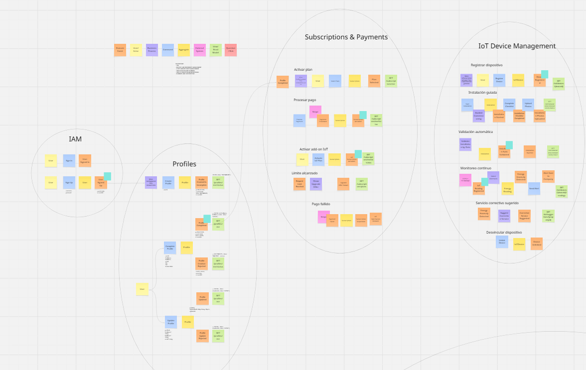
\
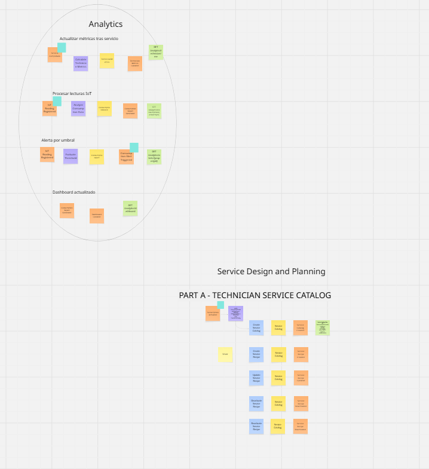
\
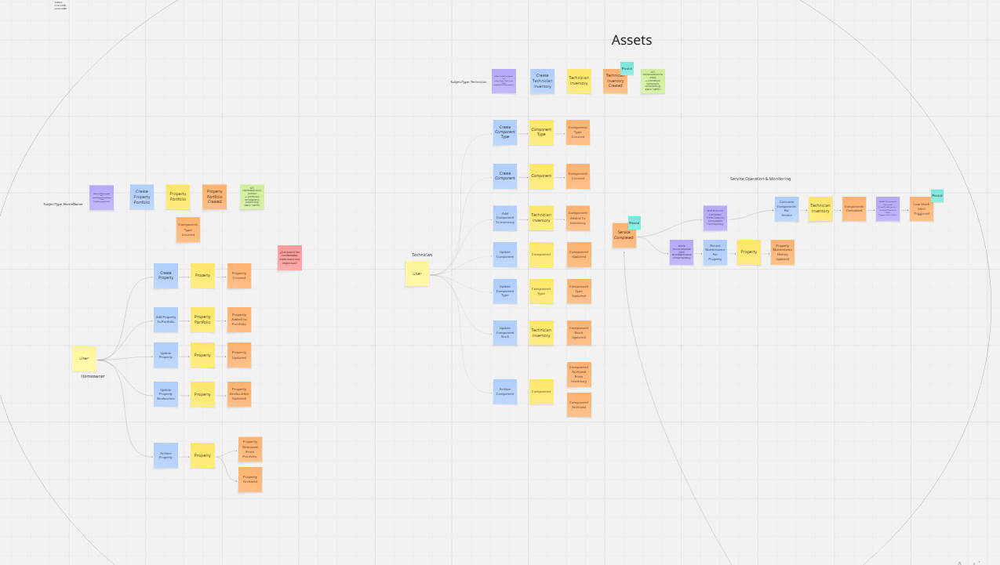
\
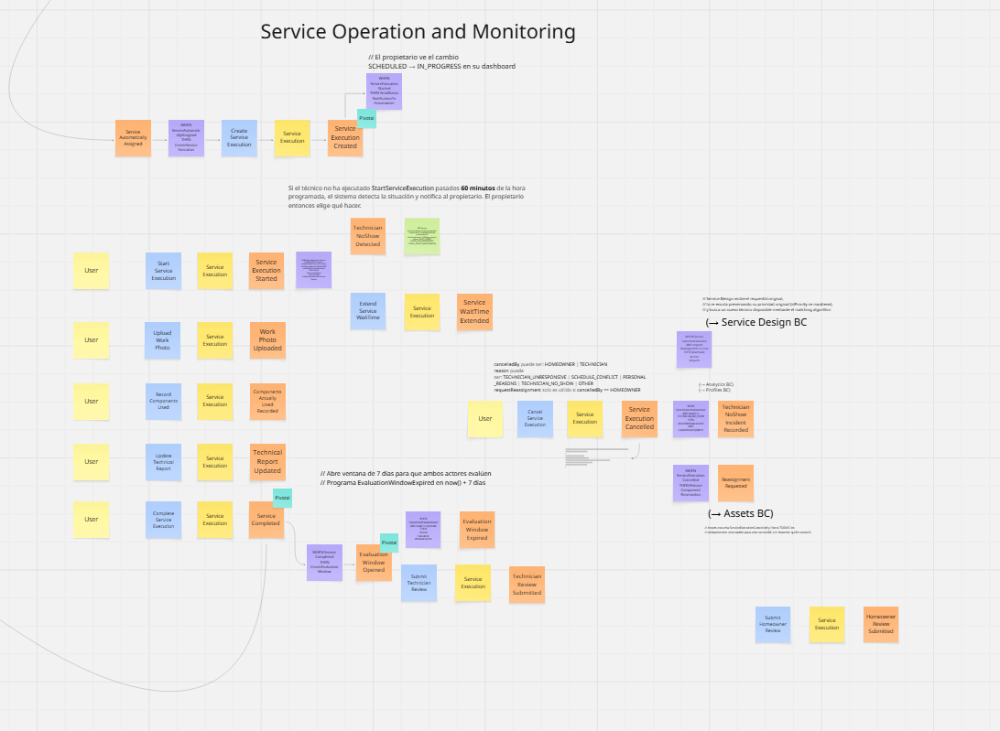

### 4.2.2. Candidate Context Discovery
\
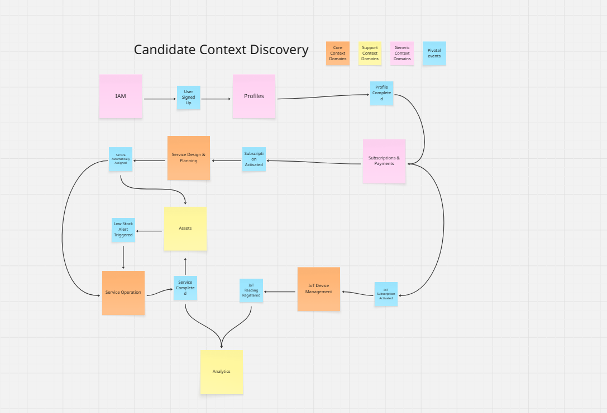

### 4.2.3. Domain Message Flows Modeling

### 4.2.4. Bounded Context Canvases

En esta sección se presentan los bounded contexts identificados para la solución ElectroLink, definidos a partir del análisis del dominio y siguiendo un enfoque de Domain-Driven Design (DDD). Cada contexto delimita responsabilidades claras, lenguaje ubicuo y reglas de negocio específicas, permitiendo una adecuada separación de preocupaciones y escalabilidad del sistema.

## 1. Identity and Access Management (IAM)
Gestión de autenticación, autorización y control de acceso de usuarios al sistema, incluyendo registro, inicio de sesión y manejo de roles.

---
\
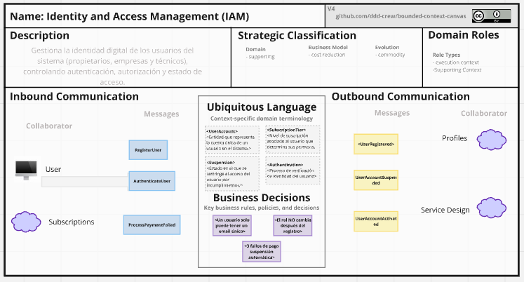

---
## 2. Subscription and Payments
Gestión de planes, facturación y control de acceso a funcionalidades.

---
\
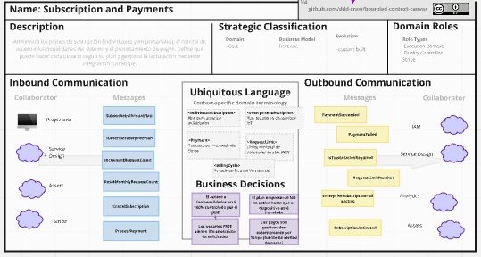

---

## 3. Profiles and Preferences
Administración de perfiles de usuarios, técnicos y configuración personalizada.

---
\
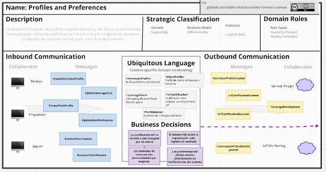

---

## 4. Service Design and Planning
Orquestación de servicios, solicitudes y asignación inteligente de técnicos.

---
\

---

## 5. Service Operation and Monitoring
Ejecución, seguimiento y cierre de servicios con evidencia y evaluación.

---
\
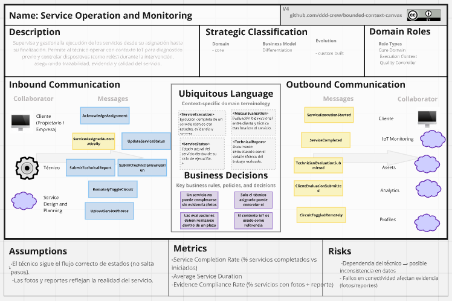

---

## 6. Assets and Resource Management
Gestión de propiedades, dispositivos IoT e inventario de técnicos.

---
\
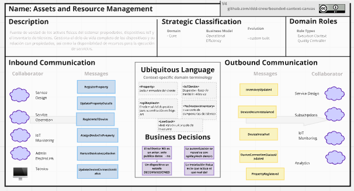

---

## 7. IoT Monitoring and Edge Processing
Procesamiento de datos en tiempo real y detección de anomalías eléctricas.

---
\
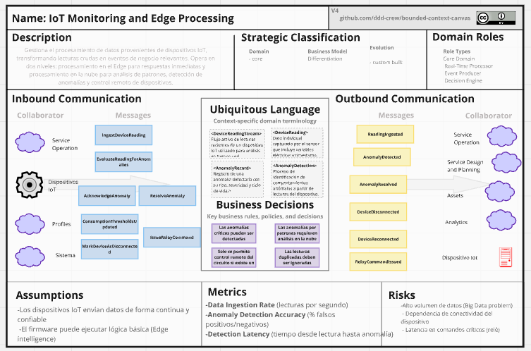

---

## 8. Analytics
Visualización, reportes e insights a partir de datos históricos y en tiempo real.

---
\
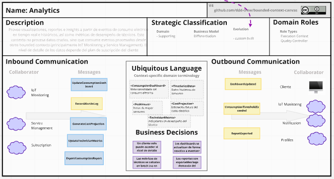

---

### 4.2.5. Context Mapping
\
El Context Mapping es una técnica esencial en el diseño de ElectroLink que nos permite visualizar las relaciones estructurales y de comunicación entre los ocho Bounded Contexts identificados en el dominio de la gestión eléctrica inteligente. A través de esta técnica, hemos identificado las interacciones, dependencias y posibles puntos de integración entre los contextos, asegurando que el flujo de información desde los sensores hasta la toma de decisiones proactivas sea consistente.
\
En el desarrollo de nuestro proyecto, el proceso se estructuró siguiendo las fases metodológicas del diseño guiado por el dominio:
\
**Identificación de Relaciones:** Se comenzó por definir las interdependencias entre contextos, estableciendo roles de Upstream (U) y Downstream (D). Un ejemplo crítico es la relación entre IoT Monitoring (Upstream) y Service Design (Downstream), donde los eventos de anomalías dictan el comportamiento proactivo del sistema.

**Anticorruption Layer (ACL):** Aplicada en Service Design para proteger el algoritmo de asignación técnica de cambios en los modelos de activos o perfiles.

**Shared Kernel:** Utilizado entre Service Operation y Assets para gestionar el estado compartido de los dispositivos instalados en tiempo real.

**Open Host Service (OHS):** El contexto de IoT Monitoring expone una interfaz estandarizada para el control seguro de relés eléctricos.

**Customer/Supplier:** Establecido entre Profiles e IoT Monitoring, donde los umbrales configurados por el cliente guían la detección de anomalías.

**Conformist:** El BC de Analytics se adhiere a los contratos de datos de telemetría impuestos por la ingesta de dispositivos para garantizar reportes precisos.

A continuación, se presenta el Context Map elegido que resume visualmente estas relaciones y sirve como hoja de ruta para la implementación técnica de la solución:

\

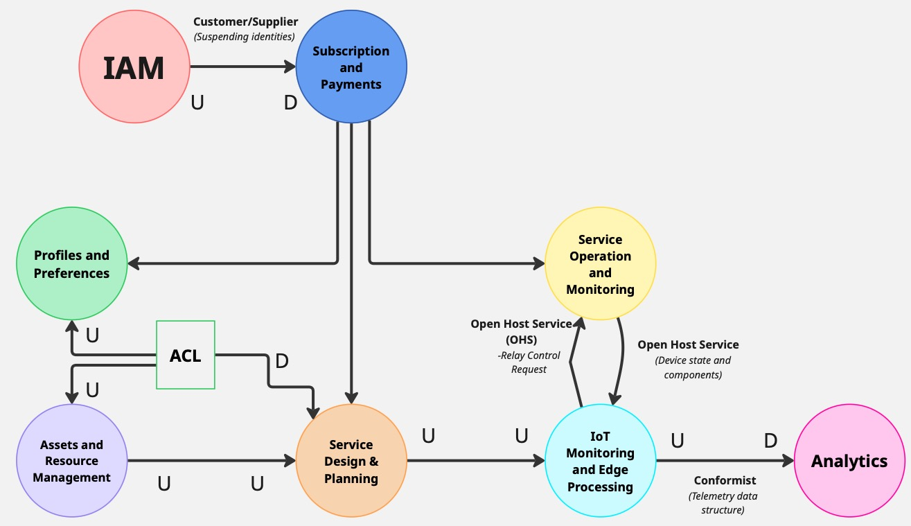

## 4.3. Software Architecture

\

### 4.3.1. Software Architecture System Landscape Diagram

### 4.3.1. Software Architecture Context Level Diagrams

### 4.3.2. Software Architecture Container Level Diagrams

### 4.3.3. Software Architecture Deployment Diagrams

# Capítulo V: Tactical-Level Software Design

## 5.X. Bounded Context: <Bounded Context Name>

### 5.X.1. Domain Layer

### 5.X.2. Interface Layer

### 5.X.3. Application Layer

### 5.X.4. Infrastructure Layer

### 5.X.6. Bounded Context Software Architecture Component Level Diagrams

### 5.X.7. Bounded Context Software Architecture Code Level Diagrams

#### 5.X.7.1. Bounded Context Domain Layer Class Diagrams

#### 5.X.7.2. Bounded Context Database Design Diagram

# Capítulo VI: Solution UX Design

## 6.1. Style Guidelines

### 6.1.1. General Style Guidelines

### 6.1.2. Web, Mobile & Devices Style Guidelines

## 6.2. Information Architecture

### 6.2.2. Labeling Systems

### 6.2.3. Searching Systems

### 6.2.4. SEO Tags and Meta Tags

### 6.2.5. Navigation Systems

## 6.3. Landing Page UI Design

### 6.3.1. Landing Page Wireframe

### 6.3.2. Landing Page Mock-up

## 6.4. Applications UX/UI Design

### 6.4.1. Applications Wireframes

### 6.4.2. Applications Wireflow Diagrams

### 6.4.2. Applications Mock-ups

### 6.4.3. Applications User Flow Diagrams

## 6.5. Applications Prototyping

# Capítulo VII: Product Implementation, Validation & Deployment

## 7.1. Software Configuration Management

### 7.1.1. Software Development Environment Configuration

### 7.1.2. Source Code Management

### 7.1.3. Source Code Style Guide & Conventions

### 7.1.4. Software Deployment Configuration

## 7.2. Solution Implementation

### 7.2.X. Sprint n

#### 7.2.X.1. Sprint Planning n

#### 7.2.X.2. Sprint Backlog n

#### 7.2.X.3. Development Evidence for Sprint Review

#### 7.2.X.4. Testing Suite Evidence for Sprint Review

#### 7.2.X.5. Execution Evidence for Sprint Review

#### 7.2.X.6. Services Documentation Evidence for Sprint Review

#### 7.2.X.7. Software Deployment Evidence for Sprint Review

#### 7.2.X.8. Team Collaboration Insights during Sprint

## 7.3. Validation Interviews

### 7.3.1. Diseño de Entrevistas

### 7.3.2. Registro de Entrevistas

### 7.3.3. Evaluaciones según heurísticas

## 7.4. Video About-the-Product

# Conclusiones

# Conclusiones y recomendaciones

# Video About-the-Team

