<h2 style="text-align:center">
  
</h2>

<h1 style="text-align:center">Universidad Peruana de Ciencias Aplicadas</h1>

<h3 style="text-align:center; margin-top:18px; margin-bottom:18px;">
  Ingeniería de Software
    
  Ciclo: 2026-20
    
  Curso: Arquitecturas De Software Emergentes
    
  Sección: 9056
      
  Profesor: Enrique Alejandro Valdivia Verde
    
  Informe del Trabajo Final
    
  Startup: HampCoders
    
  Producto: ElectroLink
</h3>

<table style="margin: 0 auto; width: auto; display: table; border-collapse: collapse; font-size: 12pt;">
  <thead>
    <tr>
      <th style="border:1px solid #000; padding:6px 12px; text-align:center;">Alumno</th>
      <th style="border:1px solid #000; padding:6px 12px; text-align:center;">Código</th>
    </tr>
  </thead>
  <tbody>
    <tr><td style="border:1px solid #000; padding:6px 12px; text-align:center;">Cesar Augusto Arostegui Alzamora</td><td style="border:1px solid #000; padding:6px 12px; text-align:center;">U202114548</td></tr>
    <tr><td style="border:1px solid #000; padding:6px 12px; text-align:center;">Vanessa May Lang Choy Robles</td><td style="border:1px solid #000; padding:6px 12px; text-align:center;">U202317450</td></tr>
    <tr><td style="border:1px solid #000; padding:6px 12px; text-align:center;">Natalia Ximena Valverde Portuguez</td><td style="border:1px solid #000; padding:6px 12px; text-align:center;">U20231A816</td></tr>
    <tr><td style="border:1px solid #000; padding:6px 12px; text-align:center;">Leandro Saul Contreras López</td><td style="border:1px solid #000; padding:6px 12px; text-align:center;">U20231E215</td></tr>
    <tr><td style="border:1px solid #000; padding:6px 12px; text-align:center;">Ivo Marcelo Machado Bracamonte</td><td style="border:1px solid #000; padding:6px 12px; text-align:center;">U20231C368</td></tr>
  </tbody>
</table>

 Diciembre 2026 

# Registro de Versiones del Informe
---

En esta sección se registra el historial de cambios del informe del proyecto ElectroLink, solución IoT para el monitoreo de la infraestructura eléctrica y la continuidad operativa en cadenas de comida rápida en Lima Metropolitana. Cada versión identifica fecha, responsable y detalle específico de lo elaborado para asegurar trazabilidad del trabajo colaborativo.

| Versión | Fecha       | Autor(es)                                                                 | Descripción de modificación |
|---------|-------------|---------------------------------------------------------------------------|------------------------------|
|   TB1   | 2026-09-19  | Valverde Portuguez, Natalia Ximena                                       | Redacción integral del Capítulo I Introducción con descripción de la startup HampCoders y del producto ElectroLink, perfiles del equipo, antecedentes y problemática del sector, proceso Lean UX con declaraciones de problema, supuestos, hipótesis y lienzo, y caracterización de los segmentos objetivo Trabajador del Local y Manager del Local con sustento estadístico |
|   TB1   | 2026-09-19  | Arostegui Alzamora, Cesar Augusto                                         | Redacción del Capítulo II Requirements Elicitation and Analysis con análisis competitivo y paisaje competitivo, estrategias y tácticas frente a competidores, análisis de entrevistas del segmento Manager del Local, matriz de tareas, escenarios actuales As Is de ambos segmentos y lenguaje ubicuo del dominio eléctrico, IoT y gestión operativa |
|   TB1   | 2026-09-19  | Contreras López, Leandro Saúl                                             | Redacción del Capítulo II con diseño de entrevistas por segmento, registro detallado de entrevistas a personal operativo y gerencial con evidencias audiovisuales y análisis del segmento Trabajador del Local, y avance del Capítulo IV con modelado de flujos de mensajes de dominio para los escenarios de detección de anomalías, reporte operativo, verificación de apagado, sincronización de telemetría, suscripción y evidencia normativa |
|   TB1   | 2026-09-19  | Choy Robles, Vanessa May Lang                                             | Redacción integral del Capítulo III Requirements Specification con escenario futuro To Be de ambos segmentos, historias de usuario por épicas de seguridad operativa, monitoreo técnico, gestión energética, cumplimiento normativo y control de acceso con criterios de aceptación en formato Gherkin, mapa de impacto y backlog de producto priorizado con puntaje por historia |
|   TB1   | 2026-09-19  | Machado Bracamonte, Ivo Marcelo                                           | Redacción del Capítulo IV Strategic Level Software Design con EventStorming, descubrimiento de contextos candidatos, lienzos de contextos delimitados para identidad y acceso, suscripción y pagos, perfiles, diseño y operación de servicios, activos, monitoreo IoT y analítica, mapa de contexto y arquitectura de software en niveles de paisaje, contexto, contenedores y despliegue, y apoyo en la matriz de trazabilidad |

# Project Report Collaboration Insights

En esta sección se presenta el URL del repositorio en la organización de GitHub del equipo y un resumen de cómo se ha desarrollado la elaboración del informe, asegurando la participación de todos los miembros del equipo en cada entrega.

**Repositorio del Project Report:**
[https://github.com/Hampcoders-Emergentes/project-documento](https://github.com/Hampcoders-Emergentes/project-documento)

**Organización del equipo:**
[https://github.com/Hampcoders-Emergentes](https://github.com/Hampcoders-Emergentes)

## Desarrollo de las actividades de elaboración del informe

El equipo ha trabajado de manera colaborativa siguiendo un registro de versiones claro y detallado, que refleja la contribución de cada miembro en la entrega TB1 del proyecto ElectroLink. La solución propone un ecosistema IoT para monitorear tableros y equipos de cocina en cadenas de comida rápida en Lima Metropolitana, con alertas locales y remotas, dashboard multisede e historial para mantenimiento y cumplimiento normativo. A continuación se describe cómo se organizaron el trabajo y las evidencias de colaboración:

### TB1

1. Valverde Portuguez Natalia Ximena elaboró el Capítulo I con la visión de la startup HampCoders, la problemática del monitoreo eléctrico en cadenas de comida rápida en Lima Metropolitana y el proceso Lean UX completo, unificando el lenguaje del dominio para todo el equipo.
2. Arostegui Alzamora Cesar Augusto y Contreras López Leandro Saúl desarrollaron el Capítulo II con análisis competitivo frente a soluciones internacionales, entrevistas a personal operativo y gerencial, análisis por segmento, needfinding con personas, matriz de tareas, mapas de empatía, escenarios actuales y lenguaje ubicuo.
3. Choy Robles Vanessa May Lang desarrolló el Capítulo III con escenarios futuros, historias de usuario por épicas, mapa de impacto y backlog priorizado, asegurando trazabilidad entre necesidades detectadas y funcionalidades propuestas.
4. Contreras López Leandro Saúl y Machado Bracamonte Ivo Marcelo avanzaron el Capítulo IV con propósito de diseño, entradas de diseño guiado por atributos, drivers arquitectónicos, decisiones entre monolito modular y microservicios, refinamiento de escenarios, EventStorming, descubrimiento de contextos, flujos de mensajes, lienzos de contexto, mapa de contexto y diagramas de paisaje, contexto, contenedores y despliegue.
5. El equipo configuró el control de versiones con ramas por capítulo, solicitudes de integración revisadas y registro de anexos con enlaces a organización, repositorio y carpeta compartida, asegurando revisión cruzada antes de la consolidación en la rama principal.

## Evidencia de colaboración en GitHub

A continuación se presenta la evidencia de colaboración en GitHub correspondiente a la entrega TB1, con el historial de commits y la actividad del repositorio del informe:

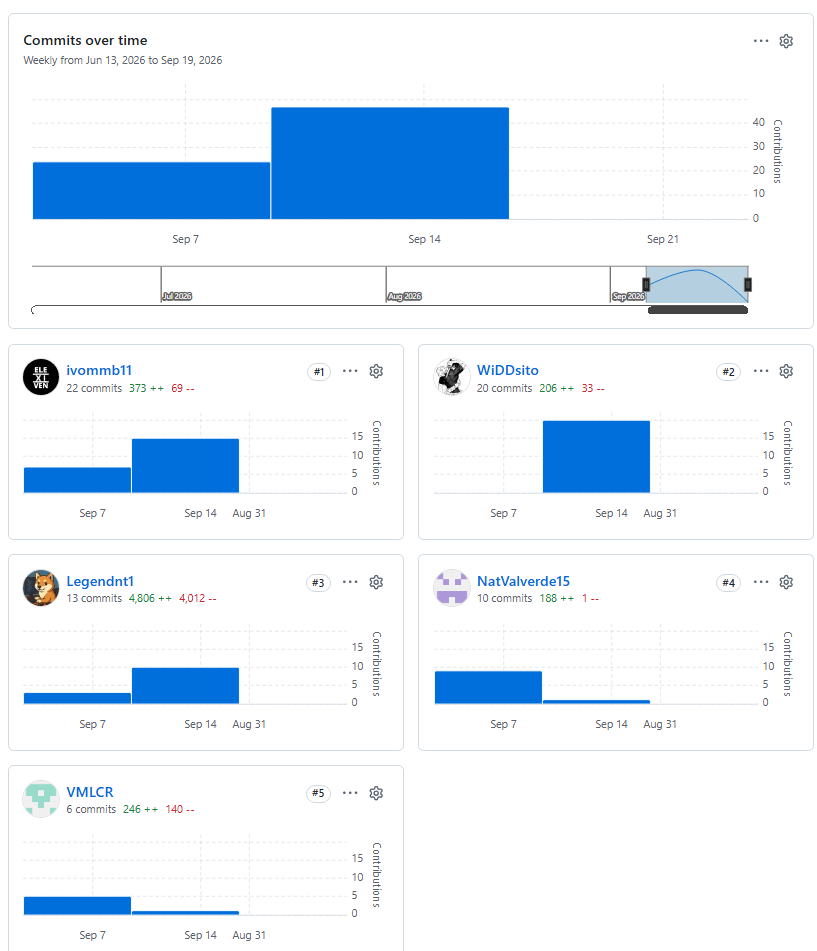

---

# Contenido
- [Registro de Versiones del Informe](#registro-de-versiones-del-informe)
- [Project Report Collaboration Insights](#project-report-collaboration-insights)
- [Contenido](#contenido)
- [Student Outcome](#student-outcome)
- [Capítulo I: Introducción](#capítulo-i-introducción)
  - [1.1. Startup Profile](#11-startup-profile)
    - [1.1.1. Descripción de la Startup](#111-descripción-de-la-startup)
    - [1.1.2. Perfiles de integrantes del equipo](#112-perfiles-de-integrantes-del-equipo)
  - [1.2. Solution Profile](#12-solution-profile)
    - [1.2.1. Antecedentes y problemática](#121-antecedentes-y-problemática)
    - [1.2.2. Lean UX Process](#122-lean-ux-process)
      - [1.2.2.1. Lean UX Problem Statements](#1221-lean-ux-problem-statements)
      - [1.2.2.2. Lean UX Assumptions](#1222-lean-ux-assumptions)
      - [1.2.2.3. Lean UX Hypothesis Statements](#1223-lean-ux-hypothesis-statements)
      - [1.2.2.4. Lean UX Canvas](#1224-lean-ux-canvas)
  - [1.3. Segmentos objetivo](#13-segmentos-objetivo)
- [Capítulo II: Requirements Elicitation & Analysis](#capítulo-ii-requirements-elicitation--analysis)
  - [2.1. Competidores](#21-competidores)
    - [2.1.1. Análisis competitivo](#211-análisis-competitivo)
    - [2.1.2. Estrategias y tácticas frente a competidores](#212-estrategias-y-tácticas-frente-a-competidores)
  - [2.2. Entrevistas](#22-entrevistas)
    - [2.2.1. Diseño de entrevistas](#221-diseño-de-entrevistas)
    - [2.2.2. Registro de entrevistas](#222-registro-de-entrevistas)
    - [2.2.3. Análisis de entrevistas](#223-análisis-de-entrevistas)
  - [2.3. Needfinding](#23-needfinding)
    - [2.3.1. User Personas](#231-user-personas)
    - [2.3.2. User Task Matrix](#232-user-task-matrix)
    - [2.3.3. Empathy Mapping](#233-empathy-mapping)
    - [2.3.4. As-is Scenario Mapping](#234-as-is-scenario-mapping)
  - [2.4. Ubiquitous Language](#24-ubiquitous-language)
- [Capítulo III: Requirements Specification](#capítulo-iii-requirements-specification)
  - [3.1. To-Be Scenario Mapping](#31-to-be-scenario-mapping)
  - [3.2. User Stories](#32-user-stories)
  - [3.3. Impact Mapping](#33-impact-mapping)
  - [3.4. Product Backlog](#34-product-backlog)
- [Capítulo IV: Strategic-Level Software Design](#capítulo-iv-strategic-level-software-design)
  - [4.1. Strategic-Level Attribute-Driven Design](#41-strategic-level-attribute-driven-design)
    - [4.1.1. Design Purpose](#411-design-purpose)
    - [4.1.2. Attribute-Driven Design Inputs](#412-attribute-driven-design-inputs)
      - [4.1.2.1. Primary Functionality (Primary User Stories)](#4121-primary-functionality-primary-user-stories)
      - [4.1.2.2. Quality Attribute Scenarios](#4122-quality-attribute-scenarios)
      - [4.1.2.3. Constraints](#4123-constraints)
    - [4.1.3. Architectural Drivers Backlog](#413-architectural-drivers-backlog)
    - [4.1.4. Architectural Design Decisions](#414-architectural-design-decisions)
    - [4.1.5. Quality Attribute Scenario Refinements](#415-quality-attribute-scenario-refinements)
  - [4.2. Strategic-Level Domain-Driven Design](#42-strategic-level-domain-driven-design)
    - [4.2.1. EventStorming](#421-eventstorming)
    - [4.2.2. Candidate Context Discovery](#422-candidate-context-discovery)
    - [4.2.3. Domain Message Flows Modeling](#423-domain-message-flows-modeling)
    - [4.2.4. Bounded Context Canvases](#424-bounded-context-canvases)
    - [4.2.5. Context Mapping](#425-context-mapping)
  - [4.3. Software Architecture](#43-software-architecture)
    - [4.3.1. Software Architecture System Landscape Diagram](#431-software-architecture-system-landscape-diagram)
    - [4.3.1. Software Architecture Context Level Diagrams](#431-software-architecture-context-level-diagrams)
    - [4.3.2. Software Architecture Container Level Diagrams](#432-software-architecture-container-level-diagrams)
    - [4.3.3. Software Architecture Deployment Diagrams](#433-software-architecture-deployment-diagrams)
- [Capítulo V: Tactical-Level Software Design](#capítulo-v-tactical-level-software-design)
  - [5.X. Bounded Context: \<Bounded Context Name\>](#5x-bounded-context-bounded-context-name)
    - [5.X.1. Domain Layer](#5x1-domain-layer)
    - [5.X.2. Interface Layer](#5x2-interface-layer)
    - [5.X.3. Application Layer](#5x3-application-layer)
    - [5.X.4. Infrastructure Layer](#5x4-infrastructure-layer)
    - [5.X.6. Bounded Context Software Architecture Component Level Diagrams](#5x6-bounded-context-software-architecture-component-level-diagrams)
    - [5.X.7. Bounded Context Software Architecture Code Level Diagrams](#5x7-bounded-context-software-architecture-code-level-diagrams)
      - [5.X.7.1. Bounded Context Domain Layer Class Diagrams](#5x71-bounded-context-domain-layer-class-diagrams)
      - [5.X.7.2. Bounded Context Database Design Diagram](#5x72-bounded-context-database-design-diagram)
- [Capítulo VI: Solution UX Design](#capítulo-vi-solution-ux-design)
  - [6.1. Style Guidelines](#61-style-guidelines)
    - [6.1.1. General Style Guidelines](#611-general-style-guidelines)
    - [6.1.2. Web, Mobile & Devices Style Guidelines](#612-web-mobile--devices-style-guidelines)
  - [6.2. Information Architecture](#62-information-architecture)
    - [6.2.2. Labeling Systems](#622-labeling-systems)
    - [6.2.3. Searching Systems](#623-searching-systems)
    - [6.2.4. SEO Tags and Meta Tags](#624-seo-tags-and-meta-tags)
    - [6.2.5. Navigation Systems](#625-navigation-systems)
  - [6.3. Landing Page UI Design](#63-landing-page-ui-design)
    - [6.3.1. Landing Page Wireframe](#631-landing-page-wireframe)
    - [6.3.2. Landing Page Mock-up](#632-landing-page-mock-up)
  - [6.4. Applications UX/UI Design](#64-applications-uxui-design)
    - [6.4.1. Applications Wireframes](#641-applications-wireframes)
    - [6.4.2. Applications Wireflow Diagrams](#642-applications-wireflow-diagrams)
    - [6.4.2. Applications Mock-ups](#642-applications-mock-ups)
    - [6.4.3. Applications User Flow Diagrams](#643-applications-user-flow-diagrams)
  - [6.5. Applications Prototyping](#65-applications-prototyping)
- [Capítulo VII: Product Implementation, Validation & Deployment](#capítulo-vii-product-implementation-validation--deployment)
  - [7.1. Software Configuration Management](#71-software-configuration-management)
    - [7.1.1. Software Development Environment Configuration](#711-software-development-environment-configuration)
    - [7.1.2. Source Code Management](#712-source-code-management)
    - [7.1.3. Source Code Style Guide & Conventions](#713-source-code-style-guide--conventions)
    - [7.1.4. Software Deployment Configuration](#714-software-deployment-configuration)
  - [7.2. Solution Implementation](#72-solution-implementation)
    - [7.2.X. Sprint n](#72x-sprint-n)
      - [7.2.X.1. Sprint Planning n](#72x1-sprint-planning-n)
      - [7.2.X.2. Sprint Backlog n](#72x2-sprint-backlog-n)
      - [7.2.X.3. Development Evidence for Sprint Review](#72x3-development-evidence-for-sprint-review)
      - [7.2.X.4. Testing Suite Evidence for Sprint Review](#72x4-testing-suite-evidence-for-sprint-review)
      - [7.2.X.5. Execution Evidence for Sprint Review](#72x5-execution-evidence-for-sprint-review)
      - [7.2.X.6. Services Documentation Evidence for Sprint Review](#72x6-services-documentation-evidence-for-sprint-review)
      - [7.2.X.7. Software Deployment Evidence for Sprint Review](#72x7-software-deployment-evidence-for-sprint-review)
      - [7.2.X.8. Team Collaboration Insights during Sprint](#72x8-team-collaboration-insights-during-sprint)
  - [7.3. Validation Interviews](#73-validation-interviews)
    - [7.3.1. Diseño de Entrevistas](#731-diseño-de-entrevistas)
    - [7.3.2. Registro de Entrevistas](#732-registro-de-entrevistas)
    - [7.3.3. Evaluaciones según heurísticas](#733-evaluaciones-según-heurísticas)
  - [7.4. Video About-the-Product](#74-video-about-the-product)
- [Conclusiones](#conclusiones)
  - [Conclusiones y recomendaciones](#conclusiones-y-recomendaciones)
  - [Video About-the-Team](#video-about-the-team)
- [Bibliografía](#bibliografía)
- [Anexos](#anexos)

# Student Outcome

## ABET – EAC - Student Outcome 3

Criterio: Capacidad de comunicarse efectivamente con un rango de audiencias. En el siguiente cuadro se describe las acciones realizadas y enunciados de conclusiones por parte del grupo, que permiten sustentar el haber alcanzado el logro del ABET – EAC - Student Outcome 3. 

| Criterio específico | Acciones realizadas | Conclusiones |
| :--- | :--- | :--- |
| **Comunica oralmente sus ideas y/o resultados con objetividad a público de diferentes especialidades y niveles jerárquicos, en el marco del desarrollo de un proyecto en ingeniería.** | **Arostegui Alzamora, Cesar Augusto** **TB1:** Logre ante el equipo el análisis competitivo y el análisis de entrevistas del segmento Manager, traduciendo hallazgos técnicos sobre seguridad eléctrica y consumo energético a mensajes claros para perfiles operativos y gerenciales.  **Choy Robles, Vanessa May Lang** **TB1:** Sinteticé la dinámica del escenario futuro To Be explicando cómo la interacción con el sistema impacta en el flujo operativo del Trabajador del Local correspondiente a operarios y en las decisiones estratégicas del Manager del Local correspondiente a administradores.  **Valverde Portuguez, Natalia Ximena** **TB1:** Logre realizar la visión de la startup HampCoders, la problemática del sector y el lienzo Lean UX ante el equipo, adaptando el mensaje a audiencia técnica y no técnica para alinear el alcance de ElectroLink.  **Contreras López, Leandro Saúl** **TB1:** Dirigí entrevistas a personal operativo y gerencial explicando la propuesta IoT de monitoreo preventivo con lenguaje simple y empático, y sustenté ante el equipo los hallazgos sobre protocolos ante fallas, tiempos de respuesta y disposición hacia la suscripción.  **Machado Bracamonte, Ivo Marcelo** **TB1:** Conduje la entrevista a gerencia de tienda con comunicación objetiva y contextualizada al ritmo operativo de comida rápida, y expliqué al equipo los flujos de dominio y la arquitectura estratégica con lenguaje técnico y funcional según la audiencia. | **TB1:** Se logro comunicar oralmente ideas y resultados con objetividad ante personal operativo, gerencia de tienda y equipo técnico, adaptando el nivel de detalle y el vocabulario a cada audiencia, lo cual se evidencia en entrevistas conducidas con empatía, sustentaciones internas alineadas y explicación clara de flujos, arquitectura y valor de ElectroLink para la seguridad y la continuidad operativa. |
| **Comunica en forma escrita ideas y/o resultados con objetividad a público de diferentes especialidades y niveles jerárquicos, en el marco del desarrollo de un proyecto en ingeniería.** | **Arostegui Alzamora, Cesar Augusto** **TB1:** Redacté el análisis competitivo, las estrategias frente a competidores, el análisis del segmento Manager, la matriz de tareas, los escenarios actuales y el lenguaje ubicuo del Capítulo II con redacción objetiva y estructurada para audiencia técnica y de negocio.  **Choy Robles, Vanessa May Lang** **TB1:** Redacté y estructuré integralmente la documentación técnica del Capítulo III, incluyendo el escenario futuro To Be, las historias de usuario con criterios de aceptación en formato Gherkin, el mapa de impacto alineado a objetivos y el backlog de producto consolidado.  **Valverde Portuguez, Natalia Ximena** **TB1:** Redacté el Capítulo I con descripción de la startup, antecedentes y problemática con técnica de preguntas guía, proceso Lean UX completo y segmentos objetivo, con redacción clara orientada a público técnico, comercial y académico.  **Contreras López, Leandro Saúl** **TB1:** Documenté el diseño y registro de entrevistas de ambos segmentos con contexto, aspectos clave y evidencias, el análisis del segmento operativo y los flujos de mensajes de dominio del Capítulo IV, con trazabilidad entre voz del usuario y decisiones de diseño.  **Machado Bracamonte, Ivo Marcelo** **TB1:** Documenté el EventStorming, el descubrimiento de contextos candidatos, los lienzos de contextos delimitados, el mapa de contexto y los diagramas de paisaje, contexto, contenedores y despliegue del Capítulo IV, con descripciones precisas para lector técnico y gerencial. | **TB1:** Se logro comunicar en forma escrita ideas y resultados con objetividad para audiencias técnicas, gerenciales y académicas, mediante capítulos articulados, trazabilidad entre hallazgos, historias, backlog y arquitectura, y uso consistente del lenguaje del dominio, lo cual sustenta el logro del resultado estudiantil correspondiente a comunicación efectiva en el marco del proyecto ElectroLink. |

# Capítulo I: Introducción

## 1.1. Startup Profile

### 1.1.1. Descripción de la Startup

Hampcoders es una startup enfocada en el desarrollo de soluciones tecnológicas innovadoras que integran Internet de las Cosas (IoT) y desarrollo de software para el sector de la restauración y retail en Lima Metropolitana. La empresa nace con la visión de transformar la gestión operativa y de seguridad en entornos comerciales de alto tráfico.

Nuestra propuesta de valor se centra en ElectroLink, un ecosistema inteligente que combina hardware y software para monitorear en tiempo real la infraestructura eléctrica de cadenas de comida rápida, previniendo accidentes laborales y optimizando el consumo energético. Nos posicionamos como un aliado estratégico escalable que ayuda a las franquicias a reducir costos por paradas no programadas y a cumplir rigurosamente con los estándares de seguridad industrial.

### 1.1.2. Perfiles de integrantes del equipo

|   Código   |     Apellidos      |     Nombres     |                                                                                                                                                                         Perfil Académico y Profesional                                                                                                                                                                          | Perfil                                               |
|:----------:|:------------------:|:---------------:|:-------------------------------------------------------------------------------------------------------------------------------------------------------------------------------------------------------------------------------------------------------------------------------------------------------------------------------------------------------------------------------:|------------------------------------------------------|
| u202317450 |   Choy Robles    | Vanessa May Lang | Estudiante de Ingeniería de Software con experiencia en distintos lenguajes de programación, diseño UX/UI y trabajo bajo metodologías ágiles como Scrum. Aporto al equipo una visión orientada tanto a la funcionalidad como a la experiencia del usuario, contribuyendo en el desarrollo y mejora continua del producto. Me caracterizo por mi responsabilidad, cumplimiento de plazos y participación activa en el trabajo colaborativo. |          |
| U20231A816 | Valverde Portuguez | Natalia Ximena  | Estudiante de Ingeniería de Software en la Universidad Peruana de Ciencias Aplicadas (UPC). Cuento con conocimientos de Marketing y estoy interesada en el UX Design y base de datos con sql. Experiencia en trabajos de creación de startups en el ámbito laboral, lo que fortalece mis capacidades tanto en trabajos grupales e individuales para las bases de un proyecto. |  |  
| U20231E215 | Contreras López | Leandro Saúl | Mucho gusto, soy Leandro Contreras, estudiante de la carrera de Ingeniería de Software en la UPC, sede San Miguel. Tengo 20 años y estoy cursando el séptimo ciclo académico. Me considero una persona adaptativa, perseverante y comprometida con lo que me propongo. En este proyecto tengo como objetivo buscar múltiples soluciones que beneficien a todo el grupo. Por experiencia propia, suelo trabajar de manera colaborativa y eficaz. Al terminar la carrera de ingeniería, me gustaría estudiar una segunda carrera: Gastronomía y Gestión Culinaria. |  |
| U20231C368 | Machado Bracamonte | Ivo Marcelo | Mi nombre es Ivo Machado, tengo 19 años y soy estudiante del sexto ciclo de Ingeniería de Software en la UPC. Me caracterizo por mi mentalidad resiliente, ya que no me rindo con facilidad y no le tengo miedo al error. Tengo empatía con los demás, disfruto resolver problemas y busco mejorar constantemente en lo que hago. Poseo conocimientos en lenguajes de programación como C++, Java y Python, así como en HTML, CSS y JavaScript. Además, domino el inglés y tengo conocimientos de portugués y alemán. |  |
| U202114548 | Arostegui Alzamora | César Augusto | Soy César Augusto, estudiante de Ingeniería de Software. Actualmente tengo 21 años. Mi lenguaje de programación más utilizado y favorito es TypeScript. Actualmente me encuentro desarrollando habilidades en áreas como DevOps y frameworks de desarrollo móvil. |  |

## 1.2. Solution Profile

### 1.2.1. Antecedentes y problemática

El sector de comida rápida en Lima Metropolitana opera bajo un ritmo constante de alta exigencia operacional donde la maquinaria pesada de cocina (freidoras, hornos, congeladores) funciona de forma ininterrumpida. Según reportes técnicos del Organismo Supervisor de la Inversión en Energía y Minería (OSINERGMIN), la falta de sistemas de monitoreo técnico preventivo expone a las cadenas a fallas críticas e incidentes de seguridad de alta severidad.

Esta problemática cobró relevancia pública tras el trágico accidente eléctrico registrado en un local de la cadena McDonald's en el distrito de Pueblo Libre, documentado por medios nacionales como RPP Noticias (2019), donde dos jóvenes trabajadores perdieron la vida a causa de una descarga eléctrica proveniente de una máquina con mantenimiento deficiente. Este evento evidenció vacíos en la supervisión de la infraestructura eléctrica y la urgencia de contar con herramientas tecnológicas que permitan detectar fugas de corriente o anomalías antes de que desencadenen fatalidades.

Para definir de forma estructurada el problema planteado, se aplica la técnica 5 "W"s y 2 "H"s:

**Who (Quiénes):** Operarios de cocina, personal de limpieza y administradores de tiendas de cadenas de comida rápida en Lima Metropolitana.

**What (Qué):** Riesgo elevado de accidentes eléctricos por falta de mantenimiento predictivo, sumado al sobrecosto por consumo energético ineficiente y fallas inesperadas de maquinaria.

**Where (Dónde):** En los locales comerciales y áreas operativas de cocina de cadenas de comida rápida ubicadas en Lima Metropolitana.

**When (Cuándo):** Durante el horario de atención operacional continuo y los procesos de mantenimiento/limpieza diaria de los equipos.

**Why (Por qué):** Ausencia de sistemas automatizados en tiempo real que alerten sobre fluctuaciones, fugas de energía o fallas a tierra, dependiendo actualmente de inspecciones manuales y reactivas.

**How (Cómo):** Se implementa la solución ElectroLink, mediante sensores inteligentes conectables a los tableros y equipos eléctricos, integrados a una plataforma de alertas preventivas y un dashboard analítico para la toma de decisiones.

**How Much (Cuánto):** Pérdidas económicas por multas administrativas, clausuras temporales o definitivas de locales, indemnizaciones legales, reemplazo prematuro de equipos y sobrecostos del 15% al 25% en la facturación eléctrica mensual por ineficiencias de red según el Ministerio de Energía y Minas (MINEM).

### 1.2.2. Lean UX Process

#### 1.2.2.1. Lean UX Problem Statements

**Domain:** Seguridad industrial y gestión de energía basada en IoT para franquicias gastronómicas.  

**Customer Segments:** Gerentes de operaciones y administradores de locales de cadenas de comida rápida en Lima Metropolitana.  

**Pain Points:**
- Imposibilidad de detectar fallas eléctricas no visibles en el equipo de cocina hasta que ocurre un accidente o una avería total.  - Altas planillas de pago por consumo eléctrico sin visibilidad del equipo específico que genera el consumo anómalo.  
- Temor a sanciones e inspecciones de entes fiscalizadores (SUNAFIL, INDECI, OSINERGMIN).

**Gap:** Las soluciones actuales de mantenimiento son manuales, costosas y reactivas, sin integración con alertas preventivas en tiempo real dirigidas al personal en tienda.  

**Vision/Strategy:** Crear la plataforma ElectroLink, combinando sensores IoT de fácil instalación con alertas inmediatas al personal operativo y analítica centralizada para la administración.  

**Initial Segment:** Cadenas de comida rápida en Lima Metropolitana con más de 5 locales operativos.

**Declaración del Problema (Problem Statement):**

El servicio de monitoreo de infraestructura en las cadenas de comida rápida en Lima Metropolitana está pensado para atender fallas eléctricas de forma reactiva. Hemos detectado que la falta de supervisión continua e inteligente impide a los administradores anticiparse a fallas en equipos de cocina y fugas de energía, lo cual expone al personal a riesgos de electrocución y genera gastos innecesarios.

*¿Cómo podríamos proporcionar una herramienta de monitoreo IoT en tiempo real que prevenga accidentes laborales, optimice el consumo energético y garantice la continuidad operacional en las tiendas de comida rápida de Lima Metropolitana?*

#### 1.2.2.2. Lean UX Assumptions

**Business Outcomes** 

- **Creemos que nuestros usuarios necesitan una solución que les permita** monitorear la salud de su red eléctrica y consumo de maquinaria pesada de cocina en tiempo real, previniendo accidentes laborales (fugas a tierra/electrocución) y fallas críticas antes de que ocurran, ya que actualmente solo reaccionan cuando el equipo se avería o inspeccionan manualmente.
  
- **Estas necesidades se pueden resolver mediante** el desarrollo de una plataforma IoT compuesta por sensores integrados a tableros/maquinaria en cocina, alertas audibles/visibles inmediatas en tienda y un dashboard analítico centralizado para la gestión operativa.
  
- **Nuestros clientes iniciales son** gerentes de operaciones, administradores de tienda y Jefes de Seguridad y Salud en el Trabajo (SST) de cadenas y franquicias de comida rápida en Lima Metropolitana con más de 5 locales operativos.
  
- **El valor #1 que los clientes quieren de nuestro servicio es** garantizar la seguridad de su personal operativo evitando fatalidades por descargas eléctricas y previniendo la paralización de la cocina en horas de alto flujo de ventas.
  
- **El cliente también puede obtener estos beneficios adicionales** como reducción en la facturación eléctrica mensual por corrección de ineficiencias de red, cumplimiento normativo ante fiscalizaciones (SUNAFIL, OSINERGMIN) y prolongación de la vida útil de sus equipos industriales.
  
- **Vamos a adquirir la mayoría de los clientes a través de** venta directa B2B a casas matrices de franquicias gastronómicas, alianzas con la Sociedad Nacional de Industrias (sector restaurantes) y demostraciones en vivo del ahorro energético y mitigación de riesgos.
  
- **Haremos dinero a través de** un modelo de suscripción Software as a Service (SaaS) mensual por local monitoreado, sumado al costo de venta/instalación de los kits de sensores IoT.
  
- **Nuestra competencia de mercado serán** empresas tradicionales de mantenimiento eléctrico correctivo/preventivo y sistemas genéricos de gestión de instalaciones (facility management) que no ofrecen alertas IoT en tiempo real focalizadas en cocina.
  
- **Los venceremos debido a** nuestra especializada arquitectura IoT preventiva centrada en la seguridad del trabajador en cocina, alertas inmediatas para personal no técnico y analítica de consumo por máquina en una sola plataforma integrada.
  
- **Nuestro mayor riesgo de producto es** que las cadenas perciban la instalación de los sensores como una interrupción en su operación o duden de la precisión del sistema frente a entornos de grasa/calor extremo en cocina.
  
- **Resolveremos esto a través de** pruebas piloto gratuitas en cocinas de prueba, sensores con protección industrial adecuados para gastronomía y demostraciones cuantificables del retorno de inversión por prevención de fallas.
  
- **Qué otras suposiciones tenemos que, de probarse falsas, pueden causar que nuestro proyecto fracase:**
  - Creemos que los administradores de comida rápida priorizarán la prevención de riesgos y la eficiencia energética sobre la compra de mantenimiento correctivo tradicional.
  - Creemos que los operarios de cocina acatarán las alertas del sistema y detendrán el uso de una máquina si se reporta una anomalía o fuga de corriente.
  - Creemos que la instalación del hardware IoT en los tableros eléctricos no interferirá con la continuidad del servicio del restaurante.

**User Outcomes** 

- **¿Quién será el usuario?**
  - **Usuarios administradores:** Gerentes de Operaciones, Jefes de SST y Administradores de Local de comida rápida.
  - **Usuarios operativos:** Personal de cocina, cajeros y brigadistas de seguridad en tienda.
    
- **¿Dónde encaja nuestro producto en su trabajo o vida?**
  - Para los **administradores**, se integra en la supervisión técnica remota de la red de tiendas, permitiéndoles auditar consumos, planificar mantenimientos y mitigar riesgos legales.
  - Para los **operarios de cocina**, se integra en su rutina diaria de preparación de alimentos como un guardián de seguridad que les notifica en pantalla o mediante alertas locales si un equipo representa un peligro inminente.
    
- **¿Qué problemas busca resolver nuestro producto?**
  - Invisibilidad de fallas invisibles y fugas a tierra en maquinaria pesada de cocina.
  - Alto riesgo de electrocución o accidentes fatales del personal de cocina.
  - Costos excesivos en la factura de luz por equipos ineficientes o sobrecargados.
  - Pérdida de ventas por apagones locales o averías en horas de mayor demanda.

- **¿Cuándo y cómo es usado nuestro producto?**
  - **Cuándo:**
    - De forma ininterrumpida (24/7) en segundo plano para la captura de datos de red.
    - Al instante de detectar un sobrevoltaje, fuga de energía o sobrecalentamiento.
    - Durante las revisiones semanales de gestión de costos de la administración.
  - **Cómo:**
    - A través del Dashboard Web de analítica para la administración centralizada.
    - Mediante notificaciones push, SMS y señalizadores locales en la cocina ante emergencias.
      
- **¿Qué características son importantes?**
  - Monitoreo en tiempo real del voltaje, amperaje y temperatura de equipos clave.
  - Módulo de alerta temprana de fugas de corriente con protocolo de apagado seguro.
  - Dashboard de consumo energético con desglose de costos aproximados por máquina.
  - Historial de eventos y reporte de salud técnica para fiscalizaciones de seguridad.
  
- **¿Cómo debe comportarse y verse nuestro producto?**
  - **Interfaz administrativa:** Visualización de métricas clara, ejecutiva y enfocada en indicadores de riesgo y costo.
  - **Interfaz operativa/tienda:** Interfaz extremadamente simple, con códigos de colores intuitivos (Verde/Amarillo/Rojo) e instructivos de acción rápida ante emergencias.
  - **Comportamiento:** Respuesta inmediata (latencia mínima) en el envío de alertas críticas para prevenir riesgos de electrocución.

#### 1.2.2.3. Lean UX Hypothesis Statements

- **Hipótesis 1: Sobre el Monitoreo Preventivo y la Seguridad Laboral.**
  **Creemos que** la implementación de sensores IoT y alertas en tiempo real reduzca los accidentes laborales por descargas eléctricas y prevenga fallas críticas en los equipos de cocina.
  **Sabremos que** estamos en lo cierto **cuando veamos** los siguientes comentarios del mercado: una reducción del 80% en las incidencias por sobrecalentamiento o fugas de corriente y un aumento del 40% en solicitudes de mantenimiento preventivo programado antes de que ocurra una falla crítica en un periodo de 6 meses.
  
- **Hipótesis 2: Sobre la Eficiencia Energética y Reducción de Costos.**
  **Creemos que** proporcionar a los administradores un dashboard analítico con el desglose del consumo eléctrico en tiempo real por cada máquina incrementará la adopción de medidas de ahorro energético.
  **Sabremos que** hemos tenido éxito **cuando veamos** una disminución de al menos un 12% en el costo total de la facturación eléctrica mensual en el 70% de los locales monitoreados durante su primer trimestre de uso.

- **Hipótesis 3: Sobre la Valoración Operativa y Continuidad del Servicio.**
  **Creemos que** los gerentes de operaciones preferirán ElectroLink porque las alertas locales e informes técnicos previenen la paralización imprevista de las cocinas en horas pico de venta.
  **Sabremos que** esto es cierto **cuando veamos** una reducción del 50% en paradas no programadas por fallas eléctricas y una tasa de renovación de suscripciones del 85% por parte de las cadenas de comida rápida tras el periodo de prueba piloto.
  
- **Hipótesis 4: Sobre el Cumplimiento Normativo y Auditorías.**
  **Creemos que** ofrecer un historial descargable de auditorías y eventos de seguridad facilitará el cumplimiento de las normativas de Seguridad y Salud en el Trabajo (SST).
  **Sabremos que** hemos tenido éxito **cuando veamos** que el 90% de los administradores de tienda descarguen y presenten estos reportes en sus inspecciones internas y fiscalizaciones oficiales (SUNAFIL e INDECI).

#### 1.2.2.4. Lean UX Canvas

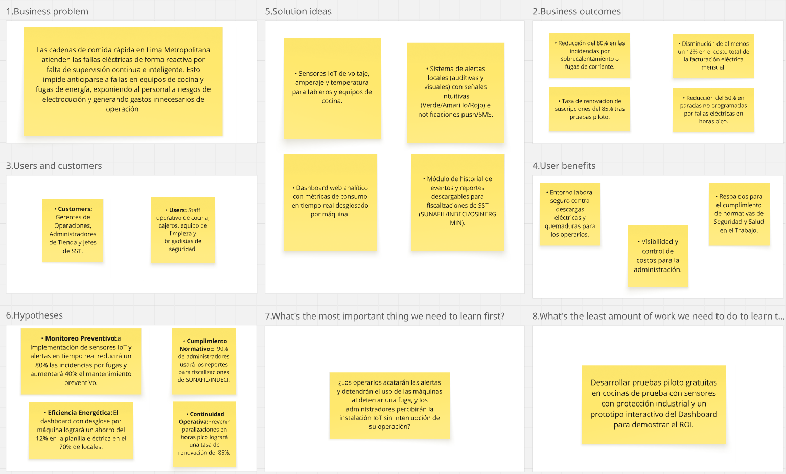

## 1.3. Segmentos objetivo

**Segmento objetivo #1: Trabajadores del Local (Staff Operativo y de Limpieza)**

- **Descripción:** Jóvenes operarios encargados de la cocina, atención en caja, despacho de pedidos y tareas de mantenimiento/limpieza de turnos en restaurantes de comida rápida en Lima Metropolitana.
  
- **Aspectos demográficos:**
  - Sexo: Masculino y Femenino.
  - Edades: Entre 18 y 28 años (muchos combinan estudios universitarios/técnicos con trabajo a tiempo parcial o completo).
  - Nivel socioeconómico: C y B.
    
- **Aspectos geográficos:** Residentes en Lima Metropolitana, que desempeñan sus labores en locales de comida rápida situados en avenidas principales, patios de comidas en centros comerciales o locales de vía pública.

- **Aspectos psicográficos:**
  - Realizan sus labores en entornos de alta velocidad y presión constante.
  - Poseen pocos o nulos conocimientos técnicos sobre electricidad o mantenimiento industrial.
  - Buscan garantías de seguridad para desempeñar sus labores sin poner en peligro su integridad física al manipular agua, mopas o artefactos de alto voltaje.

- **Necesidades clave:**
  - Conocer de manera clara e inmediata si un equipo es seguro de tocar o limpiar (por ejemplo, antes del baldeado o trapeado de la cocina).
  - Contar con una vía simple de notificación para reportar anomalías o ruidos extraños en los equipos sin descuidar sus tareas de atención.
  - Disponer de entornos laborales seguros donde no corran riesgos de electrocución o quemaduras.

- **Sustento estadístico:** El sector de comida rápida en Lima Metropolitana es uno de los mayores empleadores de jóvenes técnicos y universitarios en el país. De acuerdo con informes y registros de la Superintendencia Nacional de Fiscalización Laboral (SUNAFIL), las deficiencias en las condiciones de seguridad e higiene industrial en cocinas comerciales constituyen uno de los principales motivos de inspección, siendo las fallas mecánicas y descargas eléctricas en zonas operativas los eventos con mayor potencial de lesiones graves o fatalidades.

**Segmento objetivo #2: Manager del Local (Administrador / Jefe de Tienda)**

- **Descripción:** Profesional a cargo de la gestión de la tienda, responsable del cumplimiento de las metas de venta, la seguridad e higiene (SST), el control de costos operativos y el mantenimiento técnico de la infraestructura.
  
- **Aspectos demográficos:**
  - Cargos: Store Manager, Administrador de Local, Supervisor de Turno, Jefe de SST.
  - Edades: Entre 25 y 50 años.
  - Nivel socioeconómico: B y A.

- **Aspectos geográficos:** Encargados de establecimientos de comida rápida en Lima Metropolitana.

- **Aspectos psicográficos:**
  - Orientados al cumplimiento estricto de KPIs de servicio, presupuestos de mantenimiento y normativas legales/laborales (SUNAFIL, OSINERGMIN, INDECI e Inspecciones Municipales).
  - Buscan evitar a toda costa contingencias que afecten la imagen de la marca, clausuras temporales/definitivas o demandas legales por negligencia.
  - Valoran los datos centralizados para coordinar de forma preventiva con los equipos de mantenimiento corporativo.
  
- **Necesidades clave:**
  - Garantizar un ambiente de trabajo 100% seguro contra riesgos eléctricos para todo su personal.
  - Disponer de visibilidad del consumo energético por máquina para controlar costos y reducir la factura de energía.
  - Programar mantenimientos predictivos evitando que las cocinas, congeladoras o freidoras se malogren en horas de alta demanda o generen mermas de insumos.
  
- **Sustento estadístico:** En Lima Metropolitana operan más de 1,200 locales pertenecientes a cadenas y franquicias de comida rápida (hamburgueserías, pollerías, pizzerías). Según reportes del sector retail y gastronómico, los costos asociados a servicios básicos y mantenimiento técnico representan entre el 15% y 20% de los gastos operativos mensuales de cada tienda, donde las ineficiencias de red pueden elevar la facturación hasta un 25% si no se detectan anomalías a tiempo. 

# Capítulo II: Requirements Elicitation & Analysis

En esta sección se presentan los resultados del análisis de requerimientos, incluyendo la identificación de competidores, entrevistas con stakeholders y la definición de necesidades clave para el desarrollo de la solución ElectroLink.

## 2.1. Competidores

Tenemos los siguientes competidores directos e indirectos en el mercado de soluciones IoT para monitoreo energético y seguridad eléctrica en restaurantes multisede:

| Empresa / solución | Tipo | Descripción | Similitud con ElectroLink |
|---|---|---|---|
| ElectroLink | Solución propia | Plataforma IoT para monitorear tableros y equipos de cocina con alertas locales, remotas, dashboard multisede e historial. | Propuesta de referencia. Orientada a cadenas de comida rápida en Lima. |
| Powerhouse Dynamics – Open Kitchen | Competidor directo | Plataforma IoT e inteligencia energética para restaurantes multisede. Supervisa cocina, refrigeración, HVAC, iluminación y consumo por circuito en cloud. | Alta. Atiende restaurantes, monitorea equipos y circuitos, centraliza información y gestiona energía y operaciones. |
| MachineQ Foodservice | Competidor directo | Monitoreo IoT para equipos, enchufes, breakers y activos. MQinsights con datos actuales e históricos, tendencias, alertas configurables e información predictiva. | Alta en monitoreo energético y prevención de paradas. Menor en seguridad eléctrica laboral y cumplimiento local. |
| Acrel Smart Power Distribution | Competidor directo o indirecto especializado | Ecosistema de medidores, sensores, gateways y plataforma IoT para distribución eléctrica, energía, alarmas y seguridad multisede. | Alta en tableros, circuitos y alarmas. Enfoque más industrial que gastronómico. |

### 2.1.1. Análisis competitivo

Realizando una comparación de las soluciones mencionadas, se observa que ElectroLink se diferencia por su enfoque en la seguridad eléctrica laboral y la prevención de accidentes en entornos de cocina, mientras que los competidores se centran más en la eficiencia energética y el monitoreo de equipos. Además, ElectroLink busca adaptarse a las necesidades específicas de las cadenas de comida rápida, ofreciendo una solución local y personalizada.

#### Competitive Analysis Landscape

| ¿Por qué llevar a cabo este análisis? | Escriba en el recuadro la pregunta que busca responder o el objetivo de este análisis. |
|---|---|
| Conocer cómo se posiciona ElectroLink frente a soluciones internacionales de monitoreo energético, gestión IoT y seguridad eléctrica para restaurantes multisede. | ¿Qué ventajas, limitaciones y oportunidades tiene ElectroLink frente a Powerhouse Dynamics–Open Kitchen, MachineQ Foodservice y Acrel Smart Power Distribution? |
| Identificar funcionalidades ya validadas en el mercado. | ¿Qué características debe incluir el producto mínimo viable de ElectroLink para ser competitivo? |
| Encontrar un espacio de diferenciación. | ¿Cómo puede ElectroLink competir desde la seguridad eléctrica, la prevención de accidentes y la adaptación a cadenas de comida rápida en Lima Metropolitana? |
| Comparar modelos comerciales y canales de llegada al cliente. | ¿Qué propuesta de producto, precio, distribución y marketing resulta más conveniente para una startup local? |

|  |  |  |  |  |
|---|---|---|---|---|
|  | **ElectroLink** | **Powerhouse Dynamics – Open Kitchen** | **MachineQ Foodservice** | **Acrel Smart Power Distribution** |
| **Overview** | Plataforma IoT enfocada en seguridad eléctrica, eficiencia energética y continuidad operativa en cadenas de comida rápida de Lima. | Plataforma empresarial IoT para optimizar energía, refrigeración, HVAC, iluminación y equipos de restaurantes multisede. | Plataforma IoT para monitorear consumo y utilización de equipos mediante datos en tiempo real, históricos, tendencias y alertas. | Sistema de distribución eléctrica inteligente con medidores, sensores, gateways, alarmas y plataforma cloud para instalaciones multisede. |

**Perfil de Marketing**

| Perfil | Factor de análisis | ElectroLink | Open Kitchen | MachineQ | Acrel |
|---|---|---|---|---|---|
| **Perfil de Marketing** | **Ventaja competitiva ¿Qué valor ofrece a los clientes?** | Prevención de accidentes eléctricos, detección temprana de anomalías, alertas para personal no técnico, reducción de consumo y evidencia para mantenimiento y SST. | Visibilidad centralizada de locales, automatización energética, control de equipos y reducción de costos operativos. | Información accionable sobre consumo y rendimiento de activos, prevención de downtime y optimización del uso energético. | Medición detallada de parámetros eléctricos, alarmas configurables, monitoreo remoto y gestión de seguridad de la distribución. |
|  | **Mercado objetivo** | Cadenas y franquicias de comida rápida en Lima con más de 5 locales. Compradores: operaciones, SST, mantenimiento corporativo. Usuarios: cocina y limpieza. | Marcas de restaurantes, foodservice, retail y operadores multisede con infraestructura energética compleja. | Empresas de foodservice y organizaciones que necesitan monitorear equipos, consumo, utilización y mantenimiento. | Restaurantes, retail, edificios, centros industriales e instalaciones comerciales que requieren gestión multisede. |
|  | **Estrategias de marketing** | Venta B2B directa, pilotos en locales, demos de ahorro y seguridad, alianzas con mantenimiento eléctrico, asociaciones empresariales y consultores SST. | Venta empresarial, demostraciones, alianzas con fabricantes de equipos y paquetes con hardware, instalación y servicios administrados. | Venta consultiva B2B basada en casos de ahorro, monitoreo remoto, reducción de fallas e integración con sistemas empresariales. | Venta técnica por cotización, distribuidores, integradores eléctricos y proyectos de infraestructura o automatización. |

**Perfil de Producto**

| Perfil | Factor de análisis | ElectroLink | Open Kitchen | MachineQ | Acrel |
|---|---|---|---|---|---|
| **Perfil de Producto** | **Productos & Servicios** | Kit de sensores corriente, voltaje y temperatura; detección de fugas; gateway; dashboard web; alertas push/SMS/locales; historial; reportes; mantenimiento preventivo. | Open Kitchen, monitoreo por circuito, control HVAC, refrigeración, iluminación, alertas, analítica, reportes, instalación/soporte y reducción de demanda con IA. | MQinsights, transformadores de corriente, smart plugs, gateways, monitoreo por activo/enchufe/breaker, alertas, tendencias y predictivo. | Medidores mono/trifásicos, sensores inalámbricos y temperatura, gateways, plataforma IoT EMS, alarmas, históricos, monitoreo y control. |
|  | **Precios & Costos** | Modelo propuesto: costo inicial por kit + instalación + suscripción SaaS mensual por local/tablero. Accesible para cadenas medianas, piloto de bajo riesgo. | Cotización empresarial. Ref. no oficial USD 150-400 mensual por local. Incluye hardware, instalación, software y servicios. No hay tarifa pública. | Cotización según sensores, activos, conectividad, locales, integración y servicios. Depende de infraestructura IoT y suscripción. | Cotización por proyecto. Ref. hardware desde USD 200-1.000 por caja inteligente. No equivale al costo total de implementación. |
|  | **Canales de distribución (Web y/o Móvil)** | Dashboard web central, interfaz simple en tienda, push/SMS y señalizadores locales. Futuro: app móvil para técnicos y administradores. | Plataforma cloud en navegador, reportes centralizados y control remoto. Enfoque en gestión empresarial multisede. | Plataforma MQinsights, dashboards, alertas e integración por API REST o integraciones nativas empresariales. | Plataforma cloud y paneles; gateways con Modbus, RS485, Wi-Fi, 4G o LoRa según dispositivo. |

**Análisis SWOT**

| Perfil | Factor de análisis | ElectroLink | Open Kitchen | MachineQ | Acrel |
|---|---|---|---|---|---|
| **Análisis SWOT** | **Fortalezas** | Propuesta vertical para restaurantes; prioridad en seguridad laboral; alertas simples; adaptación a Lima y SST; integra seguridad, energía y mantenimiento. | Marca y experiencia IoT; enfoque restaurantes; amplia cobertura; monitoreo por circuito; control HVAC y refrigeración; escala grande. | Arquitectura escalable; monitoreo por activo/enchufe/breaker; datos históricos y tiempo real; alertas configurables; predictiva; APIs. | Amplio catálogo hardware; medición multicircuito; alarmas e históricos; seguridad eléctrica; personalización y arquitectura distribuida. |
|  | **Debilidades** | Startup sin historial ni casos; hardware y algoritmos por validar en grasa, calor y humedad; requiere certificación e instalación segura; debe validar reducción de accidentes. | Posiblemente sobredimensionada y costosa para cadenas pequeñas; depende de implementación empresarial; más eficiencia que prevención de electrocución. | Requiere varios dispositivos y arquitectura compleja; propuesta horizontal no adaptada a normativa peruana, SST o limpieza en cocinas. | Enfoque técnico-industrial; complejo para no técnicos; requiere personal eléctrico para instalación; no diseñado para flujo de restaurante. |
|  | **Oportunidades** | Ser solución local en seguridad foodservice; implementación rápida y bajo costo; reportes SST; alianzas con instaladores, aseguradoras y mantenimiento; expansión a retail, hoteles y dark kitchens. | Crecimiento multisede y necesidad de reducir costos energéticos favorecen plataformas inteligentes. Ampliación vía fabricantes. | Demanda de visibilidad energética, sostenibilidad, menos downtime y gestión remota. API permite integración con software existente. | Expansión IoT energético y modernización comercial crean oportunidad para distribución conectada, medición por circuito y alarmas remotas. |
|  | **Amenazas** | Competidores con capital y marca; resistencia a hardware; falsas alarmas; responsabilidad legal; dificultad para demostrar ROI; certificación y seguridad eléctrica. | Puede capturar cuentas grandes con solución integral, marca internacional, instalación y soporte administrado. | Puede competir con plataforma IoT reutilizable multindustria y respaldo Comcast/MachineQ. | Puede competir por precio en hardware, vía integradores locales y como proveedor de infraestructura en proyectos grandes. |

**Comparación de capacidades**

| Capacidad | ElectroLink | Open Kitchen | MachineQ | Acrel |
|---|---|---|---|---|
| Orientación específica a restaurantes | Alta | Alta | Alta en foodservice | Media |
| Monitoreo por local | Sí | Sí | Sí | Sí |
| Monitoreo por circuito | Sí, como función central | Sí | Sí | Sí |
| Monitoreo de corriente y voltaje | Sí | Sí, según configuración | Sí | Sí |
| Monitoreo de temperatura | Sí, en equipos y tableros | Sí, principalmente en equipos y refrigeración | Disponible según sensores y caso de uso | Sí |
| Detección de fugas o fallas a tierra | Debe ser función central, validada técnicamente | No aparece como eje principal | No aparece como eje principal | Puede cubrir condiciones eléctricas y alarmas, según componentes |
| Alertas configurables | Sí | Sí | Sí | Sí |
| Alertas para personal no técnico | Sí, mediante interfaz local simple | Principalmente gestión centralizada | Principalmente dashboard y notificaciones | Principalmente alarmas técnicas |
| Analítica energética | Sí | Sí, con funciones avanzadas de demanda | Sí | Sí |
| Mantenimiento predictivo | En desarrollo; debe validarse con datos piloto | Sí, mediante monitoreo de equipos y analítica | Sí, con insights predictivos | Sí, mediante monitoreo de condición y alarmas |
| Control remoto de equipos | Opcional o futura | Sí, especialmente HVAC, iluminación y equipos compatibles | Depende de los dispositivos instalados | Disponible según dispositivos y salidas |
| Gestión de órdenes de trabajo | Debe integrarse en el roadmap | Puede requerir integración o servicio adicional | Puede integrarse mediante API | Puede requerir integración con CMMS |
| Reportes para SST y auditorías locales | Diferenciador principal | Reportes operativos y energéticos | Reportes de consumo, activos y eventos | Registros técnicos y de eventos |
| Adaptación a Perú | Alta, si se implementa correctamente | Baja o requiere localización | Baja o requiere localización | Baja o requiere integrador local |
| Complejidad para una cadena mediana | Diseñable como baja o media | Media o alta | Media | Media o alta |
| Modelo comercial | Kit + instalación + SaaS | Cotización empresarial | Cotización empresarial | Hardware/proyecto + plataforma/cotización |

**SWOT consolidado de ElectroLink**

| Fortalezas | Debilidades |
|---|---|
| Enfoque especializado en cadenas de comida rápida y cocinas de alta exigencia. | Falta de validación comercial y técnica en condiciones reales. |
| Integra seguridad eléctrica, consumo energético y mantenimiento preventivo. | Dependencia de la precisión de sensores y algoritmos de detección. |
| Alertas diseñadas para usuarios no técnicos en la tienda. | Costos iniciales de diseño, certificación, instalación y soporte. |
| Posibilidad de generar evidencia para inspecciones y auditorías internas. | Riesgo de falsas alarmas o de que el personal ignore las alertas. |
| Adaptación a procesos, idioma, operación y necesidades regulatorias locales. | Todavía no cuenta con marca, referencias ni economías de escala de proveedores internacionales. |
| Modelo SaaS recurrente por local, tablero o conjunto de sensores. | La detección de fugas y el protocolo de apagado seguro requieren validación por especialistas eléctricos. |
| **Oportunidades** | **Amenazas** |
| Digitalización de la operación de cadenas y franquicias. | Open Kitchen puede ofrecer una plataforma integral a grandes cadenas. |
| Necesidad de disminuir paradas, accidentes, consumo y costos de mantenimiento. | MachineQ puede aprovechar una plataforma IoT horizontal y escalable. |
| Alianzas con empresas de mantenimiento eléctrico, SST, aseguradoras e integradores. | Acrel puede competir con hardware de menor costo y amplia variedad de medidores. |
| Venta de pilotos para demostrar ahorro y reducción de riesgos. | Las cadenas pueden preferir proveedores eléctricos tradicionales. |
| Expansión a minimarkets, hoteles, dark kitchens, centros comerciales y retail. | Problemas de conectividad, calor, grasa, humedad o interferencias en cocina. |
| Integración con CMMS, ERP, sistemas de tickets y plataformas de mantenimiento. | Una falla del sistema podría generar responsabilidad operativa o reputacional. |
| Posibilidad de construir una base de datos local para modelos predictivos. | Requisitos de seguridad eléctrica, certificación, responsabilidad profesional y protección de datos. |

### 2.1.2. Estrategias y tácticas frente a competidores

ElectroLink no debería competir únicamente con el argumento de medir el consumo. Open Kitchen, MachineQ y Acrel ya cubren medición energética, monitoreo remoto, alarmas y análisis de activos. La oportunidad está en combinar esas capacidades con seguridad eléctrica del trabajador, respuesta inmediata en tienda y trazabilidad del mantenimiento.

Posicionamiento recomendado: ElectroLink es una plataforma IoT de seguridad eléctrica y continuidad operativa para cadenas de restaurantes, capaz de detectar anomalías en tableros y equipos, alertar al personal antes de una falla crítica y generar evidencia para la gestión de mantenimiento y SST.

Prioridades del producto mínimo viable:

1. Medición segura y confiable de corriente, voltaje y temperatura.
2. Detección técnicamente validada de sobrecargas, sobrecalentamiento, pérdida de fase y eventos anómalos.
3. Alertas locales claras, con instrucciones de acción para personal no técnico.
4. Dashboard multisede para administradores y gerentes de operaciones.
5. Historial de eventos, responsables, acciones correctivas y reportes descargables.
6. Pilotos controlados en uno o dos locales antes de prometer porcentajes de ahorro o reducción de accidentes.
7. Integración posterior con órdenes de trabajo, mantenimiento corporativo y sistemas de auditoría.

Conviene validar antes de la versión final las cifras sobre accidentes, número de locales, porcentajes de sobrecosto energético y requisitos de OSINERGMIN, SUNAFIL e INDECI. Debe distinguirse entre detectar una anomalía eléctrica y garantizar la ausencia de riesgo de electrocución: ElectroLink debe complementar, no reemplazar, las protecciones eléctricas, inspecciones certificadas y procedimientos de SST.

## 2.2. Entrevistas

### 2.2.1. Diseño de entrevistas
En esta sección se presenta el diseño de las entrevistas por segmento objetivo.

**Segmento #1: Trabajadores del Local (Staff Operativo y de Limpieza)**

**Preguntas principales:**
- ¿Cómo actúas cuando surge un problema eléctrico, como un corte de luz, una freidora o que deja de funcionar un horno?
- ¿Qué tan rápido se atiende normalmente ese tipo de problemas en tu local?
- ¿De qué manera una falla eléctrica afecta tu trabajo con relación a la atención al cliente, tiempos de entrega y seguridad?
- ¿Has vivido alguna situación donde una instalación mal hecha o falta de mantenimiento haya causado un problema mayor en el local? ¿Cómo se resolvió?
- ¿Con qué frecuencia ves que se hace mantenimiento preventivo a los equipos e instalaciones eléctricas de tu local?
- ¿Qué importancia le das a que las reparaciones eléctricas del local cumplan normas de seguridad y cumplimiento normativo?
- ¿Considerarías útil usar una plataforma que permita reportar rápido una falla y conectar con proveedores verificados para tu zona?
- ¿Qué funcionalidades crees que harían esa plataforma útil para ti en el día a día (reporte en 1 clic, seguimiento en tiempo real, historial de fallas, chat con técnico)?

**Preguntas complementarias:**
- ¿Qué sueles hacer o buscar en internet cuando no sabes si una falla es eléctrica o del equipo?
- ¿Cuánto confías en que tu reporte será atendido rápidamente por el encargado o un técnico?
- ¿En qué momentos específicos del turno crees que sería más útil tener acceso a soporte eléctrico certificado (hora punta, cierre, apertura)?
- ¿Te sentirías cómodo usando una aplicación para reportar fallas y agendar mantenimientos preventivos sin depender solo de WhatsApp o aviso verbal?

**Segmento #2: Manager del Local (Administrador / Jefe de Tienda)**

**Preguntas principales:**
- ¿Cómo está actualmente con la forma en que gestionas fallas y mantenimientos eléctricos en tu local?
- ¿Qué haces normalmente cuando necesitas encontrar a alguien que repare o revise una instalación eléctrica del local?
- ¿Qué tan fácil o difícil te resulta encontrar técnicos eléctricos certificados que atiendan con la rapidez que exige una cadena de comida rápida?
- ¿Cuando has contratado un servicio eléctrico antes, ¿qué fue lo que más te preocupó (tiempo de inactividad, costo, seguridad alimentaria, cumplimiento normativo)?
- ¿Qué cosas valoras más al contratar un proveedor para tu local (disponibilidad 24/7, certificación, garantía, precio, rapidez, facturación formal)?
- ¿Con qué frecuencia realizas mantenimiento preventivo a tableros, cableado, refrigeración y equipos de cocina eléctrica?
- ¿Te ha pasado que una instalación mal hecha haya causado pérdida de ventas, cierre temporal o riesgo sanitario? ¿Cómo lo resolviste?
- ¿Estarías dispuesto a pagar una suscripción mensual si eso te garantiza proveedores verificados, atención prioritaria y monitoreo preventivo? ¿Por qué?
- ¿Qué funcionalidades crees que te facilitarían la gestión desde una plataforma (panel multi-local, Acuerdo de Nivel de Servicio y tiempos de atención, calificaciones, pagos y facturación, historial y alertas preventivas)?

**Preguntas complementarias:**
- ¿Dónde buscas actualmente técnicos o proveedores (contactos de la cadena, Facebook, WhatsApp, proveedores corporativos)?
- ¿Has probado plataformas para solicitar servicios de mantenimiento? ¿Cómo fue la experiencia?
- ¿Qué herramientas digitales usas hoy para organizar mantenimientos y pedidos (Excel, WhatsApp, sistema interno de la franquicia)?
- ¿Qué tan dispuesto estarías a formar parte de una red de locales y proveedores certificados con estándares comunes de seguridad eléctrica?

### 2.2.2. Registro de entrevistas

**Segmento #1: Trabajadores del Local (Staff Operativo y de Limpieza)**

- Entrevista: Mark Mori
- Edad: 21 años
- Link: <https://upcedupe-my.sharepoint.com/:v:/g/personal/u202114548_upc_edu_pe/IQC_gpWtSKeTSrFrsrdrAfTKAe0JfPhBuHVNk-_JEgFhSUE?nav=eyJyZWZlcnJhbEluZm8iOnsicmVmZXJyYWxBcHAiOiJPbmVEcml2ZUZvckJ1c2luZXNzIiwicmVmZXJyYWxBcHBQbGF0Zm9ybSI6IldlYiIsInJlZmVycmFsTW9kZSI6InZpZXciLCJyZWZlcnJhbFZpZXciOiJNeUZpbGVzTGlua0NvcHkifX0&e=jVrcff>
- Inicia en: 0:10
- Duración: 7:38
- Entrevistador: Leandro Saul Contreras López

**Contexto de la entrevista**
El objetivo de la charla fue conocer la perspectiva del personal operativo sobre una propuesta de proyecto basada en dispositivos IoT (sensores inteligentes) para medir el consumo eléctrico, evitar sobrecalentamientos y prevenir accidentes en locales comerciales.

**Aspectos clave mencionados por el entrevistado:**
- Protocolos ante fallas eléctricas: Cuando ocurre un corte de luz o falla un equipo (como freidoras u hornos), se avisa inmediatamente al gerente de turno. El gerente baja el interruptor y se emite un ticket de soporte. Priorizan revisar las llaves termomagnéticas para asegurar que las cámaras de frío no pierdan temperatura y se echen a perder los insumos.
- Tiempos de respuesta: Para fallas críticas reportadas por su plataforma interna, el tiempo estimado de atención y arreglo por parte de los técnicos es de 1 a 3 horas, ya que no pueden detener operaciones esenciales.
Impacto de las fallas en el trabajo y servicio:
- Atención y ventas: Se paralizan las operaciones. Caen los sistemas POS (puntos de venta) por falta de internet y las pantallas de cocina se apagan, impidiendo ver o tomar nuevos pedidos.
- Delivery: Los repartidores no pueden ser despachados.
- Seguridad: Las fallas incrementan el riesgo de accidentes, posibles fugas de gas o problemas de iluminación en el entorno de la cocina.
**Mantenimientos preventivos y seguridad:**
El mantenimiento en su local se realiza cada dos meses. Es vital porque la grasa y el calor constante de la cocina pueden afectar los circuitos.
Mark considera crítico el cumplimiento normativo. Reciben capacitaciones mensuales sobre cómo actuar en estas emergencias, lo cual es fundamental al convivir con pisos húmedos, freidoras y altas temperaturas.
**Opinión sobre la plataforma propuesta (IoT y reportes):**
Considera útil la idea para el seguimiento en tiempo real, aunque menciona que actualmente su empresa ya terceriza esa función con proveedores establecidos.
Funcionalidades deseadas: Si utilizara esta nueva plataforma en el día a día, le gustaría que incluyera el seguimiento en tiempo real del ticket de soporte, la opción de adjuntar fotografías del problema, un historial de fallas y un chat directo con el técnico para agilizar la solución y mejorar la trazabilidad.

---

- Entrevista: Anyelina Rivera
- Edad: 21 años
- Link: <https://upcedupe-my.sharepoint.com/:v:/g/personal/u202114548_upc_edu_pe/IQAX6Iov-xwKTo_Qebu0DG0XAeUEGuaYWgN4DCkzuRwMtwU?nav=eyJyZWZlcnJhbEluZm8iOnsicmVmZXJyYWxBcHAiOiJPbmVEcml2ZUZvckJ1c2luZXNzIiwicmVmZXJyYWxBcHBQbGF0Zm9ybSI6IldlYiIsInJlZmVycmFsTW9kZSI6InZpZXciLCJyZWZlcnJhbFZpZXciOiJNeUZpbGVzTGlua0NvcHkifX0&e=rgjWEW>
- Inicia en: 0:02
- Duración: 10:48
- Entrevistador: Leandro Saul Contreras López

**Contexto de la entrevista**
Al igual que en la primera entrevista, el objetivo fue conocer la perspectiva de un trabajador de restaurante de comida rápida sobre una propuesta de proyecto IoT para monitorear componentes eléctricos en la cocina y prevenir accidentes.

**Aspectos clave mencionados por la entrevistada:**
- Protocolos ante fallas eléctricas: Lo primero que hacen es avisar al encargado de turno. Si es un corte general, esperan indicaciones; pero si es un equipo específico (freidora, horno, plancha), evitan manipularlo por seguridad (especialmente si hay humo, chispas o cables dañados). Mientras tanto, el equipo de cocina se reorganiza para seguir trabajando con las máquinas operativas y priorizar pedidos.
- Tiempos de respuesta: Depende de la gravedad. Si la falla afecta directamente la producción y operación, se reporta rápidamente como emergencia para coordinar con mantenimiento. Si es algo menor, puede esperar. Los tiempos también dependen de la disponibilidad del técnico o de si se necesitan repuestos.

**Impacto de las fallas en el trabajo y servicio:**
- Atención y tiempos: Los pedidos se acumulan, el tiempo de preparación aumenta y los clientes terminan esperando más de lo habitual, lo cual afecta la calidad del servicio de comida rápida.
- Seguridad: Anyelina resalta que la seguridad es prioritaria. Preferirán detener el uso de un equipo antes que arriesgarse a una descarga eléctrica o accidente mayor por querer sacar los pedidos rápido.

**Mantenimientos preventivos y seguridad:**
Sabe que hay un mantenimiento periódico coordinado por los encargados, aunque los empleados no manejan el cronograma exacto.
Considera vital el mantenimiento preventivo porque en un restaurante los equipos se usan intensamente todo el día. Esperar a que se malogren genera más costos y afecta la atención.
Cumplimiento normativo: Le da mucha importancia. Las reparaciones no solo deben hacer que la máquina vuelva a funcionar, sino que deben garantizar la seguridad del personal, dado que trabajan en un entorno riesgoso con calor, agua, grasa y electricidad.

**Opinión sobre la plataforma propuesta (IoT y reportes):**
Considera que sería muy útil para ordenar y acelerar el proceso. Valora especialmente que la plataforma ofrezca técnicos y proveedores verificados, ya que los temas eléctricos no deben dejarse en manos de cualquier persona.
Funcionalidades deseadas:
- Reportes rápidos y sencillos: Seleccionar el equipo, hacer una descripción corta y poder adjuntar fotos/videos de prueba sin que sea un proceso engorroso.
- Seguimiento en tiempo real: Saber si el técnico ya fue asignado y a qué hora llegará.
- Historial de fallas: Para identificar si un equipo se malogra repetidamente y evaluar si es mejor reemplazarlo.
- Chat directo con el técnico: Para poder explicar mejor el problema antes de que llegue al local.

---

- Entrevista: Akemy Garcia 
- Edad: 19 años
- Link: <https://upcedupe-my.sharepoint.com/:v:/g/personal/u202114548_upc_edu_pe/IQC32NumMX-ARa1xo0SfJfSFARvM3lt5n7Bb8uW5LlNo7RY?nav=eyJyZWZlcnJhbEluZm8iOnsicmVmZXJyYWxBcHAiOiJPbmVEcml2ZUZvckJ1c2luZXNzIiwicmVmZXJyYWxBcHBQbGF0Zm9ybSI6IldlYiIsInJlZmVycmFsTW9kZSI6InZpZXciLCJyZWZlcnJhbFZpZXciOiJNeUZpbGVzTGlua0NvcHkifX0&e=oJpFbp>
- Inicia: 0:08
- Duración: 4:21
- Entrevistador: Leandro Saul Contreras López

**Contexto de la entrevista**
Esta entrevista continúa explorando la perspectiva del personal de atención y operaciones (en este caso, en cines) frente a la propuesta de usar sensores IoT para medir el consumo eléctrico y evitar el sobrecalentamiento de los equipos.

**Aspectos clave mencionados por la entrevistada:**
- Protocolos ante fallas eléctricas: Su primera acción es avisar al encargado y dejar de usar el equipo inmediatamente para evitar cualquier accidente. Si la situación es más grave, se recurre a llamar a un técnico.
- Tiempos de respuesta: La rapidez de la atención depende del tipo de problema. Si afecta considerablemente el trabajo y la operación, intentan solucionarlo lo más rápido posible, aunque Akemy señala que a veces el técnico se demora en llegar.
  
**Impacto de las fallas en el trabajo y servicio:**
- Atención al cliente: Considera que afecta bastante porque retrasa los pedidos, genera molestias directas en los clientes y puede llegar a paralizar por completo parte de la atención.
- Seguridad: También lo identifica como un riesgo latente para la integridad de los propios trabajadores.

Experiencias previas con malas instalaciones: Ha vivido situaciones donde un equipo empezó a fallar debido a una conexión en mal estado. La solución fue detener el uso de la máquina y llamar a un técnico para que revisara y cambiara la instalación.

**Mantenimientos preventivos y seguridad:**
- Frecuencia: Señala que el mantenimiento preventivo no es muy seguido. Generalmente, los equipos solo se revisan de manera reactiva (cuando ya presentan alguna falla) en lugar de tener revisiones preventivas constantes.
- Cumplimiento normativo: Le da bastante importancia a las normas de seguridad, ya que una reparación mal hecha puede causar accidentes graves, dañar aún más los equipos o generar problemas a futuro.

**Opinión sobre la plataforma propuesta:**
- Considera que sería una herramienta muy útil, especialmente si permite hacer el reporte de manera rápida y ayuda a encontrar técnicos confiables (verificados) que estén cerca del local.
 
**Funcionalidades deseadas:** Para que le sea útil en su día a día, le gustaría que la plataforma incluyera:
- Reporte rápido de la falla.
- Seguimiento del técnico y su tiempo estimado de llegada.
- Chat directo.
- Un historial que registre las fallas y las reparaciones previas.

---

**Segmento #2: Manager del Local (Administrador / Jefe de Tienda)**

- Entrevista: Juan Carrion
- Edad: 30 años
- Link: <https://upcedupe-my.sharepoint.com/:v:/g/personal/u202114548_upc_edu_pe/IQDlpevVloNBT6gdiUm1e88qAR_TuWgp_v3K431_OOzYjQk?nav=eyJyZWZlcnJhbEluZm8iOnsicmVmZXJyYWxBcHAiOiJPbmVEcml2ZUZvckJ1c2luZXNzIiwicmVmZXJyYWxBcHBQbGF0Zm9ybSI6IldlYiIsInJlZmVycmFsTW9kZSI6InZpZXciLCJyZWZlcnJhbFZpZXciOiJNeUZpbGVzTGlua0NvcHkifX0&e=fVegXG>
- Inicia en: 0:17
- Duración: 5:51
- Entrevistador: Vanessa May Lang Choy Robles

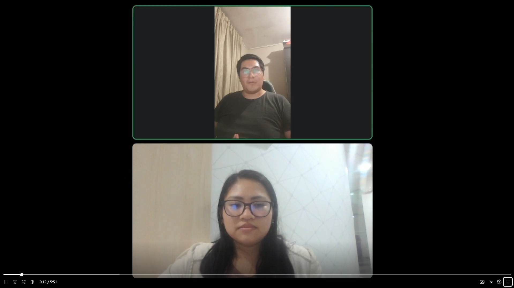

**Contexto de la entrevista**
Esta entrevista explora la perspectiva de la gestión administrativa y operativa en el rubro de comida rápida (con Juan Carrión, administrador) frente a los desafíos del mantenimiento eléctrico, la búsqueda de técnicos calificados y la disposición a adoptar una plataforma digital con modelo de suscripción para soporte preventivo y correctivo.

**Aspectos clave mencionados por la entrevistada:**
- Protocolos ante fallas eléctricas: Actualmente lo gestionan de manera reactiva; al ocurrir un incidente buscan resolverlo lo antes posible para no frenar la operación. Su primer recurso es recurrir a contactos conocidos y, si no están disponibles, buscar en internet.
- Tiempos de respuesta y disponibilidad: Requieren una respuesta prácticamente inmediata ante una emergencia. Destaca que encontrar técnicos en sí no es complejo, pero hallar uno que esté disponible de inmediato, sea confiable, esté certificado y sepa trabajar con la rapidez que demanda una cadena de comida rápida resulta bastante difícil.
  
**Impacto de las fallas en el trabajo y servicio:**
- Atención y continuidad del negocio: Una avería crítica (por ejemplo, en cocinas o refrigeración) puede causar pérdidas directas de ventas, merma de insumos o incluso la paralización parcial o total de la operación del local.
- Seguridad y riesgos: La seguridad es una de sus principales preocupaciones; priorizan la calidad y confiabilidad técnica por encima de un costo bajo si este último implica incurrir en mayores riesgos operativos o de integridad.

**Mantenimientos preventivos y seguridad:**
- Frecuencia y enfoque: Intentan realizar mantenimientos de manera periódica según el tipo de equipo y las políticas corporativas, pero admiten que en las instalaciones eléctricas generales suelen terminar actuando de forma reactiva cuando ya se presenta el problema.
- Criterios de contratación: Valora que el proveedor ofrezca rapidez, disponibilidad, certificación técnica, garantía por el trabajo efectuado y facturación formal.

**Opinión sobre la plataforma propuesta:**
- Disposición de pago: Estaría dispuesto a pagar una suscripción mensual que ofrezca proveedores verificados, monitoreo preventivo y atención prioritaria, siempre que la tarifa sea razonable y garantice el nivel de servicio requerido para emergencias comerciales.
 
**Funcionalidades deseadas:** Para optimizar la gestión del local, le gustaría que la plataforma incorporara:
- Panel centralizado con historial de incidencias para facilitar evaluaciones preventivas.
- Tiempos de atención claramente definidos (SLA de respuesta).
- Seguimiento del técnico en tiempo real ante servicios de emergencia.
- Sistema de calificación y reseñas de proveedores.
- Emisión y gestión directa de facturación formal a través de la misma plataforma.

---

- Entrevista: Brayan Serna
- Edad: 22 años
- Link: <https://upcedupe-my.sharepoint.com/:v:/g/personal/u202114548_upc_edu_pe/IQCtaN_OFEvlQ7zNkrOtlpl_AQnp0_46b9VtNGby__Ef7uc?nav=eyJyZWZlcnJhbEluZm8iOnsicmVmZXJyYWxBcHAiOiJPbmVEcml2ZUZvckJ1c2luZXNzIiwicmVmZXJyYWxBcHBQbGF0Zm9ybSI6IldlYiIsInJlZmVycmFsTW9kZSI6InZpZXciLCJyZWZlcnJhbFZpZXciOiJNeUZpbGVzTGlua0NvcHkifX0&e=9cNZyk>
- Inicia en: 0:25
- Duración: 7:33
- Entrevistador: Ivo Marcelo Machado Bracamonte

**Contexto de la entrevista**
Esta entrevista explora la perspectiva operativa y de gestión de tienda en el rubro de comida rápida con Brayan Serna, gerente de tienda de Little Caesars Arenales frente a los desafíos del mantenimiento correctivo y preventivo de equipos e instalaciones eléctricas, el protocolo de escalamiento interno y la disposición a adoptar una plataforma digital con modelo de suscripción para asegurar continuidad operativa y altos estándares de inocuidad.

**Aspectos clave mencionados por el entrevistado**
- PProtocolos ante fallas eléctricas: Siguen una línea de reporte jerárquica; ante una avería, el gerente de tienda notifica de inmediato al gerente zonal, quien coordina y gestiona la asignación de técnicos tercerizados ya homologados por la empresa. Si la incidencia es de extrema urgencia, se prioriza contactar al técnico o cuadrilla disponible más cercana al local.
- Tiempos de respuesta y disponibilidad: Requieren resolución inmediata debido al impacto directo en la producción continua. Brayan resalta que, ante imprevistos graves (como un corte de energía reciente de 30 minutos), la velocidad de respuesta para suministrar soluciones de contingencia como conectar un grupo electrógeno al tablero general es determinante para no detener la operación.
  
**Impacto de las fallas en el trabajo y servicio:**
- Atención y continuidad del negocio: Una avería crítica en maquinaria clave puede frenar por completo el flujo de venta y elevar los sobrecostos. Relata un incidente con la batidora industrial de masa tras un mal servicio técnico, lo que obligó a suspender la producción diaria de masa, trasladar insumos y una máquina pesada desde otra sucursal (Miraflores), y asumir altos costos logísticos y operativos.
- Seguridad y riesgos: Su máxima preocupación al ingresar personal externo es la inocuidad y seguridad alimentaria. Teme que técnicos dejen residuos o herramientas en áreas de preparación que puedan generar focos infecciosos o riesgos sanitarios antes de la apertura de tienda.

**Mantenimientos preventivos y seguridad:**
- Frecuencia y enfoque: Manejan programas periódicos para componentes críticos (limpieza de hornos, sumideros y cámaras frigoríficas), aunque reconoce que con frecuencia se termina actuando y priorizando intervenciones cuando ya se manifiesta una falla.
- Criterios de contratación: Exige indispensables como facturación formal obligatoria, certificaciones técnicas que garanticen pericia, rapidez de llegada y disponibilidad permanente ante imprevistos en plena operación.

**Opinión sobre la plataforma propuesta:**
- Disposición de pago: Totalmente dispuesto a pagar una suscripción mensual, siempre que garantice una reducción comprobable en tiempos de respuesta, disminuya la frecuencia de averías y asegure técnicos verificados y confiables que respalden la operación en tiempo real. También muestra gran interés en integrarse a una red con estándares comunes de seguridad.
 
**Funcionalidades deseadas:** Para optimizar el control y mantenimiento de la tienda, desearía que la plataforma incorporara:
- Registro e historial detallado por el equipo o dispositivo especificando qué intervenciones y reparaciones se le han realizado.
- Catálogo de técnicos certificados disponibles en la zona con tiempos de atención.
- Sistema automatizado de alertas y recordatorios de vencimiento para mantenimientos regulatorios y preventivos.
- Módulo de gestión y emisión de facturación formal para agilizar la rendición corporativa.

---

- Entrevista: Renzo LLontop
- Edad: 33 años
- Link: <https://upcedupe-my.sharepoint.com/:v:/g/personal/u20231e215_upc_edu_pe/IQC2fFE-AwWBRIpyQ-H9BOR2Ad6CiMUm5RY42tvdyMJz8EQ?nav=eyJyZWZlcnJhbEluZm8iOnsicmVmZXJyYWxBcHAiOiJPbmVEcml2ZUZvckJ1c2luZXNzIiwicmVmZXJyYWxBcHBQbGF0Zm9ybSI6IldlYiIsInJlZmVycmFsTW9kZSI6InZpZXciLCJyZWZlcnJhbFZpZXciOiJNeUZpbGVzTGlua0NvcHkifX0&e=XUjm7t>
- Inicia en: 0:01
- Duración: 7:49
- Entrevistador: Leandro Saul Contreras Lopez

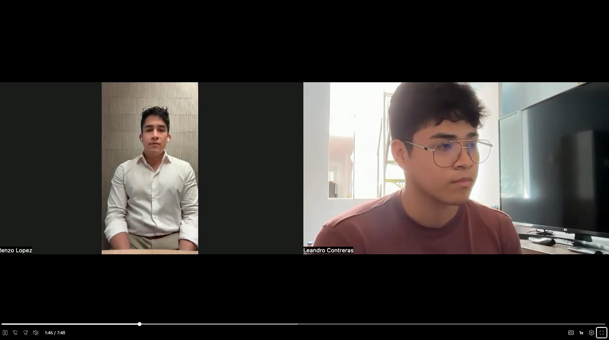

**Contexto de la entrevista**
A diferencia de las entrevistas anteriores enfocadas en el personal operativo, esta charla explora la perspectiva gerencial respecto a la propuesta de usar dispositivos IoT para monitorear el consumo eléctrico y prevenir fallas en un local de alta demanda.

**Aspectos clave mencionados por el entrevistado:**
- Gestión de fallas y mantenimiento preventivo: Por normas de la empresa, realizan una revisión de todas las instalaciones eléctricas cada 3 meses para asegurar que todo esté en buen estado.
Cuentan con un pequeño generador en el edificio (aunque no siempre es suficiente) y tienen contratada a una empresa externa que se encarga de todo el tema eléctrico y de utilería. Si hay una falla, simplemente los llaman, los técnicos resuelven el problema y luego pasan la factura.

- Tiempos de respuesta e impacto operativo: El tiempo de respuesta de los técnicos debe ser muy rápido, ya que sin electricidad la tienda queda inoperativa por completo: no pueden cobrar, las máquinas de café no funcionan, los hornos se apagan y se cae el Wi-Fi. Renzo destaca que cada minuto u hora sin operación se traduce en miles de dólares en pérdida.

- Experiencia con fallas eléctricas: Aunque no han tenido problemas por "instalaciones mal hechas", sí han sufrido pérdidas económicas importantes por cortes de luz imprevistos (la última vez fue entre febrero y marzo de ese año).

**Opinión sobre pagar una suscripción por la plataforma IoT:** Si su local no tuviera ya una empresa contratada, probablemente sí pagaría la suscripción que ofrece proveedores verificados y atención prioritaria.
Sin embargo, como administrador, tendría que evaluar el costo-beneficio. Si en todo el año solo tienen una falla eléctrica, pagar una suscripción mensual no le resultaría rentable. Lo vería más útil si se enfoca puramente en el aspecto preventivo para evitar esa única gran falla.

**Funcionalidades y usabilidad de la app:**

- Renzo hace una observación clave sobre la usabilidad: si la aplicación solo sirve para reportar emergencias, la usaría muy poco y probablemente la terminaría borrando del teléfono. En una urgencia, siente que es mucho más rápido llamar por teléfono que abrir una app.
- Acepta que la plataforma sería útil si le permite ver información adicional de valor (como facturas, estado de las revisiones o reportes técnicos pasados), pero recalca que la acción principal ante una falla debe ser garantizar una respuesta rápida (por ejemplo, con una llamada directa).

---

### 2.2.3. Análisis de entrevistas

**Segmento #1: Trabajadores del Local (Staff Operativo y de Limpieza)**

Para este análisis se revisaron 3 entrevistas: Mark Mori (21 años, comida rápida), Anyelina Rivera (21 años, comida rápida) y Akemy Garcia (19 años, atención en cines). Los tres trabajan en atención al público y operación diaria, por lo que conocen de primera mano lo que pasa cuando falla un equipo eléctrico.

#### a) Resumen comparativo de lo encontrado

| Tema | Mark Mori | Anyelina Rivera | Akemy Garcia | En qué coinciden |
|---|---|---|---|---|
| **Qué hacen ante una falla** | Avisa al gerente, el gerente baja la llave y genera un ticket. Revisan que no se apaguen las cámaras de frío. | Avisa al encargado y no toca el equipo si ve humo, chispas o cables dañados. Siguen trabajando con las otras máquinas. | Avisa al encargado y deja de usar el equipo. Si es grave, llaman al técnico. | **Todos avisan al encargado y prefieren no tocar el equipo por seguridad.** |
| **Cuánto demoran en atenderlos** | De 1 a 3 horas cuando es una falla grave. | Depende de qué tan grave sea y si hay técnico o repuestos disponibles. | Depende del problema, a veces el técnico demora en llegar. | **Solo lo urgente se atiende rápido. Sienten que la ayuda demora.** |
| **Cómo les afecta en su trabajo** | Se paraliza todo: no hay ventas, se apagan pantallas, no salen deliveries. | Se acumulan pedidos, los clientes esperan más y se molestan. | Se retrasan los pedidos y los clientes se incomodan. | **Toda falla eléctrica frena la atención y molesta al cliente.** |
| **Mantenimiento** | Lo hacen cada 2 meses y les dan charlas cada mes. La grasa y el calor dañan los cables. | Sabe que hay mantenimiento, pero no conoce las fechas. Dice que esperar a que se malogre sale más caro. | Casi no hay mantenimiento, solo revisan cuando algo ya se malogró. | **No todos tienen mantenimiento seguido y el trabajador no sabe cuándo toca.** |
| **Seguridad y normas** | Lo ve muy importante porque trabajan con pisos mojados, freidoras y calor. | Lo ve vital: no basta con que la máquina prenda, tiene que ser segura para usarla. | También lo ve importante: una mala reparación puede causar un accidente. | **Los 3 están muy preocupados por su seguridad, aunque no sean técnicos.** |
| **Qué opinan de la plataforma propuesta** | Le parece útil para ver el estado del reporte. Pide seguimiento del ticket, subir fotos, historial y chat con el técnico. | Le parece muy útil y ordenaría el trabajo. Pide reporte rápido con foto/video, saber cuándo llega el técnico, historial y chat. | Le parece muy útil si es rápida y conecta con técnicos de confianza. Pide lo mismo: reporte rápido, seguimiento, chat e historial. | **A los 3 les gusta la idea, siempre que sea fácil de usar. Piden las mismas 4 funciones.** |

#### b) Ideas que se repiten en las 3 entrevistas

1. **No tocan, solo avisan:** los trabajadores detectan señales como ruidos raros, olor a quemado o pequeños toques eléctricos, pero su única opción es avisar al encargado y alejarse. A veces demoran en avisar por miedo a parar la venta y que les llamen la atención.
2. **Los avisos se pierden:** hoy avisan de palabra o por WhatsApp (“la máquina suena raro”), sin foto ni registro. Por eso la misma máquina se malogra varias veces y nadie lleva la cuenta.
3. **La seguridad está primero:** aunque estén en hora pico y con presión por sacar pedidos, los 3 dicen que prefieren apagar el equipo antes que arriesgarse a una descarga. Esto confirma que lo que más valoran es trabajar sin miedo a accidentarse.
4. **Limpiar es el momento de más miedo:** cuando trapean o echan agua cerca de enchufes y cables sienten mucho temor a electrocutarse. No tienen ninguna señal que les confirme que es seguro limpiar.
5. **Quieren algo simple y rápido:** no piden gráficos ni datos complicados. Piden lo mismo en los 3 casos: reportar con 1 clic y foto, saber si ya viene el técnico y a qué hora llega, ver el historial de fallas y poder chatear con el técnico.

#### c) En qué se diferencian

- **No todos tienen el mismo orden:** Mark ya trabaja con tickets y tiempos de 1 a 3 horas, mientras Akemy trabaja en un local donde solo actúan cuando algo se malogra. La solución debe servir para ambos casos.
- **Distinto rubro, mismo problema:** Akemy trabaja en cines y no en comida rápida, pero cuenta lo mismo. Esto muestra que el problema existe en otros locales, aunque por ahora el proyecto se enfoca en cocinas de comida rápida.
- **Distinto nivel de detalle:** Mark y Anyelina ya piensan en usar el historial para decidir si conviene cambiar una máquina que falla mucho, mientras Akemy solo pide que el técnico llegue rápido y sea de confianza.

**Conclusión del segmento:** el trabajador operativo no necesita ver gráficos ni datos técnicos. Necesita tres cosas bien simples; que le digan si es seguro tocar o limpiar, que pueda avisar rápido con su celular o pantalla sin dejar de atender, y que le confirmen que su aviso fue recibido y que ya viene ayuda. Si ElectroLink logra eso, lo van a ver como una protección y no como un control más. 

---

**Segmento 2: Manager del Local, Administrador y Jefe de Tienda**

Para este análisis se revisaron tres entrevistas: Juan Carrion, de 30 años, administrador de comida rápida; Brayan Serna, de 22 años, gerente de tienda Little Caesars Arenales; y Renzo LLontop, de 33 años, perfil gerencial. Los tres son responsables de continuidad operativa, costos, seguridad e inocuidad en locales de alta demanda.

#### A. Resumen comparativo de lo encontrado

| Tema | Juan Carrion | Brayan Serna | Renzo LLontop | En qué coinciden |
|---|---|---|---|---|
| **Cómo gestionan fallas** | Reactivo. Recurre a contactos conocidos y, si no obtiene respuesta, busca en internet. | Jerárquico. Reporta a gerente zonal, quien asigna técnicos tercerizados homologados. Si la urgencia es extrema, busca la cuadrilla más cercana. | Tercerizado fijo. Revisión cada tres meses por norma y empresa externa contratada. Ante una falla, los llama, ellos resuelven y luego facturan. | **Ninguno resuelve con personal propio. Todos dependen de terceros y actúan de forma reactiva cuando falla el sistema eléctrico general.** |
| **Tiempos de respuesta** | Exige inmediatez. Encontrar un técnico es sencillo, pero encontrar uno disponible en el momento, certificado y rápido para el ritmo de comida rápida resulta complejo. | Exige resolución inmediata. En un corte de 30 minutos, fue determinante conectar el grupo electrógeno al tablero general para no detener la operación. | Exige rapidez total. Sin electricidad la tienda queda inoperativa: no es posible cobrar, no funcionan las máquinas de café ni los hornos y se pierde la conexión wifi. Cada minuto detenido representa miles de dólares en pérdida. | **La velocidad es innegociable. Treinta minutos detenidos generan pérdida directa de ventas.** |
| **Cómo les afecta** | Una avería crítica en cocina o refrigeración genera pérdida de ventas, merma de insumos y paralización parcial o total. | Una avería en la batidora industrial por un mal servicio obligó a suspender la producción de masa, trasladar insumos y una máquina pesada desde Miraflores, con un alto costo logístico. | No sufrió por mala instalación interna, pero sí por cortes externos ocurridos entre febrero y marzo. El último corte generó una pérdida económica importante. | **Toda falla crítica frena la venta y genera sobrecosto logístico y operativo.** |
| **Mantenimiento** | Intenta un esquema periódico según tipo de equipo y política corporativa, pero en el sistema eléctrico general termina actuando de forma reactiva. | Maneja un programa periódico en equipos críticos como hornos, sumideros y cámaras, pero reconoce que se prioriza la intervención cuando ya existe una falla. | Cumple revisión cada tres meses por norma y cuenta con un generador pequeño que resulta insuficiente. El preventivo está contratado y no lo gestiona directamente. | **El preventivo existe en documentos y políticas, pero el sistema eléctrico se atiende cuando ya falló.** |
| **Seguridad y criterios de contratación** | Prioriza calidad y confiabilidad sobre costo bajo. Valora rapidez, disponibilidad, certificación, garantía y facturación formal. | Su máxima preocupación es la inocuidad. Teme que personal externo deje residuos o herramientas en zona de preparación. Exige facturación formal, certificación, rapidez y disponibilidad permanente. | Prioriza continuidad y costo beneficio. No le preocupa tanto quién atiende, sino que responda de inmediato y que la tienda no se detenga. | **No contratan por precio. Contratan por certificación, garantía, factura formal y disponibilidad.** |
| **Disposición a pagar suscripción** | Sí, si la tarifa es razonable y garantiza acuerdo de nivel de servicio para emergencias. | Totalmente dispuesto, si reduce tiempos, disminuye la frecuencia de averías y asegura técnicos verificados. Desea una red con estándares comunes. | Postura condicional y escéptica. Si no contara con empresa contratada, sí pagaría. Con su empresa actual, si solo ocurre una falla al año, la mensualidad no resulta rentable. Solo lo considera útil con enfoque puramente preventivo. | **Dos de tres pagarían de inmediato. El tercero solo pagaría si se demuestra retorno preventivo y no solo correctivo.** |
| **Funcionalidades deseadas** | Panel centralizado con historial, acuerdos de servicio definidos, seguimiento en tiempo real, calificación de proveedores y facturación en plataforma. | Historial por equipo o dispositivo, catálogo de certificados por zona con tiempos de atención, alertas y recordatorios de vencimiento, además de facturación formal. | No desea otra aplicación solo para emergencias, pues dejaría de usarla. En una urgencia prefiere llamar antes que abrir una aplicación. Sí valora ver facturas, estado de revisiones y reportes pasados, con botón de llamada directa. | **Todos solicitan la misma base: historial, tiempos de atención definidos, seguimiento y factura. Renzo agrega el filtro de usabilidad.** |

#### B. Ideas que se repiten en las tres entrevistas

1. **Operan a ciegas hasta que ocurre la falla:** abren con lista de verificación en papel y desconocen qué circuito o equipo consume en exceso o presenta fuga. Se enteran cuando se dispara la llave termomagnética en plena hora pico.
2. **Lo reactivo resulta muy costoso:** merma, traslado entre locales, tarifa de emergencia, uso de generador y ventas perdidas. El preventivo programado no evita la falla intempestiva.
3. **El problema no es la falta de técnicos, sino la falta del técnico correcto en el momento necesario:** el dolor no es el precio, es la disponibilidad inmediata, la certificación, el conocimiento del ritmo de comida rápida, el cuidado de la inocuidad y la emisión de factura formal para rendir cuentas a nivel corporativo.
4. **La suscripción solo se justifica si previene:** están dispuestos a pagar una mensualidad, pero no por un directorio. Pagan si garantiza atención prioritaria con acuerdos de servicio medibles, menos averías y evidencia para justificar el gasto ante la gerencia regional.
5. **Desean gestión y no solo alertas:** panel central para varios locales, historial por máquina para decidir entre reemplazo y reparación, recordatorios de mantenimiento regulatorio y preventivo, y facturación dentro de la misma plataforma.
6. **Existe riesgo de abandono:** si ElectroLink se presenta solo como botón de emergencia, no la usarán a diario. Debe aportar valor de consulta frecuente, como consumo en soles por máquina, estado de revisiones y reportes descargables, y resolver la emergencia en un solo toque mediante llamada directa y no solo con un ticket en la aplicación.

#### C. En qué se diferencian

- **Modelo de abastecimiento distinto:** Juan usa red informal y buscadores, Brayan usa red corporativa homologada mediante el nivel zonal, Renzo mantiene contrato fijo con empresa externa. La solución debe servir para los tres casos: no imponer un único proveedor, sino integrar y homologar los existentes y medir su nivel de servicio.
- **Naturaleza del incidente:** Brayan sufrió mala praxis técnica interna en la batidora, Renzo sufrió corte externo de red entre febrero y marzo, Juan teme falla en cocina o refrigeración. Esto obliga a separar en el producto la anomalía interna detectable con sensores IoT de la interrupción externa no prevenible pero mitigable con grupo electrógeno y protocolo definido.
- **Postura frente al pago:** Juan y Brayan son promotores tempranos de la suscripción. Renzo representa el freno económico: exige cálculo de costo beneficio anual y enfoque preventivo puro. Este caso permite justificar el módulo de eficiencia energética con ahorro de 12 por ciento en factura como fuente de pago de la suscripción.
- **Énfasis funcional:** Juan solicita control mediante acuerdos de servicio y calificación, Brayan solicita estandarización e inocuidad mediante protocolos y alertas de vencimiento, Renzo solicita simplicidad extrema para ver facturas y reportes y llamar de inmediato.

**Conclusión del segmento:** el Manager no necesita otro buscador de electricistas. Necesita tres condiciones para firmar: primero, visibilidad preventiva por equipo para no enterarse por el disparo de la llave en viernes por la noche; segundo, respuesta de emergencia garantizada con acuerdo de servicio, seguimiento y facturación formal sin fricción corporativa; y tercero, evidencia descargable para SST, SUNAFIL e INDECI y para justificar sobrecostos ante el nivel regional. Si ElectroLink solo promete monitoreo sin acuerdo operativo, Renzo no renovará. Si combina sensores IoT, acuerdo de servicio y ahorro energético comprobable, Juan y Brayan sí pagarán e impulsarán la red de locales.

---

## 2.3. Needfinding

Continuando con esta sección, se presentan los hallazgos de las entrevistas y la investigación de campo, organizados en herramientas de análisis de necesidades, incluyendo la creación de user personas, matrices de tareas, mapas de empatía y escenarios actuales (as-is).

### 2.3.1. User Personas

Segmento 1:

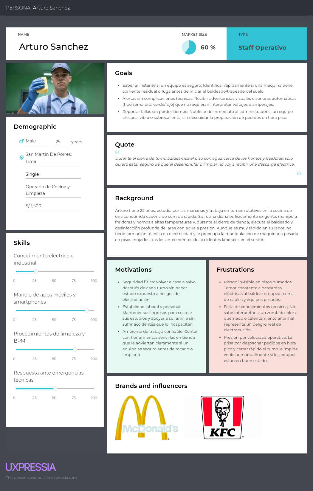

Segmento 2:

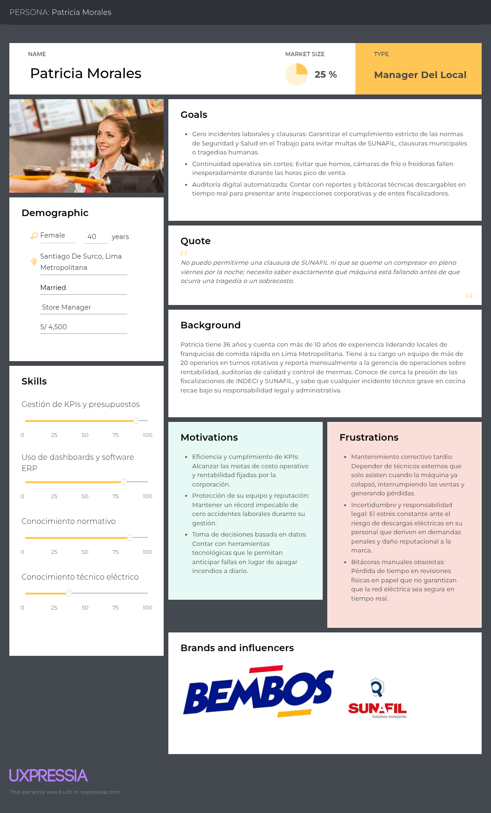

### 2.3.2. User Task Matrix

En esta sección se detallan las tareas que realizan los diferentes segmentos de usuarios representados por los User Personas de ElectroLink, con el objetivo de cumplir sus metas relacionadas con la prevención de accidentes laborales, el monitoreo y control técnico, y la optimización del consumo eléctrico en cadenas de comida rápida.

**Segmento: Trabajadores del Local (Staff Operativo y de Limpieza)**

| Persona | Actividad | Frecuencia | Importancia |
| :--- | :--- | :--- | :--- |
| Arturo Sanchez - Operario de Cocina y Limpieza | Verificar el indicador visual de seguridad antes de baldear o limpiar la cocina | Frecuentemente | Alta |
| Arturo Sanchez - Operario de Cocina y Limpieza | Recibir alertas inmediatas ante fugas de corriente o sobrecalentamiento en máquinas | Frecuentemente | Alta |
| Arturo Sanchez - Operario de Cocina y Limpieza | Reportar anomalías físicas o ruidos extraños en los equipos de cocina | Frecuentemente | Alta |
| Arturo Sanchez - Operario de Cocina y Limpieza | Detener el uso o desconexión de una máquina riesgosa ante una alerta crítica | Ocasionalmente | Alta |
| Arturo Sanchez - Operario de Cocina y Limpieza | Confirmar el restablecimiento seguro de un equipo tras la intervención de mantenimiento | Ocasionalmente | Media |
| Arturo Sanchez - Operario de Cocina y Limpieza | Revisar instructivos rápidos de seguridad y apagado seguro en pantalla de cocina | Ocasionalmente | Media |

---

**Segmento: Managers del Local (Administradores / Jefes de Tienda)**

| Persona | Actividad | Frecuencia | Importancia |
| :--- | :--- | :--- | :--- |
| Patricia Morales - Store Manager | Monitorear en tiempo real la salud de la red y el estado de los equipos críticos | Frecuentemente | Alta |
| Patricia Morales - Store Manager | Recibir y gestionar notificaciones de fugas eléctricas y riesgos de electrocución | Frecuentemente | Alta |
| Patricia Morales - Store Manager | Coordinar servicios de mantenimiento preventivo y correctivo con técnicos | Frecuentemente | Alta |
| Patricia Morales - Store Manager | Analizar reportes de consumo energético detallados por máquina | Ocasionalmente | Alta |
| Patricia Morales - Store Manager | Descargar bitácoras y reportes de seguridad para inspecciones (SUNAFIL / INDECI) | Ocasionalmente | Alta |
| Patricia Morales - Store Manager | Evaluar indicadores de ahorro energético y sobrecostos en la facturación mensual | Ocasionalmente | Alta |
| Patricia Morales - Store Manager | Supervisar el historial de alertas e incidencias técnicas de la tienda | Ocasionalmente | Media |

### 2.3.3. Empathy Mapping

Segmento 1:

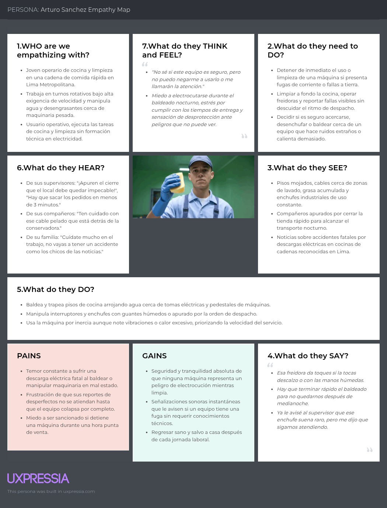

Segmento 2:

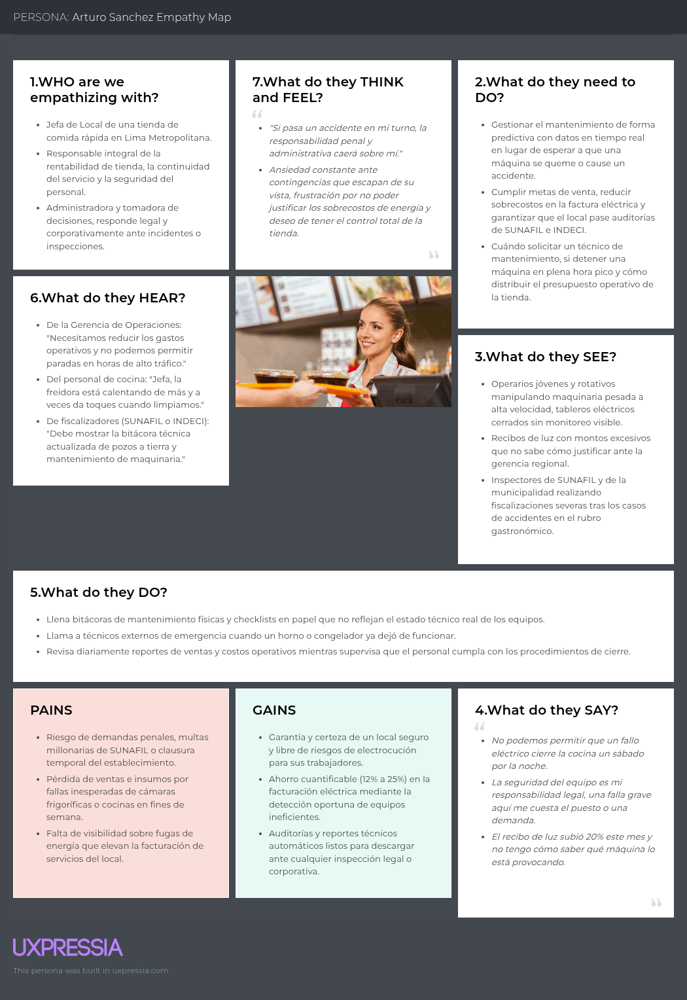

### 2.3.4. As-is Scenario Mapping

En esta sección se modela la situación operativa y de gestión actual ("As-Is") en las tiendas de comida rápida de Lima Metropolitana, evidenciando las fricciones, riesgos y vacíos tecnológicos que existen antes de la adopción de ElectroLink.

### As-Is Scenario Mapping - Segmento 1: Trabajadores del Local (Staff Operativo y de Limpieza)

| Fases | Fase 1: Inicio de Turno e Inspección Empírica | Fase 2: Operación Diaria Bajo Presión | Fase 3: Aparición de Falla No Notificada | Fase 4: Limpieza y Baldeado de Alto Riesgo | Fase 5: Cierre de Turno y Reporte Verbal |
| :--- | :--- | :--- | :--- | :--- | :--- |
| **Doing** | Enciende freidoras, tostadoras y hornos directamente por inercia, confiando únicamente en que la máquina encienda sin emitir chispas a simple vista. | Prepara alimentos a alta velocidad en hora pico; manipula perillas, carcasas y switches sin saber si existe una fuga de corriente parásita en la carcasa. | Siente un leve hormigueo ("toque") al rozar la freidora o percibe un olor sutil a cable caliente; no sabe si es normal y duda si avisar para no detener la línea de despacho. | Arroja baldes con agua y desengrasante sobre el piso de la cocina para trapear rápido, pasando trapeadores húmedos cerca de cables de conexión y enchufes industriales a nivel del suelo. | Apaga las máquinas manualmente de prisa para no perder el último transporte nocturno; le avisa de pasada o por WhatsApp al supervisor sobre "el zumbido extraño" del equipo. |
| **Thinking** | *"Ojalá todo prenda bien hoy; no tengo forma de saber si los cables de atrás están pelados o haciendo masa."* | *"Tengo que sacar los combos en menos de 3 minutos, no me da el tiempo para fijarme en detalles técnicos."* | *"Sentí una descarga pequeña al tocar el borde metálico, pero si paro la freidora la jefa me llamará la atención por retrasar los pedidos."* | *"Tengo que baldear con mucho cuidado; el piso está inundado de agua cerca de las conexiones y temo electrocutarme como ocurrió en otros locales."* | *"Ya le dije al encargado que esa máquina da toques; espero que no se le olvide y que mañana nadie se accidente."* |
| **Feeling** | Incertidumbre y resignación. | Estrés constante y distracción por temor al entorno de trabajo. | Miedo, duda e indefensión ante un peligro invisible. | Pánico latente, vulnerabilidad y extrema tensión física. | Agotamiento, frustración e intranquilidad por la seguridad del equipo. |

---

### As-Is Scenario Mapping - Segmento 2: Manager del Local (Administrador / Jefe de Tienda)

| Fases | Fase 1: Apertura y Revisión Manual | Fase 2: Operación Ciegas del Consumo | Fase 3: Ocurrencia de Avería Intempestiva | Fase 4: Mantenimiento Correctivo de Emergencia | Fase 5: Cierre Mensual y Enfrentamiento de Costos |
| :--- | :--- | :--- | :--- | :--- | :--- |
| **Doing** | Firma checklists físicos de apertura en hojas de papel; verifica visualmente que las luces del tablero no estén bajadas, sin conocer los niveles reales de voltaje ni fugas. | Supervisa la operación de venta ignorando por completo qué equipo específico está provocando picos de demanda o fugas a tierra durante la jornada. | Recibe el reporte urgente del colapso de una conservadora en pleno viernes por la noche; el interruptor termomagnético general salta y deja a oscuras parte de la cocina. | Llama de urgencia a servicios técnicos externos no verificados; suspende temporalmente la venta de ítems del menú y reubica insumos perecibles para evitar mermas masivas. | Recibe la factura eléctrica con un sobrecosto del 20% que no puede justificar ante la gerencia regional; llena manualmente bitácoras desactualizadas ante una inspección de SUNAFIL. |
| **Thinking** | *"Lleno estos formatos de seguridad en papel por protocolo, pero no garantizan que la red interna esté a salvo de un cortocircuito."* | *"No sé qué máquina consume más luz; solo me entero de los gastos cuando llega el recibo a fin de mes."* | *"Justo colapsa en la hora de mayor venta; perderemos miles de soles en pedidos y los insumos de la congeladora corren riesgo."* | *"El técnico cobrará tarifa de emergencia y demorará horas en llegar; la cocina está paralizada y el personal expuesto a riesgos."* | *"El recibo vino altísimo otra vez y no sé qué falló; si me cae una auditoría de SUNAFIL o INDECI no tengo reportes técnicos para sustentar el estado del local."* |
| **Feeling** | Falsa sensación de control y desconfianza en los registros manuales. | Ceguera operativa e impotencia presupuestal. | Desesperación, estrés extremo y alarma ante la paralización de ventas. | Agobio, reactividad y preocupación por la continuidad de la franquicia. | Frustración financiera, incertidumbre legal y alta presión corporativa. |

## 2.4. Ubiquitous Language

### 1. Términos del Dominio de Seguridad y Parámetros Eléctricos

*   **Fuga a tierra (Ground Fault Leakage):** Derivación anómala de corriente eléctrica hacia partes metálicas o carcasa exterior de una máquina debido a fallas en el aislamiento o humedad. Es el principal precursor de descargas eléctricas y accidentes laborales en cocina.
*   **Corriente Residual (Residual Current):** Diferencia medible entre la corriente que entra y la que sale de un circuito cerrado; indica la presencia activa de una fuga hacia tierra o masa.
*   **Sobrecorriente / Sobrecarga (Overcurrent / Overload):** Condición operativa en la que la demanda de corriente supera la capacidad nominal de diseño de un circuito o motor por un tiempo prolongado, generando sobrecalentamiento.
*   **Caída de Tensión (Voltage Sag):** Disminución transitoria del voltaje nominal en la red interna de la tienda producida por el arranque simultáneo de cargas inductivas pesadas (motores, compresores).
*   **Pozo a Tierra (Grounding System):** Mecanismo de seguridad obligatorio en instalaciones eléctricas que disipa hacia el suelo las corrientes de falla y sobretensiones, protegiendo tanto a los operarios como a los equipos.
*   **Temperatura de Circuito/Equipo (Operating Temperature):** Nivel térmico medido en bornes, cables y carcasas de maquinaria para prevenir conatos de incendio y desgaste de material dieléctrico.

### 2. Términos de Hardware e Infraestructura IoT

*   **Kit de Sensores (Sensor Kit):** Conjunto modular de hardware industrial compuesto por transformadores de corriente de núcleo abierto (sensores de efecto Hall/corriente), sondas térmicas y módulos de medición de voltaje instalados sin cortar el suministro de la red.
*   **Gateway IoT (IoT Edge Gateway):** Dispositivo central de comunicaciones local instalado en el tablero general que recolecta, preprocesa y encripta las lecturas de telemetría de los sensores de cocina para enviarlas a la nube mediante Wi-Fi o red celular (4G/LTE).
*   **Tablero de Distribución / General (Distribution Board):** Panel eléctrico que aloja los interruptores termomagnéticos, diferenciales y barras de conexión que alimentan los subcircuitos de la tienda.
*   **Telemetría Eléctrica (Electrical Telemetry):** Flujo de datos periódicos de alta resolución (amperaje, voltaje, factor de potencia, temperatura) transmitido en tiempo real desde el hardware IoT hacia la plataforma cloud.

### 3. Términos de Software, Alertas y Operación en Tienda

*   **Umbral de Disparo (Alert Threshold):** Límite paramétrico preestablecido (ej. corriente de fuga > 30 mA, temperatura de cable > 65 °C) que, al superarse, activa automáticamente eventos de contingencia en el sistema.
*   **Alerta Crítica (Critical Alert / Hazard):** Notificación de máxima prioridad desencadenada por una falla que compromete la vida humana o la integridad estructural de la tienda (ej. fuga eléctrica viva en entorno húmedo). Requiere apagado o bloqueo inmediato.
*   **Alerta Preventiva (Warning / Anomaly):** Notificación temprana emitida cuando una máquina opera fuera de su curva normal de consumo o temperatura, anticipando una falla antes de su interrupción total.
*   **Semáforo de Seguridad (Visual Safety Indicator):** Interfaz simplificada para el personal de piso que traduce métricas técnicas en estados cromáticos comprensibles:
    *   *Verde (Seguro):* Parámetros óptimos; seguro para operar y baldear.
    *   *Amarillo (Precaución):* Fluctuación o anomalía leve registrada; requiere supervisión.
    *   *Rojo (Peligro Inminente):* Fuga activa o sobrecalentamiento crítico; prohibido tocar o limpiar el equipo.
*   **Protocolo de Apagado Seguro (Safe Shutdown Protocol):** Secuencia asistida de instrucciones que guía al personal operativo para aislar la maquinaria comprometida de la fuente de energía antes de intervenirla físicamente.
*   **Bitácora Técnica Digital (Digital Incident Log):** Registro inmutable y cronológico de todas las lecturas de telemetría, anomalías disparadas, alertas notificadas y acciones de mitigación adoptadas por el personal de tienda.

### 4. Términos de Gestión Operativa, Auditoría y Negocio

*   **Monitoreo por Circuito (Circuit-Level Monitoring):** Capacidad analítica de aislar y auditar el comportamiento eléctrico y consumo energético de una sola línea dedicada o máquina específica (ej. freidora de papas, cámara de congelación).
*   **Continuidad Operativa (Uptime / Operational Continuity):** Métrica que evalúa el tiempo que la línea de preparación y despacho de alimentos se mantiene en servicio ininterrumpido durante los horarios de atención al cliente.
*   **Eficiencia de Red (Power Quality Efficiency):** Razón entre la energía activa efectivamente utilizada y la energía reactiva/pérdida facturada por distorsiones armónicas o sobrecargas en equipos envejecidos.
*   **Reporte de Cumplimiento SST (OSH Compliance Report):** Documento descargable generado por la plataforma que consolida evidencias técnicas sobre la estabilidad eléctrica de la tienda, utilizado en auditorías ante la SUNAFIL, OSINERGMIN e INDECI.
*   **Store Manager (Administrador de Tienda):** Usuario directivo responsable de la gestión de costos, cumplimiento normativo, respuesta ante fiscalizaciones y coordinación de órdenes de mantenimiento en el local.
*   **Operario de Cocina / Limpieza (Kitchen Crew):** Usuario operativo expuesto directamente a la interacción física con la maquinaria pesada de cocina y a tareas de limpieza profunda (baldeado de pisos).

# Capítulo III: Requirements Specification

## 3.1. To-Be Scenario Mapping

### To-Be Scenario Mapping - Segmento 1: Trabajadores del Local (Staff Operativo y de Limpieza)

| Fases | Fase 1: Inicio de Turno y Verificación | Fase 2: Operación Diaria de Equipos | Fase 3: Detección y Notificación de Anomalía | Fase 4: Protocolo de Limpieza Segura | Fase 5: Cierre de Turno y Reporte |
| :--- | :--- | :--- |
| **Doing** | Revisa el panel táctil/señalizador local en cocina antes de encender freidoras y hornos. | Trabaja en la preparación de alimentos observando los indicadores visuales en verde. | Escucha una alerta auditiva local y ve que la pantalla cambia a indicador Rojo "Fuga Detectada". | Consulta el estado del equipo en la pantalla local antes de trapear o baldear la zona de cocina. | Presiona el botón de reporte rápido de fin de turno para confirmar equipos seguros. |
| **Thinking** | "Es genial poder ver con una luz verde si los equipos están seguros antes de empezar a trabajar." | "Puedo concentrarme en sacar los pedidos rápido sin miedo a tocar una máquina en mal estado." | "El sistema me avisa de inmediato que hay peligro; debo alejarme y reportar según el protocolo." | "No debo preocuparme por un shock eléctrico al trapear la cocina porque la pantalla me confirma la seguridad." | "Terminé mi turno tranquilo sabiendo que dejé todo reportado sin trámites complicados." |
| **Feeling** | Confianza y tranquilidad. | Seguridad y concentración. | Alerta pero respaldado por la señalización clara. | Alivio y protección. | Satisfacción y seguridad laboral. |

### To-Be Scenario Mapping - Segmento 2: Manager del Local (Administrador / Jefe de Tienda)

| Fases | Fase 1: Supervisión Inicial del Dashboard | Fase 2: Monitoreo Continuo de Consumo | Fase 3: Gestión Inmediata de Alerta Crítica | Fase 4: Coordinación de Mantenimiento | Fase 5: Auditoría y Cierre Mensual |
| :--- | :--- | :--- | :--- | :--- | :--- |
| **Doing** | Abre el Dashboard Web de ElectroLink al inicio de la jornada para verificar el estado de la red. | Revisa la gráfica de consumo en kWh y Soles por máquina para identificar ineficiencias. | Recibe una alerta push/SMS sobre sobrecalentamiento en un congelador clave. | Revisa la recomendación del sistema y agenda revisión técnica en horario fuera de pico. | Exporta el reporte consolidado en PDF para la inspección interna y cumplimiento de SST. |
| **Thinking** | "Tengo visibilidad completa de toda la tienda desde mi laptop sin tener que revisar tablero por tablero." | "Veo claramente qué freidora está consumiendo más energía de lo normal este mes." | "La alerta me llegó a tiempo; puedo actuar antes de que la máquina se queme o cause un accidente." | "Puedo programar la reparación técnica sin interrumpir el flujo de ventas de la hora pico." | "Tengo toda la documentación lista y sustentada para presentar ante fiscalizaciones oficiales." |
| **Feeling** | Control y certidumbre. | Claridad y capacidad de optimización. | Urgencia gestionada con efectividad. | Proactividad y alivio. | Respaldo, cumplimiento y profesionalismo. |

---

## 3.2. User Stories

### Epics

| Epic ID | Título | Descripción |
| --- | --- | --- |
| **EP01** | **Presentación y Acceso mediante Landing Page** | Módulo orientado a presentar la propuesta de valor de ElectroLink a visitantes y dirigir hacia la aplicación web. |
| **EP02** | **Gestión de Seguridad Operativa en Tienda** | Módulo orientado a proteger la integridad física del staff operativo mediante monitoreo y señalización local. |
| **EP03** | **Monitoreo Técnico y Alertas para la Administración** | Módulo central para la gestión preventiva, supervisión de red y notificaciones ejecutivas. |
| **EP04** | **Gestión Energética y Costos Operativos** | Módulo para la visualización, desglose y optimización del consumo eléctrico en el local. |
| **EP05** | **Cumplimiento Normativo y Reportes de Seguridad** | Módulo para la generación de evidencias técnicas exigidas por entes reguladores. |
| **EP06** | **Configuración de Perfiles y Control de Acceso** | Módulo administrativo para la personalización de usuarios y acceso a datos del local. |

---

#### User Stories

| ID | Título | Descripción | Criterios de Aceptación | Relacionado con |
| --- | --- | --- | --- | --- |
| **US01** | Conocimiento de propuesta de valor y acceso a aplicación web | Como Visitante, desea conocer la propuesta de valor de ElectroLink en la sección principal de la landing page, para acceder a la aplicación web y explorar el monitoreo eléctrico. | Scenario 1: Consulta exitosa de propuesta de valor **Given** el visitante accede a la sección principal de la landing page **When** consulta el contenido de propuesta de valor **Then** visualiza la descripción del monitoreo eléctrico y el vínculo hacia la aplicación web  Scenario 2: Acceso exitoso a aplicación web **Given** el visitante selecciona el vínculo hacia la aplicación web **When** el servicio de la aplicación responde **Then** accede a la aplicación web y visualiza el inicio de sesión  Scenario 3: Vínculo hacia aplicación sin respuesta **Given** el vínculo hacia la aplicación web no responde **When** el visitante selecciona el acceso **Then** visualiza un mensaje de servicio no disponible y recibe la opción de reintentar | EP01 |
| **US02** | Comprensión de problemática operativa del sector | Como Visitante, desea comprender la problemática de seguridad eléctrica en cadenas de comida rápida, para valorar la necesidad de monitoreo continuo. | Scenario 1: Consulta exitosa de problemática **Given** el visitante accede a la sección de problemática **When** consulta el contenido **Then** visualiza datos de riesgo eléctrico y consecuencias operativas  Scenario 2: Contenido sin carga por falla de red **Given** el contenido de problemática no carga por falla de red **When** el visitante intenta consultar la sección **Then** visualiza un mensaje de contenido no disponible y recibe la opción de reintentar  Scenario 3: Consulta con conexión inestable **Given** el visitante accede con conexión inestable **When** consulta la sección **Then** visualiza el contenido esencial y recibe el aviso de conexión limitada | EP01 |
| **US03** | Consulta de beneficios de seguridad para personal operativo | Como Visitante del segmento Trabajador del Local, desea conocer los beneficios de seguridad operativa de ElectroLink, para valorar la protección durante la jornada en cocina. | Scenario 1: Consulta exitosa de beneficios operativos **Given** el visitante del segmento Trabajador accede a la sección de beneficios operativos **When** consulta el contenido **Then** visualiza la explicación de alerta temprana y protocolo de actuación segura  Scenario 2: Equipo con sensor sin señal **Given** el sensor de un equipo no emite señal **When** el visitante consulta el ejemplo de monitoreo **Then** visualiza el aviso de equipo sin supervisión y la recomendación de reporte al Manager  Scenario 3: Pérdida de conexión durante la consulta **Given** la landing page pierde conexión a internet durante la consulta **When** el visitante intenta ver los beneficios **Then** visualiza el mensaje de reconexión y conserva el acceso al contenido ya cargado | EP01 |
| **US04** | Consulta de beneficios de gestión para administración del local | Como Visitante del segmento Manager del Local, desea conocer los beneficios de gestión energética y control de costos, para valorar la suscripción al servicio. | Scenario 1: Consulta exitosa de beneficios de gestión **Given** el visitante del segmento Manager accede a la sección de beneficios de gestión **When** consulta el contenido **Then** visualiza la explicación de ahorro energético y continuidad operativa  Scenario 2: Equipo con umbral sin configurar **Given** el umbral de un equipo no se encuentra configurado **When** el visitante consulta el ejemplo de alerta **Then** visualiza el aviso de configuración pendiente y la explicación del valor por defecto  Scenario 3: Acceso exitoso desde beneficios de gestión **Given** el visitante selecciona el vínculo hacia la aplicación web desde esta sección **When** el servicio responde **Then** accede a la aplicación web y visualiza el inicio de sesión | EP01 |
| **US05** | Comprensión del funcionamiento del ecosistema conectado | Como Visitante, desea comprender el funcionamiento del ecosistema de sensores y analítica, para entender el flujo desde la detección hasta la alerta. | Scenario 1: Consulta exitosa de funcionamiento **Given** el visitante accede a la sección de funcionamiento **When** consulta el contenido **Then** visualiza la explicación del ciclo de medición y generación de alertas  Scenario 2: Sensor con pérdida de conexión **Given** un sensor pierde conexión con la plataforma **When** el visitante consulta el ejemplo de estado **Then** visualiza el aviso de sensor desconectado y la explicación de almacenamiento temporal  Scenario 3: Contenido multimedia sin carga **Given** el contenido multimedia no carga **When** el visitante consulta la sección **Then** visualiza la descripción textual alternativa y conserva el acceso al vínculo hacia la aplicación web | EP01 |
| **US06** | Consulta de planes y evidencia para cumplimiento normativo | Como Visitante del segmento Manager del Local, desea conocer los planes de suscripción y la evidencia para fiscalización, para evaluar la contratación del servicio. | Scenario 1: Consulta exitosa de planes **Given** el visitante del segmento Manager accede a la sección de planes **When** consulta el contenido **Then** visualiza la descripción de planes por local y la evidencia para fiscalización  Scenario 2: Información de precios sin disponibilidad **Given** la información de precios no se encuentra disponible por falla del servicio **When** el visitante consulta la sección **Then** visualiza el mensaje de información temporalmente no disponible y la opción de contacto  Scenario 3: Vínculo hacia aplicación sin respuesta desde planes **Given** el visitante selecciona el vínculo hacia la aplicación web desde la sección de planes **When** el servicio no responde **Then** visualiza el mensaje de reintento y conserva el acceso al contenido de planes | EP01 |
| **US07** | Solicitud de demostración y contacto comercial | Como Visitante, desea solicitar una demostración del servicio mediante los datos de contacto, para recibir atención comercial y acceso guiado a la aplicación web. | Scenario 1: Solicitud exitosa de demostración **Given** el visitante accede a la sección de contacto **When** registra datos válidos de contacto y solicita la demostración **Then** recibe la confirmación de solicitud y el vínculo hacia la aplicación web  Scenario 2: Registro con datos inválidos **Given** el visitante registra datos inválidos de contacto **When** solicita la demostración **Then** visualiza el mensaje de datos inválidos y recibe la indicación de corrección  Scenario 3: Servicio de registro sin respuesta **Given** el servicio de registro no responde **When** el visitante solicita la demostración **Then** visualiza el mensaje de intento no procesado y conserva los datos ingresados para reintentar | EP01 |
| **US08** | Consulta de nivel de riesgo operativo por equipo | Como Trabajador del Local, desea conocer el nivel de riesgo operativo de cada equipo, para decidir su manipulación con seguridad durante la jornada. | Scenario 1: Detección exitosa de condición riesgosa **Given** el sensor registra una fuga de corriente en un equipo **When** el sistema evalúa la medición recibida **Then** comunica el nivel de peligro del equipo y la indicación de no manipulación  Scenario 2: Sensor sin señal **Given** el sensor de un equipo no emite señal **When** el sistema evalúa el estado de supervisión **Then** comunica el estado sin supervisión y la recomendación de reporte al Manager  Scenario 3: Panel local sin conexión a internet **Given** el panel local pierde conexión a internet **When** el trabajador consulta el estado de un equipo **Then** conserva la señal local de riesgo y registra el evento para sincronización posterior | EP02 |
| **US09** | Reporte operativo de anomalía en equipo | Como Trabajador del Local, desea reportar una anomalía percibida en un equipo, para alertar al Manager sin interrumpir la atención. | Scenario 1: Reporte exitoso de anomalía **Given** el trabajador percibe un ruido inusual en un equipo **When** registra el reporte operativo con la identificación del equipo **Then** el Manager recibe la alerta con equipo, hora y responsable de turno  Scenario 2: Panel local sin conexión a internet **Given** el panel local pierde conexión a internet **When** el trabajador registra el reporte operativo **Then** el sistema conserva el reporte en almacenamiento local y lo sincroniza al recuperar la conexión  Scenario 3: Reporte duplicado para el mismo equipo **Given** existe un reporte abierto para el mismo equipo **When** el trabajador registra un nuevo reporte **Then** el sistema vincula el reporte al caso existente y comunica la confirmación al trabajador | EP02 |
| **US10** | Recepción de aviso sonoro ante fuga crítica | Como Trabajador del Local, desea recibir un aviso sonoro local ante una fuga crítica, para alejarse del equipo con rapidez. | Scenario 1: Fuga crítica con aviso exitoso **Given** el sensor registra una fuga de corriente crítica en un equipo **When** el sistema evalúa la medición recibida **Then** emite el aviso sonoro local y comunica la indicación de alejamiento  Scenario 2: Panel local sin conexión a internet **Given** el panel local pierde conexión a internet **When** el sensor registra una fuga crítica **Then** emite el aviso sonoro local y registra el evento para sincronización posterior  Scenario 3: Sensor sin señal **Given** el sensor de un equipo no emite señal **When** el sistema evalúa el estado de supervisión **Then** comunica el estado sin supervisión y la recomendación de reporte al Manager | EP02 |
| **US11** | Confirmación de condición segura para limpieza | Como Trabajador del Local, desea confirmar la condición segura del área antes de la limpieza, para realizar el aseo sin riesgo eléctrico. | Scenario 1: Confirmación exitosa de condición segura **Given** el circuito del área se encuentra aislado **When** el trabajador consulta la condición de seguridad del área **Then** recibe la confirmación de área segura para limpieza  Scenario 2: Condición insegura del área **Given** el circuito del área mantiene energía **When** el trabajador consulta la condición de seguridad del área **Then** recibe la indicación de no limpieza y la recomendación de reporte al Manager  Scenario 3: Sensor sin señal **Given** el sensor del área no emite señal **When** el trabajador consulta la condición de seguridad del área **Then** recibe el aviso de estado sin verificación y la recomendación de no limpieza | EP02 |
| **US12** | Consulta de protocolo de apagado seguro | Como Trabajador del Local, desea conocer el protocolo de apagado seguro de un equipo, para actuar con seguridad ante una alerta. | Scenario 1: Consulta exitosa de protocolo **Given** el equipo cuenta con protocolo de apagado definido **When** el trabajador consulta el protocolo del equipo en alerta **Then** recibe la secuencia de pasos seguros para el corte de energía  Scenario 2: Protocolo sin definir para el equipo **Given** el equipo no cuenta con protocolo de apagado definido **When** el trabajador consulta el protocolo del equipo **Then** recibe la indicación de no manipulación y la recomendación de reporte al Manager  Scenario 3: Panel local sin conexión a internet **Given** el panel local pierde conexión a internet **When** el trabajador consulta el protocolo de un equipo **Then** recibe el protocolo conservado en almacenamiento local | EP02 |
| **US13** | Registro de estado de equipos al cierre de turno | Como Trabajador del Local, desea registrar el estado de los equipos al cierre de turno, para dejar constancia al siguiente grupo de trabajo. | Scenario 1: Cierre de turno con registro exitoso **Given** el trabajador finaliza su turno en cocina **When** registra el cierre con el estado de los equipos **Then** el sistema conserva el registro con responsable y hora y lo comunica al Manager  Scenario 2: Panel local sin conexión a internet **Given** el panel local pierde conexión a internet **When** el trabajador registra el cierre de turno **Then** el sistema conserva el registro en almacenamiento local y lo sincroniza al recuperar la conexión  Scenario 3: Cierre sin responsable identificado **Given** ningún trabajador se encuentra identificado en el turno **When** se intenta registrar el cierre de turno **Then** el sistema solicita la identificación del responsable y conserva el intento como pendiente | EP02 |
| **US14** | Consulta de guía de actuación ante incidente eléctrico | Como Trabajador del Local, desea conocer la guía de actuación ante un incidente eléctrico, para apoyar con seguridad a un compañero afectado. | Scenario 1: Consulta exitosa de guía **Given** ocurre un incidente eléctrico en cocina **When** el trabajador consulta la guía de actuación **Then** recibe las instrucciones de aislamiento y socorro inmediato  Scenario 2: Panel local sin conexión a internet **Given** el panel local pierde conexión a internet **When** el trabajador consulta la guía de actuación **Then** recibe la guía conservada en almacenamiento local  Scenario 3: Guía sin contenido disponible **Given** la guía de actuación no se encuentra disponible para el local **When** el trabajador consulta la guía **Then** recibe la indicación de no intervención directa y la recomendación de aviso al Manager | EP02 |
| **US15** | Advertencia por humedad cerca de tableros | Como Trabajador del Local, desea conocer la condición de humedad cerca de tableros, para evitar la operación en superficie riesgosa. | Scenario 1: Detección exitosa de humedad **Given** el sensor ambiental registra humedad excesiva cerca del tablero **When** el sistema evalúa la medición recibida **Then** comunica la advertencia de superficie húmeda y la recomendación de no conexión  Scenario 2: Sensor ambiental sin señal **Given** el sensor ambiental no emite señal **When** el sistema evalúa el estado de supervisión **Then** comunica el estado sin supervisión ambiental y la recomendación de precaución  Scenario 3: Panel local sin conexión a internet **Given** el panel local pierde conexión a internet **When** el sensor ambiental registra humedad excesiva **Then** conserva la advertencia local y registra el evento para sincronización posterior | EP02 |
| **US16** | Consulta de estado de la red eléctrica del local | Como Manager del Local, desea conocer el estado de la red eléctrica del local, para anticipar fallas en horas de alta demanda. | Scenario 1: Consulta exitosa del estado de red **Given** los sensores del local emiten señal con normalidad **When** el Manager consulta el estado de la red eléctrica **Then** recibe el estado técnico con voltaje y temperatura por equipo  Scenario 2: Sensor sin señal **Given** el sensor de un equipo no emite señal **When** el Manager consulta el estado de la red eléctrica **Then** recibe el estado sin supervisión para ese equipo con la recomendación de revisión  Scenario 3: Conexión a internet interrumpida **Given** la conexión a internet del local se interrumpe **When** el Manager consulta el estado de la red eléctrica **Then** recibe el último estado sincronizado con el aviso de datos no actualizados | EP03 |
| **US17** | Recepción de alertas automáticas de emergencia | Como Manager del Local, desea recibir alertas automáticas ante sobrevoltajes o fugas de energía, para actuar con rapidez. | Scenario 1: Alerta exitosa ante sobrecorriente **Given** el sensor registra amperaje sobre el límite seguro en un equipo **When** el sistema evalúa la medición recibida **Then** envía la alerta de emergencia al Manager con equipo y nivel de severidad  Scenario 2: Canal principal sin disponibilidad **Given** el canal principal de notificación no se encuentra disponible **When** el sistema genera una alerta crítica **Then** envía la alerta por el canal alternativo y registra el cambio de canal  Scenario 3: Umbral sin configurar **Given** el umbral del equipo no se encuentra configurado **When** el sensor registra una medición elevada **Then** aplica el valor por defecto y comunica el aviso de configuración pendiente | EP03 |
| **US18** | Definición de límites de temperatura y amperaje por equipo | Como Manager del Local, desea definir los límites de temperatura y amperaje por equipo, para adaptar las alertas a cada máquina. | Scenario 1: Definición exitosa de límites **Given** el Manager define límites dentro del rango válido para una freidora **When** guarda la configuración del equipo **Then** el sistema aplica la nueva lógica de alertas para ese equipo  Scenario 2: Valor fuera de rango válido **Given** el Manager define un límite fuera del rango válido **When** intenta guardar la configuración **Then** el sistema rechaza el valor y solicita la corrección con el rango permitido  Scenario 3: Equipo con umbral sin configurar **Given** un equipo no cuenta con umbral configurado **When** el Manager consulta la configuración del equipo **Then** el sistema muestra el valor por defecto con el aviso de configuración pendiente | EP03 |
| **US19** | Consulta de historial de alertas con filtros | Como Manager del Local, desea consultar el historial de alertas con filtros por fecha, severidad y equipo, para analizar patrones de falla recurrentes. | Scenario 1: Consulta exitosa con filtros **Given** existen alertas registradas en el periodo consultado **When** el Manager aplica filtros por severidad y equipo **Then** recibe el listado de alertas que cumplen los filtros  Scenario 2: Consulta sin resultados **Given** no existen alertas para los filtros aplicados **When** el Manager aplica los filtros **Then** recibe el mensaje de búsqueda sin resultados y la opción de ampliar el periodo  Scenario 3: Conexión a internet interrumpida **Given** la conexión a internet se interrumpe **When** el Manager consulta el historial **Then** recibe el último historial sincronizado con el aviso de datos no actualizados | EP03 |
| **US20** | Asignación de alerta a técnico de mantenimiento | Como Manager del Local, desea asignar una alerta a un técnico de mantenimiento, para programar la revisión oportuna del equipo. | Scenario 1: Asignación exitosa de alerta **Given** existe una alerta pendiente de atención **When** el Manager asigna la alerta a un técnico disponible **Then** el técnico recibe el detalle del equipo con nivel de urgencia y plazo sugerido  Scenario 2: Técnico sin disponibilidad **Given** el técnico seleccionado no se encuentra disponible **When** el Manager asigna la alerta **Then** el sistema sugiere un técnico alternativo y conserva la alerta como pendiente  Scenario 3: Alerta ya atendida **Given** la alerta ya cuenta con atención registrada **When** el Manager intenta asignarla **Then** el sistema informa el estado atendido y vincula el intento al caso existente | EP03 |
| **US21** | Consulta de estado de conexión de sensores | Como Manager del Local, desea conocer el estado de conexión de cada sensor, para asegurar cobertura total de monitoreo en cocina. | Scenario 1: Consulta exitosa de conectividad **Given** los sensores emiten señal con normalidad **When** el Manager consulta la conectividad **Then** recibe el estado conectado por sensor y equipo asociado  Scenario 2: Sensor sin señal **Given** un sensor deja de emitir señal **When** el sistema evalúa la comunicación esperada **Then** comunica el estado desconectado con hora de última señal y equipo afectado  Scenario 3: Conexión a internet interrumpida **Given** la conexión a internet del local se interrumpe **When** el Manager consulta la conectividad **Then** recibe el último estado sincronizado con el aviso de verificación pendiente | EP03 |
| **US22** | Recepción de recomendaciones de mantenimiento predictivo | Como Manager del Local, desea recibir recomendaciones de mantenimiento predictivo, para programar revisiones sin afectar la venta. | Scenario 1: Recomendación exitosa de mantenimiento **Given** el sistema detecta desgaste elevado en un horno **When** la probabilidad de falla supera el límite definido **Then** el Manager recibe la recomendación con ventana sugerida fuera de hora pico  Scenario 2: Datos insuficientes para recomendación **Given** el equipo cuenta con pocas mediciones históricas **When** el sistema evalúa la probabilidad de falla **Then** comunica la espera de más mediciones y conserva el monitoreo reforzado  Scenario 3: Sensor sin señal **Given** el sensor del equipo no emite señal **When** el sistema evalúa la necesidad de mantenimiento **Then** comunica la recomendación de revisión de conectividad antes del mantenimiento | EP03 |
| **US23** | Consulta de responsable de turno durante alerta | Como Manager del Local, desea conocer el responsable de turno durante una alerta, para el seguimiento operativo correspondiente. | Scenario 1: Consulta exitosa de responsable **Given** una alerta cuenta con turno y responsable registrados **When** el Manager consulta el detalle de la alerta **Then** recibe el nombre del trabajador y el turno correspondiente  Scenario 2: Alerta sin responsable identificado **Given** la alerta no cuenta con responsable identificado **When** el Manager consulta el detalle **Then** recibe el aviso de responsable sin identificar y la opción de completar el registro  Scenario 3: Turno sin conexión a internet **Given** la conexión a internet se interrumpe durante el turno **When** el Manager consulta el responsable de una alerta **Then** recibe el último registro sincronizado con el aviso de verificación pendiente | EP03 |
| **US24** | Consulta de consumo eléctrico por equipo | Como Manager del Local, desea conocer el consumo eléctrico detallado por máquina, para identificar los equipos que elevan la factura mensual. | Scenario 1: Consulta exitosa por periodo **Given** existen mediciones registradas en el periodo consultado **When** el Manager consulta el consumo por equipo **Then** recibe el detalle en energía y costo estimado por máquina  Scenario 2: Periodo sin mediciones **Given** no existen mediciones en el periodo consultado **When** el Manager consulta el consumo por equipo **Then** recibe el mensaje de periodo sin datos y la opción de ampliar el rango  Scenario 3: Sensor sin señal **Given** el sensor de un equipo no emite señal **When** el Manager consulta el consumo por equipo **Then** recibe el consumo parcial con el aviso de equipo sin supervisión | EP04 |
| **US25** | Comparación de consumo entre periodos | Como Manager del Local, desea comparar el gasto energético entre periodos, para evaluar si las medidas de ahorro generan resultado. | Scenario 1: Comparación exitosa entre meses **Given** existen mediciones en ambos periodos comparados **When** el Manager solicita la comparación mensual **Then** recibe la variación porcentual de consumo y costo  Scenario 2: Periodo sin mediciones **Given** uno de los periodos no cuenta con mediciones **When** el Manager solicita la comparación **Then** recibe el aviso de comparación parcial con el periodo disponible  Scenario 3: Conexión a internet interrumpida **Given** la conexión a internet se interrumpe **When** el Manager solicita la comparación **Then** recibe la última comparación sincronizada con el aviso de datos no actualizados | EP04 |
| **US26** | Detección de consumo fuera de horario comercial | Como Manager del Local, desea conocer consumos registrados fuera del horario comercial, para detectar máquinas encendidas por error. | Scenario 1: Detección exitosa fuera de horario **Given** un equipo registra consumo sobre el modo reposo con local cerrado **When** el sistema evalúa la medición recibida **Then** envía la alerta de consumo inusual con equipo y hora  Scenario 2: Consumo dentro del modo reposo **Given** el equipo mantiene consumo dentro del modo reposo **When** el sistema evalúa la medición **Then** conserva el registro sin generar alerta  Scenario 3: Sensor sin señal **Given** el sensor del equipo no emite señal durante la noche **When** el sistema evalúa la cobertura nocturna **Then** comunica el estado sin supervisión nocturna y la recomendación de revisión | EP04 |
| **US27** | Proyección de costo eléctrico al cierre de mes | Como Manager del Local, desea conocer la proyección del costo eléctrico al cierre del mes, para ajustar el presupuesto operativo del local. | Scenario 1: Proyección exitosa con datos suficientes **Given** el mes cuenta con mediciones suficientes para estimación **When** el Manager consulta la proyección **Then** recibe el monto total estimado con la tarifa vigente  Scenario 2: Datos insuficientes para proyección **Given** el mes cuenta con pocas mediciones registradas **When** el Manager consulta la proyección **Then** recibe el aviso de estimación preliminar y la fecha sugerida de nueva consulta  Scenario 3: Tarifa sin actualizar **Given** la tarifa eléctrica no se encuentra actualizada **When** el Manager consulta la proyección **Then** recibe la estimación con la última tarifa disponible y el aviso de actualización pendiente | EP04 |
| **US28** | Descarga de reporte de eficiencia energética | Como Manager del Local, desea descargar el reporte de consumo energético, para presentarlo en la revisión de costos con gerencia. | Scenario 1: Descarga exitosa de reporte **Given** existen mediciones en el periodo solicitado **When** el Manager solicita la descarga del reporte **Then** recibe el archivo con el desglose diario por equipo  Scenario 2: Periodo sin mediciones **Given** no existen mediciones en el periodo solicitado **When** el Manager solicita la descarga **Then** recibe el mensaje de reporte sin datos y la opción de cambiar el periodo  Scenario 3: Servicio de generación sin respuesta **Given** el servicio de generación no responde **When** el Manager solicita la descarga **Then** recibe el mensaje de intento no procesado y conserva la solicitud como pendiente | EP04 |
| **US29** | Definición de meta mensual de consumo por tienda | Como Manager del Local, desea definir una meta mensual de consumo para la tienda, para recibir avisos antes de superar el presupuesto energético. | Scenario 1: Definición exitosa de meta **Given** el Manager define una meta dentro del rango válido **When** guarda la meta mensual **Then** el sistema aplica el seguimiento con aviso al alcanzar el porcentaje definido  Scenario 2: Meta fuera de rango válido **Given** el Manager define una meta fuera del rango válido **When** intenta guardar la meta **Then** el sistema rechaza el valor y solicita la corrección  Scenario 3: Consumo próximo a la meta **Given** el consumo acumulado se acerca a la meta definida **When** el sistema evalúa el avance mensual **Then** envía la advertencia de presupuesto con el avance actual | EP04 |
| **US30** | Descarga de reporte de seguridad para fiscalización | Como Manager del Local, desea descargar el historial de eventos de seguridad eléctrica, para presentar evidencia formal ante inspecciones. | Scenario 1: Descarga exitosa de reporte **Given** existen eventos de seguridad registrados en el periodo **When** el Manager solicita la descarga del reporte **Then** recibe el documento con el registro cronológico de alertas atendidas  Scenario 2: Periodo sin eventos registrados **Given** no existen eventos en el periodo solicitado **When** el Manager solicita la descarga **Then** recibe el mensaje de reporte sin datos y la opción de cambiar el periodo  Scenario 3: Servicio de generación sin respuesta **Given** el servicio de generación no responde **When** el Manager solicita la descarga **Then** recibe el mensaje de intento no procesado y conserva la solicitud como pendiente | EP05 |
| **US31** | Registro de lista de verificación semanal de red | Como Manager del Local, desea completar la lista de verificación semanal de la red, para dejar constancia del cumplimiento de estándares de seguridad. | Scenario 1: Registro exitoso de verificación **Given** inicia la semana con verificación pendiente **When** el Manager completa la lista de verificación **Then** el sistema guarda el registro con fecha y responsable  Scenario 2: Verificación incompleta **Given** la lista cuenta con preguntas sin responder **When** el Manager intenta guardar el registro **Then** el sistema informa las preguntas pendientes y conserva el avance como borrador  Scenario 3: Conexión a internet interrumpida **Given** la conexión a internet se interrumpe **When** el Manager completa la verificación **Then** el sistema conserva el registro local y lo sincroniza al recuperar la conexión | EP05 |
| **US32** | Registro de constancia de mantenimiento realizado | Como Manager del Local, desea registrar la constancia de mantenimiento emitida por el técnico, para mantener la trazabilidad de reparaciones ante auditorías. | Scenario 1: Registro exitoso de constancia **Given** concluye la reparación de un equipo **When** el Manager registra la constancia del técnico en la ficha del equipo **Then** el sistema actualiza la fecha del último mantenimiento efectuado  Scenario 2: Constancia con datos inválidos **Given** la constancia presenta datos inválidos **When** el Manager intenta registrarla **Then** el sistema rechaza el registro y solicita la corrección  Scenario 3: Equipo sin historial previo **Given** el equipo no cuenta con mantenimientos previos **When** el Manager registra la primera constancia **Then** el sistema crea el historial del equipo con la fecha registrada | EP05 |
| **US33** | Consulta de nivel de cumplimiento normativo del local | Como Manager del Local, desea conocer el nivel de cumplimiento normativo del local, para corregir observaciones antes de una inspección. | Scenario 1: Consulta exitosa de cumplimiento **Given** el local cuenta con registros de verificación y mantenimientos **When** el Manager consulta el cumplimiento normativo **Then** recibe el porcentaje global de salud técnica del local  Scenario 2: Registros insuficientes para cálculo **Given** el local cuenta con pocos registros de verificación **When** el Manager consulta el cumplimiento **Then** recibe el cálculo parcial con la lista de registros faltantes  Scenario 3: Sensor sin señal **Given** varios sensores no emiten señal **When** el Manager consulta el cumplimiento **Then** recibe el nivel calculado con el aviso de cobertura parcial de monitoreo | EP05 |
| **US34** | Recepción de aviso de vencimiento de mantenimiento | Como Manager del Local, desea recibir avisos antes del vencimiento del mantenimiento de un equipo, para evitar operar con maquinaria sin certificación. | Scenario 1: Aviso exitoso de vencimiento próximo **Given** faltan pocos días para el vencimiento de revisión de un equipo **When** el Manager consulta el panel de tareas **Then** recibe la notificación con equipo y fecha de vencimiento  Scenario 2: Equipo sin fecha de mantenimiento **Given** un equipo no cuenta con fecha de mantenimiento registrada **When** el sistema evalúa los vencimientos **Then** comunica el aviso de fecha pendiente con la opción de registro  Scenario 3: Conexión a internet interrumpida **Given** la conexión a internet se interrumpe **When** se acerca un vencimiento **Then** el sistema conserva el aviso local y lo sincroniza al recuperar la conexión | EP05 |
| **US35** | Registro de cuentas para trabajadores | Como Manager del Local, desea registrar cuentas para los operarios de cocina, para permitir su identificación al inicio de turnos. | Scenario 1: Registro exitoso de cuenta **Given** se incorpora un nuevo trabajador al local **When** el Manager registra sus datos laborales **Then** el sistema crea la cuenta con credencial de acceso rápido para tienda  Scenario 2: Datos inválidos de trabajador **Given** los datos del trabajador presentan errores **When** el Manager intenta registrar la cuenta **Then** el sistema rechaza el registro y solicita la corrección  Scenario 3: Cuenta duplicada **Given** ya existe una cuenta activa para el mismo trabajador **When** el Manager intenta registrar una nueva cuenta **Then** el sistema informa la duplicidad y conserva la cuenta existente | EP06 |
| **US36** | Selección de canales de notificación preferidos | Como Manager del Local, desea elegir los canales de recepción de alertas, para ajustar la comunicación a su disponibilidad de señal. | Scenario 1: Selección exitosa de canal **Given** el Manager elige un canal disponible como primario **When** guarda su preferencia de notificación **Then** el sistema dirige las alertas críticas al canal elegido  Scenario 2: Canal primario sin disponibilidad **Given** el canal primario no se encuentra disponible **When** el sistema genera una alerta crítica **Then** envía la alerta por el canal alternativo y registra el cambio  Scenario 3: Preferencia sin definir **Given** el Manager no define canal preferido **When** el sistema genera una alerta **Then** aplica el canal por defecto y comunica la opción de personalización | EP06 |
| **US37** | Acceso seguro a la plataforma web | Como Manager del Local, desea acceder con credenciales seguras a la plataforma, para proteger la información operativa del local. | Scenario 1: Acceso exitoso con credenciales válidas **Given** el Manager cuenta con credenciales válidas **When** ingresa sus credenciales en el inicio de sesión **Then** el sistema otorga acceso a la gestión del local  Scenario 2: Credenciales inválidas **Given** las credenciales ingresadas no son válidas **When** el Manager intenta acceder **Then** el sistema rechaza el acceso y registra el intento fallido  Scenario 3: Cuenta bloqueada por intentos reiterados **Given** la cuenta supera los intentos fallidos permitidos **When** el Manager intenta acceder **Then** el sistema mantiene el bloqueo temporal y comunica la opción de recuperación | EP06 |
| **US38** | Recuperación de acceso mediante correo | Como Manager del Local, desea recuperar el acceso mediante correo electrónico, para restablecer su clave con seguridad. | Scenario 1: Solicitud exitosa de recuperación **Given** el correo se encuentra registrado en la plataforma **When** el Manager solicita la recuperación **Then** recibe el enlace seguro de restablecimiento con vigencia limitada  Scenario 2: Correo sin registro **Given** el correo no se encuentra registrado **When** el Manager solicita la recuperación **Then** recibe el mensaje de correo sin registro y la opción de contacto con soporte  Scenario 3: Enlace vencido **Given** el enlace de restablecimiento supera la vigencia permitida **When** el Manager intenta usarlo **Then** el sistema rechaza el enlace y ofrece la generación de uno nuevo | EP06 |
| **US39** | Ordenamiento de equipos según distribución de cocina | Como Manager del Local, desea ordenar la ubicación de los equipos según la distribución real de la cocina, para ubicar con rapidez la máquina en falla. | Scenario 1: Ordenamiento exitoso de equipos **Given** el local cuenta con equipos registrados **When** el Manager registra la ubicación de cada equipo **Then** el sistema conserva el diseño espacial del local  Scenario 2: Ubicación duplicada **Given** dos equipos comparten la misma ubicación registrada **When** el Manager guarda el diseño **Then** el sistema informa la duplicidad y solicita la corrección  Scenario 3: Equipo sin ubicación registrada **Given** un equipo no cuenta con ubicación registrada **When** el Manager consulta el diseño espacial **Then** el sistema muestra el equipo en la lista de pendientes de ubicación | EP06 |
| **US40** | Registro de firma de conformidad | Como Manager del Local, desea registrar su firma de conformidad, para validar los reportes descargables de inspección. | Scenario 1: Registro exitoso de firma **Given** la firma cumple el formato permitido **When** el Manager registra su firma **Then** el sistema la asocia a su cuenta para futuros reportes  Scenario 2: Firma con formato inválido **Given** la firma no cumple el formato permitido **When** el Manager intenta registrarla **Then** el sistema rechaza el archivo y solicita un formato válido  Scenario 3: Generación de reporte con firma **Given** el Manager cuenta con firma registrada **When** solicita la descarga de un reporte normativo **Then** el sistema incluye la firma al pie del documento generado | EP06 |
| **US41** | Consulta de bitácora de acciones en tienda | Como Manager del Local, desea consultar la bitácora de acciones realizadas en tienda, para verificar quién atendió cada alerta. | Scenario 1: Consulta exitosa por fecha **Given** existen acciones registradas en la fecha consultada **When** el Manager consulta la bitácora con filtro de fecha **Then** recibe el listado con hora, responsable y acción ejecutada  Scenario 2: Fecha sin acciones registradas **Given** no existen acciones en la fecha consultada **When** el Manager consulta la bitácora **Then** recibe el mensaje de fecha sin registros y la opción de ampliar el rango  Scenario 3: Conexión a internet interrumpida **Given** la conexión a internet se interrumpe **When** el Manager consulta la bitácora **Then** recibe la última bitácora sincronizada con el aviso de datos no actualizados | EP06 |
| **US42** | Activación de pausa temporal de interacción del panel | Como Trabajador del Local, desea activar la pausa temporal de interacción del panel, para asear el equipo sin generar acciones involuntarias. | Scenario 1: Activación exitosa de pausa **Given** el trabajador inicia el aseo del panel **When** activa la pausa temporal de interacción **Then** el panel conserva la señal de riesgo visible e ignora interacciones durante el periodo definido  Scenario 2: Alerta crítica durante la pausa **Given** la pausa temporal se encuentra activa **When** el sensor registra una fuga crítica **Then** el sistema interrumpe la pausa y emite el aviso sonoro con la indicación de alejamiento  Scenario 3: Panel local sin conexión a internet **Given** el panel local pierde conexión a internet **When** el trabajador activa la pausa temporal **Then** el sistema aplica la pausa local y registra el evento para sincronización posterior | EP02 |

---

### Technical Stories

| ID | Título | Descripción | Criterios de Aceptación | Relacionado con |
| --- | --- | --- | --- | --- |
| **TS01** | Ingesta de lecturas de sensores mediante API | Como Developer, desea exponer la ingesta de lecturas de sensores mediante API, para persistir telemetría con trazabilidad por dispositivo y equipo. | Scenario 1: Ingesta exitosa de lectura válida **Given** el gateway envía una lectura válida con identificación de dispositivo y equipo **When** la API recibe la solicitud de ingesta **Then** responde éxito y persiste la medición con marca temporal y origen  Scenario 2: Carga útil inválida **Given** el gateway envía una lectura con datos inválidos **When** la API recibe la solicitud de ingesta **Then** responde error de validación y descarta la medición con registro de causa  Scenario 3: Lectura duplicada **Given** la API recibe una lectura ya persistida con igual identificador **When** evalúa la solicitud recibida **Then** responde éxito sin duplicar el registro y conserva la trazabilidad original | EP03 |
| **TS02** | Distribución de alertas mediante API | Como Developer, desea exponer la distribución de alertas mediante API, para clasificar eventos por severidad y dirigir cada aviso al destino definido. | Scenario 1: Distribución exitosa de alerta crítica **Given** existe un evento clasificado como crítico **When** la API recibe la solicitud de distribución **Then** responde éxito y dirige el aviso al panel local y al Manager con severidad y equipo  Scenario 2: Evento con severidad sin clasificar **Given** el evento no cuenta con severidad clasificada **When** la API recibe la solicitud de distribución **Then** responde error de clasificación y conserva el evento como pendiente de revisión  Scenario 3: Destino sin disponibilidad **Given** el destino principal no se encuentra disponible **When** la API distribuye la alerta **Then** responde éxito parcial y redirige al destino alternativo con registro del cambio | EP03 |
| **TS03** | Sincronización del panel tras pérdida de conexión | Como Developer, desea implementar la sincronización del panel tras la pérdida de conexión, para recuperar mediciones y eventos sin pérdida de información. | Scenario 1: Sincronización exitosa con eventos pendientes **Given** el panel conserva eventos en almacenamiento local tras la interrupción **When** la conexión se restablece y solicita la sincronización **Then** responde éxito y persiste los eventos con marca temporal original  Scenario 2: Sincronización sin eventos pendientes **Given** el panel no conserva eventos pendientes **When** solicita la sincronización **Then** responde éxito sin cambios y actualiza la hora de última sincronización  Scenario 3: Almacenamiento local al límite **Given** el almacenamiento local alcanza el límite definido **When** el panel intenta conservar un nuevo evento **Then** prioriza el evento crítico más reciente y registra la rotación aplicada | EP02 |
| **TS04** | Generación de reporte SST mediante servicio dedicado | Como Developer, desea implementar la generación del reporte SST mediante servicio dedicado, para entregar evidencia inmutable con firma de conformidad. | Scenario 1: Generación exitosa de reporte **Given** existen eventos y firma registrados en el periodo **When** el servicio recibe la solicitud de generación **Then** responde éxito y entrega el documento con registro cronológico y firma incluida  Scenario 2: Periodo sin eventos registrados **Given** no existen eventos en el periodo solicitado **When** el servicio recibe la solicitud **Then** responde éxito con documento sin eventos y mensaje de periodo sin datos  Scenario 3: Servicio de generación sin respuesta **Given** el servicio de generación no responde dentro del tiempo definido **When** se solicita el reporte **Then** responde error temporal y conserva la solicitud como pendiente de reintento | EP05 |
| **TS05** | Autenticación y autorización con registro de auditoría | Como Developer, desea implementar la autenticación y autorización con registro de auditoría, para proteger los recursos y trazabilizar modificaciones críticas. | Scenario 1: Autenticación exitosa **Given** las credenciales recibidas son válidas **When** el servicio recibe la solicitud de acceso **Then** responde éxito con credencial temporal de sesión y registra el ingreso  Scenario 2: Credenciales inválidas **Given** las credenciales recibidas no son válidas **When** el servicio recibe la solicitud de acceso **Then** responde error de autenticación y registra el intento fallido  Scenario 3: Acceso a recurso protegido sin autorización **Given** la sesión no cuenta con permiso para el recurso solicitado **When** el servicio recibe la solicitud **Then** responde error de autorización y registra el intento en la bitácora | EP06 |
| **TS06** | Envío de notificaciones mediante proveedor externo | Como Developer, desea integrar el envío de notificaciones mediante proveedor externo, para entregar avisos críticos por canales alternativos con confirmación. | Scenario 1: Envío exitoso mediante proveedor **Given** existe una alerta clasificada como crítica **When** el servicio solicita el envío al proveedor externo **Then** responde éxito y registra la confirmación de entrega por canal  Scenario 2: Proveedor sin disponibilidad **Given** el proveedor externo no se encuentra disponible **When** el servicio solicita el envío **Then** responde error temporal y conserva el aviso para reintento con canal alternativo  Scenario 3: Destinatario sin canal registrado **Given** el destinatario no cuenta con canal registrado **When** el servicio solicita el envío **Then** responde error de destino y conserva el aviso como pendiente de configuración | EP03 |

---

## 3.3. Impact Mapping

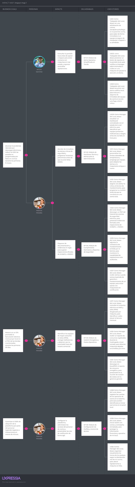 

## 3.4. Product Backlog

Criterio: el backlog se ordena por valor de negocio de mayor a menor y se estima con la serie Fibonacci. La prioridad sigue seguridad operativa primero, continuidad del monitoreo después, cumplimiento normativo luego, eficiencia energética a continuación, acceso y control después y descubrimiento mediante landing al final.

| Puntaje | Significado |
| --- | --- |
| 1 | Esfuerzo mínimo y alcance acotado |
| 2 | Esfuerzo bajo con dependencias escasas |
| 3 | Esfuerzo medio con lógica de negocio incluida |
| 5 | Esfuerzo alto con integración entre módulos |
| 8 | Esfuerzo máximo con procesamiento IoT o cálculo complejo |

| # Orden | ID | Título | Descripción | Story Points Fibonacci |
| :---: | :--- | :--- | :--- | :---: |
| 1 | **US10** | Recepción de aviso sonoro ante fuga crítica | Como Trabajador del Local, desea recibir un aviso sonoro local ante una fuga crítica, para alejarse del equipo con rapidez. | 3 |
| 2 | **US08** | Consulta de nivel de riesgo operativo por equipo | Como Trabajador del Local, desea conocer el nivel de riesgo operativo de cada equipo, para decidir su manipulación con seguridad durante la jornada. | 3 |
| 3 | **US17** | Recepción de alertas automáticas de emergencia | Como Manager del Local, desea recibir alertas automáticas ante sobrevoltajes o fugas de energía, para actuar con rapidez. | 3 |
| 4 | **TS01** | Ingesta de lecturas de sensores mediante API | Como Developer, desea exponer la ingesta de lecturas de sensores mediante API, para persistir telemetría con trazabilidad por dispositivo y equipo. | 8 |
| 5 | **TS02** | Distribución de alertas mediante API | Como Developer, desea exponer la distribución de alertas mediante API, para clasificar eventos por severidad y dirigir cada aviso al destino definido. | 5 |
| 6 | **US16** | Consulta de estado de la red eléctrica del local | Como Manager del Local, desea conocer el estado de la red eléctrica del local, para anticipar fallas en horas de alta demanda. | 5 |
| 7 | **US21** | Consulta de estado de conexión de sensores | Como Manager del Local, desea conocer el estado de conexión de cada sensor, para asegurar cobertura total de monitoreo en cocina. | 2 |
| 8 | **TS03** | Sincronización del panel tras pérdida de conexión | Como Developer, desea implementar la sincronización del panel tras la pérdida de conexión, para recuperar mediciones y eventos sin pérdida de información. | 8 |
| 9 | **US18** | Definición de límites de temperatura y amperaje por equipo | Como Manager del Local, desea definir los límites de temperatura y amperaje por equipo, para adaptar las alertas a cada máquina. | 3 |
| 10 | **US11** | Confirmación de condición segura para limpieza | Como Trabajador del Local, desea confirmar la condición segura del área antes de la limpieza, para realizar el aseo sin riesgo eléctrico. | 2 |
| 11 | **US12** | Consulta de protocolo de apagado seguro | Como Trabajador del Local, desea conocer el protocolo de apagado seguro de un equipo, para actuar con seguridad ante una alerta. | 2 |
| 12 | **US09** | Reporte operativo de anomalía en equipo | Como Trabajador del Local, desea reportar una anomalía percibida en un equipo, para alertar al Manager sin interrumpir la atención. | 2 |
| 13 | **US14** | Consulta de guía de actuación ante incidente eléctrico | Como Trabajador del Local, desea conocer la guía de actuación ante un incidente eléctrico, para apoyar con seguridad a un compañero afectado. | 2 |
| 14 | **US15** | Advertencia por humedad cerca de tableros | Como Trabajador del Local, desea conocer la condición de humedad cerca de tableros, para evitar la operación en superficie riesgosa. | 2 |
| 15 | **US30** | Descarga de reporte de seguridad para fiscalización | Como Manager del Local, desea descargar el historial de eventos de seguridad eléctrica, para presentar evidencia formal ante inspecciones. | 5 |
| 16 | **TS04** | Generación de reporte SST mediante servicio dedicado | Como Developer, desea implementar la generación del reporte SST mediante servicio dedicado, para entregar evidencia inmutable con firma de conformidad. | 5 |
| 17 | **US33** | Consulta de nivel de cumplimiento normativo del local | Como Manager del Local, desea conocer el nivel de cumplimiento normativo del local, para corregir observaciones antes de una inspección. | 3 |
| 18 | **US31** | Registro de lista de verificación semanal de red | Como Manager del Local, desea completar la lista de verificación semanal de la red, para dejar constancia del cumplimiento de estándares de seguridad. | 3 |
| 19 | **US32** | Registro de constancia de mantenimiento realizado | Como Manager del Local, desea registrar la constancia de mantenimiento emitida por el técnico, para mantener la trazabilidad de reparaciones ante auditorías. | 2 |
| 20 | **US34** | Recepción de aviso de vencimiento de mantenimiento | Como Manager del Local, desea recibir avisos antes del vencimiento del mantenimiento de un equipo, para evitar operar con maquinaria sin certificación. | 2 |
| 21 | **US19** | Consulta de historial de alertas con filtros | Como Manager del Local, desea consultar el historial de alertas con filtros por fecha, severidad y equipo, para analizar patrones de falla recurrentes. | 3 |
| 22 | **US20** | Asignación de alerta a técnico de mantenimiento | Como Manager del Local, desea asignar una alerta a un técnico de mantenimiento, para programar la revisión oportuna del equipo. | 3 |
| 23 | **US22** | Recepción de recomendaciones de mantenimiento predictivo | Como Manager del Local, desea recibir recomendaciones de mantenimiento predictivo, para programar revisiones sin afectar la venta. | 8 |
| 24 | **US13** | Registro de estado de equipos al cierre de turno | Como Trabajador del Local, desea registrar el estado de los equipos al cierre de turno, para dejar constancia al siguiente grupo de trabajo. | 2 |
| 25 | **US23** | Consulta de responsable de turno durante alerta | Como Manager del Local, desea conocer el responsable de turno durante una alerta, para el seguimiento operativo correspondiente. | 2 |
| 26 | **US41** | Consulta de bitácora de acciones en tienda | Como Manager del Local, desea consultar la bitácora de acciones realizadas en tienda, para verificar quién atendió cada alerta. | 3 |
| 27 | **US24** | Consulta de consumo eléctrico por equipo | Como Manager del Local, desea conocer el consumo eléctrico detallado por máquina, para identificar los equipos que elevan la factura mensual. | 8 |
| 28 | **US26** | Detección de consumo fuera de horario comercial | Como Manager del Local, desea conocer consumos registrados fuera del horario comercial, para detectar máquinas encendidas por error. | 3 |
| 29 | **US25** | Comparación de consumo entre periodos | Como Manager del Local, desea comparar el gasto energético entre periodos, para evaluar si las medidas de ahorro generan resultado. | 5 |
| 30 | **US27** | Proyección de costo eléctrico al cierre de mes | Como Manager del Local, desea conocer la proyección del costo eléctrico al cierre del mes, para ajustar el presupuesto operativo del local. | 5 |
| 31 | **US28** | Descarga de reporte de eficiencia energética | Como Manager del Local, desea descargar el reporte de consumo energético, para presentarlo en la revisión de costos con gerencia. | 3 |
| 32 | **US29** | Definición de meta mensual de consumo por tienda | Como Manager del Local, desea definir una meta mensual de consumo para la tienda, para recibir avisos antes de superar el presupuesto energético. | 3 |
| 33 | **US37** | Acceso seguro a la plataforma web | Como Manager del Local, desea acceder con credenciales seguras a la plataforma, para proteger la información operativa del local. | 3 |
| 34 | **TS05** | Autenticación y autorización con registro de auditoría | Como Developer, desea implementar la autenticación y autorización con registro de auditoría, para proteger los recursos y trazabilizar modificaciones críticas. | 5 |
| 35 | **US38** | Recuperación de acceso mediante correo | Como Manager del Local, desea recuperar el acceso mediante correo electrónico, para restablecer su clave con seguridad. | 2 |
| 36 | **US35** | Registro de cuentas para trabajadores | Como Manager del Local, desea registrar cuentas para los operarios de cocina, para permitir su identificación al inicio de turnos. | 3 |
| 37 | **TS06** | Envío de notificaciones mediante proveedor externo | Como Developer, desea integrar el envío de notificaciones mediante proveedor externo, para entregar avisos críticos por canales alternativos con confirmación. | 3 |
| 38 | **US36** | Selección de canales de notificación preferidos | Como Manager del Local, desea elegir los canales de recepción de alertas, para ajustar la comunicación a su disponibilidad de señal. | 2 |
| 39 | **US39** | Ordenamiento de equipos según distribución de cocina | Como Manager del Local, desea ordenar la ubicación de los equipos según la distribución real de la cocina, para ubicar con rapidez la máquina en falla. | 5 |
| 40 | **US40** | Registro de firma de conformidad | Como Manager del Local, desea registrar su firma de conformidad, para validar los reportes descargables de inspección. | 2 |
| 41 | **US01** | Conocimiento de propuesta de valor y acceso a aplicación web | Como Visitante, desea conocer la propuesta de valor de ElectroLink en la sección principal de la landing page, para acceder a la aplicación web y explorar el monitoreo eléctrico. | 2 |
| 42 | **US04** | Consulta de beneficios de gestión para administración del local | Como Visitante del segmento Manager del Local, desea conocer los beneficios de gestión energética y control de costos, para valorar la suscripción al servicio. | 2 |
| 43 | **US03** | Consulta de beneficios de seguridad para personal operativo | Como Visitante del segmento Trabajador del Local, desea conocer los beneficios de seguridad operativa de ElectroLink, para valorar la protección durante la jornada en cocina. | 2 |
| 44 | **US06** | Consulta de planes y evidencia para cumplimiento normativo | Como Visitante del segmento Manager del Local, desea conocer los planes de suscripción y la evidencia para fiscalización, para evaluar la contratación del servicio. | 2 |
| 45 | **US05** | Comprensión del funcionamiento del ecosistema conectado | Como Visitante, desea comprender el funcionamiento del ecosistema de sensores y analítica, para entender el flujo desde la detección hasta la alerta. | 2 |
| 46 | **US02** | Comprensión de problemática operativa del sector | Como Visitante, desea comprender la problemática de seguridad eléctrica en cadenas de comida rápida, para valorar la necesidad de monitoreo continuo. | 1 |
| 47 | **US07** | Solicitud de demostración y contacto comercial | Como Visitante, desea solicitar una demostración del servicio mediante los datos de contacto, para recibir atención comercial y acceso guiado a la aplicación web. | 2 |
| 48 | **US42** | Activación de pausa temporal de interacción del panel | Como Trabajador del Local, desea activar la pausa temporal de interacción del panel, para asear el equipo sin generar acciones involuntarias. | 1 |

---

# Capítulo IV: Strategic-Level Software Design

## 4.1. Strategic-Level Attribute-Driven Design

En esta sección se presenta el proceso de diseño arquitectónico de ElectroLink abordando la definición de la arquitectura desde una perspectiva estratégica y orientada tanto a los atributos de calidad como al dominio del negocio.

### 4.1.1. Design Purpose

El propósito del proceso de diseño de ElectroLink es definir una arquitectura de software que permita soportar de manera confiable, escalable y mantenible el monitoreo continuo de los componentes eléctricos presentes en establecimientos de cadenas de comida rápida. La solución busca responder a la problemática asociada con la detección tardía de anomalías eléctricas, posibles fugas de corriente, sobrecargas, fallas de funcionamiento y consumos energéticos ineficientes, situaciones que pueden generar interrupciones operativas, riesgos de seguridad y mayores costos de mantenimiento.

Los principales propósitos que orientan el diseño de la solución son:

- **Facilitar el monitoreo continuo del estado eléctrico de los establecimientos:** ElectroLink debe permitir visualizar de manera centralizada las mediciones obtenidas por los dispositivos IoT instalados en los diferentes componentes y equipos eléctricos de cada local. Esto permitirá a los responsables de mantenimiento y operaciones conocer el estado de los activos eléctricos sin necesidad de realizar inspecciones constantes de manera presencial.

- **Detectar oportunamente anomalías y posibles fallas eléctricas:** La solución deberá analizar las mediciones obtenidas por los dispositivos IoT para identificar comportamientos fuera de los rangos esperados, tales como consumos anómalos, sobrecargas, variaciones de voltaje, temperaturas elevadas o posibles fugas de corriente. Ante estas situaciones, el sistema deberá generar alertas que permitan al personal responsable actuar antes de que una anomalía pueda convertirse en una falla crítica.

- **Reducir interrupciones operativas y costos de mantenimiento:** El acceso a información histórica y en tiempo real permitirá identificar tendencias y comportamientos anormales en los equipos eléctricos, facilitando la ejecución de mantenimiento preventivo y reduciendo la dependencia de intervenciones correctivas posteriores a una falla. De esta manera, la solución busca disminuir tiempos de inactividad y costos asociados a reparaciones inesperadas.

- **Optimizar el consumo energético de los establecimientos:** ElectroLink deberá proporcionar información sobre el consumo eléctrico de los equipos y componentes monitoreados, permitiendo identificar patrones de uso ineficientes o consumos fuera de los valores habituales. Esta información podrá ser utilizada por los responsables de operaciones para tomar decisiones orientadas a mejorar la eficiencia energética de los establecimientos.

- **Atender las necesidades de los principales segmentos de usuario:**
    - **Responsables de mantenimiento:** requieren identificar rápidamente anomalías, consultar el historial de mediciones y recibir alertas que permitan priorizar las actividades de mantenimiento.
    - **Responsables de operaciones:** necesitan conocer el estado general de los implementos eléctricos registrados por cada establecimiento y detectar situaciones que puedan afectar la continuidad de las operaciones.
    - **Administradores o responsables de la cadena:** requieren disponer de información consolidada sobre distintos locales para analizar consumo energético, incidencias y desempeño operativo.

- **Asegurar un monitoreo confiable y oportuno:** Debido a que la solución dependerá de dispositivos IoT y comunicación continua con la plataforma, el diseño arquitectónico deberá considerar atributos de calidad relacionados con disponibilidad, confiabilidad, rendimiento, seguridad y escalabilidad. La información crítica deberá ser transmitida y procesada oportunamente, mientras que la plataforma deberá ser capaz de soportar el incremento progresivo de establecimientos, dispositivos y mediciones sin comprometer la operación del sistema.

### 4.1.2. Attribute-Driven Design Inputs

En esta sección se presentan los tres tipos principales de entradas consideradas para el proceso de diseño: la funcionalidad primaria, representada mediante las historias de usuario más relevantes para la operación del sistema; los escenarios de atributos de calidad, que permiten establecer expectativas medibles relacionadas con aspectos como disponibilidad, rendimiento, seguridad, confiabilidad y escalabilidad; y las restricciones, que delimitan las decisiones arquitectónicas debido a condiciones tecnológicas, operativas o de negocio.

Estas entradas servirán posteriormente como base para la identificación y priorización de los drivers arquitectónicos, así como para la definición de las decisiones de diseño que estructurarán la arquitectura de ElectroLink.

#### 4.1.2.1. Primary Functionality (Primary User Stories)
Para el proceso de Attribute-Driven Design (ADD) de ElectroLink se han seleccionado las User Stories que representan las funcionalidades esenciales de la solución y que generan un impacto significativo sobre su arquitectura. La selección considera principalmente aquellas capacidades relacionadas con la adquisición y procesamiento de información proveniente de dispositivos IoT, el monitoreo del estado eléctrico de los equipos, la detección y comunicación de situaciones de riesgo, la configuración de parámetros operativos, el análisis del consumo energético y la protección del acceso a la plataforma.

| Epic / User Story ID | Título | Descripción | Criterios de Aceptación | Relacionado con (Epic ID) |
| :--- | :--- | :--- | :--- | :--- |
| **US08** | Visualización de Semáforo Operativo | Como Trabajador del Local, deseo ver una señalización de colores (Verde/Amarillo/Rojo) en el panel de cocina, para saber de forma inmediata si un equipo es seguro de manipular o trapear a su alrededor. | **Dado** que el trabajador se encuentra en el área de cocina, **cuando** el sensor registra una fuga de corriente o sobrecalentamiento, **entonces** la pantalla muestra el indicador en Rojo y despliega el mensaje "NO TOCAR". | EP02 |
| **US10** | Alarma Sonora de Emergencia | Como Trabajador del Local, deseo escuchar una alerta auditiva local, para evacuar o alejarme de inmediato del equipo de cocina si ocurre una fuga a tierra crítica. | **Dado** que ocurre una fuga de corriente crítica, **cuando** el sensor la detecta en tiempo real, **entonces** el sistema activa la bocina local y parpadea la pantalla en rojo con el instructivo de seguridad. | EP02 |
| **US16** | Dashboard de Red en Tiempo Real | Como Manager del Local, deseo visualizar un Dashboard centralizado con el estado de la red eléctrica, para identificar qué equipos presentan ineficiencias o riesgos antes de una falla en hora pico. | **Dado** que el Manager ingresa a la plataforma web, **cuando** carga la vista principal, **entonces** el sistema despliega el estado de salud técnica, voltaje y temperatura de todos los equipos del local. | EP03 |
| **US17** | Alertas Push y SMS de Emergencia | Como Manager del Local, deseo recibir alertas automáticas por SMS y notificación Push, para tomar acciones inmediatas ante sobrevoltajes o fugas de energía. | **Dado** que se sobrepasa el límite seguro de amperaje en un equipo, **cuando** el sensor registra el evento, **entonces** el sistema envía un mensaje SMS y notificación al teléfono del Manager. | EP03 |
| **US18** | Configuración de Umbrales Térmicos | Como Manager del Local, deseo personalizar los límites tolerables de temperatura y amperaje por equipo, para adaptar las alertas a la maquinaria antigua o nueva. | **Dado** que el Manager edita la ficha de una freidora, **cuando** ingresa los límites máximos permitidos y guarda, **entonces** el sistema actualiza la lógica de disparo de alertas para dicho equipo. | EP03 |
| **US21** | Estado de Conectividad de Sensores | Como Manager del Local, deseo ver un indicador de estado de conexión de cada sensor IoT, para asegurar que toda la cocina esté siendo monitoreada sin puntos ciegos. | **Dado** que un sensor pierde conexión a la red local, **entonces** el Dashboard muestra el icono del equipo en gris e informa "Sensor Desconectado". | EP03 |
| **US24** | Desglose de Consumo por Equipo | Como Manager del Local, deseo consultar el consumo eléctrico en kWh y Soles (PEN) desglosado por máquina, para identificar cuáles elevan la factura mensual. | **Dado** que el Manager entra al módulo de energía, **cuando** selecciona un rango de fechas, **entonces** el sistema muestra una gráfica interactiva con el gasto en PEN por cada equipo de cocina. | EP04 |
| **US26** | Detección de Consumo Anómalo Fuera de Horario | Como Manager del Local, deseo recibir un reporte de consumos registrados durante la madrugada o local cerrado, para detectar máquinas dejadas encendidas por error. | **Dado** que la tienda está fuera de horario comercial, **cuando** un equipo registra un consumo superior al modo de espera (standby), **entonces** el sistema envía una alerta de "Consumo Inusual Fuera de Horario". | EP04 |
| **US30** | Generación de Reporte SST en PDF | Como Manager del Local, deseo descargar un PDF del historial de eventos de seguridad eléctrica, para presentar evidencias formales ante inspecciones de SUNAFIL o INDECI. | **Dado** que se realiza una auditoría oficial, **cuando** el Manager presiona "Exportar Reporte SST", **entonces** el sistema genera un documento PDF con registro cronológico de alertas resueltas. | EP05 |
| **US37** | Autenticación Segura en Plataforma Web | Como Manager del Local, deseo iniciar sesión con correo y contraseña encriptada, para proteger la información financiera y operativa de mi local. | **Dado** que el Manager ingresa sus credenciales válidas en la página de login, **cuando** presiona "Ingresar", **entonces** el sistema le otorga acceso al Dashboard administrativo. | EP06 |

En conjunto, estas funcionalidades influyen directamente en decisiones posteriores relacionadas con los mecanismos de comunicación entre dispositivos, procesamiento de eventos, almacenamiento de telemetría, generación de alertas, gestión de identidad y acceso, así como en la disponibilidad y escalabilidad de la plataforma.

#### 4.1.2.2. Quality Attribute Scenarios

| Atributo | Fuente | Estímulo | Artefacto | Entorno | Respuesta | Medida |
|---|---|---|---|---|---|---|
| **Rendimiento** | Sensor IoT | Se detecta una condición eléctrica crítica, como fuga de corriente, sobrecorriente o temperatura fuera del umbral permitido. | Servicio de recepción y procesamiento de telemetría / sistema de alertas | Operación normal del establecimiento | El sistema procesa la medición, determina su criticidad y genera la alerta correspondiente para el panel local y el Manager. | La alerta crítica debe generarse en un máximo de **3 segundos** desde la recepción de la medición. |
| **Disponibilidad** | Infraestructura del sistema | Una instancia o servicio encargado del monitoreo deja de estar disponible inesperadamente. | Plataforma de monitoreo de ElectroLink | Operación normal o periodo de alta actividad del local | La plataforma continúa brindando las funciones esenciales de monitoreo mediante mecanismos de recuperación o redundancia. | Restablecer el servicio afectado en un máximo de **60 segundos** y mantener una disponibilidad mensual de al menos **99.9 %**. |
| **Confiabilidad** | Red de comunicaciones / dispositivo IoT | Se produce una pérdida temporal de conexión entre un dispositivo IoT y el backend. | Gateway o mecanismo de transmisión de telemetría | Conectividad inestable o interrupción temporal de Internet | Las mediciones son almacenadas temporalmente y transmitidas cuando se recupera la conexión, evitando la pérdida de información relevante. | Recuperar y sincronizar al menos el **99.5 % de las mediciones** generadas durante la interrupción. |
| **Confiabilidad** | Dispositivo IoT | Un sensor deja de enviar información durante su operación. | Servicio de supervisión de dispositivos | Operación normal | El sistema identifica la pérdida de comunicación, cambia el estado del sensor a desconectado y comunica la situación al responsable del local. | Detectar e informar la desconexión en un máximo de **30 segundos** desde la última comunicación esperada. |
| **Seguridad** | Usuario no autorizado o atacante externo | Se intenta acceder al Dashboard o a recursos protegidos utilizando credenciales inválidas o inexistentes. | Servicio de autenticación y autorización | Plataforma accesible desde Internet | El sistema rechaza el acceso, registra el intento y evita que el usuario acceda a información o funcionalidades protegidas. | El **100 % de los endpoints protegidos** debe requerir autenticación válida y los intentos rechazados deben quedar registrados. |
| **Seguridad** | Manager autenticado | Se intenta modificar los umbrales eléctricos o parámetros de configuración de un equipo. | Servicio de configuración de dispositivos y equipos | Operación normal | El sistema verifica que el usuario posea los permisos requeridos antes de aplicar el cambio y registra la modificación realizada. | El **100 % de las modificaciones de parámetros críticos** debe validar autorización y generar un registro de auditoría. |
| **Escalabilidad** | Administrador de la cadena | Se incorporan nuevos establecimientos y dispositivos IoT a ElectroLink. | Plataforma IoT y servicios de procesamiento de telemetría | Crecimiento progresivo de la cadena | La infraestructura incrementa su capacidad de procesamiento sin requerir cambios importantes en la arquitectura ni afectar significativamente los tiempos de respuesta. | La solución debe soportar inicialmente hasta **5 000 dispositivos IoT conectados**, manteniendo los tiempos de procesamiento de alertas críticas dentro del límite establecido. |
| **Modificabilidad** | Equipo de desarrollo | Se requiere incorporar un nuevo tipo de sensor o una nueva variable de monitoreo. | Módulo de integración y procesamiento IoT | Sistema en evolución | La arquitectura permite integrar el nuevo dispositivo o tipo de medición sin modificar significativamente otros módulos del sistema. | La incorporación debe limitar los cambios principalmente al módulo de integración correspondiente y requerir como máximo **2 días-persona de desarrollo**, excluyendo pruebas de hardware. |

#### 4.1.2.3. Constraints

Las restricciones arquitectónicas para el proyecto ElectroLink se han categorizado en técnicas, operativas, de integración y regulatorias, estableciendo los límites dentro de los cuales debe diseñarse y operar la solución:

| ID | Título | Descripción | Aceptación | EPIC | 
|---|---|---|---|---|
| CON-01 | Hardware IoT Predefinido (ESP32) | Los dispositivos físicos de monitoreo (sensores y gateways) deben estar basados estrictamente en microcontroladores ESP32, adaptados para operar bajo las condiciones del entorno. | Escenario 1: Captura de datos en entorno hostilDado que el microcontrolador ESP32 está instalado en un tablero de cocina,Cuando las temperaturas y humedad aumentan por la operación,Entonces el dispositivo debe mantener su conectividad y continuar transmitiendo telemetría. | EP01 y EP02 |
| CON-02 | Arquitectura Monolítica Modular en C# | El backend debe implementarse como una API RESTful utilizando C# / ASP.NET Core y Entity Framework Core, garantizando la separación por módulos de negocio (monolito modular). | Escenario 1: Estructura del proyectoDado que un desarrollador inspecciona el código fuente,Cuando revisa las dependencias y la solución,Entonces se evidencia el uso de C#, ASP.NET Core y una separación interna por Bounded Contexts bien definidos. | Todas |
| CON-03 | Persistencia en PostgreSQL | Toda la información relacional, incluyendo datos de usuarios, credenciales, locales e historiales de mantenimiento, debe persistirse obligatoriamente en PostgreSQL. | Escenario 1: Almacenamiento de transaccionesDado que un manager registra la asignación de un técnico,Cuando el sistema guarda la transacción,Entonces los datos se persisten asegurando atomicidad dentro de la base de datos PostgreSQL. | Todas |
| CON-04 | Frontend Segregado (React y Flutter) | El ecosistema cliente debe separar la tecnología: la web administrativa (SPA) se construirá con JavaScript/React, mientras que la aplicación móvil se desarrollará con Dart/Flutter. | Escenario 1: Uso de dashboard administrativoDado que el manager de tienda abre la plataforma web,Cuando visualiza el consumo eléctrico en tiempo real,Entonces la interfaz reacciona de forma fluida e interactiva usando componentes de React.Escenario 2: Notificaciones en campoDado que un técnico o trabajador usa la app móvil,Cuando recibe una alerta de voltaje,Entonces la experiencia nativa es soportada por el framework Flutter. | EP02 y EP03 |
| CON-05 | Infraestructura Cloud en Microsoft Azure | El despliegue de los servicios (Backend, Frontend SPA y Base de Datos) debe realizarse exclusivamente sobre la nube de Microsoft Azure, usando Azure App Service. | Escenario 1: Despliegue en producciónDado que se finaliza un sprint y se lanza una nueva versión,Cuando el pipeline de CI/CD sube los contenedores,Entonces estos son alojados y orquestados dentro de la infraestructura de Azure. | Todas | 
| CON-06 | Integraciones de Terceros Obligatorias | La plataforma está restringida a usar Stripe para la facturación SaaS, Firebase Cloud Messaging (FCM/APNs) para alertas Push, y Mapbox/Google Maps para geolocalización. | Escenario 1: Pago de suscripciónDado que una cadena de comida rápida adquiere el plan Premium,Cuando realiza el pago mensual,Entonces el cobro se procesa obligatoriamente a través de los webhooks de Stripe.Escenario 2: Alerta Crítica PushDado que el sistema detecta una fuga de corriente,Cuando dispara la alerta móvil,Entonces la notificación viaja a través de FCM/APNs. | EP02 y EP05 |
| CON-07 | Cumplimiento Normativo SST | El sistema debe generar evidencias, bitácoras y reportes inmutables de incidentes que cumplan estrictamente con los estándares legales peruanos (SUNAFIL, OSINERGMIN, INDECI). | Escenario 1: Auditoría de seguridad oficialDado que el local recibe una inspección inopinada de SUNAFIL,Cuando el administrador exporta el reporte de salud técnica,Entonces el PDF generado contiene firmas digitales y un registro inalterable que sustenta el cumplimiento legal del local. | EP04 |

La tabla de restricciones arquitectónicas establece las condiciones que deben cumplirse durante el diseño del proyecto, evitando dudas o decisiones técnicas innecesarias desde el inicio. Estas restricciones tecnológicas, operativas y legales se organizan mediante escenarios BDD (Dado/Cuando/Entonces), lo que permite definir pruebas claras para validar su cumplimiento. Para ElectroLink, esta tabla ayuda a garantizar que la arquitectura funcione correctamente en el entorno de una cocina de comida rápida y cumpla con las normas de seguridad y regulación correspondientes (SUNAFIL/INDECI). De esta manera, se busca que la solución tecnológica sea viable y contribuya a los objetivos del negocio.

### 4.1.3. Architectural Drivers Backlog

| Driver ID | Título de Driver | Descripción | Importancia para Stakeholders | Architecture Technical Complexity |
|---|---|---|---|---|
| **DR-01** | **Rendimiento** | Capacidad de ElectroLink para recibir y procesar continuamente las mediciones generadas por los sensores IoT, detectar condiciones críticas como fugas de corriente, sobrecorriente o sobrecalentamiento y generar las alertas correspondientes en un tiempo máximo de **3 segundos** desde la recepción del evento, garantizando una respuesta oportuna ante situaciones que puedan comprometer la seguridad del establecimiento. | Alta | Alta |
| **DR-02** | **Disponibilidad** | Capacidad de la plataforma para mantener operativas las funciones esenciales de monitoreo eléctrico ante fallos parciales de servicios, dispositivos o infraestructura, buscando una disponibilidad mensual mínima de **99.9 %** y permitiendo recuperar un servicio afectado en un máximo de **60 segundos**, sin comprometer las funciones críticas de seguridad. | Alta | Alta |
| **DR-03** | **Confiabilidad** | Capacidad del sistema para mantener un monitoreo consistente incluso ante interrupciones temporales de conectividad, almacenando localmente las mediciones pendientes y sincronizándolas posteriormente con la plataforma. Asimismo, ElectroLink debe detectar sensores desconectados en un máximo de **30 segundos** y recuperar al menos el **99.5 % de las mediciones** generadas durante una pérdida temporal de comunicación. | Alta | Alta |
| **DR-04** | **Escalabilidad** | Capacidad de la arquitectura para soportar el crecimiento progresivo de ElectroLink mediante la incorporación de nuevos establecimientos, equipos eléctricos y dispositivos IoT sin requerir una reestructuración significativa del sistema. La solución deberá poder soportar inicialmente hasta **5 000 dispositivos IoT conectados**, manteniendo los tiempos establecidos para el procesamiento de eventos críticos. | Alta | Alta |
| **DR-05** | **Monitoreo y Detección de Anomalías** | Capacidad funcional para recibir información proveniente de sensores IoT, visualizar en tiempo real el estado eléctrico y térmico de los equipos, evaluar las mediciones respecto a umbrales configurados y detectar condiciones anómalas que puedan representar riesgos de seguridad, fallas operativas o funcionamiento ineficiente. | Alta | Alta |
| **DR-06** | **Operación Local ante Pérdida de Conectividad** | Capacidad de los componentes locales de ElectroLink para conservar funciones esenciales de seguridad cuando se interrumpe la comunicación con los servicios remotos. Las alertas críticas locales no deberán depender exclusivamente de la disponibilidad de Internet, permitiendo advertir al personal del establecimiento y almacenar temporalmente los eventos hasta recuperar la conexión. | Alta | Alta |
| **DR-07** | **Seguridad** | Implementación de mecanismos para proteger la información operativa y la configuración de los equipos mediante autenticación, autorización y comunicación segura. El **100 % de los recursos protegidos** deberá requerir autenticación válida, mientras que toda modificación de parámetros críticos, como umbrales eléctricos y térmicos, deberá verificar los permisos correspondientes y generar registros de auditoría. | Alta | Media |
| **DR-08** | **Interoperabilidad IoT** | Capacidad de ElectroLink para comunicarse con diferentes sensores, dispositivos y componentes IoT utilizados para medir variables como corriente, voltaje, consumo energético y temperatura, empleando interfaces y protocolos definidos que permitan desacoplar los dispositivos físicos de los servicios encargados del procesamiento y análisis de la información. | Alta | Media |
| **DR-09** | **Gestión de Alertas** | Capacidad del sistema para clasificar los eventos detectados según su nivel de severidad y distribuir las alertas hacia los mecanismos correspondientes, incluyendo señalización visual o auditiva local, Dashboard administrativo y canales de notificación remotos para el Manager del establecimiento. | Alta | Media |
| **DR-10** | **Gestión Energética** | Capacidad de la plataforma para almacenar y procesar información histórica sobre el consumo eléctrico de los equipos, permitiendo calcular consumos en kWh, estimar costos, comparar periodos e identificar patrones anómalos como consumo fuera del horario comercial. | Media | Media |
| **DR-11** | **Modificabilidad** | Facilidad con la que la arquitectura permite incorporar nuevos tipos de sensores, variables eléctricas o mecanismos de análisis sin generar modificaciones significativas en componentes no relacionados. La integración de un nuevo tipo de sensor deberá concentrar los cambios principalmente en su módulo de integración y requerir como máximo **2 días-persona de desarrollo**, excluyendo las pruebas asociadas al hardware. | Media | Media |
| **DR-12** | **Persistencia y Trazabilidad** | Capacidad del sistema para conservar mediciones de telemetría, alertas, cambios de configuración y eventos relevantes de los equipos, permitiendo realizar consultas históricas, análisis energético, auditorías y seguimiento de incidentes sin perder la relación entre el dispositivo, equipo y establecimiento que originó la información. | Media | Media |

### 4.1.4. Architectural Design Decisions

A continuación se presenta la evaluación de las decisiones de diseño arquitectónico para ElectroLink, comparando el estilo de Monolito Modular (DDD) frente a una arquitectura basada en Microservicios, evaluándolos según los Drivers Arquitectónicos definidos.

| Driver ID | Título de Driver | Monolito Modular (DDD) Pro | Monolito Modular (DDD) Contra | Microservicios Pro | Microservicios Contra | 
|---|---|---|---|---|---|
|DR01|Rendimiento|Las llamadas entre los módulos de telemetría IoT y el gestor de alertas ocurren en memoria, lo que elimina la latencia de red interna y facilita cumplir el tiempo de respuesta $\le 3$ segundos.|El procesamiento intensivo de datos de los sensores IoT puede competir por recursos de CPU/RAM con otros módulos (ej. consultas al Dashboard administrativo).|Los servicios especializados (ej. Ingesta IoT) pueden optimizarse independientemente, asignando hardware específico para la lectura de telemetría.|El overhead de comunicación por red entre microservicios (ej. Ingesta $\rightarrow$ Alertas $\rightarrow$ Notificación) puede incrementar la latencia en flujos críticos.|
|DR02|Disponibilidad|Despliegue simple y unificado en Azure App Service. Menor cantidad de partes móviles e infraestructura que puedan fallar en la comunicación interna.|Cualquier fallo crítico en un módulo (ej. un bucle infinito procesando datos de sensores) puede tumbar toda la instancia y afectar la operación de todos los locales.|El aislamiento de fallos permite que, si el servicio de reportes SST falla, la detección de fugas de corriente y alertas siga funcionando sin interrupciones.|La alta disponibilidad requiere infraestructura compleja (Service Mesh, Kubernetes) y manejo de tolerancia a fallos entre red (Circuit Breakers).|
|DR04|Escalabilidad|La modularización interna mediante DDD permite escalar horizontalmente replicando la instancia completa para absorber la demanda.|Limitaciones de eficiencia en costos: para escalar la capacidad de 5,000 dispositivos IoT, se debe escalar también el módulo de facturación y usuarios innecesariamente.|Escalabilidad horizontal elástica y granular: el servicio de ingesta IoT puede escalar masivamente por demanda sin afectar o sobredimensionar el resto del sistema.|Costo operativo inicial elevado y alta complejidad de orquestación requerida para mantener la consistencia entre múltiples bases de datos.|
|DR07|Seguridad|Seguridad centralizada con un único flujo de autenticación, gestión de tokens JWT y control de accesos uniforme para las APIs y la configuración de umbrales.|Mayor superficie de impacto: el compromiso o vulneración de un módulo compromete el acceso directo a la base de datos completa (PostgreSQL).|Seguridad aislada por servicio; los datos de facturación (Stripe) están separados de los datos de telemetría, aplicando el principio de menor privilegio.|Requiere una gestión distribuida compleja de tokens de autorización y validación de identidades en cada salto entre servicios.|
|DR11|Modificabilidad|La separación lógica por dominios (DDD) facilita incorporar nuevos tipos de sensores IoT limitando el impacto al módulo correspondiente, lográndolo en $\le 2$ días-persona.|Si no se respeta la disciplina arquitectónica, los límites de los módulos pueden difuminarse, creando un alto acoplamiento (Big Ball of Mud).|Servicios pequeños y totalmente independientes permiten la evolución tecnológica y despliegue aislado de nuevas funcionalidades IoT sin afectar el resto.|Requiere gobernanza fuerte y coordinación exhaustiva para gestionar cambios en contratos de APIs o transacciones distribuidas (Patrón Saga).|

### 4.1.5. Quality Attribute Scenario Refinements

Luego del proceso de **Quality Attribute Workshop**, el equipo revisó los escenarios de atributos de calidad identificados inicialmente y priorizó aquellos con mayor influencia sobre la arquitectura de ElectroLink. La priorización consideró principalmente el impacto de cada escenario sobre la seguridad del personal, la continuidad del monitoreo eléctrico, la capacidad de respuesta ante anomalías y el crecimiento futuro de la solución.

Como resultado, se refinaron los escenarios relacionados con **rendimiento, confiabilidad, disponibilidad, seguridad y escalabilidad**, incorporando mayor detalle acerca de las condiciones en las que ocurren los estímulos, los componentes involucrados, las respuestas esperadas y sus respectivas métricas. Asimismo, se identificaron preguntas e issues arquitectónicos que deberán ser considerados durante el diseño de la solución.

### Scenario Refinement for Scenario 1

| Campo | Descripción |
|---|---|
| **Scenario(s)** | Como Manager del Local, quiero recibir alertas automáticas cuando se detecte una condición eléctrica crítica, para tomar acciones antes de que se produzca una falla o una situación que comprometa la seguridad del personal. |
| **Business Goals** | Reducir el riesgo de accidentes eléctricos y disminuir el impacto operativo de fallas en los equipos mediante la detección y comunicación temprana de condiciones peligrosas. |
| **Relevant Quality Attributes** | Rendimiento, Confiabilidad, Disponibilidad |

| Scenario Components | Descripción |
|---|---|
| **Stimulus** | Un sensor registra una condición crítica, como fuga de corriente, sobrecorriente o temperatura superior al umbral configurado. |
| **Stimulus Source** | Sensor IoT instalado en un equipo eléctrico del establecimiento. |
| **Environment** | Operación normal del local, incluyendo periodos de alta actividad en los que múltiples dispositivos transmiten telemetría simultáneamente. |
| **Artifact (if Known)** | Dispositivo IoT, gateway local, servicio de procesamiento de telemetría y sistema de alertas. |
| **Response** | El sistema recibe la medición, identifica que supera un umbral crítico, registra el evento y activa las alertas locales y remotas correspondientes. |
| **Response Measure** | La alerta crítica debe generarse en un máximo de **3 segundos** desde la recepción de la medición. |
| **Questions** | ¿La detección de una situación crítica debe realizarse únicamente en el backend o también localmente? ¿Qué ocurre si varias alertas críticas se producen simultáneamente? |
| **Issues** | La dependencia exclusiva de servicios cloud podría incrementar la latencia o impedir la generación de alertas ante una pérdida de conectividad. |

### Scenario Refinement for Scenario 2

| Campo | Descripción |
|---|---|
| **Scenario(s)** | Como trabajador del local, quiero que las alertas críticas continúen funcionando aunque se pierda la conexión a Internet, para mantener las funciones de seguridad dentro del establecimiento. |
| **Business Goals** | Mantener la protección del personal y la capacidad de reacción ante riesgos eléctricos incluso cuando la comunicación con la plataforma central no esté disponible. |
| **Relevant Quality Attributes** | Confiabilidad, Disponibilidad, Tolerancia a fallos |

| Scenario Components | Descripción |
|---|---|
| **Stimulus** | Se interrumpe temporalmente la conexión entre el establecimiento y el backend de ElectroLink. |
| **Stimulus Source** | Red de comunicaciones o proveedor de Internet del establecimiento. |
| **Environment** | Operación normal del local mientras los sensores continúan generando información. |
| **Artifact (if Known)** | Gateway o dispositivo Edge local, sensores IoT y backend central. |
| **Response** | El componente local continúa procesando condiciones críticas, activa las alertas locales y almacena temporalmente las mediciones y eventos pendientes. Cuando se recupera la conexión, sincroniza la información con la plataforma central. |
| **Response Measure** | Las funciones de alerta local deben permanecer disponibles durante la interrupción y al menos el **99.5 % de las mediciones almacenadas** deben sincronizarse luego de restablecerse la comunicación. |
| **Questions** | ¿Cuánto tiempo debe poder almacenar información el dispositivo local? ¿Cómo se resuelven conflictos al sincronizar los datos? |
| **Issues** | Será necesario disponer de almacenamiento local y mecanismos de sincronización para evitar pérdida o duplicación de información. |

### Scenario Refinement for Scenario 3

| Campo | Descripción |
|---|---|
| **Scenario(s)** | Como Manager del Local, quiero que la plataforma permanezca disponible ante fallos parciales, para continuar supervisando el estado eléctrico de los equipos. |
| **Business Goals** | Evitar periodos prolongados sin monitoreo y mantener la continuidad operativa de ElectroLink ante fallos en componentes de software o infraestructura. |
| **Relevant Quality Attributes** | Disponibilidad, Confiabilidad |

| Scenario Components | Descripción |
|---|---|
| **Stimulus** | Uno de los servicios responsables del monitoreo o procesamiento de telemetría deja de responder inesperadamente. |
| **Stimulus Source** | Infraestructura o componente interno de la plataforma. |
| **Environment** | Operación normal o periodo de alta actividad del establecimiento. |
| **Artifact (if Known)** | Servicios backend responsables de telemetría, monitoreo y alertas. |
| **Response** | La plataforma detecta la falla, ejecuta mecanismos de recuperación y mantiene disponibles las funciones esenciales de monitoreo mediante instancias o mecanismos alternativos. |
| **Response Measure** | Mantener una disponibilidad mensual mínima de **99.9 %** y recuperar el servicio afectado en un máximo de **60 segundos**. |
| **Questions** | ¿Qué servicios requieren redundancia? ¿Qué componentes pueden degradarse temporalmente sin afectar la seguridad? |
| **Issues** | Incrementar la disponibilidad puede requerir redundancia, health checks, reinicio automático y balanceo de carga, aumentando la complejidad de infraestructura. |

### Scenario Refinement for Scenario 4

| Campo | Descripción |
|---|---|
| **Scenario(s)** | Como Manager del Local, quiero conocer cuando un sensor deja de transmitir información, para evitar zonas o equipos sin monitoreo dentro del establecimiento. |
| **Business Goals** | Reducir los puntos ciegos en el monitoreo eléctrico y permitir que el personal intervenga rápidamente cuando un dispositivo IoT presenta problemas de comunicación. |
| **Relevant Quality Attributes** | Confiabilidad, Disponibilidad |

| Scenario Components | Descripción |
|---|---|
| **Stimulus** | Un dispositivo IoT deja de transmitir sus mensajes o señales periódicas al sistema. |
| **Stimulus Source** | Sensor o dispositivo IoT. |
| **Environment** | Operación normal con los dispositivos registrados como activos. |
| **Artifact (if Known)** | Servicio de monitoreo de conectividad de dispositivos y Dashboard administrativo. |
| **Response** | El sistema identifica la ausencia de comunicación, cambia el estado del sensor a desconectado y muestra una alerta al Manager. |
| **Response Measure** | La pérdida de comunicación debe detectarse y comunicarse en un máximo de **30 segundos** desde la última transmisión esperada. |
| **Questions** | ¿Con qué frecuencia debe enviar heartbeat cada dispositivo? ¿Cómo se diferencia una caída de red de una falla física del sensor? |
| **Issues** | Un intervalo demasiado reducido podría aumentar innecesariamente el tráfico de la red, mientras que uno demasiado amplio retrasaría la detección de dispositivos desconectados. |

### Scenario Refinement for Scenario 5

| Campo | Descripción |
|---|---|
| **Scenario(s)** | Como Manager del Local, quiero que únicamente usuarios autorizados puedan acceder y modificar parámetros críticos, para evitar alteraciones que puedan comprometer el monitoreo de los equipos. |
| **Business Goals** | Proteger la información operativa y evitar modificaciones no autorizadas sobre configuraciones relacionadas con la seguridad eléctrica del establecimiento. |
| **Relevant Quality Attributes** | Seguridad, Auditabilidad |

| Scenario Components | Descripción |
|---|---|
| **Stimulus** | Un usuario intenta acceder a un recurso protegido o modificar los umbrales de corriente o temperatura de un equipo. |
| **Stimulus Source** | Usuario autenticado sin permisos suficientes o usuario no autorizado. |
| **Environment** | Plataforma web disponible mediante Internet durante la operación normal. |
| **Artifact (if Known)** | Servicio de autenticación y autorización, módulo de configuración y registros de auditoría. |
| **Response** | El sistema valida la identidad y permisos del usuario, rechaza las operaciones no autorizadas y registra los intentos o modificaciones realizadas. |
| **Response Measure** | El **100 % de los endpoints protegidos** debe exigir autenticación válida y el **100 % de las modificaciones de parámetros críticos** debe verificar autorización y generar un registro de auditoría. |
| **Questions** | ¿Qué roles tendrán permisos para modificar umbrales? ¿Se requiere autenticación adicional para cambios particularmente sensibles? |
| **Issues** | Será necesario definir adecuadamente roles y permisos para evitar tanto accesos excesivos como restricciones que dificulten la operación. |

### Scenario Refinement for Scenario 6

| Campo | Descripción |
|---|---|
| **Scenario(s)** | Como administrador de una cadena de establecimientos, quiero incorporar progresivamente nuevos locales y dispositivos sin afectar el funcionamiento de los existentes. |
| **Business Goals** | Permitir que ElectroLink pueda ser implementado progresivamente en cadenas de comida rápida y acompañar el crecimiento del número de establecimientos monitoreados. |
| **Relevant Quality Attributes** | Escalabilidad, Rendimiento, Disponibilidad |

| Scenario Components | Descripción |
|---|---|
| **Stimulus** | Se incrementa significativamente la cantidad de establecimientos, equipos y dispositivos IoT conectados simultáneamente. |
| **Stimulus Source** | Crecimiento de la cadena y despliegue de nuevos dispositivos ElectroLink. |
| **Environment** | Plataforma en operación mientras se incorporan nuevos establecimientos y sensores. |
| **Artifact (if Known)** | Infraestructura cloud, servicios de ingesta y procesamiento de telemetría, almacenamiento y sistema de alertas. |
| **Response** | La plataforma incrementa su capacidad para recibir y procesar telemetría sin requerir una reestructuración significativa y mantiene los tiempos definidos para los eventos críticos. |
| **Response Measure** | Soportar inicialmente hasta **5 000 dispositivos IoT conectados**, manteniendo la generación de alertas críticas dentro del límite de **3 segundos**. |
| **Questions** | ¿El escalamiento se realizará horizontal o verticalmente? ¿Qué componente se convertirá primero en cuello de botella: ingesta, procesamiento o almacenamiento? |
| **Issues** | El crecimiento del volumen de telemetría puede requerir procesamiento asíncrono, particionamiento de datos y escalamiento independiente de determinados servicios. |

## 4.2. Strategic-Level Domain-Driven Design

### 4.2.1. EventStorming
\
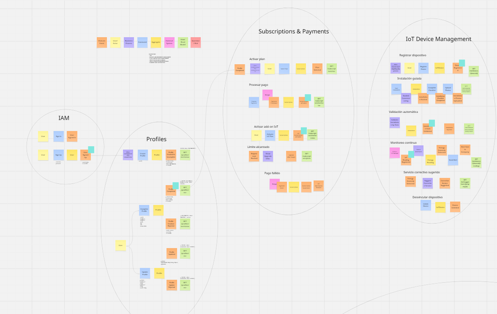
\
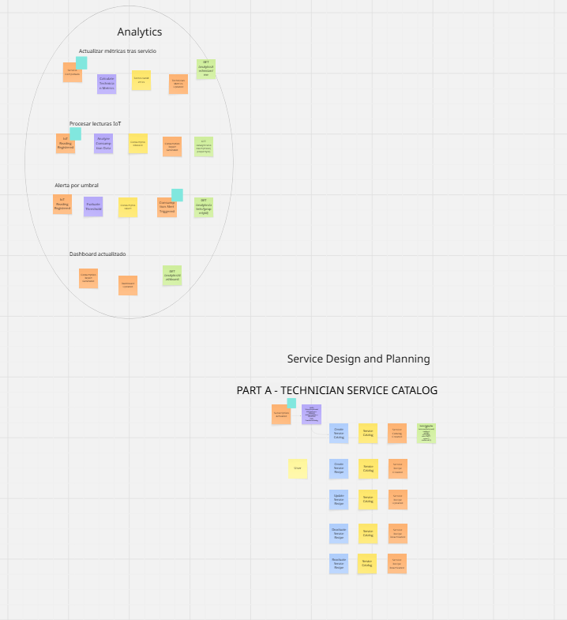
\
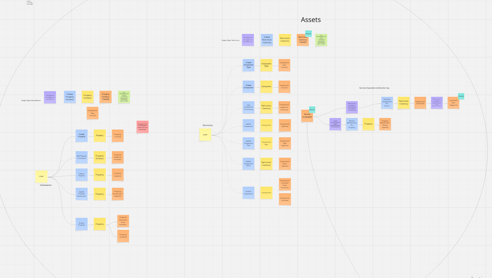
\
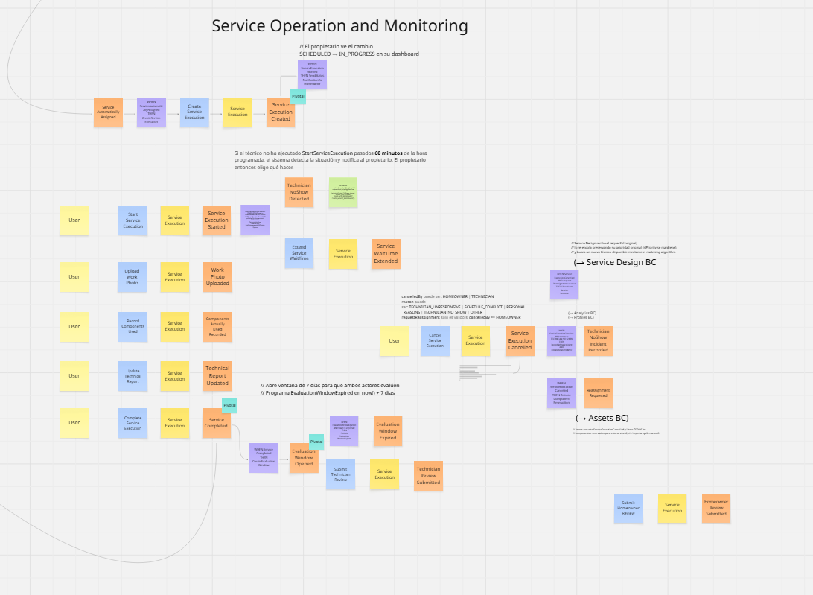

### 4.2.2. Candidate Context Discovery
\
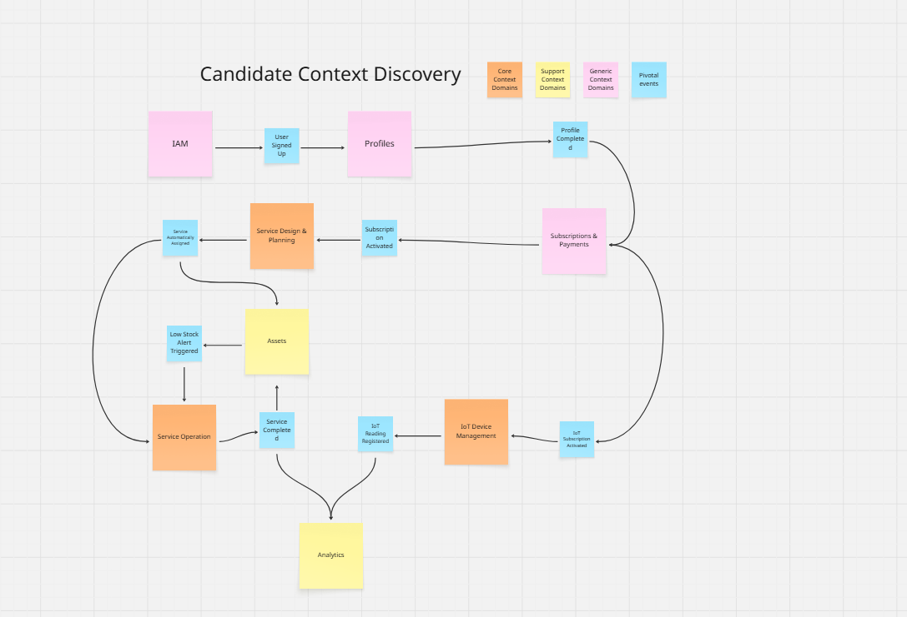

### 4.2.3. Domain Message Flows Modeling

El Domain Message Flow Modeling es una técnica visual utilizada en la metodología de Domain-Driven Design (DDD) para diagramar y documentar cómo los comandos, eventos y mensajes transitan entre los actores y los Bounded Contexts dentro de una arquitectura de software. Su objetivo es mapear las interacciones clave entre los componentes del sistema para entender cómo un suceso específico desencadena una reacción en cadena a través de diferentes partes del dominio.

#### Scenario 1: Detección Automática y Alerta de Fuga a Tierra o Sobrecalentamiento
Cuando un sensor IoT detecta un umbral crítico de temperatura o corriente, el contexto de monitoreo emite un evento de anomalía. Esta alerta acciona inmediatamente el semáforo rojo en la cocina para proteger al operario y envía una notificación de emergencia al teléfono del administrador a través de Firebase, garantizando una respuesta rápida.

#### Scenario 2: Reporte Rápido Operativo y Asignación Técnica
Un operario reporta rápidamente una falla desde el panel local, generando un evento en el sistema. El contexto de diseño y planificación recibe la alerta, evalúa el inventario de técnicos disponibles y permite al administrador asignar la tarea. Finalmente, se notifica al técnico seleccionado mediante SMS o Push para su intervención.

#### Scenario 3:Verificación de Apagado Seguro para Limpieza
Antes de limpiar, el personal solicita verificar el aislamiento de energía. El sistema consulta directamente la telemetría de los sensores IoT para confirmar la ausencia de voltaje o amperaje. Al certificarse la desenergización, la pantalla local cambia a luz verde, indicando que el área es totalmente segura para trapear sin riesgo de electrocución.

#### Scenario 4: Sincronización de Telemetría Tras Caída de Conexión
Ante un corte de Internet, el Edge Node local almacena la telemetría para evitar pérdida de datos. Una vez restaurada la conexión, se activa una política que sincroniza masivamente la información retenida hacia la nube de Azure. Esto actualiza los consumos históricos y las métricas del dashboard administrativo de forma transparente.

#### Scenario 5: Renovación de Suscripción SaaS del Local
Al cumplirse la fecha de corte, el sistema emite automáticamente un cobro mediante la pasarela Stripe. Tras recibir la confirmación exitosa del pago vía webhook, se genera un evento de dominio que instruye a los módulos de identidad y perfiles a renovar las credenciales, asegurando que el local mantenga su acceso ininterrumpido a la plataforma.

#### Scenario 6: Generación de Evidencia Normativa (SST)
El administrador solicita un reporte de cumplimiento para auditorías oficiales como SUNAFIL. El módulo analítico orquesta la recopilación de telemetría de sensores, el historial de reparaciones y la firma digital del usuario. Finalmente, consolida estos datos para generar y entregar un documento PDF inmutable que certifica la seguridad y operatividad del local

---

### 4.2.4. Bounded Context Canvases

En esta sección se presentan los bounded contexts identificados para la solución ElectroLink, definidos a partir del análisis del dominio y siguiendo un enfoque de Domain-Driven Design (DDD). Cada contexto delimita responsabilidades claras, lenguaje ubicuo y reglas de negocio específicas, permitiendo una adecuada separación de preocupaciones y escalabilidad del sistema.

## 1. Identity and Access Management (IAM)
Gestión de autenticación, autorización y control de acceso de usuarios al sistema, incluyendo registro, inicio de sesión y manejo de roles.

---
\
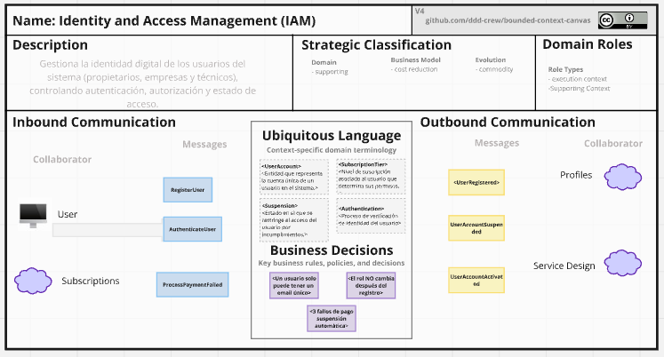

---
## 2. Subscription and Payments
Gestión de planes, facturación y control de acceso a funcionalidades.

---
\
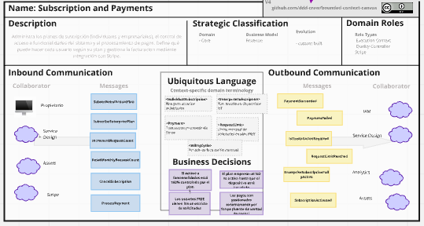

---

## 3. Profiles and Preferences
Administración de perfiles de usuarios, técnicos y configuración personalizada.

---
\
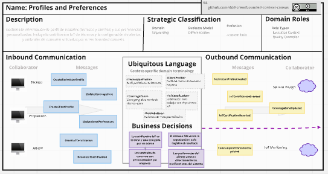

---

## 4. Service Design and Planning
Orquestación de servicios, solicitudes y asignación inteligente de técnicos.

---
\

---

## 5. Service Operation and Monitoring
Ejecución, seguimiento y cierre de servicios con evidencia y evaluación.

---
\
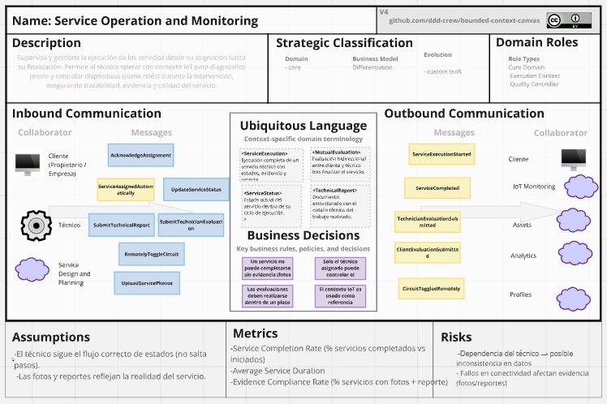

---

## 6. Assets and Resource Management
Gestión de propiedades, dispositivos IoT e inventario de técnicos.

---
\
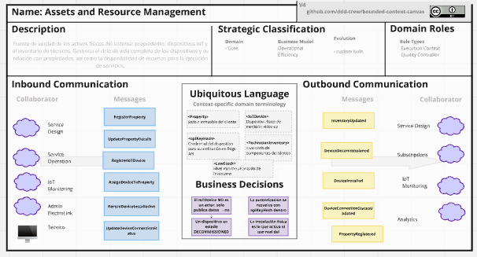

---

## 7. IoT Monitoring and Edge Processing
Procesamiento de datos en tiempo real y detección de anomalías eléctricas.

---
\
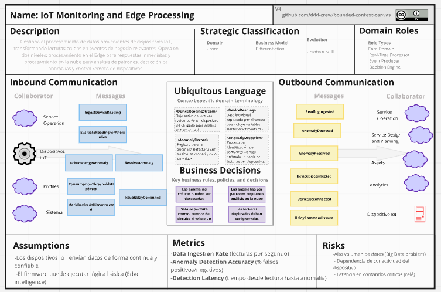

---

## 8. Analytics
Visualización, reportes e insights a partir de datos históricos y en tiempo real.

---
\
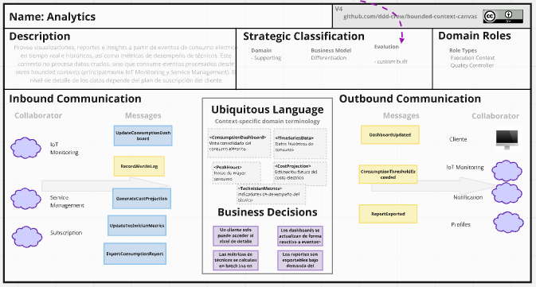

---

### 4.2.5. Context Mapping
\
El Context Mapping es una técnica esencial en el diseño de ElectroLink que nos permite visualizar las relaciones estructurales y de comunicación entre los ocho Bounded Contexts identificados en el dominio de la gestión eléctrica inteligente. A través de esta técnica, hemos identificado las interacciones, dependencias y posibles puntos de integración entre los contextos, asegurando que el flujo de información desde los sensores hasta la toma de decisiones proactivas sea consistente.
\
En el desarrollo de nuestro proyecto, el proceso se estructuró siguiendo las fases metodológicas del diseño guiado por el dominio:
\
**Identificación de Relaciones:** Se comenzó por definir las interdependencias entre contextos, estableciendo roles de Upstream (U) y Downstream (D). Un ejemplo crítico es la relación entre IoT Monitoring (Upstream) y Service Design (Downstream), donde los eventos de anomalías dictan el comportamiento proactivo del sistema.

**Anticorruption Layer (ACL):** Aplicada en Service Design para proteger el algoritmo de asignación técnica de cambios en los modelos de activos o perfiles.

**Shared Kernel:** Utilizado entre Service Operation y Assets para gestionar el estado compartido de los dispositivos instalados en tiempo real.

**Open Host Service (OHS):** El contexto de IoT Monitoring expone una interfaz estandarizada para el control seguro de relés eléctricos.

**Customer/Supplier:** Establecido entre Profiles e IoT Monitoring, donde los umbrales configurados por el cliente guían la detección de anomalías.

**Conformist:** El BC de Analytics se adhiere a los contratos de datos de telemetría impuestos por la ingesta de dispositivos para garantizar reportes precisos.

A continuación, se presenta el Context Map elegido que resume visualmente estas relaciones y sirve como hoja de ruta para la implementación técnica de la solución:
\
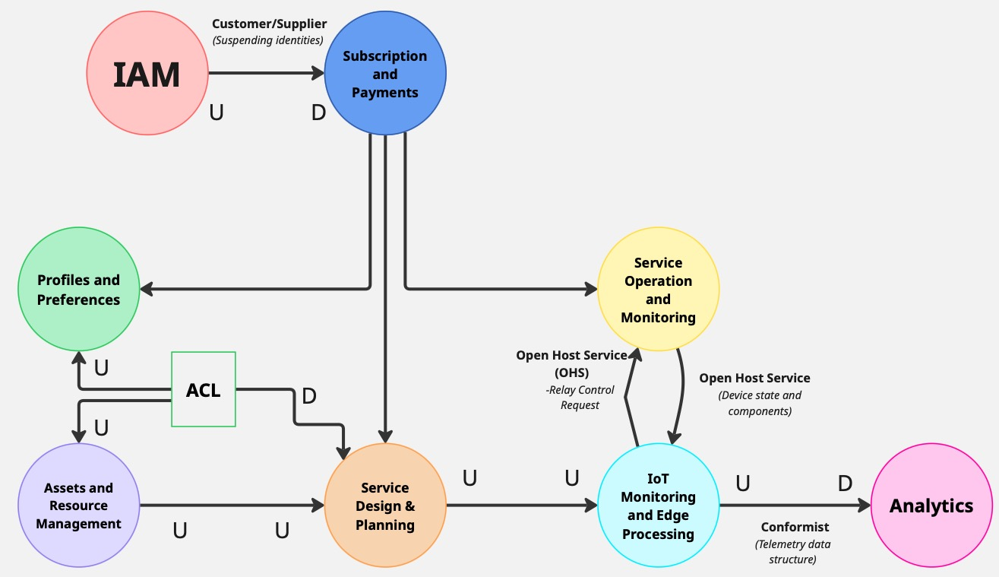

## 4.3. Software Architecture

### 4.3.1. Software Architecture System Landscape Diagram
\
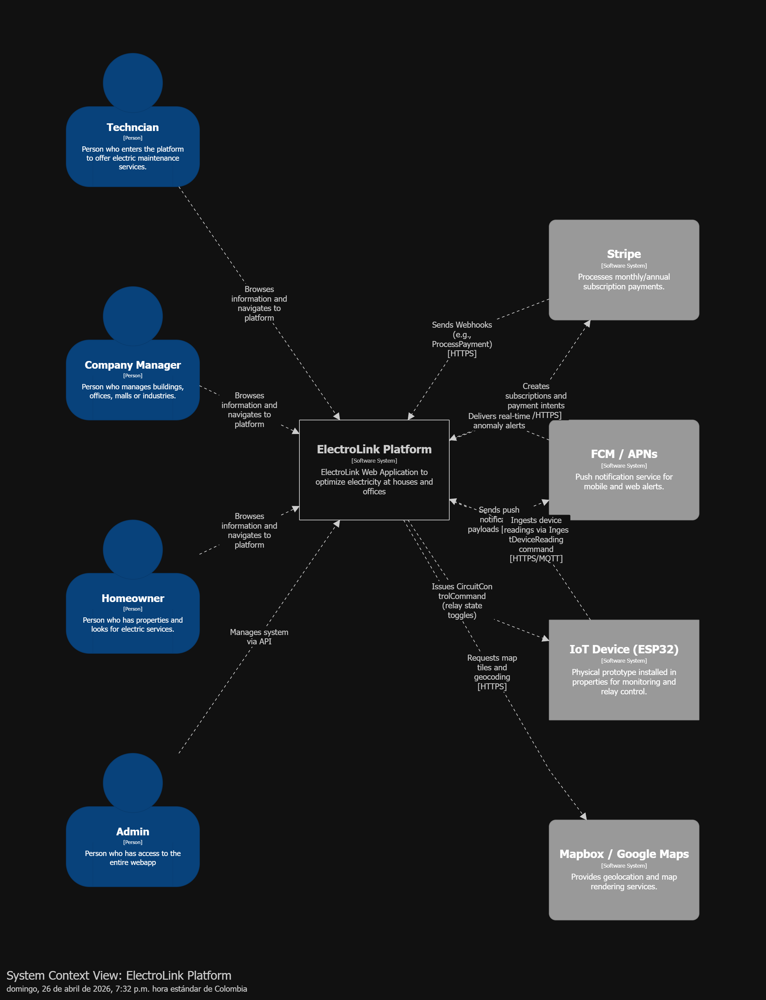

### 4.3.1. Software Architecture Context Level Diagrams
\

### 4.3.2. Software Architecture Container Level Diagrams
\
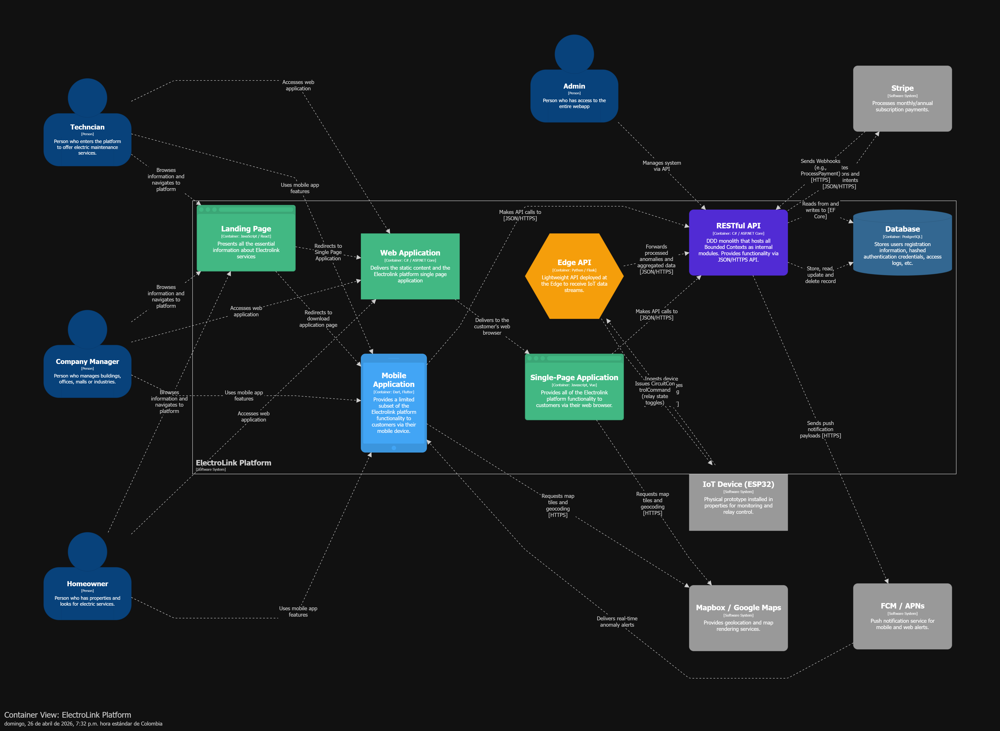

### 4.3.3. Software Architecture Deployment Diagrams
\
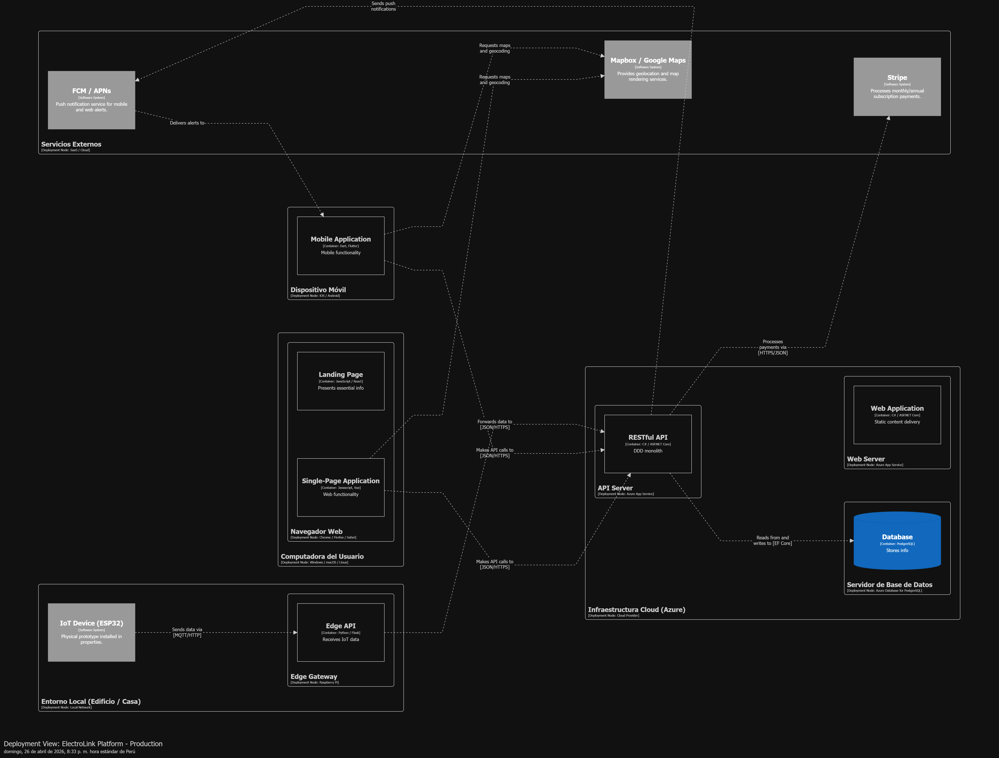

# Capítulo V: Tactical-Level Software Design

## 5.X. Bounded Context: <Bounded Context Name>

### 5.X.1. Domain Layer

### 5.X.2. Interface Layer

### 5.X.3. Application Layer

### 5.X.4. Infrastructure Layer

### 5.X.6. Bounded Context Software Architecture Component Level Diagrams

### 5.X.7. Bounded Context Software Architecture Code Level Diagrams

#### 5.X.7.1. Bounded Context Domain Layer Class Diagrams

#### 5.X.7.2. Bounded Context Database Design Diagram

# Capítulo VI: Solution UX Design

En este capítulo se presentan los lineamientos de diseño de experiencia de usuario y la arquitectura de información que guiarán la implementación de la solución ElectroLink. Se detallan las pautas de estilo, la estructura de navegación, los flujos de interacción y los prototipos visuales que aseguran una experiencia coherente, intuitiva y alineada con los objetivos del proyecto.

## 6.1. Style Guidelines

El sistema de diseño de ElectroLink adopta una identidad visual basada en la paleta general unificada, orientada a conferir un acabado sobrio, tecnológico y de precisión industrial para entornos críticos de monitoreo IoT y automatización RPA. La paleta es única para los tres productos: landing page, web application y mobile application.

### 6.1.1. General Style Guidelines

**Branding**

El logo de ElectroLink representa el mensaje que nosotros queremos dar con nuestra startup que es una búsqueda de seguridad eléctrica y continuidad operativa en cadenas de comida rápida. El logo se compone de un rayo estilizado integrado a un nodo de conexión, utilizado para referenciar la telemetría en tiempo real de tableros y equipos de cocina. Asimismo, se incorpora el nombre en tipografía geométrica, con esto queremos dar a entender que los locales monitoreados gracias al servicio de ElectroLink serán supervisados con precisión preventiva y respuesta inmediata ante fugas o sobrecargas. Los colores azul principal y cian que hemos elegido para nuestro proyecto transmiten una sensación de estar en un servicio industrial confiable, sobrio y eficaz.

**Variantes del Logo**

#### Logo

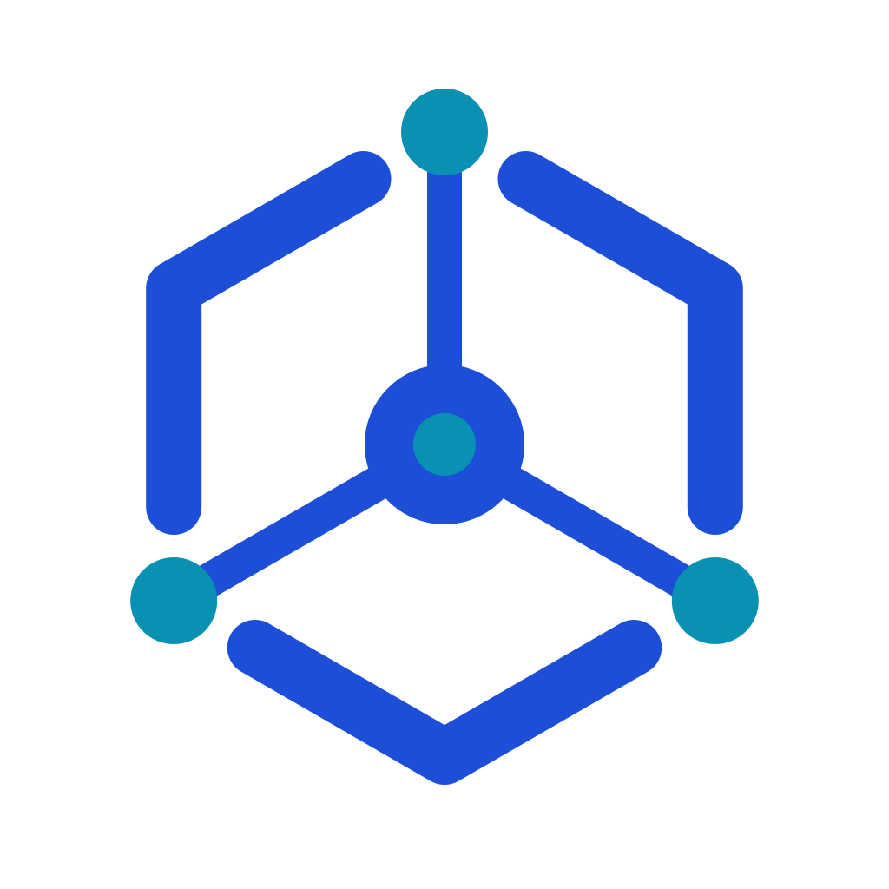

**Typography**

Nuestra tipografía Exo 2 proyecta una imagen de profesionalidad y confianza que se alinea con la misión de ElectroLink. Con su estilo moderno y geométrico, transmite una sensación de tecnología e innovación, mostrando que estamos al día con las últimas herramientas del mundo IoT industrial. Además, su claridad y legibilidad refuerzan la transparencia de nuestro servicio. Utilizaremos Exo 2 en sus variantes más gruesas para títulos, métricas de telemetría y llamadas a la acción, aportando un dinamismo que capta la atención. Para el cuerpo del texto, optaremos por un estilo más ligero, garantizando que toda la información sea fácil de leer, lo que contribuye a una experiencia de usuario que se percibe como limpia, ordenada y fiable. Todo esto se ve reforzado con los colores azul y cian que impulsan y agilizan la lectura dentro de la página web. Todas las visualizaciones numéricas de corriente, tensión y costos en soles configuran `font-feature-settings: "tnum" 1` para evitar oscilaciones cuando los datos IoT varían en tiempo real.

| Jerarquía | Peso | Tamaño / Interlineado |
| :--- | :--- | :--- |
| Hero Display / Alerta Crítica | Exo 2 Bold (700) | 40px (Line-height: 48px) |
| Métrica Principal IoT / KPIs | Exo 2 Bold (700) | 32px (Line-height: 38px, tnum) |
| Heading 1 (Vistas Principales) | Exo 2 Bold (700) | 28px (Line-height: 36px) |
| Heading 2 (Títulos de Tarjeta) | Exo 2 SemiBold (600) | 20px (Line-height: 28px) |
| Controles / Botones / Tabs | Exo 2 Medium (500) | 16px (Line-height: 24px) |
| Cuerpo de Texto (Body) | Exo 2 Regular (400) | 16px (Line-height: 24px) |
| Metadatos, Badges y Leyendas | Exo 2 Regular (400) | 13px (Line-height: 18px) |

**Colors**

La paleta de colores elegida para la web de ElectroLink fue diseñada para transmitir un mensaje dirigido a los consumidores. El azul principal se asocia con la seguridad, la profesionalidad y la fiabilidad, convirtiéndose en el color principal de la marca. El azul oscuro tiene la función de reforzar estados hover y fondos de secciones oscuras. El cian actúa como acento de conectividad IoT y visualización de datos. El azul noche y el fondo claro transmiten sobriedad industrial, limpieza y frescura, con estos colores nuestra página es más ligera a la hora de navegar en ella. El semáforo funcional (verde, ámbar, rojo) refuerza la seguridad eléctrica y la criticidad, mientras que el gris pizarra aporta equilibrio para sensores desconectados.

#### Estilos

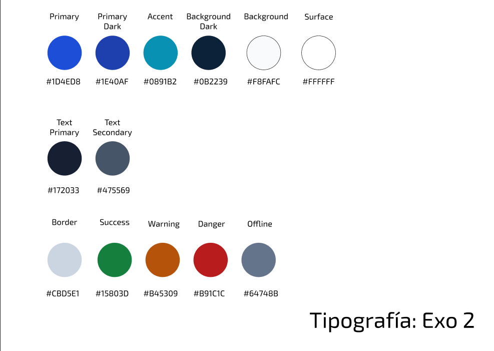

**Paleta general unificada**
| Color | Código HEX | Uso general |
| :--- | :--- | :--- |
| Azul principal | `#1D4ED8` | Color principal de marca: botones, enlaces, navegación activa, foco, iconos destacados y elementos clave de la landing |
| Azul oscuro | `#1E40AF` | Hover/pressed de controles primarios, fondos de secciones oscuras y detalles de marca |
| Cian | `#0891B2` | Conectividad IoT, visualizaciones de datos, ilustraciones técnicas y detalles secundarios |
| Azul noche | `#0B2239` | Hero y footer de la landing, sidebar, top bar y modo oscuro en pantallas operativas |
| Fondo claro | `#F8FAFC` | Fondo general de la web app y la app móvil; secciones claras de la landing |
| Blanco | `#FFFFFF` | Cards, inputs, modales, tablas y contenedores elevados |
| Tinta | `#172033` | Títulos, métricas, texto principal y contenido de alta prioridad |
| Gris pizarra | `#475569` | Descripciones, labels, metadata y texto auxiliar |
| Gris borde | `#CBD5E1` | Bordes, separadores, estados inactivos y estructura visual de formularios |
| Verde seguro | `#15803D` | Operación completada, dispositivo saludable, conexión confirmada y condición eléctrica segura |
| Ámbar alerta | `#B45309` | Mantenimiento requerido, consumo elevado, advertencia operativa o acción pendiente |
| Rojo peligro | `#B91C1C` | Alerta crítica, riesgo eléctrico, fuga detectada y apagado de emergencia |
| Gris offline | `#64748B` | Sensor desconectado, ausencia de telemetría o dispositivo no disponible |

**Aplicación por producto**
| Producto | Predominio visual | Uso de color |
| :--- | :--- | :--- |
| Landing page | Azul noche, azul principal, cian y superficies claras | Hero oscuro, acentos cian en diagramas de la integración IoT y RPA, secciones alternadas claras y oscuras |
| Web application | Fondo claro, blanco, tinta y gris borde | Interfaz clara orientada a dashboards, tablas, formularios, gestión y análisis operativo |
| Mobile application | Fondo claro, blanco, azul principal y estados semánticos | Flujos simples, acciones táctiles claras, tarjetas ligeras y alertas visibles pero no invasivas |

**Reglas de consistencia**
- El azul principal representa la acción principal; no lo reutilices para alertas ni estados de seguridad.
- El cian representa información técnica o conectividad, no una condición segura.
- El verde seguro, el ámbar alerta, el rojo peligro y el gris offline deben aparecer con icono y etiqueta de texto, no dependas solo del color. WCAG indica que el color no debe ser el único medio para comunicar información o estados.
- Reserva el rojo peligro únicamente para riesgo eléctrico real. Para un error normal de formulario o autenticación, muestra una descripción textual y un borde/estado visual no asociado a emergencias.

### 6.1.2. Web, Mobile & Devices Style Guidelines

Respecto al estilo de la estructura de la web, se ha empleado el patrón Persistent Navigation, con una barra lateral (Sidebar) en azul noche mediante la cual el usuario podrá tener acceso a las secciones principales sin perderse en el flujo y con la posibilidad de volver. Con este patrón se puede cumplir la heurística de visibilidad del estado del sistema donde el menú de navegación resaltará la sección activa con barra de 3px en azul principal y fondo azul suave en todo momento.
El patrón de diseño Card Layout es visible en el dashboard y landing, este se encarga de organizar telemetría, consumos y planes en bloques con fondo blanco y borde sutil en gris borde.
En la web de ElectroLink se puede visualizar el uso de la heurística de brindar retroalimentación al usuario mediante badges de estado con icono, texto y barras de progreso RPA que permiten rastrear si un proceso de mantenimiento preventivo está en curso o finalizado. Los acentos cian se reservan para conectividad y datos, no para estados seguros.
En cuanto a los botones, destaca el patrón Primary Call to Action en azul principal con hover en azul oscuro, con el que se permite destacar lo importante mediante un contraste mínimo 4.5:1 y se guía al usuario hacia acciones críticas. En cocina se aplica jerarquía de un solo toque con áreas táctiles amplias y pausa táctil de limpieza de 30 segundos que se interrumpe ante fuga mayor a 30 mA con fondo en rojo peligro y alerta sonora. El rojo peligro se reserva solo para riesgo eléctrico real.

## 6.2. Information Architecture

En esta sección se detallará parte importante de la estructura y etiquetado del aplicativo.

### 6.2.2. Labeling Systems

| Sección | Etiqueta | Descripción |
| :--- | :--- | :--- |
| Menú principal | Monitoreo en tiempo real | Apartado que muestra el estado eléctrico de tableros y equipos por local. Este se mostrará tanto para el Manager del Local como para el Trabajador del Local en vista simplificada |
|  | Alertas | Muestra fugas a tierra, sobrecargas y desviaciones térmicas con severidad y protocolo de acción |
|  | Consumos | Visualiza kWh por máquina, costos en soles y desvíos sobre la meta presupuestada |
|  | Mantenimiento | Contiene órdenes preventivas derivadas por RPA y su estado de atención |
| Perfil | Editar perfil | Botón que permitirá que el usuario pueda cambiar información de su perfil |
| Locales | Agregar local | Permite que un Manager con más de un local los pueda registrar según sus necesidades |
| Equipos | Registrar equipo | El Manager deberá registrar freidoras, hornos y congeladores para asociarles sensores |
|  | Verificar seguridad | Es un apartado diseñado para que el Trabajador pueda verificar si un equipo es apto para contacto o limpieza |
| Historial | Historial de eventos | Contiene información relevante sobre alertas, consumos y mantenimientos ya atendidos |
| Reportes | Reporte SST | Muestra el reporte descargable para fiscalizaciones SUNAFIL, INDECI y OSINERGMIN |
| Configuración | Cambiar contraseña | Se le brinda a ambos tipos de usuario la posibilidad de cambiar las contraseñas que correspondan a la cuenta |
|  | Suscripción | Muestra el plan de suscripción SaaS adquirido por local monitoreado |
|  | Modo limpieza | Permite que el Trabajador pueda activar la pausa táctil de 30 segundos para aseo de pantalla |

### 6.2.3. Searching Systems

ElectroLink cuenta con un sistema de búsqueda que permite al usuario poder encontrar locales, equipos y eventos que sean más críticos para su operación, esto a través de múltiples filtros:

| Filtros | Descripción |
| :--- | :--- |
| Sede / Local | Filtro geográfico que ayuda a encontrar los locales monitoreados en Lima Metropolitana. |
| Equipo | Filtra por freidoras, hornos, congeladores o tableros según el activo registrado. |
| Estado | Filtra por seguro, preventivo, peligro u offline según el semáforo funcional. |
| Severidad | Filtro que muestra eventos críticos o preventivos según prioridad. |
| Rango de fechas | Filtra el historial de telemetría y eventos para auditoría y análisis de consumo. |

### 6.2.4. SEO Tags and Meta Tags

**Landing Page Title:** ElectroLink

**Description:** ElectroLink es una startup que se especializa en el desarrollo de soluciones IoT para monitoreo eléctrico. Con ElectroLink, facilitamos la prevención de accidentes por fugas a tierra y la optimización del consumo energético en cadenas de comida rápida, lo que facilita la conexión entre sensores en cocina y decisiones gerenciales.

**Meta Keywords:** Monitoreo eléctrico IoT, seguridad eléctrica cocina, fuga a tierra, eficiencia energética restaurantes, mantenimiento preventivo.

**Meta Author:** HampCoders

**Meta Description:** Prevenir accidentes laborales y optimizar el consumo energético con telemetría en tiempo real, alertas locales y dashboard multisede.

**Title:** ElectroLink

**Description:** ElectroLink, la plataforma de HampCoders, conecta tableros y equipos de cocina con alertas inmediatas y analítica centralizada, ofreciendo seguridad operativa y cumplimiento normativo con una experiencia moderna, clara y eficiente.

**Meta Author:** HampCoders

### 6.2.5. Navigation Systems

Los sistemas de navegación de ElectroLink han sido diseñados para poder guiar de forma intuitiva a los usuarios a través de la Landing Page y dentro de la aplicación, facilitando la exploración del contenido y el acceso a las distintas funcionalidades que la aplicación ofrece. ElectroLink sigue una estructura lógica clara que permite al usuario encontrar rápidamente lo que necesita mediante menús jerárquicos, enlaces destacados y botones de acción visibles para el usuario.

| Icono | Funcionalidad |
| :--- | :--- |
|  | Este ícono permite que el usuario pueda dirigirse a la pantalla inicial que brinda información vital sobre el funcionamiento de ElectroLink. |
|  | Este ícono, que pertenece al Manager del Local, permite visualizar el estado multisede de tableros y equipos. |
|  | Este ícono permite visualizar fugas, sobrecargas y su protocolo de parada segura. |
|  | Este ícono permite buscar un equipo y verificar si es apto para contacto o limpieza. |
|  | Este ícono dirige al usuario al apartado de Historial, donde podrá visualizar eventos y mantenimientos anteriores. |
|  | Permite visualizar las órdenes preventivas derivadas por RPA dentro del local. |
|  | Permite gestionar y descargar evidencias para fiscalización SST. |
|  | Permite al usuario visualizar el perfil con el que se ha registrado, brindando información pertinente como nombres, sede, rol, etc. |

## 6.3. Landing Page UI Design

A continuación se mostrarán los diseños realizados en Figma para la creación de la landing page de ElectroLink.

### 6.3.1. Landing Page Wireframe

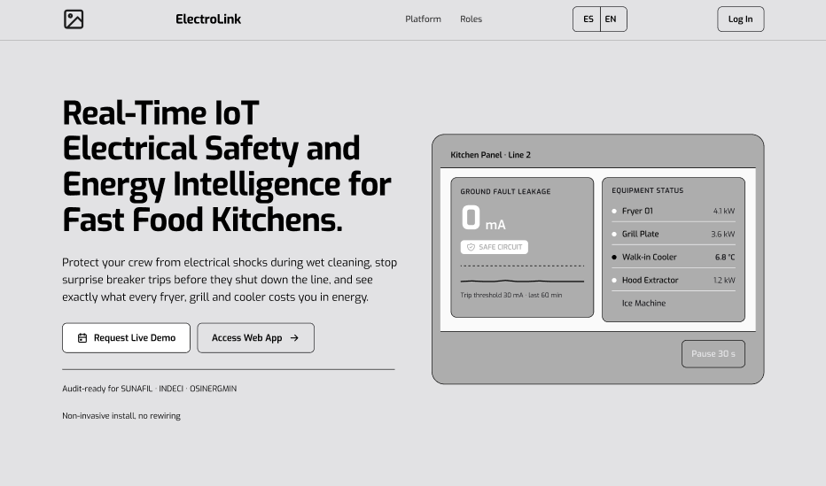

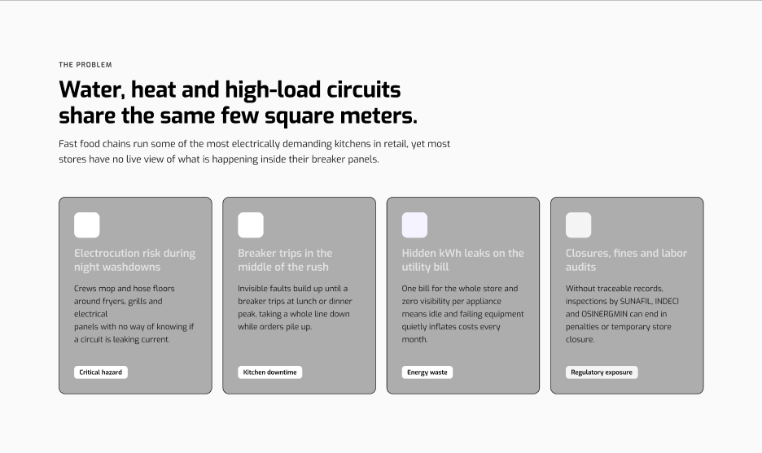

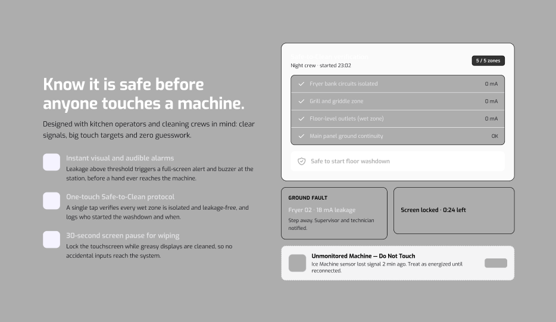

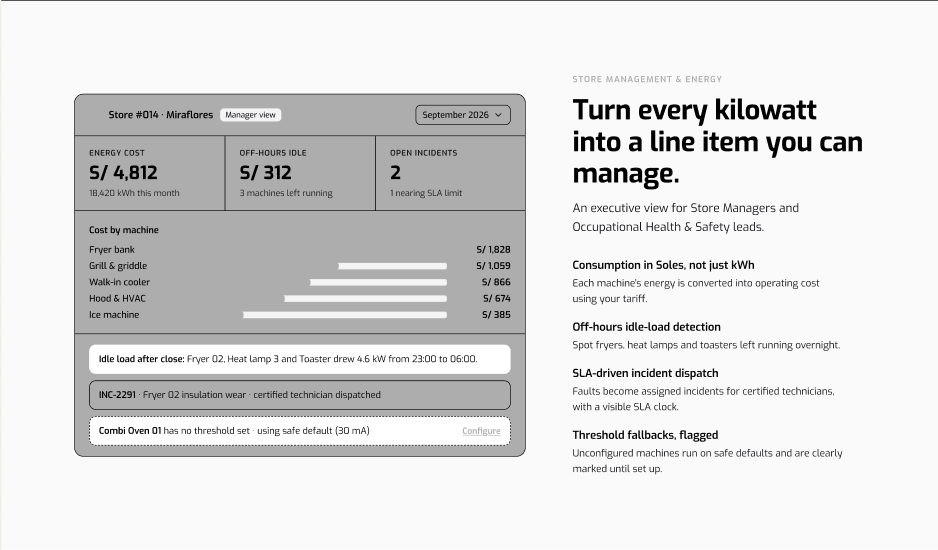

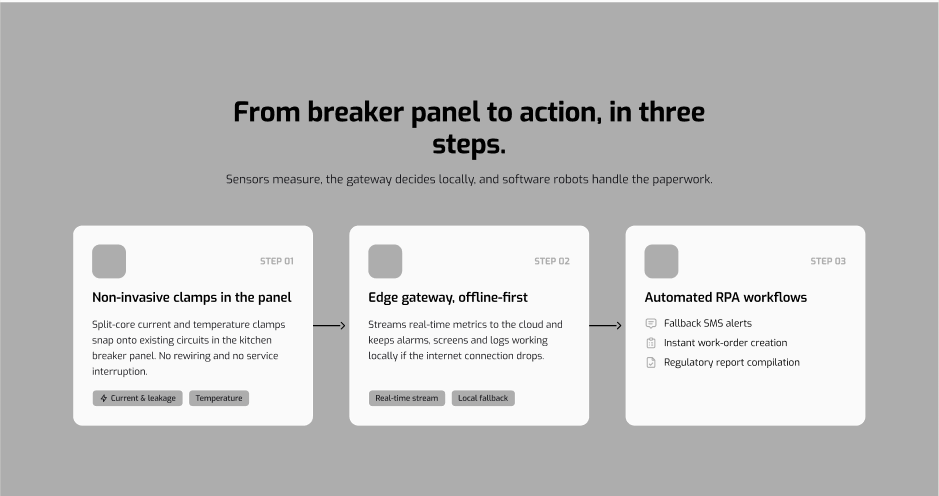

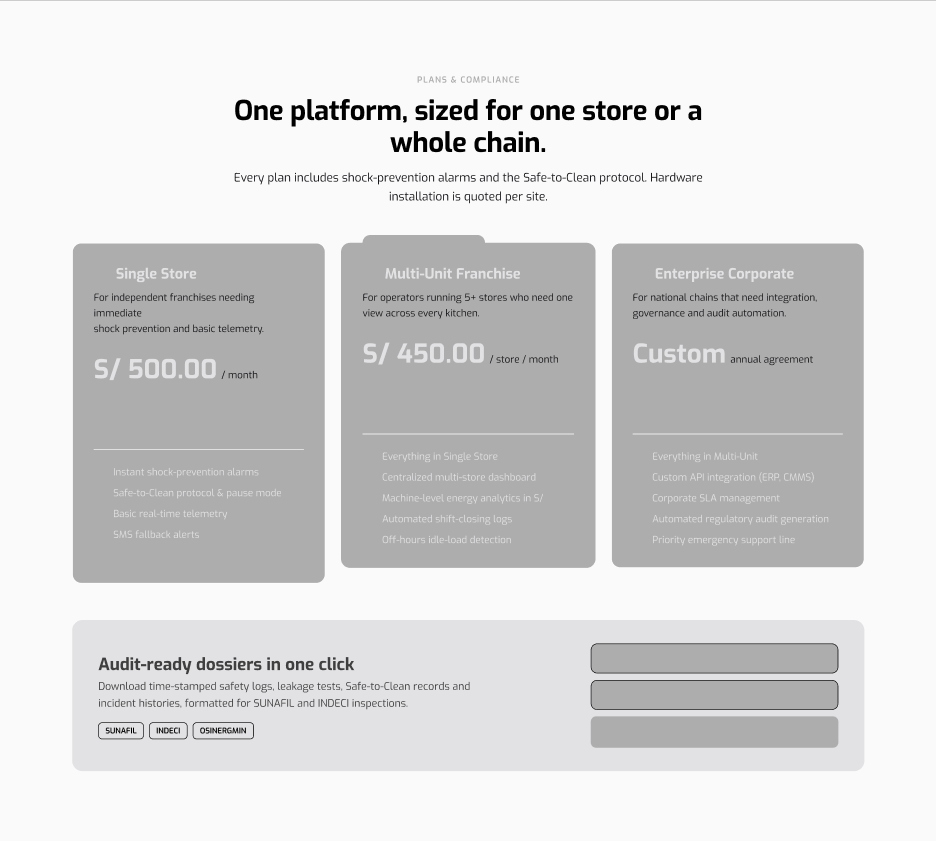

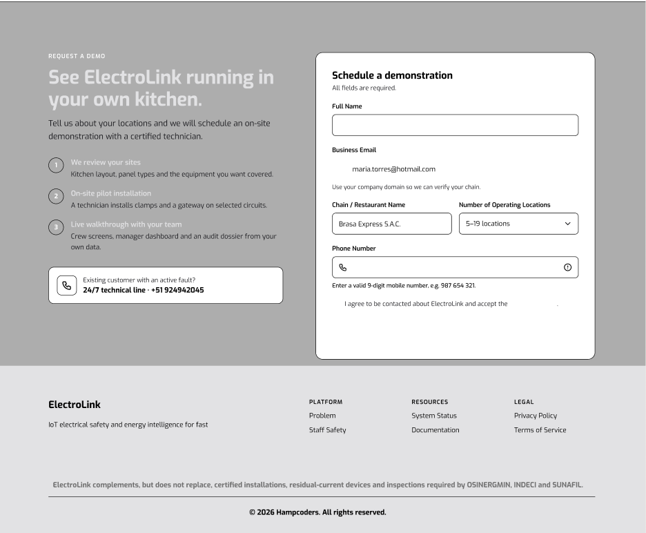

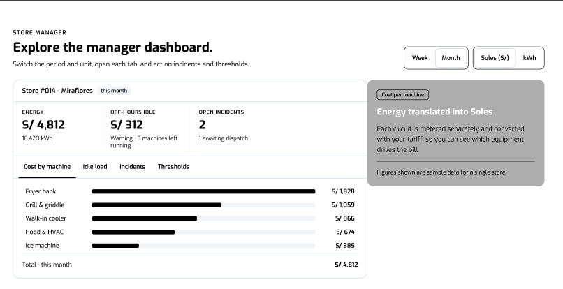

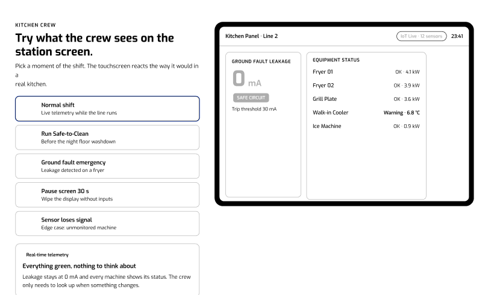

### 6.3.2. Landing Page Mock-up

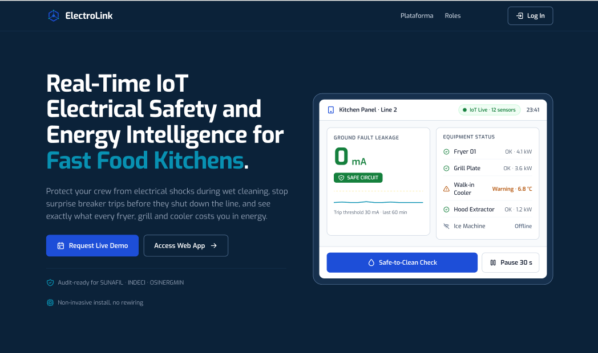

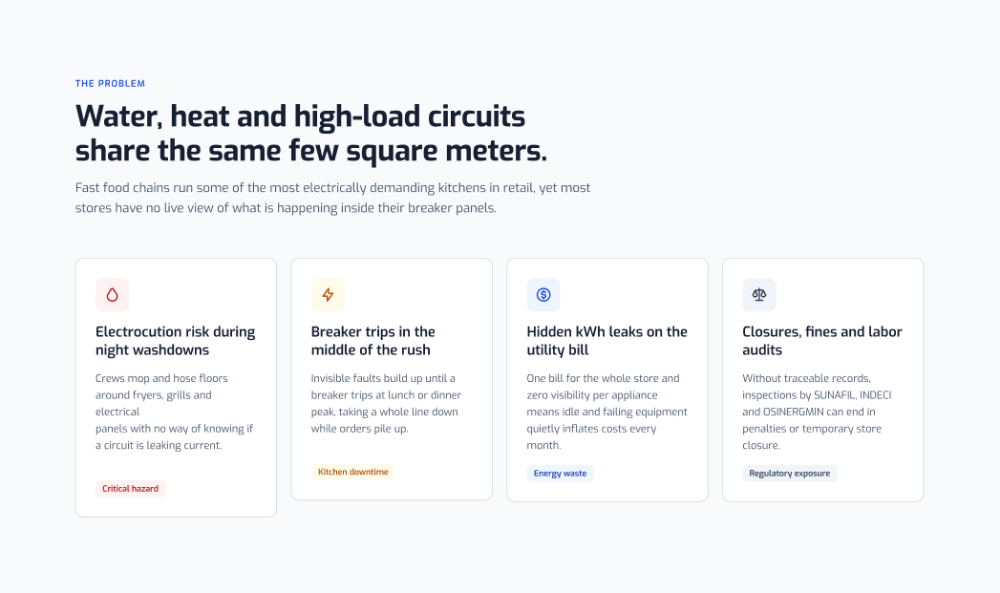

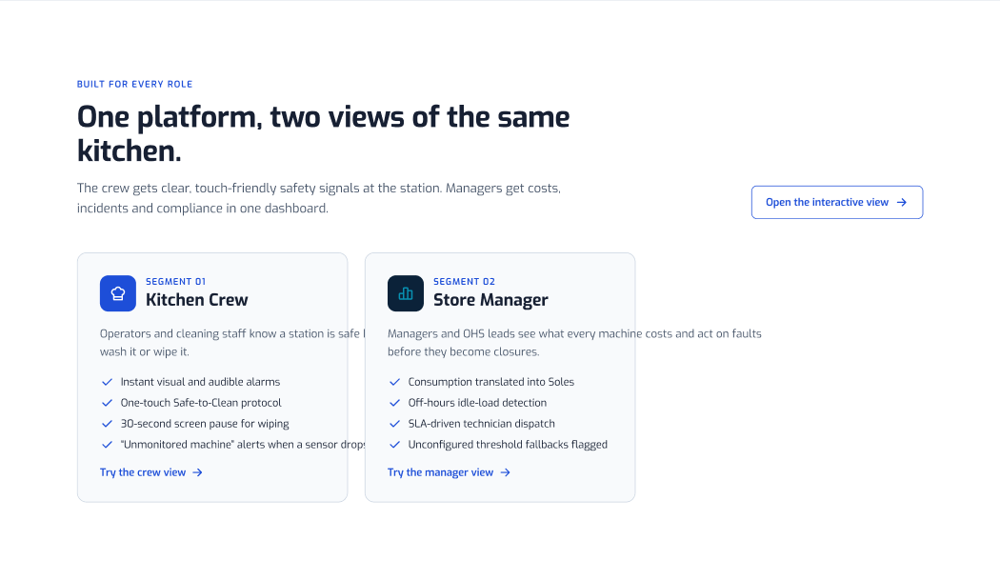

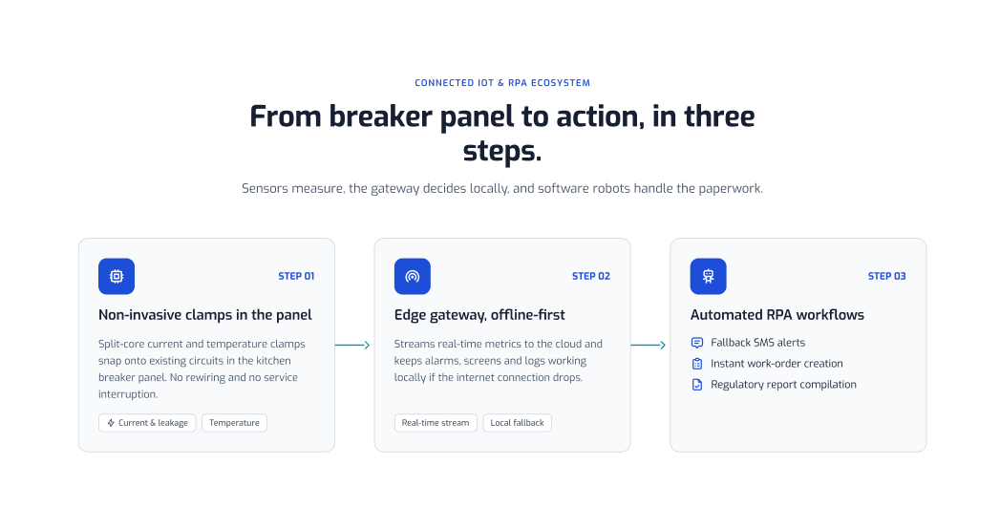

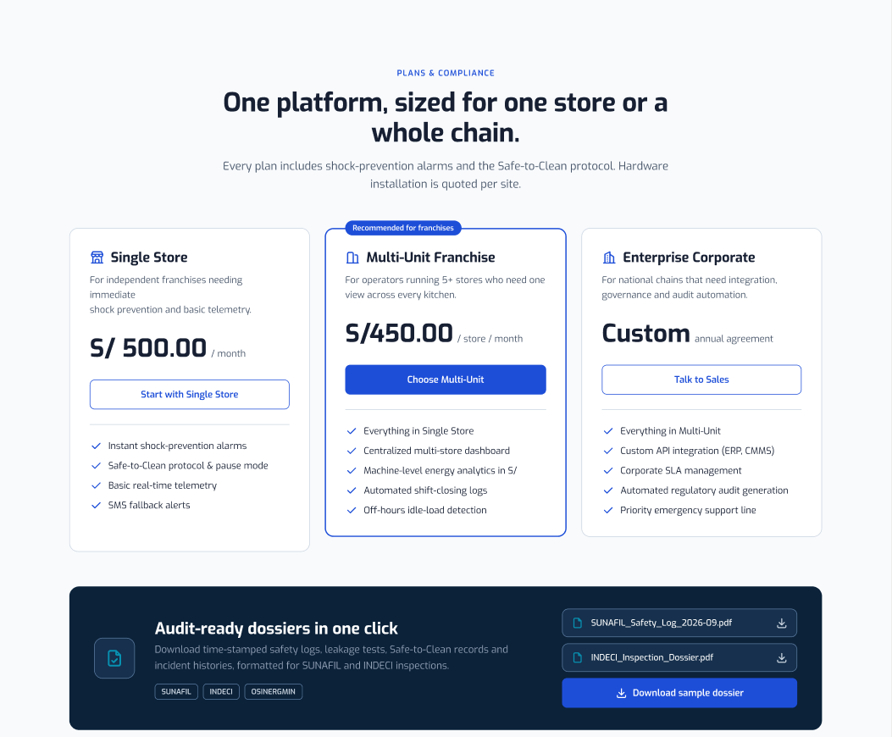

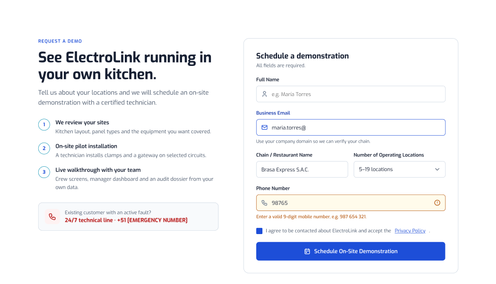

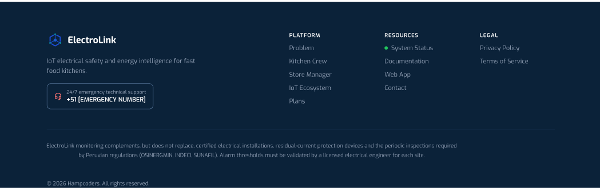

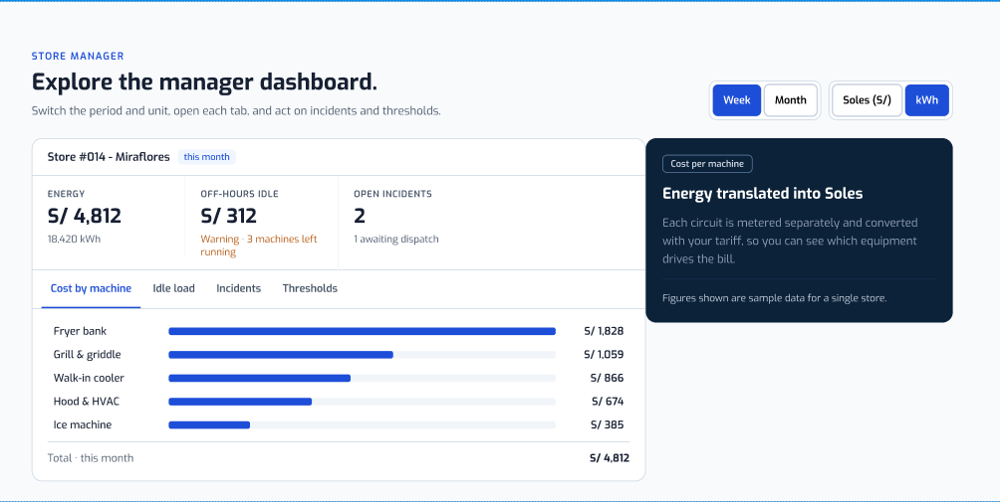

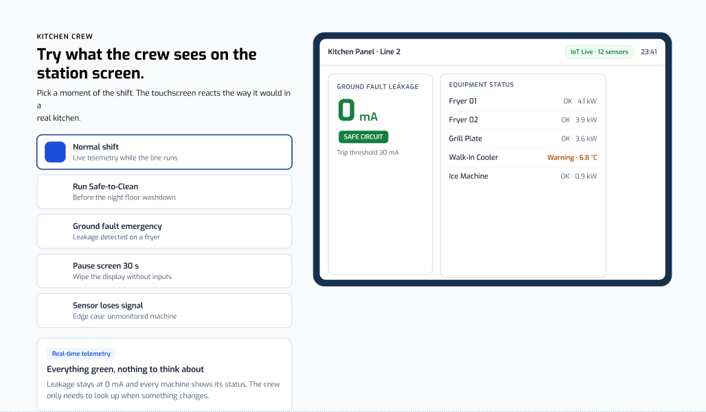

## 6.4. Applications UX/UI Design

### 6.4.1. Applications Wireframes

### 6.4.2. Applications Wireflow Diagrams

### 6.4.2. Applications Mock-ups

### 6.4.3. Applications User Flow Diagrams

## 6.5. Applications Prototyping

# Capítulo VII: Product Implementation, Validation & Deployment

## 7.1. Software Configuration Management

### 7.1.1. Software Development Environment Configuration

### 7.1.2. Source Code Management

### 7.1.3. Source Code Style Guide & Conventions

### 7.1.4. Software Deployment Configuration

## 7.2. Solution Implementation

### 7.2.X. Sprint n

#### 7.2.X.1. Sprint Planning n

#### 7.2.X.2. Sprint Backlog n

#### 7.2.X.3. Development Evidence for Sprint Review

#### 7.2.X.4. Testing Suite Evidence for Sprint Review

#### 7.2.X.5. Execution Evidence for Sprint Review

#### 7.2.X.6. Services Documentation Evidence for Sprint Review

#### 7.2.X.7. Software Deployment Evidence for Sprint Review

#### 7.2.X.8. Team Collaboration Insights during Sprint

## 7.3. Validation Interviews

### 7.3.1. Diseño de Entrevistas

### 7.3.2. Registro de Entrevistas

### 7.3.3. Evaluaciones según heurísticas

## 7.4. Video About-the-Product

# Conclusiones

## Conclusiones y recomendaciones

- Las entrevistas evidencian que la operación actual en cocina es reactiva y sin visibilidad del estado eléctrico, por lo que el monitoreo continuo con señalización simple responde a un riesgo real para la seguridad del personal y la continuidad de la venta. Se recomienda ejecutar un piloto controlado en uno o dos locales para validar la precisión de los sensores en condiciones de calor, grasa y humedad antes de comprometer metas de ahorro o de reducción de incidentes.

- El análisis competitivo confirma que el valor diferencial de ElectroLink está en la prevención de accidentes y en la generación de evidencia para fiscalización, más que en la sola medición de consumo, lo cual da sustento a lo definido en historias, backlog y arquitectura. Se recomienda priorizar en la implementación las funciones de historial por equipo, facturación formal y reporte para fiscalización, pues son las que justifican el pago de la suscripción ante la gerencia regional.

- El diseño estratégico logrado en la entrega AV1, con arquitectura de monolito modular, ingesta IoT y alertas tempranas, deja una base viable y escalable para avanzar hacia la implementación sin necesidad de un rediseño mayor. Se recomienda incorporar desde el inicio el almacenamiento local y la sincronización posterior de telemetría, para mantener la alerta local activa aun con pérdida de conectividad y evitar vacíos de información.

- El trabajo colaborativo con reparto por capítulos, ramas por avance y revisión cruzada permitió articular hallazgos de campo con decisiones técnicas, manteniendo coherencia entre problemática, requerimientos y propuesta arquitectónica. Se recomienda definir umbrales, roles y protocolos de apagado seguro junto a un especialista eléctrico, para evitar falsas alarmas y asegurar un uso correcto por parte de personal operativo sin formación técnica.

## Video About-the-Team

# Bibliografía

Collyns, D. (2019, 17 de diciembre). Every McDonald's in Peru closes amid protests at death of two workers. *The Guardian*. https://www.theguardian.com/global-development/2019/dec/18/every-mcdonalds-peru-closes-amid-protests-at-death-of-two-workers

Deutsche Welle. (2019, 22 de diciembre). *Perú: máquina de bebidas causó muerte de empleados en McDonald’s*. https://www.dw.com/es/per%C3%BA-m%C3%A1quina-de-bebidas-caus%C3%B3-muerte-de-empleados-en-mcdonalds/a-51771494

Fowks, J. (2019, 18 de diciembre). La muerte de dos empleados de McDonald’s indigna a Perú. *El País*. https://elpais.com/internacional/2019/12/18/america/1576627016_774946.html

Jiangsu Acrel Electrical Manufacturing Co., Ltd. (2024, 10 de octubre). *IOT power online management cloud platform*. https://www.acrel.qa/solution/iot-power-online-management-cloud-platform

Ley 29783. (2011). *Ley de seguridad y salud en el trabajo*. Congreso de la República del Perú. https://www.gob.pe/institucion/congreso-de-la-republica/normas-legales/462576-29783

MachineQ. (s. f.). *Foodservice: IoT-enabled power monitoring*. https://www.machineq.com/foodservices-solutions/power-monitoring

Organismo Supervisor de la Inversión en Energía y Minería. (s. f.). *Organismo Supervisor de la Inversión en Energía y Minería*. Recuperado el 20 de septiembre de 2026, de https://www.osinergmin.gob.pe/SitePages/default.aspx

Powerhouse Dynamics. (s. f.). *Open Kitchen: Optimize operations for multi-site food service and retail facilities*. https://powerhousedynamics.com/

Resolución de Consejo Directivo 228-2009-OS-CD. (2009). *Procedimiento para la supervisión de las instalaciones de distribución eléctrica por seguridad pública*. Organismo Supervisor de la Inversión en Energía y Minería. https://www.osinergmin.gob.pe/seccion/centro_documental/PlantillaMarcoLegalBusqueda/Osinergmin-228-2009-OS-CD.pdf

Superintendencia Nacional de Fiscalización Laboral. (2024, 2 de junio). *Más de 2,800 inspecciones de accidentes de trabajo realizó la Sunafil entre el 2023 y 2024*. Plataforma del Estado Peruano. https://www.gob.pe/institucion/sunafil/noticias/964567-mas-de-2-800-inspecciones-de-accidentes-de-trabajo-realizo-la-sunafil-entre-el-2023-y-2024

Tamayo, J., Vásquez, A., & García, R. (2013, febrero). *La protección del consumidor en el sector eléctrico peruano: una perspectiva preventiva* (Documento de Trabajo N.º 26). Organismo Supervisor de la Inversión en Energía y Minería. https://revistas.indecopi.gob.pe/index.php/rcpi/article/view/106

# Anexos

- Link del la organización del equipo: [https://github.com/Hampcoders-Emergentes](https://github.com/Hampcoders-Emergentes)

- Link del repositorio del reporte: [https://github.com/Hampcoders-Emergentes/project-documento](https://github.com/Hampcoders-Emergentes/project-documento)

- Link de la carpeta de OneDrive: <https://upcedupe-my.sharepoint.com/:f:/g/personal/u202114548_upc_edu_pe/IgA4hH36P5pgSYS2dliiBXpTAQwy_m72jpCcivmkVy_gEvc?e=ng0PdU>

- Link del video de exposición de la entrega TB1: <https://upcedupe-my.sharepoint.com/:v:/g/personal/u202114548_upc_edu_pe/IQAgfZvBGriXQYK-cVEkAiJaAZU3dnjm4p9MaKorcmwxG6M?nav=eyJyZWZlcnJhbEluZm8iOnsicmVmZXJyYWxBcHAiOiJPbmVEcml2ZUZvckJ1c2luZXNzIiwicmVmZXJyYWxBcHBQbGF0Zm9ybSI6IldlYiIsInJlZmVycmFsTW9kZSI6InZpZXciLCJyZWZlcnJhbFZpZXciOiJNeUZpbGVzTGlua0NvcHkifX0&e=in1M8u>